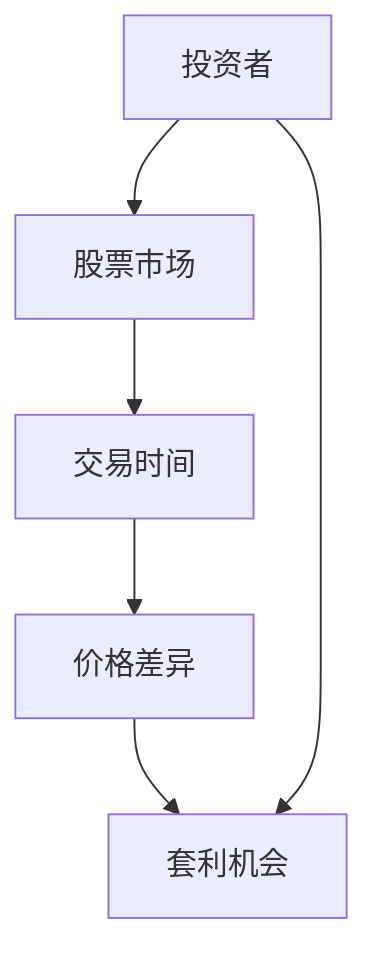

                 

# 如何构建基于特价股票的跨时区套利系统

> 关键词：跨时区套利，特价股票，股票交易，套利系统，金融市场

> 摘要：本文将详细讲解如何构建基于特价股票的跨时区套利系统，从基本概念、数学模型、系统设计到实战实现，逐步深入分析。本文适合对金融市场和编程技术感兴趣的读者，帮助他们理解套利的基本原理，并掌握构建套利系统的具体方法。

---

# 第一部分: 跨时区套利的背景与核心概念

## 第1章: 跨时区套利的基本概念与背景

### 1.1 什么是套利

#### 1.1.1 套利的定义与基本原理
套利是一种利用市场价差进行无风险或低风险交易的策略。简单来说，套利是指在不同市场或时间段内，利用价格差异进行买卖，以获取利润。套利的基本原理是基于价格差异的存在，通过同时买入低价市场和卖出高价市场来获利。

#### 1.1.2 套利的分类与特点
套利可以分为以下几种类型：
1. **跨市场套利**：在同一资产但在不同市场（如股票市场和期货市场）之间进行套利。
2. **跨期套利**：在同一市场中，利用不同时间段的价格差异进行套利。
3. **跨时区套利**：利用不同时区市场的价格差异进行套利。

套利的特点包括：
- 低风险或无风险：套利通常利用价格差异，理论上可以无风险。
- 高频交易：套利需要快速执行交易，以抓住短暂的价格差异。
- 短期收益：套利通常在较短时间内完成。

#### 1.1.3 跨时区套利的定义与优势
跨时区套利是指在不同时区的金融市场中，利用同一资产在不同市场中的价格差异进行买卖，以获取利润。其优势包括：
- 利用时间差：不同时区市场的交易时间不同，可以利用价格差异。
- 市场效率较低：某些市场可能由于信息不对称或流动性不足，导致价格差异。
- 全球化市场：全球多个金融市场分布在不同时区，提供了丰富的套利机会。

### 1.2 跨时区套利的背景与现状

#### 1.2.1 全球金融市场的时间差异
全球主要金融市场分布在不同的时区，例如：
- 纽约证券交易所（NYSE）：美国东部时间（EST）
- 伦敦证券交易所（LSE）：格林威治标准时间（GMT）
- 东京证券交易所（TSE）：日本标准时间（JST）

这些市场的交易时间差异为跨时区套利提供了可能。

#### 1.2.2 跨时区套利的可行性与风险
跨时区套利的可行性取决于市场的价格差异和交易成本。然而，套利也存在一定的风险，例如：
- 市场波动：价格差异可能在短时间内消失，导致套利失败。
- 交易成本：跨时区交易可能涉及较高的交易费用。
- 法律风险：不同国家的法律法规可能限制套利行为。

#### 1.2.3 当前市场中的套利机会分析
当前市场中，跨时区套利的机会主要集中在以下方面：
- 不同时区市场的开盘和收盘价格差异。
- 特定资产在不同市场中的价格差异，例如同一公司的股票在不同交易所的挂牌交易。

### 1.3 特价股票的定义与特性

#### 1.3.1 特价股票的定义
特价股票是指在特定时间内以低于市场价出售的股票。通常，特价股票出现在市场波动较大或公司有特殊事件时。

#### 1.3.2 特价股票的特点与分类
特价股票的特点包括：
- 价格低廉：特价股票的价格通常低于市场价。
- 数量有限：特价股票的数量有限，可能只在特定时间段内提供。
- 市场波动：特价股票的价格波动较大，存在较高的风险和收益。

特价股票可以分为以下几类：
1. **临时特价**：公司为了促销或清理库存而推出的特价股票。
2. **市场特价**：由于市场波动或供需失衡导致的特价股票。
3. **事件驱动特价**：公司发生重大事件（如并购、重组）导致的特价股票。

#### 1.3.3 特价股票的市场分析与选择策略
选择特价股票时，需要注意以下几点：
- 市场分析：分析市场的整体走势，选择在特定时间段内可能出现价格差异的股票。
- 公司基本面：选择基本面良好的公司，避免因公司问题导致的特价股票风险。
- 时间差利用：利用不同时区市场的交易时间差异，选择在价格差异最大的时间段进行交易。

---

## 第2章: 跨时区套利的核心概念与联系

### 2.1 核心概念原理

#### 2.1.1 套利的基本原理
套利的基本原理是利用不同市场或时间段的价格差异，同时买入低价市场和卖出高价市场，从而获取利润。例如，如果A市场的股票价格为10元，B市场的股票价格为11元，可以通过在A市场买入股票并在B市场卖出股票，从而获利1元。

#### 2.1.2 跨时区套利的核心机制
跨时区套利的核心机制是利用不同时区市场的价格差异。具体步骤如下：
1. 在低价市场买入股票。
2. 在高价市场卖出股票。
3. 利用两地市场的时间差异，完成交易并获利。

#### 2.1.3 特价股票在套利中的应用
特价股票通常价格低廉，适合用于套利。通过在低价市场买入特价股票，在高价市场卖出，可以获取利润。

### 2.2 核心概念属性特征对比表

#### 表2-1: 套利类型与特点对比表

| 套利类型         | 特点                          |
|------------------|-------------------------------|
| 跨市场套利       | 利用不同市场价格差异          |
| 跨期套利         | 利用同一市场不同时间段价格差异 |
| 跨时区套利       | 利用不同时区市场价格差异      |

### 2.3 ER实体关系图（Mermaid流程图）

---

## 第3章: 跨时区套利的数学模型与公式

### 3.1 套利的数学模型

#### 3.1.1 套利的无风险利润公式
套利的无风险利润公式为：
$$ \text{无风险利润} = \text{价格差} \times \text{数量} $$

其中，价格差是指买入价格和卖出价格的差值，数量是指交易的数量。

#### 3.1.2 时间差套利模型
时间差套利模型基于不同时区市场的交易时间差异。假设A市场的价格为$P_A$，B市场的价格为$P_B$，交易时间差为$T$，则时间差套利的利润公式为：
$$ \text{利润} = (P_B - P_A) \times T $$

其中，$T$表示时间差，通常以分钟或小时为单位。

#### 3.1.3 特价股票价格波动模型
特价股票的价格波动可以用布朗运动模型来描述：
$$ dP = \mu dt + \sigma dW $$

其中：
- $dP$表示价格的变化量。
- $\mu$表示价格的平均变化率。
- $dt$表示时间变化量。
- $\sigma$表示价格波动的标准差。
- $dW$表示标准正态分布的随机变量。

---

## 第4章: 跨时区套利系统的技术基础

### 4.1 数据获取与处理

#### 4.1.1 数据源选择
选择可靠的数据源是跨时区套利系统的核心。常用的数据源包括：
- **金融数据供应商**：如Yahoo Finance、Quandl、Alpha Vea。
- **交易所API**：通过交易所提供的API获取实时数据。
- **网络爬虫**：从金融网站或论坛中爬取数据。

#### 4.1.2 数据清洗与预处理
数据清洗与预处理包括：
- **去重**：去除重复数据。
- **插值**：填补缺失数据。
- **标准化**：统一数据格式。

#### 4.1.3 数据存储与管理
常用的数据存储方式包括：
- **数据库**：使用关系型数据库（如MySQL）或NoSQL数据库（如MongoDB）存储数据。
- **文件存储**：将数据存储为CSV、Excel等格式的文件。

---

## 第5章: 跨时区套利系统的实战实现

### 5.1 系统设计与实现

#### 5.1.1 系统架构设计
跨时区套利系统的架构设计包括以下几个模块：
- **数据获取模块**：负责从数据源获取实时数据。
- **数据处理模块**：负责清洗和预处理数据。
- **套利算法模块**：负责识别套利机会并执行交易。
- **风险控制模块**：负责监控和管理交易风险。

#### 5.1.2 系统功能设计
系统功能设计包括：
- **数据获取与展示**：展示不同时区市场的实时数据。
- **套利机会识别**：识别价格差异并生成套利信号。
- **交易执行**：根据套利信号执行交易。
- **风险管理**：监控和管理交易风险。

---

## 第6章: 跨时区套利系统的优化与风险管理

### 6.1 系统优化

#### 6.1.1 性能优化
性能优化包括：
- **并行处理**：利用多线程或分布式计算提高数据处理效率。
- **缓存优化**：合理使用缓存技术减少数据访问时间。

#### 6.1.2 系统稳定性优化
系统稳定性优化包括：
- **容错设计**：增加容错机制，避免系统崩溃。
- **日志记录**：记录系统运行状态和交易记录，便于调试和分析。

### 6.2 风险管理

#### 6.2.1 风险识别
风险识别包括：
- **市场风险**：价格波动导致的套利失败。
- **交易风险**：交易延迟或失败导致的套利机会丧失。
- **法律风险**：法律法规变化导致的套利策略失效。

#### 6.2.2 风险控制策略
风险控制策略包括：
- **止损机制**：设定止损点，避免亏损过大。
- **仓位管理**：合理分配仓位，避免过度集中。
- **实时监控**：实时监控市场变化和交易情况，及时调整策略。

---

## 第7章: 总结与展望

### 7.1 总结
本文详细讲解了如何构建基于特价股票的跨时区套利系统，从基本概念、数学模型到系统设计和实战实现，为读者提供了全面的指导。

### 7.2 展望
随着金融市场的全球化和技术的不断进步，跨时区套利系统将更加智能化和自动化。未来的研究方向包括：
- **人工智能应用**：利用机器学习算法优化套利策略。
- **区块链技术**：利用区块链技术提高交易透明度和安全性。
- **大数据分析**：利用大数据分析技术发现更多套利机会。

---

## 致谢

感谢读者的耐心阅读，希望本文能为您提供有价值的信息和启发。如需进一步探讨或交流，欢迎随时联系。

--- 

以上是《如何构建基于特价股票的跨时区套利系统》的完整目录和内容概要。

