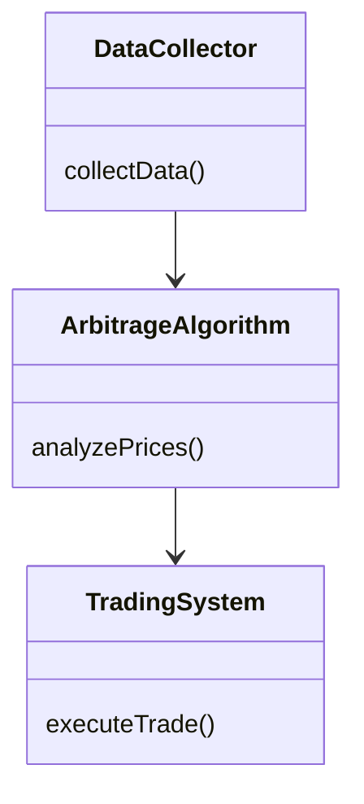
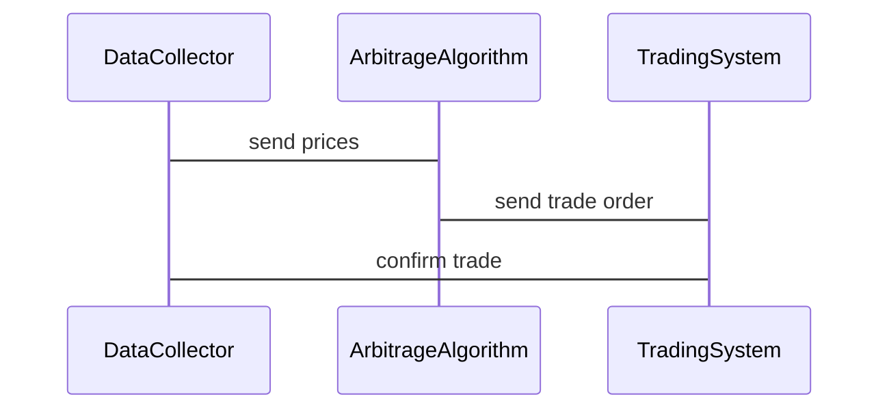

                 


# 如何构建基于特价股票的跨链套利系统

> 关键词：特价股票，跨链套利，区块链，算法，系统设计，风险管理

> 摘要：本文详细讲解了如何构建基于特价股票的跨链套利系统，从背景介绍到系统设计，从算法实现到项目实战，全面分析了跨链套利的实现原理、系统架构、数学模型和优化策略。文章通过丰富的图表和代码示例，结合实际案例，为读者提供了一套完整的跨链套利解决方案。

---

# 第一部分: 特价股票与跨链套利概述

## 第1章: 特价股票与跨链套利的背景与概念

### 1.1 特价股票的定义与特征

- 1.1.1 特价股票的定义  
  特价股票是指在特定市场环境下，由于市场波动、信息不对称或其他因素导致股票价格出现短期异常波动，从而为投资者提供套利机会的股票。

- 1.1.2 特价股票的主要特征  
  - 价格波动剧烈  
  - 市场流动性较高  
  - 价格差异显著  

- 1.1.3 特价股票的市场背景  
  近年来，随着区块链技术的发展，跨链技术逐渐成熟，为跨链套利提供了技术基础。同时，金融市场的价格差异也为套利者提供了机会。

### 1.2 跨链套利的定义与原理

- 1.2.1 跨链套利的定义  
  跨链套利是指在不同区块链之间，利用价格差异进行低买高卖，从中获利的一种交易策略。

- 1.2.2 跨链套利的基本原理  
  - 通过分析不同链上资产的价格差异  
  - 利用跨链技术实现资产转移  
  - 在价格差异消失时进行平仓，获取利润  

- 1.2.3 跨链套利的实现方式  
  - 智能合约  
  - 跨链桥接技术  
  - 貨币兑换机制  

### 1.3 特价股票与跨链套利的结合

- 1.3.1 特价股票在跨链套利中的作用  
  特价股票作为价格波动较大的资产，是跨链套利的理想标的。

- 1.3.2 跨链套利在特价股票中的应用  
  - 抓住价格差异  
  - 利用跨链技术快速交易  
  - 规避不同市场的限制  

- 1.3.3 特价股票跨链套利的市场价值  
  通过跨链套利，投资者可以利用不同市场的价格差异，提高投资收益。

### 1.4 本章小结  
  本章介绍了特价股票和跨链套利的基本概念和背景，为后续章节的分析奠定了基础。

---

# 第二部分: 特价股票跨链套利的核心概念与联系

## 第2章: 特价股票跨链套利的核心概念

### 2.1 特价股票的市场分析

- 2.1.1 特价股票的市场结构  
  - 一级市场与二级市场  
  - 市场参与者分析  

- 2.1.2 特价股票的价格波动  
  - 市场情绪对价格的影响  
  - 价格波动的周期性  

- 2.1.3 特价股票的交易策略  
  - 短期交易策略  
  - 长期投资策略  

### 2.2 跨链套利的技术实现

- 2.2.1 跨链技术的实现原理  
  - 跨链桥接技术  
  - 跨链通信协议  

- 2.2.2 跨链套利的算法模型  
  - 套利算法的基本原理  
  - 算法的优化策略  

- 2.2.3 跨链套利的风险控制  
  - 市场风险  
  - 技术风险  

### 2.3 特价股票与跨链套利的关系

- 2.3.1 特价股票在跨链套利中的角色  
  - 作为套利标的  
  - 提供价格差异  

- 2.3.2 跨链套利对特价股票市场的影响  
  - 市场流动性增加  
  - 价格波动加剧  

- 2.3.3 特价股票跨链套利的可行性分析  
  - 技术可行性  
  - 市场可行性  

### 2.4 本章小结  
  本章分析了特价股票和跨链套利的核心概念，探讨了它们之间的关系和影响。

---

# 第三部分: 特价股票跨链套利的算法原理

## 第3章: 特价股票跨链套利的算法模型

### 3.1 套利算法的基本原理

- 3.1.1 套利算法的定义  
  套利算法是一种通过分析价格差异，实现低买高卖的自动化交易算法。

- 3.1.2 套利算法的核心步骤  
  - 数据采集  
  - 价格分析  
  - 交易执行  

- 3.1.3 套利算法的分类  
  - 简单套利算法  
  - 复杂套利算法  

### 3.2 特价股票跨链套利的数学模型

- 3.2.1 数学模型的构建  
  设$P_1$和$P_2$分别为两个不同链上资产的价格，套利机会存在当$P_1 < P_2$。

- 3.2.2 数学模型的公式推导  
  利润$\pi = P_2 - P_1$。

- 3.2.3 数学模型的验证与优化  
  通过历史数据验证模型的有效性，并优化参数。

### 3.3 套利算法的实现

- 3.3.1 算法实现的步骤  
  - 数据接口开发  
  - 算法策略编写  
  - 系统集成测试  

- 3.3.2 算法实现的代码示例  

```python
def arbitrage_strategy(price1, price2):
    if price1 < price2:
        return "Buy on chain1, sell on chain2"
    else:
        return "No arbitrage opportunity"
```

- 3.3.3 算法实现的优化策略  
  - 并行计算  
  - 模型优化  

### 3.4 本章小结  
  本章详细讲解了套利算法的基本原理和实现，为后续系统设计提供了理论基础。

---

# 第四部分: 特价股票跨链套利的系统分析与架构设计

## 第4章: 特价股票跨链套利系统的分析与设计

### 4.1 系统需求分析

- 4.1.1 系统功能需求  
  - 数据采集模块  
  - 套利算法模块  
  - 交易执行模块  

- 4.1.2 系统性能需求  
  - 响应时间：小于1秒  
  - 吞吐量：每秒处理1000笔交易  

- 4.1.3 系统安全性需求  
  - 数据加密  
  - 权限控制  

### 4.2 系统功能设计

- 4.2.1 系统功能模块  
  - 数据采集模块  
  - 算法分析模块  
  - 交易执行模块  

- 4.2.2 领域模型设计（Mermaid类图）



- 4.2.3 系统架构设计（Mermaid架构图）


### 4.3 系统接口设计

- 4.3.1 数据接口设计  
  - API接口：`GET /prices`  
  - 返回格式：JSON  

- 4.3.2 交易接口设计  
  - API接口：`POST /execute_trade`  
  - 返回格式：JSON  

### 4.4 系统交互设计（Mermaid序列图）



### 4.5 本章小结  
  本章详细分析了系统的功能需求和架构设计，为后续的系统实现提供了指导。

---

# 第五部分: 特价股票跨链套利的项目实战

## 第5章: 特价股票跨链套利的项目实战

### 5.1 项目环境搭建

- 5.1.1 系统环境要求  
  - 操作系统：Linux/Windows  
  - 开发工具：Python, Node.js  
  - 区块链环境：Ethereum, Binance Smart Chain  

- 5.1.2 数据源选择  
  - 交易所API：Binance, OKEx  

### 5.2 系统核心实现

- 5.2.1 数据采集模块的实现  

```python
import requests

def collect_prices(exchange):
    response = requests.get(f"https://api.{exchange}.com/price")
    return response.json()
```

- 5.2.2 套利算法的实现  

```python
def arbitrage_strategy(prices):
    if prices["chain1"] < prices["chain2"]:
        return True
    return False
```

- 5.2.3 交易执行模块的实现  

```python
def execute_trade(chain, amount):
    # Implement trade execution logic
    pass
```

### 5.3 实际案例分析

- 5.3.1 案例背景  
  假设在两个链上，资产A的价格分别为$10和$12。

- 5.3.2 案例分析  
  - 跨链套利机会：$10 < $12  
  - 执行交易：在链1买入，链2卖出  

- 5.3.3 案例结果  
  利润：$2  

### 5.4 本章小结  
  本章通过实际案例展示了系统的实现过程和应用效果。

---

# 第六部分: 特价股票跨链套利的优化与扩展

## 第6章: 特价股票跨链套利的优化与扩展

### 6.1 系统优化策略

- 6.1.1 算法优化  
  - 增加并行计算  
  - 优化模型参数  

- 6.1.2 系统性能优化  
  - 使用分布式计算  
  - 优化数据库查询  

### 6.2 风险管理

- 6.2.1 市场风险控制  
  - 设置止损点  
  - 监控市场波动  

- 6.2.2 技术风险控制  
  - 定期系统维护  
  - 备份数据  

### 6.3 跨链技术的最新发展

- 6.3.1 跨链技术的新趋势  
  - 跨链互操作性  
  - 跨链治理  

- 6.3.2 跨链技术对套利系统的影响  
  - 提高交易效率  
  - 增加套利机会  

### 6.4 本章小结  
  本章分析了系统的优化策略和风险管理，探讨了跨链技术的最新发展。

---

# 第七部分: 总结与展望

## 第7章: 总结与展望

### 7.1 总结

- 本章总结了全文的主要内容，强调了跨链套利的重要性和实现的复杂性。

### 7.2 未来展望

- 跨链技术的进一步发展  
- 套利算法的优化与创新  
- 跨链套利的法律与伦理问题  

### 7.3 本章小结  
  本章回顾了全文内容，并展望了未来的发展趋势。

---

# 参考文献

- 文献1：《区块链技术入门与实践》  
- 文献2：《跨链技术研究与应用》  
- 文献3：《套利算法与金融市场》  

---

通过以上目录结构，读者可以系统地学习如何构建基于特价股票的跨链套利系统，从理论到实践，从基础到高级，逐步掌握相关知识和技能。

