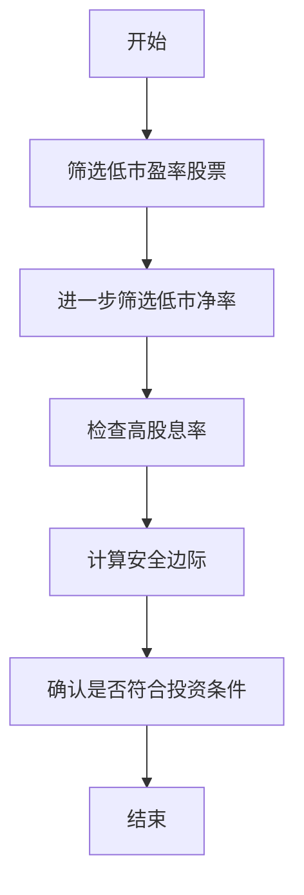

                 


# 如何构建格雷厄姆特价股票投资组合

## 关键词：格雷厄姆投资、价值投资、特价股票、股票分析、投资组合、风险管理

## 摘要：本文详细讲解如何基于格雷厄姆的价值投资理念，系统地构建特价股票投资组合。通过基本面分析、财务指标评估和安全边际计算等方法，结合实际案例和风险管理策略，帮助投资者在市场中找到低估的股票，实现长期稳健的投资回报。

---

# 第一部分: 格雷厄姆价值投资基础

## 第1章: 价值投资与格雷厄姆投资理念

### 1.1 价值投资的核心概念

#### 1.1.1 价值投资的定义与背景

- **价值投资**是一种投资策略，强调以低于内在价值的价格购买优质股票。其核心理念是市场短期波动不可预测，但长期来看，股票价格会回归其内在价值。
- **背景**：20世纪初，本杰明·格雷厄姆和戴维德·多德提出了价值投资理论，成为现代投资学的重要基石。

#### 1.1.2 格雷厄姆的投资哲学

- **安全边际**：格雷厄姆强调购买股票时，价格应显著低于其内在价值，以确保即使出现错误，也能获得安全边际。
- **长期视角**：投资不是投机，而是基于企业基本面的长期价值。
- **逆市场思维**：当市场恐慌时，优质股票可能被低估，是投资的好机会。

#### 1.1.3 价值投资与投机的区别

- **价值投资**：基于企业的基本面分析，追求长期稳定的回报。
- **投机**：基于市场情绪和短期价格波动，风险较高。

### 1.2 格雷厄姆投资策略的核心要素

#### 1.2.1 股票的内在价值

- 内在价值是企业未来现金流的现值，可以通过DCF模型计算。
- 公式：$$\text{内在价值} = \sum_{t=1}^{n} \frac{\text{现金流}}{(1 + r)^t}$$

#### 1.2.2 安全边际的概念

- 安全边际 = 内在价值 - 市场价格。
- 公式：$$\text{安全边际} = \text{内在价值} - \text{市场价格}$$
- 格雷厄姆建议安全边际至少为市场价格的30%。

#### 1.2.3 避免情绪化投资的原则

- 投资者应避免被市场情绪左右，坚持基本面分析。
- 定期审视投资组合，避免追涨杀跌。

---

## 第2章: 股票分析的核心方法

### 2.1 基本面分析的核心要素

#### 2.1.1 财务报表分析

- **利润表**：分析收入、成本和利润。
- **资产负债表**：评估资产、负债和所有者权益。
- **现金流量表**：监控现金流入和流出。

#### 2.1.2 盈利能力指标

- **净利润率**：$$\text{净利润率} = \frac{\text{净利润}}{\text{收入}}$$
- **ROE（净资产收益率）**：$$\text{ROE} = \frac{\text{净利润}}{\text{股东权益}}$$

#### 2.1.3 偿债能力指标

- **流动比率**：$$\text{流动比率} = \frac{\text{流动资产}}{\text{流动负债}}$$
- **速动比率**：$$\text{速动比率} = \frac{\text{速动资产}}{\text{流动负债}}$$

### 2.2 财务指标分析与对比

#### 2.2.1 常用财务指标对比表

| 指标       | 公式                        |
|------------|-----------------------------|
| 市盈率     | $$\text{市盈率} = \frac{\text{股价}}{\text{每股收益}}$$ |
| 市净率     | $$\text{市净率} = \frac{\text{股价}}{\text{每股净资产}}$$ |
| 股息率     | $$\text{股息率} = \frac{\text{股息}}{\text{股价}} \times 100\%$$ |

#### 2.2.2 市盈率与市净率的计算

- **市盈率**：反映市场对收益的估值，低市盈率可能意味着低估。
- **市净率**：反映市场对资产的估值，低市净率可能意味着低估。

#### 2.2.3 股息率与股息支付率的分析

- **股息率**：衡量股票的分红收益。
- **股息支付率**：$$\text{股息支付率} = \frac{\text{股息支付}}{\text{净利润}} \times 100\%$$

### 2.3 股票估值方法

#### 2.3.1 市场价值与内在价值的对比

- 市场价值由供需决定，内在价值由基本面决定。
- 安全边际 = 内在价值 - 市场价值。

#### 2.3.2 现金流折现模型（DCF）的应用

- **DCF模型**：通过未来现金流折现计算内在价值。
- 步骤：
  1. 预测未来现金流。
  2. 选择合适的折现率。
  3. 计算现值总和。

#### 2.3.3 市盈率与市净率的估值方法

- **市盈率法**：$$\text{合理股价} = \text{每股收益} \times \text{行业平均市盈率}$$
- **市净率法**：$$\text{合理股价} = \text{每股净资产} \times \text{行业平均市净率}$$

---

## 第3章: 格雷厄姆特价股票筛选标准

### 3.1 格雷厄姆选股公式

#### 3.1.1 低市盈率策略

- 选择市盈率低于行业平均水平的股票。
- 公式：$$\text{市盈率} < \text{行业平均市盈率}$$

#### 3.1.2 低市净率策略

- 选择市净率低于行业平均水平的股票。
- 公式：$$\text{市净率} < \text{行业平均市净率}$$

#### 3.1.3 高股息率策略

- 选择股息率高于行业平均水平的股票。
- 公式：$$\text{股息率} > \text{行业平均股息率}$$

### 3.2 特价股票的筛选流程

#### 3.2.1 筛选流程图（Mermaid）



### 3.3 特价股票的分类与对比

#### 3.3.1 不同类型特价股票的对比表格

| 类型       | 特点                  | 适用场景            |
|------------|-----------------------|---------------------|
| 低市盈率    | 收益稳定，价格低估    | 稳健投资者          |
| 低市净率    | 资产轻，价格低估      | 抗跌性较强          |
| 高股息率    | 现金流充裕，分红高    | 需求稳定现金流      |

---

## 第4章: 投资组合构建策略

### 4.1 资产配置与分散投资

#### 4.1.1 资产配置的重要性

- 分散投资降低风险，避免单一股票的风险。
- 资产配置应根据市场环境调整。

#### 4.1.2 分散投资的实现方法

- 按行业、市值、地理位置分散投资。

### 4.2 投资组合优化算法

#### 4.2.1 算法原理

- 使用优化模型选择最优股票组合。
- 目标：最大化收益，最小化风险。

#### 4.2.2 算法实现（Python代码）

```python
import pandas as pd
from scipy.optimize import minimize

def portfolio Optimization(returns, weights):
    def objective(weights):
        return -sum(weights * returns * weights)
    constraints = [{'type': 'eq', 'fun': lambda w: sum(w) - 1}]
    result = minimize(objective, weights, constraints=constraints)
    return result.x

# 示例数据
returns = pd.Series([0.1, 0.2, 0.15], index=['A', 'B', 'C'])
weights = [1/3, 1/3, 1/3]

optimal_weights = portfolio_Optimization(returns, weights)
print(optimal_weights)
```

### 4.3 风险管理与持续优化

#### 4.3.1 风险管理策略

- 定期审查投资组合。
- 重新计算安全边际，调整持仓。

#### 4.3.2 持续优化方法

- 定期再平衡投资组合。
- 根据市场变化调整权重。

---

## 第5章: 实战案例与经验总结

### 5.1 实战案例分析

#### 5.1.1 案例选择

- 选择一家低市盈率、低市净率且高股息率的公司。
- 计算其内在价值和安全边际。

#### 5.1.2 安全边际计算

- 假设公司内在价值为50元，市场价格为40元。
- 安全边际：$$\text{安全边际} = 50 - 40 = 10\text{元}$$

### 5.2 投资组合构建步骤

#### 5.2.1 确定投资目标

- 确定投资期限、风险承受能力和收益目标。

#### 5.2.2 选择标的股票

- 根据筛选标准选择多只符合条件的股票。

#### 5.2.3 构建投资组合

- 按照优化算法分配权重。

### 5.3 经验总结与注意事项

#### 5.3.1 经验总结

- 价值投资需要耐心和纪律。
- 定期审查和调整投资组合。

#### 5.3.2 注意事项

- 避免情绪化决策。
- 保持分散投资，降低风险。

---

## 第6章: 风险管理与投资纪律

### 6.1 风险管理的核心要素

#### 6.1.1 风险识别

- 识别市场风险、流动性风险和公司特定风险。

#### 6.1.2 风险量化

- 使用波动率和VaR（在险价值）量化风险。

### 6.2 投资纪律的重要性

#### 6.2.1 避免追涨杀跌

- 遵循买入和卖出纪律，避免情绪化交易。

#### 6.2.2 保持长期视角

- 短期波动不影响长期价值。

---

## 第7章: 总结与展望

### 7.1 总结

- 格雷厄姆的价值投资策略强调基本面分析和安全边际。
- 构建投资组合时，需结合分散投资和定期优化。

### 7.2 未来展望

- 结合技术分析和量化模型，进一步优化投资策略。
- 随着市场的变化，不断调整和改进投资方法。

---

通过以上步骤，投资者可以系统地构建格雷厄姆特价股票投资组合，实现长期稳健的投资回报。

