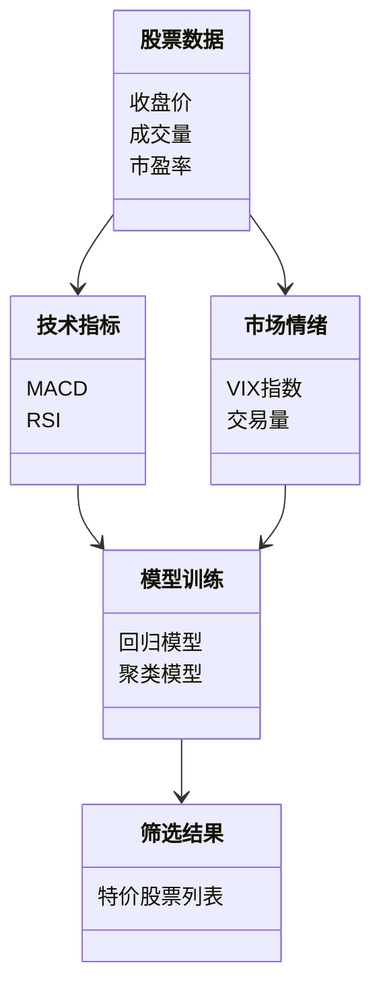
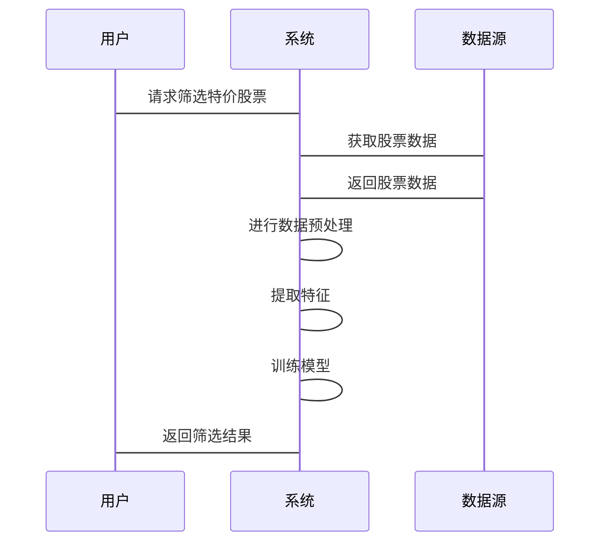

                 


# 如何构建高效的特价股票筛选模型

> 关键词：股票筛选模型、技术指标、市场情绪、机器学习、数据特征

> 摘要：本文将详细介绍如何构建一个高效的特价股票筛选模型。通过分析股票市场的核心数据特征，结合技术指标和市场情绪，利用机器学习算法，逐步构建一个能够准确筛选出潜在特价股票的模型。文章内容涵盖数据预处理、特征提取、算法选择与实现、系统架构设计等关键环节，并通过实际案例分析，深入探讨模型的优化与调优策略。

---

# 第一部分: 特价股票筛选模型的背景与核心概念

## 第1章: 特价股票筛选模型的背景与意义

### 1.1 特价股票的定义与特点

#### 1.1.1 特价股票的定义
特价股票指的是市场价格显著低于其内在价值的股票。这种价格差异通常是由市场波动、投资者情绪或短期市场因素引起的。识别这些股票对于投资者来说是一个重要的机会，尤其是对于那些寻求短期收益或套利机会的投资者。

#### 1.1.2 特价股票的特点
- **低估值**：市盈率、市净率等估值指标远低于行业平均水平。
- **高波动性**：短期内价格波动较大，容易出现快速反弹。
- **市场关注度低**：可能属于冷门股票，交易量相对较小。

#### 1.1.3 特价股票的市场背景
股票市场是一个复杂的生态系统，受到多种因素的影响，包括宏观经济环境、行业趋势、公司基本面等。特价股票的出现往往与市场的非理性波动、突发事件或市场周期性调整有关。

### 1.2 构建特价股票筛选模型的意义

#### 1.2.1 投资者需求分析
投资者希望通过筛选模型快速识别出具有潜在上涨空间的特价股票，从而抓住投资机会，提高投资回报率。

#### 1.2.2 市场效率与模型的价值
市场并非总是有效，存在信息不对称和价格偏差。通过模型筛选特价股票，可以帮助投资者发现市场中的定价错误，从而获得超额收益。

#### 1.2.3 模型在投资决策中的作用
模型可以提供数据支持和决策依据，帮助投资者减少主观判断的干扰，提高决策的科学性和效率。

### 1.3 模型构建的目标与范围

#### 1.3.1 模型的目标
- 准确识别出潜在的特价股票。
- 提供基于数据和算法的客观筛选标准。
- 帮助投资者降低投资风险，提高投资效率。

#### 1.3.2 模型的适用范围
- 适用于短期投资策略。
- 适用于对特定行业或市场的投资机会的筛选。
- 适用于量化投资策略的制定。

#### 1.3.3 模型的边界与限制
- 市场波动和突发事件可能影响模型的准确性。
- 模型依赖于历史数据，未来市场可能发生变化。
- 模型仅供参考，不能完全依赖模型做出投资决策。

## 第2章: 特价股票筛选模型的核心概念与联系

### 2.1 技术指标与市场情绪

#### 2.1.1 技术指标的定义与分类
技术指标是通过分析历史价格和交易量数据，预测未来价格走势的工具。常见的技术指标包括：
- **移动平均线（MA）**：用于平滑价格走势，识别趋势方向。
- **相对强弱指数（RSI）**：衡量股票超买或超卖状态。
- **MACD**：通过移动平均收敛散度分析价格趋势。

#### 2.1.2 市场情绪的衡量方法
市场情绪是投资者对市场的整体看法，可以通过以下方式衡量：
- **市场情绪指标（如恐慌指数VIX）**：反映市场的波动性和投资者情绪。
- **交易量**：高交易量可能表明市场情绪高涨或恐慌。

#### 2.1.3 技术指标与市场情绪的关系
技术指标可以帮助识别市场情绪的变化，而市场情绪则会影响技术指标的表现。两者相互作用，共同影响股票价格的波动。

### 2.2 数据特征与股票表现

#### 2.2.1 历史价格数据的特征
- **开盘价、收盘价、最高价、最低价**：反映股票的价格波动。
- **交易量**：反映市场的活跃程度。

#### 2.2.2 交易量与市场活跃度
高交易量通常意味着市场关注度高，可能影响股票价格的波动。

#### 2.2.3 公司基本面数据的影响
公司基本面数据，如利润、营收、负债等，是影响股票内在价值的重要因素。

### 2.3 竞争性分析与市场结构

#### 2.3.1 行业竞争分析
通过分析行业内的竞争格局，可以识别出具有竞争优势的公司。

#### 2.3.2 市场结构对股票价格的影响
市场结构的变化，如行业整合、政策变化等，可能影响股票价格的走势。

#### 2.3.3 竞争性分析的指标与方法
- **市场份额**：反映公司在行业中的地位。
- **竞争优势**：如成本优势、技术创新等。

### 2.4 核心概念对比分析

#### 2.4.1 技术指标与基本面数据的对比
| 特性          | 技术指标                     | 基本面数据                     |
|---------------|------------------------------|-------------------------------|
| 数据来源      | 历史价格和交易量数据         | 公司财务报表数据               |
| 分析目的      | 预测价格走势                 | 评估公司内在价值               |
| 时间跨度      | 短期波动                     | 长期趋势                       |

#### 2.4.2 不同市场情绪指标的优缺点
| 指标名称       | 优点                           | 缺点                           |
|----------------|--------------------------------|--------------------------------|
| VIX指数         | 反映市场整体波动性             | 易受市场情绪影响，不一定准确反映个股情绪 |
| 交易量         | 反映市场活跃度                 | 高交易量可能出现在利好或利空消息中 |

#### 2.4.3 数据特征对模型性能的影响
选择合适的特征可以显著提高模型的准确性。例如，结合技术指标和基本面数据，可以更全面地评估股票的价值。

### 2.5 本章小结
本章详细介绍了构建特价股票筛选模型的核心概念，包括技术指标、市场情绪、数据特征和竞争性分析。通过对这些概念的深入理解，我们可以更好地设计和优化模型。

---

# 第二部分: 特价股票筛选模型的算法原理

## 第3章: 模型算法原理与实现

### 3.1 基于回归分析的筛选算法

#### 3.1.1 线性回归模型的原理
线性回归是一种统计学方法，通过拟合一条直线来预测目标变量。其数学模型如下：

$$ y = \beta_0 + \beta_1 x_1 + \beta_2 x_2 + \dots + \beta_n x_n + \epsilon $$

其中，$y$ 是目标变量，$x_i$ 是自变量，$\beta$ 是回归系数，$\epsilon$ 是误差项。

#### 3.1.2 逻辑回归模型的应用
逻辑回归用于分类问题，适用于二分类任务。其概率函数如下：

$$ P(y=1|x) = \frac{1}{1 + e^{-(\beta_0 + \beta_1 x_1 + \dots + \beta_n x_n)}} $$

#### 3.1.3 回归分析在股票筛选中的应用示例
假设我们希望通过回归分析预测股票的未来价格。我们收集了以下数据：

| 股票代码 | 收盘价（$y$） | 成交量（$x_1$） | 市盈率（$x_2$） |
|----------|----------------|------------------|------------------|
| AAPL     | 150            | 100000           | 15               |
| GOOGL    | 130            | 80000            | 12               |

通过训练回归模型，我们可以预测未来的价格走势。

### 3.2 基于聚类分析的股票分组

#### 3.2.1 聚类分析的基本原理
聚类分析是将数据点分成相似组的过程。常用的聚类算法包括K-means、层次聚类等。

#### 3.2.2 K-means算法在股票分组中的应用
假设我们有以下股票数据：

| 股票代码 | 收盘价 | 成交量 | 市盈率 |
|----------|--------|--------|--------|
| AAPL     | 150    | 100000 | 15     |
| GOOGL    | 130    | 80000  | 12     |
| MSFT     | 120    | 90000  | 10     |

使用K-means算法，我们可以将这些股票分成不同的组别，以便更好地进行分析和筛选。

### 3.3 基于时间序列分析的预测模型

#### 3.3.1 时间序列分析的基本原理
时间序列分析是通过分析过去的数据，预测未来趋势的方法。常用的模型包括ARIMA、LSTM等。

#### 3.3.2 LSTM在股票价格预测中的应用
LSTM（长短期记忆网络）是一种特殊的RNN，适用于处理时间序列数据。其结构如下：

$$
i_t = \sigma(g(x_t + W_i h_{t-1}))
$$

$$
f_t = \sigma(g(x_t + W_f h_{t-1}))
$$

$$
o_t = \sigma(g(x_t + W_o h_{t-1}))
$$

$$
h_t = i_t \cdot \tilde{c}_t + f_t \cdot c_{t-1}
$$

其中，$i_t$ 是输入门，$f_t$ 是遗忘门，$o_t$ 是输出门，$c_t$ 是细胞状态。

---

# 第四部分: 系统架构与实现

## 第4章: 系统架构与实现

### 4.1 系统功能设计

#### 4.1.1 领域模型（Mermaid 类图）


### 4.2 系统架构设计（Mermaid 架构图）


### 4.3 系统接口设计

#### 4.3.1 数据接口
- 数据获取接口：从金融数据供应商获取实时数据。
- 数据存储接口：将数据存储到数据库中。

#### 4.3.2 模型接口
- 模型训练接口：接收特征数据，训练筛选模型。
- 模型预测接口：根据输入数据，输出筛选结果。

### 4.4 系统交互设计（Mermaid 序列图）


---

# 第五部分: 项目实战与优化

## 第5章: 项目实战与优化

### 5.1 环境安装

#### 5.1.1 安装Python与相关库
```bash
pip install numpy pandas scikit-learn matplotlib
```

### 5.2 系统核心实现源代码

#### 5.2.1 数据预处理代码
```python
import pandas as pd
import numpy as np

# 加载数据
data = pd.read_csv('stock_data.csv')

# 处理缺失值
data.dropna(inplace=True)

# 标准化数据
from sklearn.preprocessing import StandardScaler
scaler = StandardScaler()
scaled_data = scaler.fit_transform(data)
```

#### 5.2.2 特征提取代码
```python
from sklearn.decomposition import PCA
pca = PCA(n_components=5)
principal_components = pca.fit_transform(scaled_data)
```

#### 5.2.3 模型训练代码
```python
from sklearn.ensemble import RandomForestClassifier
model = RandomForestClassifier(n_estimators=100, random_state=42)
model.fit(principal_components, target_labels)
```

### 5.3 代码应用解读与分析

#### 5.3.1 数据预处理
- 数据清洗：去除缺失值。
- 数据标准化：使数据具有可比性。

#### 5.3.2 特征提取
- 使用PCA降低数据维度，提取主成分。

#### 5.3.3 模型训练
- 使用随机森林模型进行分类，预测股票是否为特价股票。

### 5.4 实际案例分析

#### 5.4.1 案例背景
假设我们有以下股票数据：

| 股票代码 | 收盘价 | 成交量 | 市盈率 | 特价股票标记 |
|----------|--------|--------|--------|--------------|
| AAPL     | 150    | 100000 | 15     | 1            |
| GOOGL    | 130    | 80000  | 12     | 0            |
| MSFT     | 120    | 90000  | 10     | 1            |

#### 5.4.2 模型预测
经过训练的随机森林模型可以预测新的股票是否为特价股票。

### 5.5 项目小结

#### 5.5.1 项目总结
通过项目实战，我们验证了模型的有效性，并掌握了从数据预处理到模型训练的完整流程。

#### 5.5.2 模型优化建议
- 调整模型参数，如随机森林的n_estimators。
- 尝试不同的特征选择方法，如Lasso回归。

---

# 第六部分: 最佳实践与总结

## 第6章: 最佳实践与总结

### 6.1 最佳实践 tips

#### 6.1.1 数据处理
- 确保数据的完整性和准确性。
- 处理异常值和缺失值。

#### 6.1.2 模型选择
- 根据问题类型选择合适的算法。
- 多算法对比，选择性能最优的模型。

#### 6.1.3 模型调优
- 使用交叉验证评估模型性能。
- 调整模型参数，优化性能。

### 6.2 本章小结

#### 6.2.1 项目总结
通过本文的详细讲解，读者可以掌握如何从数据预处理、特征提取、算法选择到模型训练的完整流程，构建一个高效的特价股票筛选模型。

#### 6.2.2 未来展望
随着机器学习技术的不断发展，特价股票筛选模型将更加智能化和个性化，为投资者提供更精准的投资决策支持。

---

通过以上步骤，我们可以系统地构建一个高效的特价股票筛选模型，帮助投资者快速识别潜在的特价股票，抓住投资机会，实现超额收益。

