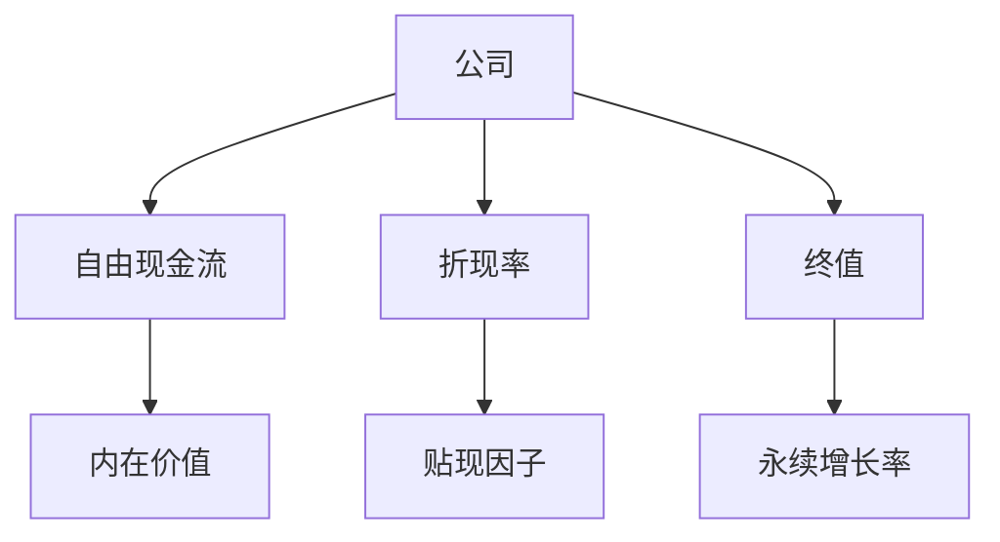
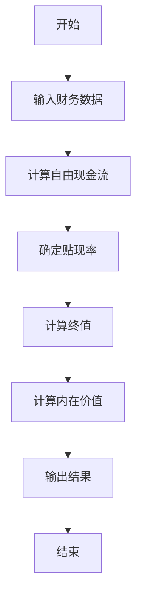

                 


# 如何计算一家公司的内在价值

## 关键词：公司内在价值、现金流贴现模型、DCF模型、自由现金流、折现率、终值

## 摘要：  
计算公司的内在价值是投资决策中的关键步骤，它基于对公司未来现金流的预测和贴现。本文通过详细分析现金流贴现模型（DCF模型）的核心概念、算法原理、系统架构设计及实际案例，帮助读者掌握如何准确评估公司的内在价值。文章还涵盖了内在价值与市场价值的区别、DCF模型的优缺点以及实际应用中的注意事项。

---

## 第一部分: 公司内在价值的背景与概念

### 第1章: 公司内在价值的基本概念

#### 1.1 内在价值的定义与背景
- **1.1.1 什么是公司内在价值**  
  公司的内在价值是指基于其未来现金流的现值，反映了公司的真实价值，与市场波动无关。  

- **1.1.2 内在价值与市场价值的区别**  
  内在价值是公司的真实价值，而市场价值是市场交易价格，可能偏离内在价值。  

- **1.1.3 内在价值在投资中的重要性**  
  内在价值是投资决策的基础，帮助投资者判断股票是否被低估或高估。  

#### 1.2 内在价值的核心要素
- **1.2.1 自由现金流的定义与计算**  
  自由现金流是公司在偿还债务和再投资后的剩余现金流，公式为：  
  $$ \text{自由现金流} = \text{净利润} + \text{折旧} + \text{摊销} - \text{资本 expenditures} $$  

- **1.2.2 折现率的含义与影响**  
  折现率反映了资金的时间价值和风险，通常使用加权平均资本成本（WACC）作为折现率。  

- **1.2.3 终值的概念与计算方法**  
  终值是公司未来永续现金流的现值，假设永续增长率为\( g \)，终值公式为：  
  $$ TV = \frac{\text{最后一年现金流}}{1 - g} $$  

#### 1.3 内在价值的计算公式与边界条件
- **1.3.1 内在价值的标准公式**  
  $$ V = \sum_{t=1}^{n} \frac{FCF_t}{(1 + r)^t} + \frac{TV}{(1 + r)^n} $$  

- **1.3.2 边界条件的设定与影响**  
  包括预测期长度、永续增长率、折现率等，边界条件的变化会影响最终的内在价值计算。  

- **1.3.3 内在价值计算的常见误区**  
  过度依赖历史数据、忽略风险因素、错误设定永续增长率等。  

#### 1.4 内在价值与投资决策的关系
- **1.4.1 内在价值在股票投资中的应用**  
  通过比较股票的内在价值与市场价，判断投资机会。  

- **1.4.2 如何通过内在价值判断投资机会**  
  如果市场价低于内在价值，股票可能被低估，值得买入。  

- **1.4.3 内在价值与风险管理的结合**  
  内在价值分析需考虑下行风险，确保投资的安全性。  

#### 1.5 本章小结  
本章介绍了内在价值的基本概念、核心要素及其与投资决策的关系，为后续计算奠定了基础。

---

### 第2章: 内在价值的核心概念与联系

#### 2.1 内在价值的核心概念
- **2.1.1 自由现金流的构成与计算**  
  自由现金流是公司可用于再投资和偿还债务的现金流，反映了公司的盈利能力和流动性。  

- **2.1.2 折现率的计算方法与影响因素**  
  折现率由无风险利率和风险溢价组成，反映了资金的时间价值和投资风险。  

- **2.1.3 终值的估算与假设**  
  终值假设公司以永续增长率增长，需合理设定增长率以避免高估或低估。  

#### 2.2 内在价值核心概念的对比分析
- **2.2.1 自由现金流与净利润的对比**  
  自由现金流考虑了资本支出，净利润未考虑。  

- **2.2.2 折现率与资本成本的关系**  
  折现率通常等于资本成本，反映了公司的资金成本。  

- **2.2.3 终值与永续增长率的联系**  
  终值与永续增长率成正比，增长率越高，终值越大。  

#### 2.3 内在价值的ER实体关系图


#### 2.4 本章小结  
本章通过对比分析和实体关系图，展示了内在价值核心概念之间的联系，帮助读者更好地理解其内在逻辑。

---

### 第3章: 内在价值计算的算法原理

#### 3.1 现金流贴现模型（DCF模型）
- **3.1.1 DCF模型的基本原理**  
  DCF模型将未来现金流折现，计算其现值以确定内在价值。  

- **3.1.2 DCF模型的计算步骤**  
  1. 预测未来自由现金流。  
  2. 确定合适的折现率。  
  3. 计算终值。  
  4. 将未来现金流和终值折现，求和得到内在价值。  

- **3.1.3 DCF模型的优缺点**  
  优点：考虑了时间价值和风险。缺点：依赖假设，计算复杂。  

#### 3.2 内在价值计算的数学模型
- **3.2.1 自由现金流公式**  
  $$ FC_{\text{free}} = \text{净利润} + \text{折旧} + \text{摊销} $$  

- **3.2.2 内在价值公式**  
  $$ V = \sum_{t=1}^{n} \frac{FCF_t}{(1 + r)^t} + \frac{TV}{(1 + r)^n} $$  

#### 3.3 算法流程图


#### 3.4 本章小结  
本章详细讲解了DCF模型的原理和计算步骤，通过流程图清晰展示了算法的逻辑。

---

### 第4章: 内在价值计算的系统分析与架构设计

#### 4.1 系统分析
- **4.1.1 问题场景介绍**  
  需要计算公司内在价值，涉及大量财务数据和复杂计算。  

- **4.1.2 项目目标与范围**  
  开发一个计算内在价值的系统，支持用户输入数据和模型计算。  

- **4.1.3 关键业务流程分析**  
  数据输入、模型计算、结果输出。  

#### 4.2 系统功能设计
- **4.2.1 领域模型**  
  ```mermaid
  classDia
    class 公司 {
      - 财务数据
      - 假设参数
      + 计算内在价值()
    }
    class 自由现金流 {
      + 计算()
    }
    class 折现率 {
      + 计算()
    }
    class 终值 {
      + 计算()
    }
  ```

- **4.2.2 系统架构设计**  
  ```mermaid
  graph TD
    A[用户界面] --> B[数据层]
    B --> C[计算层]
    C --> D[结果层]
  ```

- **4.2.3 系统接口设计**  
  用户输入数据，系统调用计算模块，输出结果。  

- **4.2.4 系统交互序列图**  
  ```mermaid
  sequenceDiagram
    participant 用户
    participant 系统
    用户->系统: 输入财务数据
    系统->系统: 计算自由现金流
    系统->系统: 计算折现率
    系统->系统: 计算终值
    系统->用户: 输出内在价值
  ```

#### 4.3 本章小结  
本章从系统角度分析了内在价值计算的需求、功能和架构设计，为实际开发提供了指导。

---

### 第5章: 内在价值计算的项目实战

#### 5.1 环境安装
- **安装Python和必要的库**  
  需要安装Pandas、NumPy、Matplotlib等库，用于数据处理和可视化。  

#### 5.2 核心实现源代码
```python
import pandas as pd
import numpy as np

def calculate_intrinsic_value(fcf, discount_rate, terminal_value):
    present_value = 0
    for t in range(len(fcf)):
        present_value += fcf[t] / (1 + discount_rate) ** t
    present_value += terminal_value / (1 + discount_rate) ** len(fcf)
    return present_value

# 示例数据
fcf = [100, 120, 150]
discount_rate = 0.1
terminal_value = 2000

iv = calculate_intrinsic_value(fcf, discount_rate, terminal_value)
print(f"内在价值: {iv:.2f}")
```

#### 5.3 代码解读与分析
- **代码功能**  
  该代码实现了一个简单的DCF模型，计算公司的内在价值。  

- **关键步骤**  
  1. 输入自由现金流、折现率和终值。  
  2. 计算每一年的现值并累加。  
  3. 计算终值的现值并加总。  

#### 5.4 实际案例分析
- **案例：苹果公司**  
  假设苹果公司未来三年的自由现金流分别为1000、1200、1500，折现率为10%，终值为3000。  
  内在价值计算如下：  
  $$ V = \frac{1000}{1.1} + \frac{1200}{1.1^2} + \frac{1500}{1.1^3} + \frac{3000}{1.1^3} $$  
  计算结果为：  
  $$ V ≈ 2830.19 $$  

#### 5.5 本章小结  
本章通过实际案例和代码实现，展示了如何将内在价值计算应用于实际投资分析。

---

### 第6章: 最佳实践、小结、注意事项与拓展阅读

#### 6.1 最佳实践
- **数据来源的可靠性**  
  使用可靠的财务数据，确保计算准确。  

- **假设的合理性**  
  合理设定增长率和折现率，避免高估或低估。  

- **模型的敏感性分析**  
  检查关键参数变化对内在价值的影响，确保结果稳健。  

#### 6.2 小结  
本文详细讲解了如何计算公司的内在价值，从基本概念到实际应用，帮助读者掌握这一重要技能。  

#### 6.3 注意事项
- 避免过度简化模型，忽略关键因素。  
- 定期更新财务数据和假设，适应市场变化。  

#### 6.4 拓展阅读
- Fama, F. (1970). Efficient Capital Markets: A Review of Theory and Practice.  
- Graham, B. (1949). The Intelligent Investor.  

---

### 第7章: 总结与展望

#### 7.1 本文章总结
本文从理论到实践，全面讲解了公司内在价值的计算方法，帮助投资者做出明智决策。  

#### 7.2 对未来研究的展望
未来研究可以探索更多模型，如相对估值法、情景分析等，以提高内在价值评估的准确性。  

#### 7.3 本章小结  
本章总结了全文内容，并展望了未来的研究方向。

---

# 关键词总结：
公司内在价值、现金流贴现模型、自由现金流、折现率、终值、投资决策、DCF模型、系统架构设计、实际案例分析、最佳实践

---

通过本文的详细讲解，读者可以掌握如何计算公司的内在价值，并将其应用于实际投资分析中。希望本文能为投资者和研究者提供有价值的参考和指导。

