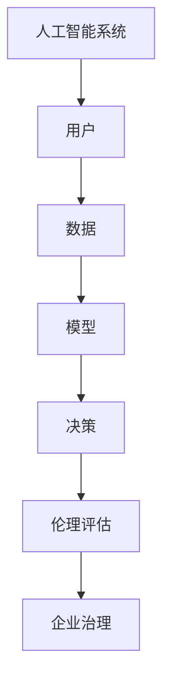
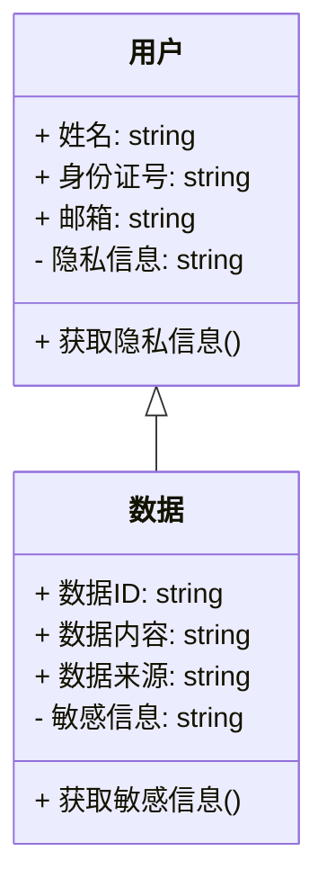
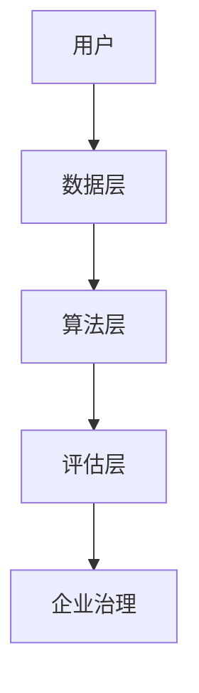

                 


# 如何评估企业的人工智能伦理标准

## 关键词：人工智能，伦理标准，企业评估，算法原理，系统架构

## 摘要：  
随着人工智能技术的快速发展，企业应用AI技术的同时也面临越来越多的伦理挑战。本文详细介绍了如何评估企业的人工智能伦理标准，从核心概念、算法原理、系统架构到实际案例，全面解析了企业在AI伦理评估中的关键步骤和方法。

---

## 第1章：人工智能伦理评估的背景与问题背景

### 1.1 人工智能技术的快速发展与伦理挑战  
人工智能技术的快速发展为企业带来了巨大的机遇，同时也带来了诸多伦理挑战。例如，AI算法可能存在的数据偏见、隐私泄露问题，以及AI决策的透明性和可解释性问题。这些问题不仅影响企业的声誉，还可能引发法律风险。

### 1.2 企业AI伦理评估的必要性  
企业应用AI技术时，必须考虑其伦理影响。例如，在招聘系统中使用AI算法可能会因为数据偏差而导致不公平的招聘结果。因此，企业需要建立一套完整的AI伦理评估体系，确保AI技术的应用符合伦理标准。

### 1.3 人工智能伦理的核心概念  
AI伦理的核心概念包括公平性、透明性、隐私保护、责任归属和社会福祉。这些概念相互关联，构成了企业AI伦理评估的框架。

---

## 第2章：人工智能伦理的核心维度与特征对比

### 2.1 AI伦理的核心维度  
AI伦理的核心维度包括公平性、透明性、隐私保护、责任归属和社会福祉。这些维度是企业在评估AI伦理时需要重点关注的方面。

### 2.2 核心维度的特征对比  
以下是核心维度的特征对比表：

| 维度   | 特征描述                     |
|--------|------------------------------|
| 公平性 | 数据偏差、结果公正性         |
| 透明性 | 模型可解释性、决策过程公开性 |
| 隐私保护 | 数据安全、用户隐私保护       |
| 责任归属 | 可追溯性、责任分配           |
| 社会福祉 | 社会价值、公共利益           |

### 2.3 ER实体关系图  
以下是AI伦理评估的ER实体关系图：



---

## 第3章：AI伦理评估的算法原理

### 3.1 偏见检测算法  
偏见检测算法是AI伦理评估的重要组成部分。以下是常见的偏见检测算法：

#### 3.1.1 基于统计的偏见检测方法  
- **方法描述**：通过统计分析检测数据中的偏差。
- **代码示例**：
  ```python
  import pandas as pd
  df = pd.read_csv('data.csv')
  print(df['gender'].value_counts())
  ```

#### 3.1.2 基于机器学习的偏见消除算法  
- **方法描述**：通过机器学习模型消除数据中的偏见。
- **代码示例**：
  ```python
  from sklearn.linear_model import LogisticRegression
  model = LogisticRegression()
  model.fit(X, y)
  ```

### 3.2 数据隐私保护算法  
数据隐私保护算法是AI伦理评估的重要组成部分。以下是常见的数据隐私保护算法：

#### 3.2.1 差分隐私  
- **方法描述**：通过在数据中加入噪声，保护数据隐私。
- **数学公式**：
  $$ \text{Noise} = \text{Laplace}(\mu=0, b=1/\epsilon) $$

#### 3.2.2 同态加密  
- **方法描述**：通过对数据进行加密，保护数据隐私。
- **数学公式**：
  $$ \text{Enc}(x) = x + \text{Noise} $$

---

## 第4章：AI伦理评估的系统架构设计

### 4.1 系统功能设计  
以下是AI伦理评估系统的功能设计：

#### 4.1.1 领域模型  
以下是领域模型的类图：



#### 4.1.2 系统架构设计  
以下是系统架构设计的架构图：



---

## 第5章：AI伦理评估的项目实战

### 5.1 环境安装  
以下是项目实战的环境安装步骤：

1. 安装Python和必要的库：
   ```bash
   pip install numpy pandas scikit-learn
   ```

2. 安装Mermaid工具：
   ```bash
   npm install -g mermaid-cli
   ```

### 5.2 核心代码实现  
以下是核心代码实现：

#### 5.2.1 偏见检测代码  
```python
from sklearn.linear_model import LogisticRegression
from sklearn.metrics import accuracy_score

model = LogisticRegression()
model.fit(X_train, y_train)
y_pred = model.predict(X_test)
print("Accuracy:", accuracy_score(y_test, y_pred))
```

#### 5.2.2 数据隐私保护代码  
```python
import numpy as np

def add_laplace_noise(x, epsilon):
    noise = np.random.laplace(0, 1/epsilon)
    return x + noise

data = np.array([1, 2, 3, 4, 5])
noisy_data = add_laplace_noise(data, 0.1)
print(noisy_data)
```

### 5.3 实际案例分析  
以下是实际案例分析：

#### 5.3.1 案例背景  
某企业在招聘系统中使用AI算法筛选简历，但由于数据偏差，导致女性候选人通过率低于男性。

#### 5.3.2 评估与解决  
通过偏见检测算法发现数据中的性别偏差，并使用同态加密保护候选人的隐私信息。

---

## 第6章：AI伦理评估的注意事项与小结

### 6.1 注意事项  
企业在进行AI伦理评估时，需要注意以下几点：
- 数据来源的合法性
- 模型的可解释性
- 用户隐私的保护
- 算法的公平性

### 6.2 小结  
本文详细介绍了如何评估企业的人工智能伦理标准，从核心概念、算法原理到系统架构，再到实际案例，全面解析了企业在AI伦理评估中的关键步骤和方法。通过本文的指导，企业可以更好地应对AI技术带来的伦理挑战，确保AI技术的应用符合伦理标准。

---

## 附录：参考文献

1. 《人工智能伦理评估指南》
2. 《数据隐私保护与AI伦理》
3. 《机器学习算法与伦理评估》

---

以上是《如何评估企业的人工智能伦理标准》的完整目录大纲和文章内容。希望对您有所帮助！

