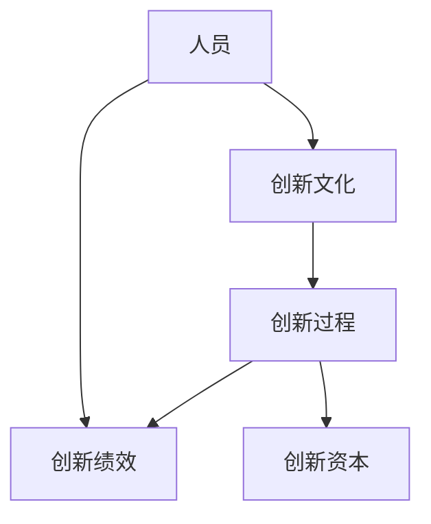
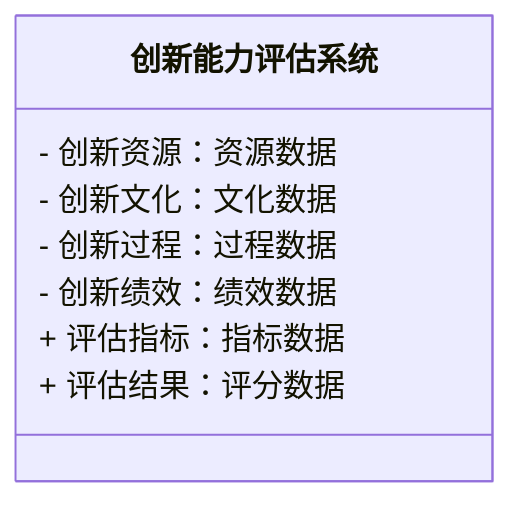
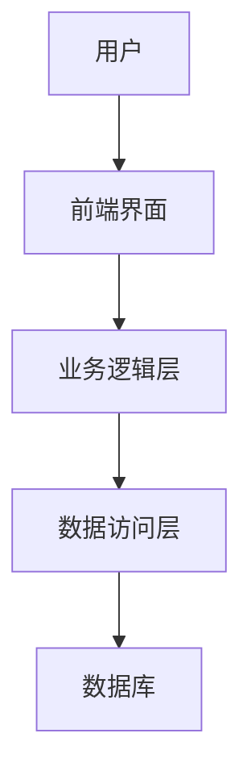

                 


# 如何评估企业的创新能力

## 关键词

- 企业创新能力
- 创新评估
- 创新模型
- 层次分析法（AHP）
- 创新系统设计

## 摘要

企业的创新能力是企业在市场竞争中保持优势的核心能力。本文系统地探讨了如何评估企业的创新能力，从核心概念、评估模型、算法原理到系统设计和实战案例，逐一进行深入分析。通过层次分析法（AHP）的应用，结合具体的数学模型和系统架构设计，为企业提供一套科学的创新能力评估方法。同时，本文还提供了实际案例分析和项目总结，帮助企业在实践中更好地应用这些评估方法。

---

## 第1章：企业创新能力评估的背景与意义

### 1.1 创新能力的基本概念

创新是企业持续发展的核心动力。创新能力不仅包括技术创新，还包括管理创新、市场创新等多个方面。创新能力的强弱直接决定了企业在市场中的竞争力和适应能力。

#### 1.1.1 创新能力的定义

创新能力是指企业在现有资源和条件下，通过整合知识、技术、管理等要素，提出新的解决方案或改进现有解决方案的能力。创新能力不仅包括技术层面的创新，还包括商业模式、组织结构和文化层面的创新。

#### 1.1.2 创新能力的类型与层次

创新可以分为以下几种类型：
- **产品创新**：开发新产品或改进现有产品的功能和性能。
- **技术创新**：在技术领域实现突破，开发新技术或改进现有技术。
- **管理创新**：在管理流程、组织结构或方法上进行创新。
- **市场创新**：通过开拓新市场、新客户或新商业模式实现创新。

创新能力的层次可以分为：
1. **个体创新能力**：员工个人的创新意识和能力。
2. **团队创新能力**：团队协作中的创新表现。
3. **组织创新能力**：整个组织在创新过程中的表现。

#### 1.1.3 创新能力对企业发展的意义

创新能力是企业在激烈竞争中生存和发展的关键。具有强大创新能力的企业能够更快地适应市场变化，抓住新的机遇，降低风险，从而在市场中占据优势地位。

### 1.2 企业创新能力评估的必要性

#### 1.2.1 当前企业面临的创新挑战

在当前的商业环境中，企业面临着日益加剧的竞争压力。技术的快速发展、客户需求的变化以及政策环境的不确定性都要求企业不断进行创新。然而，许多企业在创新过程中缺乏系统的方法，导致创新效率低下，甚至失败。

#### 1.2.2 创新能力评估对企业战略的重要性

创新能力评估是企业制定创新战略的基础。通过评估创新能力，企业可以识别自身的优劣势，制定有针对性的改进措施。同时，创新能力评估也是衡量企业创新绩效的重要依据。

#### 1.2.3 企业创新能力与市场竞争的关系

创新能力是企业在市场竞争中的核心竞争优势。具有强大创新能力的企业能够更快地响应市场变化，推出符合客户需求的产品和服务，从而在市场中占据领先地位。

### 1.3 企业创新能力评估的边界与外延

#### 1.3.1 创新能力的边界界定

创新能力的评估需要明确其边界。创新能力并不包括企业的所有能力，而是集中在创新相关的资源、过程和结果上。例如，创新能力不包括企业的财务能力或生产效率。

#### 1.3.2 创新能力与其他能力的关系

创新能力与其他能力密切相关。例如，管理能力是创新能力实现的基础，而技术水平是创新能力的重要支撑。然而，创新能力具有一定的独立性，它更多地关注企业在创新活动中的表现。

#### 1.3.3 创新能力的外部环境影响

创新能力的评估需要考虑外部环境的影响。例如，政策环境、行业竞争状况和技术发展水平都会影响企业的创新能力。因此，在评估企业创新能力时，需要综合考虑内外部环境因素。

---

## 第2章：企业创新能力的构成要素与模型

### 2.1 企业创新能力的构成要素

#### 2.1.1 创新资源与能力

创新资源包括人力资源、财务资源、技术资源等。创新能力则是企业在整合这些资源的基础上，实现创新目标的能力。

#### 2.1.2 创新文化与组织结构

创新文化是指企业在创新活动中的价值观和行为准则。创新文化是企业创新能力的重要组成部分，良好的创新文化可以激发员工的创新意识和积极性。组织结构则是企业创新活动的组织基础，合理的组织结构可以提高创新效率。

#### 2.1.3 创新过程与方法

创新过程包括需求分析、构思、开发、测试和推广等阶段。创新方法则是企业在创新过程中采用的具体技术和工具，例如设计思维、敏捷开发等。

### 2.2 企业创新能力评估的模型构建

#### 2.2.1 4P模型：人员、过程、产品、绩效

4P模型是一种常见的创新能力评估模型。它包括以下四个要素：
- **人员（People）**：企业的创新团队及其能力。
- **过程（Process）**：创新过程的规范性和效率。
- **产品（Product）**：创新成果的数量和质量。
- **绩效（Performance）**：创新活动对企业绩效的贡献。

#### 2.2.2 3C模型：文化、能力、资本

3C模型也是一种常用的创新能力评估模型。它包括以下三个要素：
- **文化（Culture）**：企业的创新文化和氛围。
- **能力（Competence）**：员工的创新能力和技能。
- **资本（Capital）**：企业的财务和技术资源。

#### 2.2.3 其他相关模型的对比与选择

不同的模型有不同的侧重点。例如，4P模型更注重创新过程和结果，而3C模型更注重创新资源和文化。企业在选择模型时，需要根据自身的实际情况和评估目标进行选择。

### 2.3 核心概念的属性特征对比表格

表2-1：创新资源与创新文化的对比

| 特性       | 创新资源               | 创新文化               |
|------------|------------------------|------------------------|
| 定义       | 企业的创新投入资源     | 企业的创新价值观和行为准则 |
| 侧重点     | 财务、技术、人力资源   | 企业文化、管理方式     |
| 影响因素   | 技术水平、资金投入     | 企业领导、员工态度     |

表2-2：创新过程与创新绩效的关系

| 特性       | 创新过程               | 创新绩效               |
|------------|------------------------|------------------------|
| 定义       | 创新活动的具体步骤     | 创新活动的结果         |
| 侧重点     | 创新方法、流程规范性   | 创新成果的质量和数量   |
| 关系       | 创新过程影响创新绩效   | 创新绩效衡量创新能力   |

### 2.4 实体关系图（ER图）：企业创新能力的核心要素



---

## 第3章：企业创新能力评估的算法与数学模型

### 3.1 层次分析法（AHP）的应用

#### 3.1.1 AHP的基本原理

层次分析法（AHP）是一种用于多准则决策分析的方法。它通过构建层次结构，将复杂的决策问题分解为若干个子问题，并通过比较和判断，确定各个子问题的权重。

#### 3.1.2 AHP在创新能力评估中的步骤

1. **构建层次结构**：将创新能力的评估指标分为多个层次，例如目标层、准则层和方案层。
2. **构建比较矩阵**：对各个指标进行两两比较，构建比较矩阵。
3. **计算权重**：通过计算比较矩阵的最大特征值和特征向量，确定各个指标的权重。

#### 3.1.3 AHP的权重计算方法

假设我们有n个评估指标，构建比较矩阵如下：

$$
A = \begin{bmatrix}
1 & a_{12} & a_{13} & \dots & a_{1n} \\
a_{21} & 1 & a_{23} & \dots & a_{2n} \\
\vdots & \vdots & \ddots & & \vdots \\
a_{n1} & a_{n2} & a_{n3} & \dots & 1
\end{bmatrix}
$$

通过计算比较矩阵的最大特征值和特征向量，可以得到各个指标的权重向量：

$$
w = \begin{bmatrix}
w_1 \\
w_2 \\
\vdots \\
w_n
\end{bmatrix}
$$

### 3.2 创新能力评估的数学模型

#### 3.2.1 综合评估模型

综合评估模型可以表示为：

$$
C = \sum_{i=1}^{n} w_i x_i
$$

其中，$C$ 是创新能力的综合评分，$w_i$ 是第i个指标的权重，$x_i$ 是第i个指标的评分。

#### 3.2.2 案例分析

假设我们有三个创新指标：创新资源（权重0.4）、创新文化（权重0.3）、创新资本（权重0.3）。某企业的这三个指标的评分为分别为80、70、90。则其创新能力的综合评分为：

$$
C = 0.4 \times 80 + 0.3 \times 70 + 0.3 \times 90 = 32 + 21 + 27 = 80
$$

---

## 第4章：企业创新能力评估的系统设计与实现

### 4.1 系统功能设计

#### 4.1.1 领域模型类图



#### 4.1.2 系统架构设计



#### 4.1.3 系统接口设计

- **输入接口**：用户输入创新指标数据。
- **输出接口**：系统输出创新能力评分和评估报告。

#### 4.1.4 系统交互流程

```mermaid
sequenceDiagram
    participant 用户
    participant 系统
    用户 -> 系统：输入创新指标数据
    系统 -> 用户：输出创新能力评分和评估报告
```

### 4.2 系统核心实现源代码

以下是一个简单的Python实现示例：

```python
# 创新能力评估系统实现
def calculate创新能力评分(创新资源, 创新文化, 创新资本):
    # 权重计算
    权重 = [0.4, 0.3, 0.3]
    # 综合评分计算
    综合评分 = 权重[0] * 创新资源 + 权重[1] * 创新文化 + 权重[2] * 创新资本
    return 综合评分

# 示例
创新资源 = 80
创新文化 = 70
创新资本 = 90
评分 = calculate创新能力评分(创新资源, 创新文化, 创新资本)
print("创新能力综合评分：" + str(评分))
```

---

## 第5章：企业创新能力评估的实际案例分析

### 5.1 案例介绍

某高科技公司计划评估其创新能力。公司拥有一支专业的研发团队，创新文化氛围浓厚，但创新资本投入相对较少。公司希望通过创新能力评估，找出其创新过程中的瓶颈，并制定改进措施。

### 5.2 案例分析

根据4P模型，我们对该公司进行评估：

1. **人员（People）**：公司拥有一支专业的研发团队，创新能力强，得分为90。
2. **过程（Process）**：创新过程规范，但效率有待提高，得分为80。
3. **产品（Product）**：公司推出的新产品数量较多，但质量有待提高，得分为75。
4. **绩效（Performance）**：创新成果对企业绩效的贡献较大，得分为85。

综合评分计算如下：

$$
C = 0.4 \times 90 + 0.2 \times 80 + 0.2 \times 75 + 0.2 \times 85 = 36 + 16 + 15 + 17 = 84
$$

### 5.3 改进建议

根据评估结果，该公司在创新过程和产品质量方面存在瓶颈。建议公司优化创新流程，加强质量控制，并加大创新资本的投入。

---

## 第6章：企业创新能力评估的总结与展望

### 6.1 项目小结

本文系统地探讨了企业创新能力的评估方法，从核心概念、评估模型、算法原理到系统设计和实战案例进行了全面分析。通过层次分析法（AHP）和4P模型的应用，为企业提供了一套科学的创新能力评估方法。

### 6.2 最佳实践 tips

1. 在创新能力评估中，建议企业结合自身的实际情况选择合适的模型和方法。
2. 创新能力评估需要关注创新资源、创新文化和创新过程等多个方面。
3. 在实际应用中，建议企业定期进行创新能力评估，并根据评估结果制定改进措施。

### 6.3 未来展望

随着技术的不断发展和市场竞争的加剧，企业创新能力评估的方法和工具也将不断优化。未来的研究可以进一步探索人工智能和大数据技术在创新能力评估中的应用，以提高评估的准确性和效率。

---

## 结语

企业创新能力是企业在市场竞争中保持优势的核心能力。通过科学的评估方法和系统的改进措施，企业可以不断提升其创新能力，从而在激烈的市场竞争中立于不败之地。

