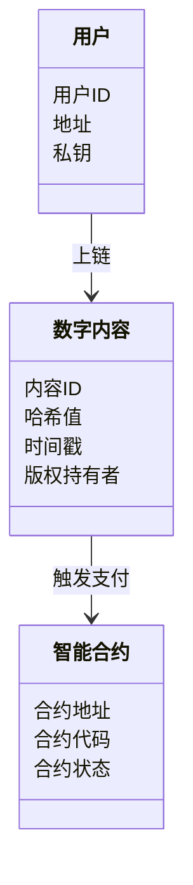
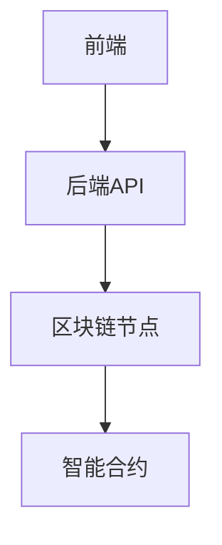
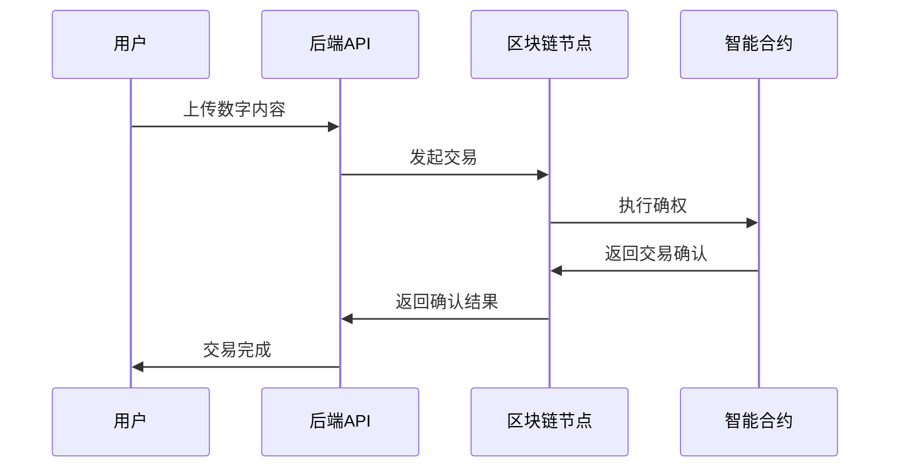

                 


# 如何评估企业的区块链数字版权保护平台

## 关键词：区块链，数字版权，版权保护，评估，企业平台

## 摘要：本文详细探讨了如何评估企业级区块链数字版权保护平台，涵盖了背景分析、核心概念、算法原理、系统架构、项目实战以及最佳实践。通过系统性的分析和案例研究，帮助读者全面了解如何选择和实施有效的数字版权保护方案。

---

## 第一部分: 区块链数字版权保护平台的背景与核心概念

### 第1章: 区块链数字版权保护平台的背景与问题背景

#### 1.1 问题背景

##### 1.1.1 数字版权保护的现状与挑战
在数字时代，版权保护面临着前所未有的挑战。数字内容的易复制性和网络传播的便捷性使得盗版和侵权问题严重。传统版权保护手段依赖法律手段，但在数字环境下难以有效追踪和确权。

##### 1.1.2 区块链技术在数字版权保护中的作用
区块链以其去中心化、不可篡改和可追溯的特性，为数字版权保护提供了新的解决方案。通过区块链技术，可以实现数字内容的高效确权、溯源和交易，确保版权方的权益。

##### 1.1.3 企业级数字版权保护的需求与痛点
企业级平台需要处理大量数字内容，要求高并发、高可用性和安全性。传统的中心化系统在扩展性和安全性上存在不足，而区块链技术能够提供分布式、抗审查的特性，满足企业级平台的需求。

#### 1.2 问题描述

##### 1.2.1 数字版权保护的核心问题
数字版权保护的核心问题是确权、授权和维权。确权需要高效且不可篡改的机制；授权需要透明且可追踪的流程；维权则需要快速且有效的法律支持。

##### 1.2.2 区块链技术如何解决这些问题
区块链通过去中心化的账本记录，确保数字内容的来源和交易历史不可篡改。智能合约可以自动执行授权和支付流程，减少人为干预和错误。区块链的透明性和可追溯性为维权提供了有力支持。

##### 1.2.3 企业级平台的特殊需求
企业级平台需要支持大规模用户和高并发交易，要求系统具备高可用性和扩展性。同时，平台需要与现有业务系统集成，确保数据的一致性和流程的连贯性。

### 第2章: 区块链数字版权保护平台的核心概念与联系

#### 2.1 核心概念

##### 2.1.1 区块链技术的基本原理
区块链是一种分布式账本技术，通过共识机制确保数据的一致性和完整性。每个区块包含交易数据和时间戳，通过链式结构形成不可篡改的记录。

##### 2.1.2 数字版权保护的定义与实现方式
数字版权保护是指通过技术手段确权、管理和保护数字内容的版权。区块链技术通过记录数字内容的哈希值和交易历史，实现版权的确权和溯源。

##### 2.1.3 智能合约在版权保护中的应用
智能合约是区块链上的自动执行程序，用于自动执行授权和支付流程。例如，当内容被使用时，智能合约自动触发支付，确保版权方获得应有的报酬。

#### 2.2 核心概念的联系

##### 2.2.1 区块链技术与数字版权保护的关系
区块链为数字版权保护提供了底层技术支持，通过去中心化和不可篡改的特性，确保数字内容的来源和交易历史真实可靠。

##### 2.2.2 智能合约与数字版权保护的结合
智能合约用于自动化管理版权授权和支付，减少人为干预，提高效率和透明度。

##### 2.2.3 平台架构的核心要素与功能模块
平台架构包括内容上链、版权确权、智能合约执行和版权交易分发等功能模块，每个模块协同工作，实现数字版权的全生命周期管理。

---

## 第三部分: 区块链数字版权保护平台的算法原理与数学模型

### 第4章: 区块链技术的算法原理

#### 4.1 区块链的共识机制

##### 4.1.1 工作量证明机制（PoW）
PoW是最常用的共识机制，通过计算哈希值来验证交易的有效性。虽然安全性高，但计算量大，能耗高。

##### 4.1.2 权益证明机制（PoS）
PoS基于持币者持有的代币数量来决定记账权，相比PoW能耗更低，但存在被操控的风险。

##### 4.1.3 拜占庭容错（BFT）
BFT是一种基于投票的共识机制，适用于节点数量较少的场景。通过多轮投票确保达成共识。

#### 4.2 区块链的哈希函数

##### 4.2.1 哈希函数的作用
哈希函数用于将任意长度的数据映射为固定长度的哈希值，确保数据的唯一性和完整性。

##### 4.2.2 常见哈希函数（SHA-256, SHA-3）
SHA-256和SHA-3是常用的哈希函数，具有高碰撞-resistant和安全性。

#### 4.3 区块链的数字签名

##### 4.3.1 数字签名的作用
数字签名用于验证数据来源和完整性，确保交易数据的真实性和不可篡改性。

##### 4.3.2 数字签名的实现
通过公钥和私钥对进行签名和验签，确保数据的完整性和不可否认性。

#### 4.4 区块链的存储结构

##### 4.4.1 区块链的链式结构
链式结构由多个区块组成，每个区块包含交易数据和前一区块的哈希值，确保数据不可篡改。

##### 4.4.2 区块链的树状结构
树状结构通过Merkle树实现，提高数据存储和验证效率，适用于大规模数据的存储和检索。

#### 4.5 区块链的数据加密

##### 4.5.1 数据加密的作用
数据加密用于保护交易数据的隐私，防止未授权访问。

##### 4.5.2 常见加密算法（AES, RSA）
AES是对称加密算法，适用于数据加密；RSA是公钥加密算法，适用于数字签名和身份验证。

---

### 第5章: 区块链数字版权保护平台的数学模型与公式

#### 5.1 评估模型

##### 5.1.1 评估指标
评估指标包括可信度、安全性、效率和扩展性。

##### 5.1.2 模型构建
$$ \text{总分} = 0.3 \times \text{可信度} + 0.3 \times \text{安全性} + 0.2 \times \text{效率} + 0.2 \times \text{扩展性} $$

##### 5.1.3 指标计算
可信度基于区块链节点的分布和共识机制的安全性；安全性基于智能合约的漏洞数量和交易验证机制；效率基于交易处理速度和网络延迟；扩展性基于节点数量和网络带宽。

#### 5.2 智能合约的执行效率

##### 5.2.1 合约执行时间
$$ \text{执行时间} = \frac{\text{合约代码长度}}{\text{节点计算能力}} + \text{网络延迟} $$

##### 5.2.2 并发处理能力
$$ \text{并发能力} = \text{节点数量} \times \text{单节点处理能力} $$

---

## 第四部分: 区块链数字版权保护平台的系统分析与架构设计

### 第6章: 系统分析与架构设计方案

#### 6.1 问题场景介绍

##### 6.1.1 数字内容确权
通过区块链记录数字内容的哈希值和时间戳，确保内容的唯一性和可追溯性。

##### 6.1.2 版权交易与分发
通过智能合约实现版权交易的自动执行，确保交易的透明和安全。

##### 6.1.3 侵权监测与维权
通过区块链查询交易历史，快速定位侵权行为，提供确凿证据。

#### 6.2 系统功能设计

##### 6.2.1 领域模型类图


#### 6.3 系统架构设计

##### 6.3.1 整体架构图


#### 6.4 接口设计与交互流程

##### 6.4.1 接口设计
```json
{
    "action": "upload_content",
    "params": {
        "content_hash": "string",
        "content_owner": "string"
    }
}
```

##### 6.4.2 交互流程图


---

## 第五部分: 区块链数字版权保护平台的项目实战

### 第7章: 项目实战

#### 7.1 环境搭建与工具安装

##### 7.1.1 环境搭建
安装Python、Node.js、Solidity编译器、区块链框架（如Ethereum、Hyperledger）等工具。

##### 7.1.2 工具安装
安装Solidity、Ganache（本地区块链环境）、MetaMask（钱包）等开发工具。

#### 7.2 核心代码实现

##### 7.2.1 内容上链模块
```python
import hashlib

def compute_hash(content):
    return hashlib.sha256(content.encode()).hexdigest()

# 示例：上链数字内容
content = "example_content"
hash_value = compute_hash(content)
print(f"Content hash: {hash_value}")
```

##### 7.2.2 智能合约实现
```solidity
contract CopyrightProtection {
    function uploadContent(bytes contentHash, address owner) {
        // 记录内容哈希和所有者
        emit ContentUploaded(contentHash, owner);
    }
}
```

#### 7.3 案例分析与解读

##### 7.3.1 案例背景
一家音乐流媒体公司希望通过区块链技术保护音乐版权，确保创作者获得应有的报酬。

##### 7.3.2 实施步骤
1. 内容上链：将音乐作品的哈希值和创作者信息记录在区块链上。
2. 智能合约：自动执行授权和支付流程，确保每次播放都支付版权费。
3. 监测与维权：通过区块链查询交易历史，快速定位侵权行为。

##### 7.3.3 代码应用解读
通过Python脚本生成内容哈希，Solidity智能合约实现授权和支付，区块链节点记录交易数据。

#### 7.4 项目小结

##### 7.4.1 项目成果
成功实现数字内容的确权和交易自动化，提高了版权保护的效率和透明度。

##### 7.4.2 经验总结
确保智能合约的安全性，选择合适的共识机制，以及与现有业务系统的无缝集成是项目成功的关键。

---

## 第六部分: 最佳实践、小结、注意事项和拓展阅读

### 第8章: 最佳实践与总结

#### 8.1 最佳实践

##### 8.1.1 技术选型
选择适合的区块链框架和共识机制，确保系统的性能和安全性。

##### 8.1.2 智能合约安全
进行智能合约审计，避免漏洞导致的损失。

##### 8.1.3 与业务系统集成
确保区块链平台与现有业务系统的兼容性，实现数据的无缝交互。

#### 8.2 小结

本文详细探讨了如何评估企业级区块链数字版权保护平台，从背景分析到系统设计，再到项目实战，提供了全面的指导。通过区块链技术，企业可以实现数字内容的确权、授权和交易的自动化，提高版权保护的效率和透明度。

#### 8.3 注意事项

##### 8.3.1 技术风险
区块链技术尚不成熟，存在能耗高、扩展性不足等问题，需要持续关注技术发展。

##### 8.3.2 法律合规
确保平台的运营符合相关法律法规，特别是在数据隐私和跨境交易方面。

##### 8.3.3 用户教育
对用户进行区块链和智能合约的教育，提高用户对平台的信任和使用能力。

#### 8.4 拓展阅读

##### 8.4.1 区块链技术书籍
推荐《区块链：通向数字未来的金色之路》、《精通以太坊：智能合约与去中心化应用开发实战》。

##### 8.4.2 数字版权保护文献
推荐《基于区块链的数字版权管理研究》、《区块链技术在数字内容保护中的应用》。

---

通过以上内容，读者可以系统地了解如何评估和实施区块链数字版权保护平台，从理论到实践，全面掌握相关技术和方法。

