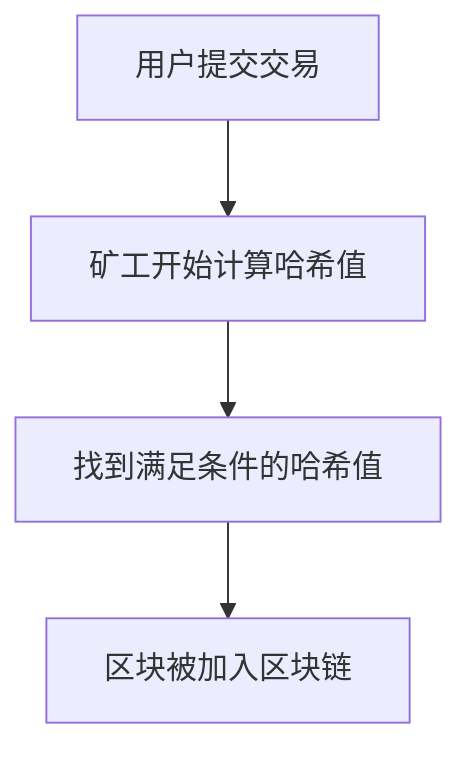
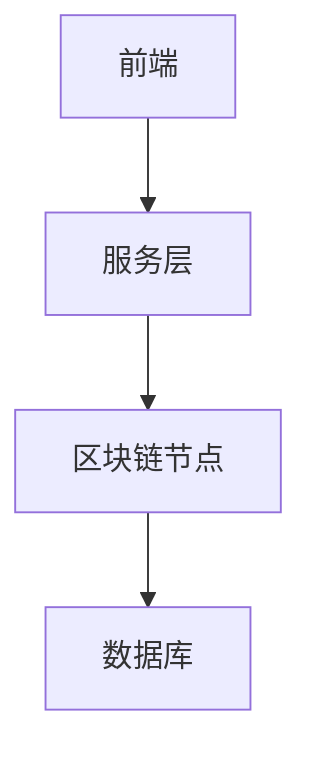
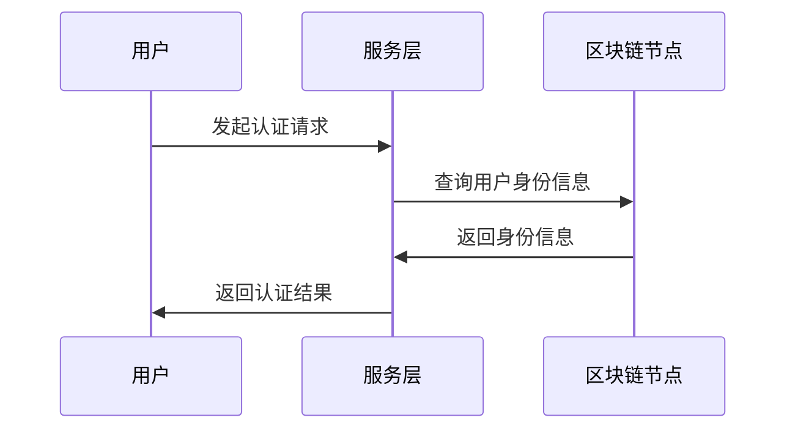

                 


# 如何评估企业的区块链数字身份跨境认证应用

> **关键词**: 区块链, 数字身份, 跨境认证, 应用评估, 系统架构, 技术实现

> **摘要**: 本文深入探讨了区块链技术在数字身份跨境认证中的应用，从核心概念、算法原理到系统架构和项目实战，全面分析了如何评估和实现企业的区块链数字身份跨境认证应用。文章结合实际案例，详细阐述了技术原理、系统设计和最佳实践，为企业的技术决策提供了有价值的参考。

---

# 第1章 区块链数字身份跨境认证的背景与问题描述

## 1.1 数字身份的背景与挑战

### 1.1.1 数字身份的概念
数字身份是指在数字世界中，个体或实体的唯一标识。随着全球数字化进程的加速，数字身份的重要性日益凸显。例如，跨国公司员工需要在多个国家和地区进行身份验证，传统的中心化认证方式存在效率低下、数据孤岛等问题。

### 1.1.2 区块链技术的赋能
区块链技术通过去中心化、不可篡改和可追溯的特性，为数字身份的管理提供了新的解决方案。例如，基于区块链的数字身份可以在跨国业务中实现无缝认证，避免重复验证和数据冗余。

### 1.1.3 跨境认证的挑战
跨境认证的核心问题在于不同国家和地区的认证标准和系统不统一，导致认证过程复杂、成本高且容易出现数据泄露。例如，跨国企业的员工在不同国家的分支机构登录系统时，需要多次提交身份信息，且难以保证数据一致性。

---

## 1.2 区块链数字身份跨境认证的解决方案

### 1.2.1 区块链技术的核心优势
区块链通过去中心化的方式，确保数字身份信息的安全性和一致性。例如，区块链上的数字身份信息可以被多个机构共享和验证，而无需重复提交。

### 1.2.2 数字身份的生命周期
数字身份的生命周期包括创建、存储、验证和更新。基于区块链的数字身份系统可以通过智能合约实现这些操作的自动化，例如，用户申请身份认证时，系统自动创建并存储其身份信息。

### 1.2.3 跨境认证的实现机制
通过区块链的分布式账本技术，数字身份信息可以在全球范围内无缝验证。例如，用户在不同国家登录时，系统可以通过区块链查询其身份信息，实现一次认证，全球通用。

---

## 1.3 核心概念对比分析

| **对比项**       | **传统中心化认证**          | **区块链数字身份认证**              |
|-------------------|----------------------------|---------------------------------------|
| 数据存储方式     | 集中存储在服务器中           | 分布式存储在区块链节点中             |
| 数据安全性       | 易受黑客攻击，数据泄露风险高 | 数据不可篡改，安全性高               |
| 认证效率         | 依赖中心机构，效率低         | 去中心化，认证效率高                 |
| 跨境适用性       | 不同国家认证标准不统一       | 统一标准，支持跨境认证               |

---

## 1.4 实体关系图（ER图）

```mermaid
er
  actor 用户 {
    id: string
    name: string
    email: string
  }
  actor 机构 {
    id: string
    name: string
    country: string
  }
  entity 认证记录 {
    id: string
    用户ID: string
    机构ID: string
    认证时间: timestamp
    状态: status
  }
  用户 --> 认证记录
  机构 --> 认证记录
```

---

# 第2章 区块链数字身份跨境认证的核心概念与联系

## 2.1 区块链技术的核心原理

### 2.1.1 区块链的基本概念
区块链是由多个区块组成的链式结构，每个区块包含交易数据和哈希值。例如，比特币区块链中的每个区块都记录了一定时间内的交易信息。

### 2.1.2 共识机制
共识机制是区块链的核心，确保所有节点达成一致。常见的共识机制包括工作量证明（PoW）、权益证明（PoS）等。例如，比特币采用PoW机制，通过计算哈希值来验证交易。

### 2.1.3 去中心化特性
去中心化是区块链的核心特点，避免了单点故障和数据集中存储的风险。例如，区块链上的数字身份信息可以被多个节点验证，无需依赖中心机构。

---

## 2.2 数字身份的核心原理

### 2.2.1 数字身份的定义与属性
数字身份包括用户ID、姓名、邮箱等属性，这些信息可以通过区块链进行存储和验证。例如，用户ID可以作为区块链上的唯一标识。

### 2.2.2 数字身份的生命周期
数字身份的生命周期包括创建、存储、验证和更新。例如，用户申请身份认证时，系统会生成唯一的数字身份，并存储在区块链上。

### 2.2.3 数字身份的安全性
通过区块链的加密技术，数字身份信息可以被安全存储和验证。例如，用户登录时，系统可以通过区块链验证其身份信息，确保数据的完整性和真实性。

---

## 2.3 区块链与数字身份的结合原理

### 2.3.1 区块链在数字身份中的应用
区块链可以作为数字身份的存储和验证平台，例如，用户的身份信息可以存储在区块链上，并通过智能合约进行验证。

### 2.3.2 数字身份在区块链中的存储
数字身份信息以区块链上的交易形式存在，每个交易记录了用户的ID、姓名和签名等信息。例如，用户申请身份认证时，系统会生成一条区块链交易，记录其身份信息。

### 2.3.3 跨境认证的实现机制
通过区块链的分布式特性，数字身份信息可以在全球范围内无缝验证。例如，用户在不同国家登录时，系统可以通过区块链查询其身份信息，实现一次认证，全球通用。

---

## 2.4 核心概念对比分析

| **对比项**       | **传统数据库**       | **区块链**             |
|-------------------|----------------------|------------------------|
| 数据存储方式     | 集中存储              | 分布式存储             |
| 数据一致性       | 依赖事务处理          | 通过共识机制保证一致性 |
| 数据安全性       | 易受攻击，数据泄露风险高 | 数据不可篡改，安全性高  |

---

## 2.5 本章小结

区块链技术为数字身份的管理提供了新的解决方案，通过去中心化和不可篡改的特性，解决了传统认证方式的痛点。在跨境认证场景中，区块链技术可以实现一次认证，全球通用，极大提升了效率和安全性。

---

# 第3章 区块链数字身份跨境认证的算法原理

## 3.1 区块链共识机制的算法实现

### 3.1.1 工作量证明（PoW）机制
PoW机制通过计算哈希值来验证交易的有效性。例如，比特币区块链中的每个区块头都包含一个 nonce，用于计算满足特定条件的哈希值。



### 3.1.2 Python实现示例
以下是一个简单的PoW算法实现：

```python
import hashlib

def find_hash(prefix):
    nonce = 0
    while True:
        hash_input = prefix + str(nonce)
        hex_hash = hashlib.sha256(hash_input.encode()).hexdigest()
        if hex_hash.startswith('0000'):
            return nonce, hex_hash
        nonce += 1

# 示例
prefix = "example"
nonce, hash = find_hash(prefix)
print(f"Nonce: {nonce}, Hash: {hash}")
```

### 3.1.3 数学模型
哈希函数的计算过程可以表示为：

$$H(message) = hash$$

其中，$message$ 是输入消息，$hash$ 是输出的哈希值。

---

## 3.2 数字身份验证的算法实现

### 3.2.1 数字签名算法
数字签名算法用于验证数据的完整性和真实性。例如，RSA算法可以通过公钥和私钥对数据进行签名和验证。

### 3.2.2 Python实现示例
以下是一个RSA签名和验证的示例：

```python
from cryptography.hazmat.primitives.asymmetric import padding
from cryptography.hazmat.primitives.asymmetric.rsa import RSAParameters, generate_private_key
from cryptography.hazmat.primitives import hashes

# 生成RSA密钥
private_key = generate_private_key(
    RSAParameters(
        modulus=2551,
        exponent=65537,
        crt_exponent=None,
        private_exponent=2751,
    )
)
public_key = private_key.public_key()

# 签名消息
message = "验证身份"
signature = private_key.sign(
    message.encode(),
    padding.PKCS1v15(),
    hashes.SHA256(),
)

# 验证签名
try:
    public_key.verify(
        signature,
        message.encode(),
        padding.PKCS1v15(),
        hashes.SHA256(),
    )
    print("签名验证成功")
except Exception as e:
    print("签名验证失败")
```

### 3.2.3 数学模型
签名和验证过程可以表示为：

$$
\text{签名} = \text{私钥} \times \text{消息} \mod n
$$

$$
\text{验证} = \text{公钥} \times \text{签名} \mod n
$$

其中，$n$ 是 RSA 模数。

---

## 3.3 本章小结

区块链的共识机制和数字签名算法是数字身份认证的核心技术。通过这些算法，可以实现数据的安全存储和高效验证。在跨境认证场景中，这些算法能够确保数字身份信息的完整性和真实性。

---

# 第4章 区块链数字身份跨境认证的系统架构设计

## 4.1 系统功能设计

### 4.1.1 用户管理模块
用户管理模块负责用户的注册、登录和信息管理。例如，用户可以通过区块链提交身份信息，系统会将信息存储在区块链上。

### 4.1.2 认证请求模块
认证请求模块处理用户的认证请求，并通过区块链进行验证。例如，用户在登录时，系统会查询区块链上的身份信息进行验证。

### 4.1.3 认证记录模块
认证记录模块记录用户的认证历史，例如，每次认证的时间、机构和状态等信息。

---

## 4.2 系统架构设计

### 4.2.1 分层架构
系统采用分层架构，包括前端、服务层、区块链节点和数据库。例如，前端负责用户交互，服务层处理业务逻辑，区块链节点负责数据存储和验证，数据库负责存储额外信息。

### 4.2.2 模块交互流程
以下是一个简单的模块交互流程：



---

## 4.3 接口设计

### 4.3.1 API接口
系统提供以下API接口：
- `POST /api/register`：用户注册
- `POST /api/login`：用户登录
- `GET /api/verify`：身份验证

### 4.3.2 接口交互流程
以下是一个身份验证的序列图：



---

## 4.4 本章小结

通过分层架构和模块化设计，系统可以高效地处理用户的认证请求，并通过区块链实现身份信息的存储和验证。接口设计确保了系统的可扩展性和可维护性。

---

# 第5章 区块链数字身份跨境认证的项目实战

## 5.1 项目背景

### 5.1.1 项目目标
本项目旨在实现基于区块链的数字身份跨境认证系统，解决跨国企业的身份认证问题。

### 5.1.2 项目范围
项目范围包括用户注册、登录、身份验证和记录管理等功能。

---

## 5.2 核心代码实现

### 5.2.1 智能合约实现
以下是基于Solidity的智能合约实现：

```solidity
// SPDX-License-Identifier: MIT
pragma solidity ^0.8.0;

contract DigitalIdentity {
    struct Identity {
        bytes32 userId;
        bytes32 name;
        bytes32 signature;
    }

    Identity[] identities;

    function register(bytes32 userId, bytes32 name, bytes32 signature) public {
        identities.push(Identity(userId, name, signature));
    }

    function verify(bytes32 userId) public view returns (bool) {
        for (uint i = 0; i < identities.length; i++) {
            if (identities[i].userId == userId) {
                return true;
            }
        }
        return false;
    }
}
```

### 5.2.2 认证服务实现
以下是认证服务的Python代码实现：

```python
from web3 import Web3, HTTPProvider

# 初始化区块链节点
web3 = Web3(HTTPProvider("http://localhost:8545"))

# 智能合约地址
contract_address = "0x...合约地址..."

# 调用合约方法
contract = web3.eth.contract(contract_address, abi=abi)

def register(user_id, name, signature):
    tx_hash = contract.functions.register(user_id, name, signature).transact()
    receipt = web3.eth.waitForTransactionReceipt(tx_hash)
    return receipt

def verify(user_id):
    result = contract.functions.verify(user_id).call()
    return result

# 示例
register("0x123", "Alice", "0x456")
verify("0x123")
```

---

## 5.3 项目小结

通过智能合约和区块链技术，我们可以实现高效的数字身份认证系统。本项目展示了如何通过区块链技术解决跨国企业的身份认证问题，为后续的优化和扩展提供了良好的基础。

---

# 第6章 区块链数字身份跨境认证的最佳实践

## 6.1 项目总结

### 6.1.1 核心收获
通过本项目，我们深入理解了区块链技术在数字身份认证中的应用，掌握了智能合约的编写和系统架构设计的方法。

### 6.1.2 项目启示
区块链技术为数字身份认证提供了新的解决方案，通过去中心化和不可篡改的特性，解决了传统认证方式的痛点。

---

## 6.2 实践中的注意事项

### 6.2.1 性能优化
在实际应用中，需要考虑区块链的性能问题，例如选择合适的共识机制和优化智能合约的执行效率。

### 6.2.2 数据隐私
数字身份信息涉及用户的隐私数据，需要采取严格的隐私保护措施，例如加密存储和访问控制。

### 6.2.3 安全性
区块链系统的安全性至关重要，需要定期进行安全审计和漏洞修复。

---

## 6.3 拓展阅读

### 6.3.1 推荐书籍
- 《Blockchain: A Step-by-Step Guide》
- 《Mastering Blockchain》

### 6.3.2 技术博客
- [Solidity官方文档](https://solidity.readthedocs.io/en/latest/)
- [Web3.js官方文档](https://web3js.readthedocs.io/en/v1.2.0/)

---

## 6.4 本章小结

区块链技术在数字身份认证中的应用前景广阔，通过不断的实践和优化，可以进一步提升系统的性能和安全性，为企业的跨境认证需求提供更高效的解决方案。

---

# 结语

区块链技术为数字身份的管理提供了新的可能性，通过去中心化和不可篡改的特性，解决了传统认证方式的痛点。本文从理论到实践，全面分析了区块链数字身份跨境认证的应用，为企业的技术决策提供了有价值的参考。

--- 

**全文完**

