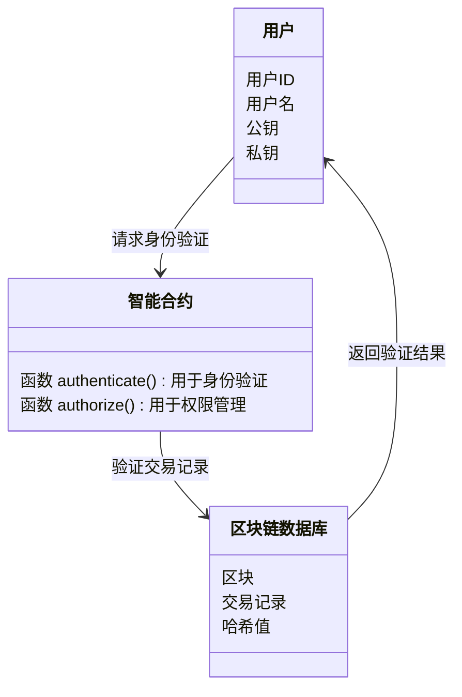
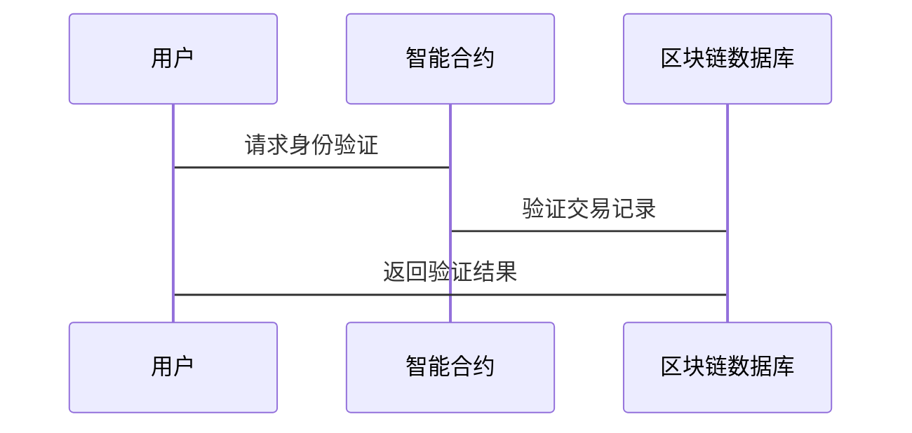

                 


# 如何评估企业的区块链数字身份跨平台认证应用

> 关键词：区块链、数字身份、跨平台认证、身份管理、安全性、去中心化、智能合约

> 摘要：本文深入探讨了如何评估企业区块链数字身份跨平台认证应用的各个方面。从核心概念到技术原理，再到系统架构和实际案例，详细分析了区块链在数字身份管理中的优势、实现方式以及评估的关键点，为企业在选择和实施区块链数字身份认证系统提供全面的指导。

---

## 第一部分：区块链数字身份跨平台认证应用概述

### 第1章：区块链与数字身份的背景介绍

#### 1.1 区块链技术概述
- **1.1.1 区块链的基本概念**
  - 区块链是一种分布式账本技术，通过去中心化和加密算法确保数据的安全性和不可篡改性。
  - 核心特点：去中心化、不可篡改、透明性、可追溯性。
  - 应用场景：金融支付、智能合约、供应链管理等。

- **1.1.2 区块链的核心特点**
  - 去中心化：数据由多个节点共同维护，避免单点故障。
  - 共识机制：通过共识算法（如POW、POS、BFT等）确保所有节点达成一致。
  - 可追溯性：每笔交易都可追踪，确保数据的真实性和完整性。

- **1.1.3 区块链的分类与应用场景**
  - 公有链：完全去中心化的区块链，如比特币、以太坊。
  - 联盟链：适用于特定组织或机构之间的协作，如企业间的供应链管理。
  - 私有链：仅限于特定用户或机构内部使用。

#### 1.2 数字身份的概念与特点
- **1.2.1 数字身份的定义**
  - 数字身份是用户在数字世界中的唯一标识，通常包括用户ID、公钥、私钥等。
  - 数字身份的目的是验证用户的真实性，确保用户在系统中的合法性。

- **1.2.2 数字身份的核心属性**
  - 独一性：每个数字身份都是唯一的，避免身份冲突。
  - 安全性：通过加密算法保护身份信息，防止被窃取或篡改。
  - 可扩展性：支持多种应用场景，如登录、支付、数据访问等。

- **1.2.3 数字身份的分类与应用场景**
  - 基于证书的数字身份：使用数字证书进行身份验证，如SSL证书。
  - 基于密码的数字身份：使用密码进行身份验证，如用户名密码。
  - 基于生物特征的数字身份：使用指纹、面部识别等生物特征进行身份验证。

#### 1.3 区块链与数字身份的结合
- **1.3.1 区块链在数字身份中的优势**
  - 去中心化：避免单一机构控制身份信息，减少数据泄露风险。
  - 不可篡改性：确保身份信息的真实性和完整性。
  - 可追溯性：便于追踪身份信息的变更和使用记录。

- **1.3.2 区块链数字身份的实现方式**
  - 使用区块链存储身份信息，通过智能合约实现身份认证。
  - 利用零知识证明等技术保护隐私，仅验证身份真实性，不泄露其他信息。

- **1.3.3 区块链数字身份的应用前景**
  - 在金融、医疗、教育等领域具有广泛的应用潜力。
  - 支持跨平台认证，提升用户体验和安全性。

#### 1.4 本章小结
本章主要介绍了区块链技术和数字身份的基本概念，并探讨了它们结合的可能性和优势。区块链的去中心化和不可篡改性为数字身份管理提供了新的解决方案，使得跨平台认证更加安全和高效。

---

### 第2章：区块链数字身份跨平台认证的核心概念

#### 2.1 区块链数字身份的核心要素
- **2.1.1 去中心化身份标识**
  - 使用区块链技术为每个用户生成唯一的去中心化标识符（DID）。
  - DID通过区块链上的智能合约进行管理，确保标识符的安全性和唯一性。

- **2.1.2 数字证书与签名机制**
  - 数字证书用于验证用户身份，通常包含公钥、颁发者信息等。
  - 数字签名用于验证数据的完整性和真实性，防止数据被篡改。

- **2.1.3 跨平台认证的实现方式**
  - 跨平台认证通过区块链上的智能合约实现，支持不同平台之间的身份互认。
  - 使用联邦身份验证协议（如OAuth 2.0、SAML）与区块链技术结合，实现跨平台认证。

#### 2.2 区块链数字身份的属性对比
- **2.2.1 不同身份认证方式的对比分析**
  | 认证方式 | 中心化 | 去中心化 | 安全性 | 易用性 |
  |----------|--------|----------|--------|--------|
  | 基于密码 | 是      | 否        | 较低    | 较高    |
  | 数字证书 | 是      | 否        | 较高    | 较低    |
  | 区块链   | 否      | 是        | 高      | 中等    |

- **2.2.2 区块链数字身份的特性分析**
  - 高安全性：通过区块链技术和加密算法保护身份信息。
  - 高透明性：所有交易记录在区块链上，可追溯且不可篡改。
  - 高可扩展性：支持多种应用场景，易于扩展。

- **2.2.3 区块链数字身份的优缺点**
  - 优点：安全性高、去中心化、不可篡改。
  - 缺点：实现复杂、需要依赖区块链技术、资源消耗较高。

#### 2.3 区块链数字身份的ER实体关系图
```mermaid
erDiagram
    user(用户) {
        id 用户ID
        name 用户名
        publicKey 公钥
        privateKey 私钥
    }
    blockchainDB(区块链数据库) {
        hash 哈希值
        transaction 交易记录
        block 区块
    }
    smartContract(智能合约) {
        function authenticate() 用于身份验证
        function authorize() 用于权限管理
    }
    用户 --> 智能合约 : 请求身份验证
    智能合约 --> 区块链数据库 : 验证交易记录
    区块链数据库 --> 用户 : 返回验证结果
```

#### 2.4 本章小结
本章详细探讨了区块链数字身份的核心要素，包括去中心化标识符、数字证书和签名机制，并通过对比分析突出了区块链数字身份的优势。同时，通过ER实体关系图展示了系统的组成部分及其关系。

---

## 第二部分：区块链数字身份跨平台认证的技术原理

### 第3章：区块链数字身份跨平台认证的算法原理

#### 3.1 区块链共识机制的实现原理
- **3.1.1 共识机制的定义与分类**
  - 共识机制是区块链节点达成一致的算法，确保所有节点的账本一致。
  - 常见共识机制：工作量证明（POW）、权益证明（POS）、拜占庭容错（BFT）等。

- **3.1.2 常见共识机制的原理**
  - 工作量证明（POW）：通过计算哈希值来验证区块的有效性，确保网络安全。
  - 权益证明（POS）：通过持有代币的数量来决定验证区块的权利，减少能源消耗。
  - 拜占庭容错（BFT）：通过投票机制达成共识，适用于联盟链。

- **3.1.3 跨平台认证中的共识机制选择**
  - 根据应用场景选择合适的共识机制，如高并发场景选择BFT，低并发场景选择POW。

#### 3.2 智能合约的实现原理
- **3.2.1 智能合约的定义与特点**
  - 智能合约是部署在区块链上的自动执行脚本，用于管理区块链上的资产和数据。
  - 特点：自动执行、不可篡改、透明性。

- **3.2.2 智能合约的执行流程**
  - 合约部署：将智能合约部署到区块链上。
  - 合约调用：通过交易调用智能合约的方法，触发相应的操作。
  - 合约状态：智能合约的状态存储在区块链上，确保数据的不可篡改性。

- **3.2.3 跨平台认证中的智能合约设计**
  - 实现身份验证功能：验证用户的身份信息是否合法。
  - 实现权限管理功能：根据用户权限控制访问范围。
  - 实现日志记录功能：记录每次身份验证的操作，便于审计。

#### 3.3 数学模型与公式
- **3.3.1 哈希函数的数学模型**
  - 哈希函数将任意长度的输入映射为固定长度的输出，确保数据的唯一性和完整性。
  - 示例：$$H(x) = \text{哈希值}$$

- **3.3.2 数字签名的数学模型**
  - 数字签名通过私钥对数据进行加密，公钥验证签名的有效性。
  - 签名生成：$$S = \text{签名}(D, K)$$
  - 签名验证：$$D = \text{解签名}(S, K)$$

#### 3.4 本章小结
本章深入探讨了区块链共识机制和智能合约的实现原理，并通过数学模型和公式展示了其技术细节。共识机制确保了区块链的安全性和一致性，智能合约实现了复杂的业务逻辑，是区块链数字身份跨平台认证的核心技术。

---

## 第三部分：区块链数字身份跨平台认证的系统分析与架构设计

### 第4章：区块链数字身份跨平台认证的系统分析与架构设计

#### 4.1 系统分析
- **4.1.1 问题场景介绍**
  - 跨平台认证需求：用户需要在多个平台之间进行身份认证，传统中心化方式存在数据泄露风险。
  - 系统目标：构建一个安全、高效、可扩展的区块链数字身份跨平台认证系统。

- **4.1.2 项目介绍与目标**
  - 项目名称：区块链数字身份跨平台认证系统。
  - 项目目标：实现用户在多个平台之间的身份认证，确保身份信息的安全性和一致性。

- **4.1.3 系统功能需求分析**
  - 用户注册与登录：用户可以通过区块链数字身份进行注册和登录。
  - 跨平台认证：支持在多个平台之间进行身份认证。
  - 权限管理：根据用户权限控制访问范围。

#### 4.2 系统架构设计
- **4.2.1 系统架构的层次划分**
  - 用户层：用户通过应用程序或网页进行身份认证。
  - 智能合约层：部署在区块链上的智能合约用于身份验证和权限管理。
  - 区块链层：区块链数据库用于存储身份信息和交易记录。
  - 接口层：提供API接口，方便其他系统调用身份认证服务。

- **4.2.2 系统架构的组件设计**
```mermaid
graph TD
    用户 --> 智能合约 : 请求身份验证
    智能合约 --> 区块链数据库 : 验证交易记录
    区块链数据库 --> 用户 : 返回验证结果
```

- **4.2.3 系统架构的类图设计**


#### 4.3 系统接口设计
- **4.3.1 API接口设计**
  - `/api/v1/authenticate`：用户请求身份验证。
  - `/api/v1/authorize`：用户请求权限管理。
  - `/api/v1/blockchain`：与区块链数据库交互的接口。

- **4.3.2 API接口的交互流程图**


#### 4.4 本章小结
本章详细分析了区块链数字身份跨平台认证系统的架构设计，包括系统层次划分、组件设计和接口设计。通过类图和交互流程图展示了系统的组成部分及其交互关系。

---

## 第四部分：区块链数字身份跨平台认证的项目实战

### 第5章：区块链数字身份跨平台认证的项目实战

#### 5.1 环境安装与配置
- **5.1.1 安装区块链开发环境**
  - 安装以太坊开发环境：使用Node.js和Solidity语言开发智能合约。
  - 安装以太坊钱包：用于管理和部署智能合约。

- **5.1.2 配置智能合约开发环境**
  - 安装Solidity编译器：用于编译智能合约。
  - 安装以太坊虚拟机：用于测试智能合约。

#### 5.2 系统核心实现源代码
- **5.2.1 智能合约实现**
```solidity
// SPDX-License-Identifier: MIT
pragma solidity ^0.8.0;

contract IdentityManager {
    struct User {
        bytes32 userId;
        bytes32 publicKey;
        bytes32 privateKey;
    }

    mapping(address => User) public users;

    function authenticate(bytes32 userId, bytes32 publicKey) public returns (bool) {
        User memory user = users[msg.sender];
        return user.userId == userId && user.publicKey == publicKey;
    }

    function authorize(bytes32 userId, bytes32 permission) public returns (bool) {
        // 权限管理逻辑
        return true;
    }
}
```

- **5.2.2 身份验证实现**
```javascript
const Web3 = require('web3');
const web3 = new Web3(new Web3.providers.HttpProvider('http://localhost:8545'));

async function authenticate(userId, publicKey) {
    const contract = new web3.eth.Contract(identityManagerAbi, identityManagerAddress);
    try {
        const result = await contract.methods.authenticate(userId, publicKey).call();
        return result;
    } catch (error) {
        console.error('身份验证失败', error);
        return false;
    }
}
```

#### 5.3 项目小结
本章通过实际案例展示了如何在以太坊上实现区块链数字身份跨平台认证系统。从环境安装到智能合约开发，详细讲解了项目的实现过程，并给出了代码示例。通过本章的学习，读者可以掌握区块链数字身份跨平台认证的核心技术。

---

## 第五部分：总结与展望

### 第6章：总结与展望

#### 6.1 总结
- 区块链数字身份跨平台认证应用的优势：
  - 高安全性：通过区块链技术和加密算法保护身份信息。
  - 去中心化：避免单一机构控制身份信息，减少数据泄露风险。
  - 可扩展性：支持多种应用场景，易于扩展。

- 评估的关键点：
  - 安全性：确保身份信息的安全性和隐私性。
  - 可扩展性：支持多种应用场景和用户规模。
  - 易用性：提供良好的用户体验，降低用户使用门槛。

#### 6.2 展望
- 未来发展方向：
  - 多链互操作性：实现不同区块链之间的身份互认。
  - 隐私保护：通过零知识证明等技术进一步保护用户隐私。
  - 自动化管理：通过智能合约实现身份管理的自动化。

#### 6.3 最佳实践 Tips
- 安全性是区块链数字身份跨平台认证的核心，必须选择合适的共识机制和加密算法。
- 在实现跨平台认证时，需要考虑不同平台之间的兼容性和互操作性。
- 定期进行安全审计和漏洞测试，确保系统的安全性。

#### 6.4 本章小结
本章总结了区块链数字身份跨平台认证应用的优势和评估的关键点，并展望了未来的发展方向。通过最佳实践 Tips，为读者提供了实用的建议。

---

## 关键词
区块链、数字身份、跨平台认证、身份管理、安全性、去中心化、智能合约

---

## 摘要
本文深入探讨了如何评估企业区块链数字身份跨平台认证应用的各个方面。从核心概念到技术原理，再到系统架构和实际案例，详细分析了区块链在数字身份管理中的优势、实现方式以及评估的关键点，为企业在选择和实施区块链数字身份认证系统提供全面的指导。

