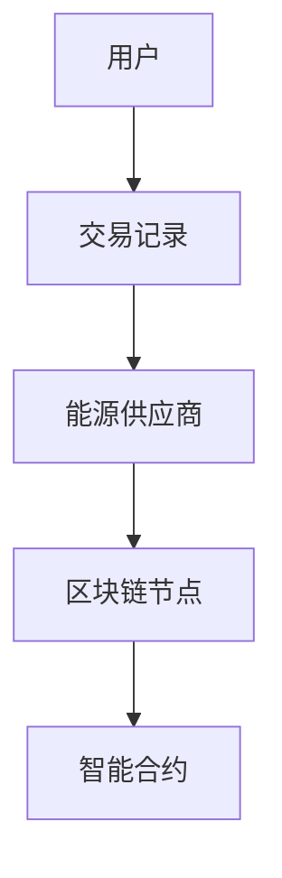
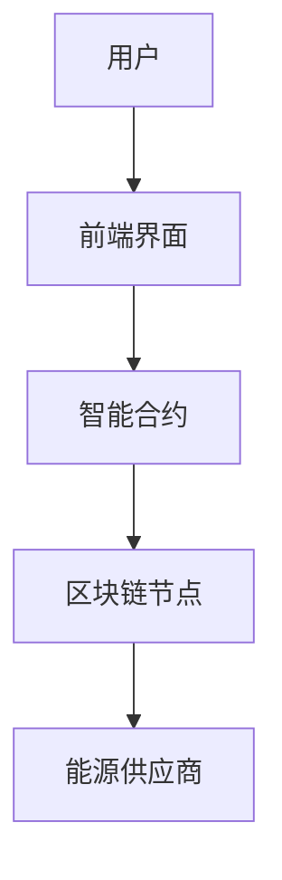
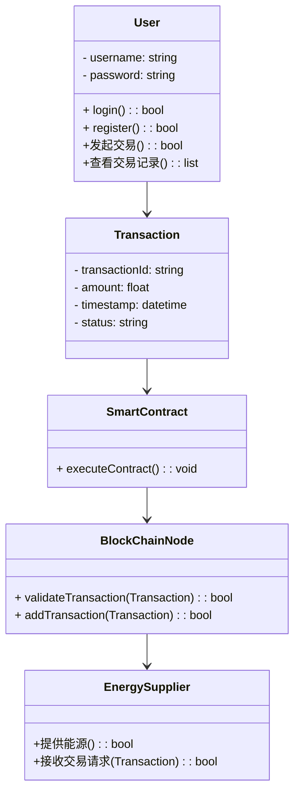

                 


# 如何评估企业的区块链能源交易平台

> 关键词：区块链能源交易，评估方法，系统架构，智能合约，安全性分析

> 摘要：本文详细探讨了如何评估企业级的区块链能源交易平台，从背景介绍到系统架构设计，再到项目实战和最佳实践，全面分析了评估的关键点和实施方法。

---

# 第1章：区块链能源交易平台的背景介绍

## 1.1 区块链能源交易平台的定义与核心概念

### 1.1.1 区块链能源交易平台的定义
区块链能源交易平台是指利用区块链技术构建的去中心化平台，用于能源的生产者、消费者和供应商之间的交易。该平台通过智能合约自动执行交易，确保数据的安全性和透明性。

### 1.1.2 区块链能源交易平台的核心要素
- **智能合约**：用于自动执行交易规则。
- **分布式账本**：记录所有交易数据，确保数据不可篡改。
- **共识机制**：确保所有节点达成一致，保证交易的正确性。
- **用户身份验证**：确保交易双方的身份真实性。

### 1.1.3 区块链能源交易平台的边界与外延
区块链能源交易平台的边界包括内部交易流程、智能合约的执行和数据存储。外延则涉及外部能源市场、监管机构和第三方支付系统。

## 1.2 区块链能源交易平台的背景与问题背景

### 1.2.1 当前能源交易的痛点与挑战
- **交易透明性不足**：传统能源交易中可能存在数据篡改和不透明的问题。
- **交易效率低下**：多个中间商可能导致交易延迟和成本增加。
- **信任问题**：交易双方可能缺乏信任，导致交易难以达成。

### 1.2.2 区块链技术如何解决能源交易问题
- **去中心化**：通过区块链技术去除中间商，降低交易成本。
- **智能合约**：自动执行交易规则，提高交易效率。
- **数据不可篡改**：确保交易数据的安全性和透明性。

### 1.2.3 区块链能源交易平台的行业现状
目前，区块链技术在能源交易领域的应用还处于起步阶段，但已有一些试点项目。例如，某些地区已经通过区块链技术实现了分布式能源交易。

---

# 第2章：区块链能源交易平台的核心概念与联系

## 2.1 区块链技术的核心原理

### 2.1.1 区块链的基本概念
区块链是一种分布式账本技术，通过去中心化的节点网络实现数据的分布式存储和同步。每个节点都保存一份完整的账本副本，确保数据的安全性和一致性。

### 2.1.2 区块链的核心技术
- **共识机制**：如PoW（工作量证明）和PoS（权益证明），用于确保所有节点达成一致。
- **智能合约**：通过预定义的代码自动执行交易规则。
- **分布式账本**：记录所有交易数据，确保数据不可篡改。

### 2.1.3 区块链的特性
- **去中心化**：没有单一点控制整个网络。
- **不可篡改**：数据一旦写入区块链，就无法被修改。
- **透明性**：所有交易数据对所有节点公开可见。

## 2.2 区块链能源交易平台的实体关系与架构

### 2.2.1 ER实体关系图


### 2.2.2 系统架构图


## 2.3 区块链能源交易平台的评估维度与指标

### 2.3.1 评估维度
- **安全性**：包括智能合约漏洞和节点安全性。
- **效率**：包括交易确认时间和网络延迟。
- **可扩展性**：包括最大支持用户数和交易吞吐量。
- **可用性**：包括系统 uptime 和故障恢复能力。

### 2.3.2 评估指标对比表格
| 评估维度 | 评估指标 | 重要性权重 |
|----------|----------|------------|
| 安全性    | 智能合约漏洞 | 0.4        |
|          | 节点安全性  | 0.6        |
| 效率      | 交易确认时间 | 0.5        |
|          | 网络延迟    | 0.5        |
| 可扩展性  | 最大支持用户数 | 0.7       |
|          | 交易吞吐量  | 0.3        |

---

# 第3章：区块链能源交易平台的系统架构设计

## 3.1 系统功能设计

### 3.1.1 功能模块
- **用户模块**：用户注册、登录、查看交易记录。
- **交易模块**：发起交易、确认交易、智能合约执行。
- **区块链节点模块**：维护区块链账本、验证交易。
- **能源供应商模块**：提供能源、接收交易请求。

### 3.1.2 领域模型类图


## 3.2 系统架构设计

### 3.2.1 系统架构图


### 3.2.2 系统接口设计
- 用户通过前端界面提交交易请求。
- 智能合约接收请求并执行交易逻辑。
- 区块链节点验证交易并记录到区块链账本。
- 能源供应商根据交易结果提供能源。

## 3.3 系统交互流程

### 3.3.1 交易流程
1. 用户在前端界面发起交易请求。
2. 请求被发送到智能合约。
3. 智能合约执行交易逻辑并通知区块链节点。
4. 区块链节点验证交易并记录到区块链账本。
5. 能源供应商根据交易结果提供能源。

### 3.3.2 交易确认流程
1. 用户提交交易请求。
2. 智能合约验证交易合法性。
3. 区块链节点通过共识机制确认交易。
4. 交易记录到区块链账本。
5. 能源供应商确认交易完成。

---

# 第4章：区块链能源交易平台的项目实战

## 4.1 环境搭建

### 4.1.1 环境要求
- 操作系统：Linux或Windows。
- 区块链框架：以太坊、Hyperledger等。
- 开发工具：Visual Studio Code、IDEA等。

### 4.1.2 安装步骤
```bash
# 安装以太坊
npm install -g ethereumjs-testrpc
```

## 4.2 核心代码实现

### 4.2.1 智能合约实现
```solidity
// SPDX-License-Identifier: MIT
pragma solidity ^0.8.0;

contract EnergyTrade {
    mapping(address => uint256) public balances;

    function trade(address _buyer, uint256 _amount) public {
        balances[_buyer] += _amount;
    }
}
```

### 4.2.2 交易确认逻辑
```javascript
const Web3 = require('web3');
const web3 = new Web3(provider);

async function confirmTransaction(txHash) {
    const receipt = await web3.eth.getTransactionReceipt(txHash);
    return receipt.status === ' mined';
}
```

## 4.3 案例分析

### 4.3.1 实际案例
假设某用户需要购买100度电，通过智能合约自动完成交易。

### 4.3.2 代码解读
- 用户发起交易请求，智能合约接收请求。
- 智能合约执行交易逻辑，更新用户余额。
- 区块链节点验证交易并记录到区块链账本。
- 能源供应商根据交易结果提供能源。

## 4.4 项目小结
通过实际案例分析，我们可以看到区块链能源交易平台的优势。智能合约自动执行交易规则，区块链节点确保数据的安全性和透明性，从而提高了交易效率和安全性。

---

# 第5章：区块链能源交易平台的最佳实践与总结

## 5.1 最佳实践

### 5.1.1 安全性保障
- 定期审计智能合约，防止漏洞。
- 使用多重签名钱包，提高安全性。

### 5.1.2 效率优化
- 优化智能合约代码，提高执行效率。
- 使用侧链或二层解决方案，提高交易吞吐量。

## 5.2 项目小结
通过本文的分析，我们了解了如何评估企业级的区块链能源交易平台。从背景介绍到系统架构设计，再到项目实战和最佳实践，我们详细探讨了评估的关键点和实施方法。

## 5.3 未来展望
随着区块链技术的不断发展，区块链能源交易平台的应用场景将更加广泛。未来，我们可以通过优化系统架构和提升智能合约的安全性，进一步提高交易效率和安全性。

---

# 结语

通过本文的详细分析，我们可以看到区块链能源交易平台的优势和挑战。评估一个企业级的区块链能源交易平台需要从多个维度进行考量，包括安全性、效率、可扩展性和可用性。通过实际项目实战和最佳实践，我们可以更好地理解和应用这些评估方法，从而推动区块链技术在能源交易领域的广泛应用。

--- 

**关键词**：区块链能源交易，评估方法，系统架构，智能合约，安全性分析

