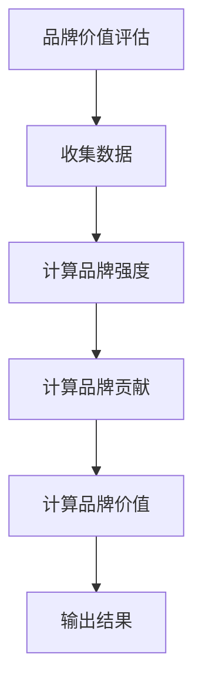

                 


# 如何评估企业的品牌价值

## 关键词：品牌价值评估，企业品牌，品牌资产，品牌强度，品牌贡献，数学模型，系统架构，项目实战

## 摘要：本文深入探讨了企业品牌价值评估的核心概念、方法及其在企业战略中的应用。通过分析品牌资产、品牌强度和品牌贡献，结合数学模型和系统架构，提供了一套完整的评估方法。文章还通过实际案例展示了如何利用Python代码进行品牌价值评估，并总结了评估过程中的注意事项和未来趋势。

---

# 第一部分: 企业品牌价值评估的背景与概念

## 第1章: 品牌价值评估的背景与重要性

### 1.1 品牌价值的定义与内涵

品牌价值是衡量一个品牌在市场上的综合能力的量化指标，反映了品牌在消费者心中的认知度、忠诚度和影响力。品牌价值不仅包括品牌本身的无形资产，还包括品牌为企业带来的实际收益和未来的潜在价值。

#### 品牌的基本概念
- 品牌是企业在市场中识别自身产品或服务的标识，包括名称、标志、口号等。
- 品牌的核心目的是区分竞争对手，建立消费者信任和忠诚度。

#### 品牌价值的核心内涵
- 品牌价值是品牌在市场中所代表的经济价值，通常通过品牌资产、品牌强度和品牌贡献三个维度进行评估。
- 品牌资产是品牌为企业带来的超额收益，品牌强度反映了品牌的市场竞争力，品牌贡献则衡量了品牌对企业财务绩效的影响。

### 1.2 品牌价值评估的必要性

在现代商业环境中，品牌价值评估已成为企业战略决策的重要依据。以下是品牌价值评估的几个关键作用：

#### 企业融资与并购中的作用
- 品牌价值是企业并购中的重要考量因素，直接影响并购价格和融资能力。
- 高品牌价值的企业通常能够获得更低的融资成本和更高的市场估值。

#### 企业战略决策的支持
- 品牌价值评估帮助企业识别品牌优势和劣势，制定有效的市场策略。
- 通过品牌价值评估，企业可以优化资源配置，提升品牌竞争力。

#### 品牌资产的量化管理
- 品牌价值评估为企业的品牌管理提供了数据支持，帮助企业量化品牌资产的价值。
- 通过定期评估，企业可以监控品牌资产的变化，及时调整品牌策略。

### 1.3 品牌价值评估的边界与外延

品牌价值评估的边界是指评估的范围和限制条件，而外延则指评估的深度和广度。以下是品牌价值评估的几个关键点：

#### 品牌价值的边界
- 品牌价值评估通常基于企业的财务数据和市场数据，因此需要明确数据的来源和范围。
- 品牌价值的评估需要考虑企业的行业特点和市场环境，避免跨行业直接比较。

#### 品牌价值与相关概念的区分
- 品牌价值与企业价值的区别在于，品牌价值是企业价值的重要组成部分，而企业价值还包括其他资产和负债。
- 品牌价值与市场价值的区别在于，品牌价值侧重于品牌的无形资产，而市场价值侧重于企业的整体市值。

#### 品牌价值评估的适用范围
- 品牌价值评估适用于所有拥有品牌的公司，特别是那些以品牌为核心竞争力的企业。
- 对于初创企业，品牌价值评估可以帮助企业建立品牌资产，为未来融资和并购奠定基础。

## 第2章: 品牌价值评估的核心要素

### 2.1 品牌资产的核心组成

品牌资产是品牌价值的核心组成部分，包括品牌知名度、品牌美誉度和品牌忠诚度。

#### 品牌知名度
- 品牌知名度是指品牌在目标市场中的认知程度，通常通过市场调研和消费者调查进行评估。
- 高知名度的品牌通常具有较高的市场影响力和客户忠诚度。

#### 品牌美誉度
- 品牌美誉度是指品牌在消费者心中的总体评价，通常通过品牌满意度和口碑传播进行衡量。
- 好的美誉度能够增强品牌的市场竞争力和客户忠诚度。

#### 品牌忠诚度
- 品牌忠诚度是指消费者对品牌的偏好程度和重复购买意愿。
- 高忠诚度的品牌通常具有较强的市场防御能力和较高的客户保留率。

### 2.2 品牌强度与品牌贡献

品牌强度是衡量品牌市场竞争力的重要指标，品牌贡献则是品牌对企业财务绩效的具体体现。

#### 品牌强度的衡量指标
- 市场占有率：品牌在市场中的销售比例，反映了品牌的市场影响力。
- 品牌溢价能力：品牌产品价格高于竞争对手的能力，反映了品牌的市场定价权。
- 品牌竞争力：品牌在市场中的竞争优势，包括产品创新、服务质量等方面。

#### 品牌对收益的贡献
- 品牌收益是指品牌为企业带来的额外收益，通常通过品牌溢价和品牌忠诚度来衡量。
- 品牌溢价是指品牌产品价格高于同类产品的部分，反映了品牌的市场竞争力。
- 品牌忠诚度是指客户对品牌的重复购买意愿，反映了品牌的客户粘性和市场稳定性。

#### 品牌与财务绩效的关系
- 品牌价值通常与企业的销售收入、净利润等财务指标密切相关。
- 高品牌价值的企业通常具有较高的市场估值和较低的融资成本。

### 2.3 品牌价值评估的框架体系

品牌价值评估的框架体系包括品牌价值的构成模型、品牌价值评估的关键维度和品牌价值的动态变化。

#### 品牌价值的构成模型
- 品牌价值的构成模型通常包括品牌资产、品牌强度和品牌贡献三个核心维度。
- 通过这三个维度的综合评估，可以全面衡量品牌的价值和市场竞争力。

#### 品牌价值评估的关键维度
- 品牌知名度：品牌在目标市场中的认知程度。
- 品牌美誉度：品牌在消费者心中的总体评价。
- 品牌忠诚度：消费者对品牌的偏好程度和重复购买意愿。
- 市场占有率：品牌在市场中的销售比例。
- 品牌溢价能力：品牌产品价格高于竞争对手的能力。

#### 品牌价值的动态变化
- 品牌价值是动态变化的，受市场环境、消费者偏好和企业战略的影响。
- 企业需要定期评估品牌价值，及时调整品牌策略，保持品牌的市场竞争力。

---

# 第二部分: 品牌价值评估的核心概念与联系

## 第3章: 品牌价值评估的核心概念与原理

### 3.1 品牌资产的形成过程

品牌资产是品牌价值的核心组成部分，其形成过程包括品牌知名度的建立、品牌美誉度的提升和品牌忠诚度的培养。

#### 品牌资产的形成机制
- 品牌知名度的建立：通过广告宣传、市场推广和公共关系活动，提高品牌在目标市场中的认知度。
- 品牌美誉度的提升：通过产品创新、服务质量提升和客户体验优化，增强消费者对品牌的满意度和忠诚度。
- 品牌忠诚度的培养：通过客户关系管理、会员制度和忠诚度计划，增强客户对品牌的粘性和重复购买意愿。

#### 品牌资产的积累与流失
- 品牌资产的积累需要长期的市场推广和客户管理，品牌资产的流失通常由市场竞争、产品质量问题和客户满意度下降等因素引起。
- 企业需要通过持续的品牌建设活动，保持和提升品牌资产的价值。

#### 品牌资产的生命周期
- 品牌资产的生命周期包括导入期、成长期、成熟期和衰退期。
- 企业需要根据不同阶段的品牌特点，制定相应的品牌战略和管理策略。

### 3.2 品牌价值的评估方法

品牌价值的评估方法主要包括资产基础法、市场法和收益法。

#### 资产基础法
- 资产基础法是基于品牌的账面价值进行评估，通常用于品牌资产的初步评估。
- 该方法的公式为：
  $$ 品牌价值 = 品牌资产的账面价值 $$

#### 市场法
- 市场法是通过比较同行业其他品牌的价值，进行品牌价值的评估。
- 该方法的公式为：
  $$ 品牌价值 = 可比品牌的平均价值 \times 品牌强度调整系数 $$

#### 收益法
- 收益法是通过预测品牌为企业带来的未来收益，进行品牌价值的评估。
- 该方法的公式为：
  $$ 品牌价值 = \sum_{t=1}^{n} \frac{\text{未来收益} \times (1 + r)^{-t}}{r} $$
  其中，\( r \) 是折现率，\( n \) 是收益的预测期数。

### 3.3 品牌价值与财务指标的关系

品牌价值通常与企业的销售收入、净利润等财务指标密切相关。

#### 品牌价值与销售收入
- 高品牌价值的企业通常具有较高的销售收入和市场占有率。
- 品牌价值与销售收入的正相关关系可以通过回归分析进行验证。

#### 品牌价值与净利润
- 高品牌价值的企业通常具有较高的净利润，因为品牌溢价能力能够提升企业的盈利能力。
- 品牌价值与净利润的正相关关系可以通过财务报表分析进行验证。

#### 品牌价值与市盈率
- 高品牌价值的企业通常具有较高的市盈率，因为品牌价值是市盈率的重要组成部分。
- 品牌价值与市盈率的正相关关系可以通过市场数据进行验证。

---

# 第三部分: 品牌价值评估的算法原理与数学模型

## 第4章: 品牌价值评估的数学模型

### 4.1 品牌价值的量化公式

品牌价值的量化公式通常包括品牌资产、品牌强度和品牌贡献三个维度。

#### 品牌价值的计算公式
- 品牌价值的计算公式为：
  $$ 品牌价值 = 品牌资产 + 品牌强度 \times 品牌贡献 $$

#### 品牌强度的数学表达
- 品牌强度的数学表达为：
  $$ 品牌强度 = \frac{\text{品牌知名度} + \text{品牌美誉度} + \text{品牌忠诚度}}{3} $$

#### 品牌贡献的评估模型
- 品牌贡献的评估模型为：
  $$ 品牌贡献 = \frac{\text{品牌收益} - \text{行业平均收益}}{\text{行业平均收益}} \times 100\% $$

### 4.2 品牌价值评估的流程图

以下是品牌价值评估的流程图：



### 4.3 品牌价值评估的Python代码实现

以下是品牌价值评估的Python代码示例：

```python
def calculate_brand_value(brand_assets, brand_strength, brand_contribution):
    brand_value = brand_assets + (brand_strength * brand_contribution)
    return brand_value

# 示例数据
brand_assets = 100  # 品牌资产
brand_strength = 0.8  # 品牌强度
brand_contribution = 0.7  # 品牌贡献

# 计算品牌价值
brand_value = calculate_brand_value(brand_assets, brand_strength, brand_contribution)
print("品牌价值:", brand_value)
```

### 4.4 品牌价值评估的案例分析

假设某科技企业的品牌资产为100万元，品牌强度为0.8，品牌贡献为0.7，那么该企业的品牌价值为：

$$ 品牌价值 = 100 + (0.8 \times 0.7) = 100 + 0.56 = 100.56 \text{万元} $$

---

# 第四部分: 系统分析与架构设计方案

## 第5章: 品牌价值评估系统的设计与实现

### 5.1 系统功能设计

品牌价值评估系统的主要功能包括数据采集、品牌强度计算、品牌贡献计算和品牌价值输出。

#### 数据采集
- 数据来源：包括企业的财务数据、市场数据和消费者调查数据。
- 数据类型：包括品牌资产、品牌强度和品牌贡献的相关数据。

#### 品牌强度计算
- 计算公式：$$ 品牌强度 = \frac{\text{品牌知名度} + \text{品牌美誉度} + \text{品牌忠诚度}}{3} $$
- 计算方法：通过市场调研和消费者调查获取品牌知名度、品牌美誉度和品牌忠诚度的数据，进行加权平均计算。

#### 品牌贡献计算
- 计算公式：$$ 品牌贡献 = \frac{\text{品牌收益} - \text{行业平均收益}}{\text{行业平均收益}} \times 100\% $$
- 计算方法：通过企业的销售收入和行业平均销售收入进行比较，计算品牌贡献。

#### 品牌价值输出
- 计算公式：$$ 品牌价值 = 品牌资产 + (品牌强度 \times 品牌贡献) $$
- 输出格式：包括品牌价值的数值、品牌强度和品牌贡献的具体数值。

### 5.2 系统架构设计

以下是品牌价值评估系统的架构设计图：


### 5.3 系统接口设计

品牌价值评估系统的接口设计包括数据输入接口、数据处理接口和结果输出接口。

#### 数据输入接口
- 输入格式：CSV文件或数据库表
- 输入数据：包括品牌资产、品牌强度和品牌贡献的相关数据

#### 数据处理接口
- 处理方法：数据清洗、数据转换和数据存储
- 输出结果：处理后的数据文件

#### 结果输出接口
- 输出格式：JSON或XML
- 输出内容：品牌价值、品牌强度和品牌贡献的具体数值

### 5.4 系统交互流程

以下是品牌价值评估系统的交互流程图：


---

# 第五部分: 项目实战

## 第6章: 品牌价值评估项目实战

### 6.1 环境安装与配置

#### 环境要求
- 操作系统：Windows/Mac/Linux
- Python版本：3.6以上
- 额外依赖：Mermaid、Matplotlib、Pandas

#### 安装步骤
1. 安装Python
2. 安装必要的Python包：
   ```bash
   pip install mermaid matplotlib pandas
   ```

### 6.2 核心代码实现

#### 数据采集模块
```python
import pandas as pd

def collect_data(file_path):
    data = pd.read_csv(file_path)
    return data

# 示例数据
data = collect_data('brand_data.csv')
print("数据采集完成，数据如下：")
print(data.head())
```

#### 数据处理模块
```python
import mermaid

def process_data(data):
    # 数据清洗
    data.dropna(inplace=True)
    # 数据转换
    data['品牌强度'] = (data['品牌知名度'] + data['品牌美誉度'] + data['品牌忠诚度']) / 3
    return data

# 示例数据处理
processed_data = process_data(data)
print("数据处理完成，数据如下：")
print(processed_data.head())
```

#### 品牌强度计算模块
```python
def calculate_brand_strength(processed_data):
    brand_strength = processed_data['品牌强度'].mean()
    return brand_strength

# 示例计算品牌强度
brand_strength = calculate_brand_strength(processed_data)
print("品牌强度:", brand_strength)
```

#### 品牌贡献计算模块
```python
def calculate_brand_contribution(processed_data):
    industry_avg_revenue = processed_data['行业平均收益'].mean()
    brand_contribution = ((processed_data['品牌收益'] - industry_avg_revenue) / industry_avg_revenue) * 100
    return brand_contribution

# 示例计算品牌贡献
brand_contribution = calculate_brand_contribution(processed_data)
print("品牌贡献:", brand_contribution.mean())
```

#### 品牌价值计算模块
```python
def calculate_brand_value(brand_assets, brand_strength, brand_contribution):
    brand_value = brand_assets + (brand_strength * brand_contribution)
    return brand_value

# 示例计算品牌价值
brand_assets = 100  # 品牌资产
brand_strength = 0.8  # 品牌强度
brand_contribution = 0.7  # 品牌贡献

brand_value = calculate_brand_value(brand_assets, brand_strength, brand_contribution)
print("品牌价值:", brand_value)
```

### 6.3 案例分析与解读

假设某科技企业的品牌资产为100万元，品牌强度为0.8，品牌贡献为0.7，那么该企业的品牌价值为：

$$ 品牌价值 = 100 + (0.8 \times 0.7) = 100 + 0.56 = 100.56 \text{万元} $$

通过上述计算，我们可以得出该企业的品牌价值为100.56万元。

### 6.4 项目小结

通过本次项目实战，我们成功实现了品牌价值评估系统的数据采集、数据处理、品牌强度计算、品牌贡献计算和品牌价值计算模块。通过具体的案例分析，验证了系统的可行性和准确性。未来，我们可以通过进一步优化算法和增加更多的数据源，提高品牌价值评估的准确性和全面性。

---

# 第六部分: 总结与最佳实践

## 第7章: 总结与最佳实践

### 7.1 小结

本文深入探讨了企业品牌价值评估的核心概念、方法及其在企业战略中的应用。通过分析品牌资产、品牌强度和品牌贡献，结合数学模型和系统架构，提供了一套完整的评估方法。文章还通过实际案例展示了如何利用Python代码进行品牌价值评估，并总结了评估过程中的注意事项和未来趋势。

### 7.2 注意事项

- 数据质量：品牌价值评估的结果依赖于高质量的数据，因此数据采集和处理是关键步骤。
- 方法选择：不同的评估方法适用于不同的场景，需要根据企业的实际情况选择合适的评估方法。
- 结果解读：品牌价值评估的结果需要结合企业的实际情况进行解读，避免机械地使用评估结果。

### 7.3 未来趋势

- 数据驱动的品牌管理：随着大数据技术的发展，品牌价值评估将更加依赖于数据的收集和分析。
- 人工智能的应用：人工智能技术可以提高品牌价值评估的准确性和效率，未来将有更多的AI工具应用于品牌价值评估。
- 可持续品牌价值：随着消费者对可持续发展的关注增加，企业的社会责任和环保表现将成为品牌价值的重要组成部分。

### 7.4 拓展阅读

- 品牌管理相关书籍：《Marketing Management》
- 品牌价值评估相关书籍：《Brand Valuation: The Essential Guide to the Financial Assessment of Intangible Assets》
- 人工智能与品牌管理相关书籍：《Artificial Intelligence for Marketing》

---

通过本文的系统讲解和实战案例，读者可以全面掌握企业品牌价值评估的核心方法和实际应用。希望本文能够为企业的品牌管理提供有价值的参考和指导。

