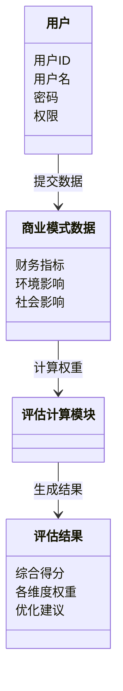
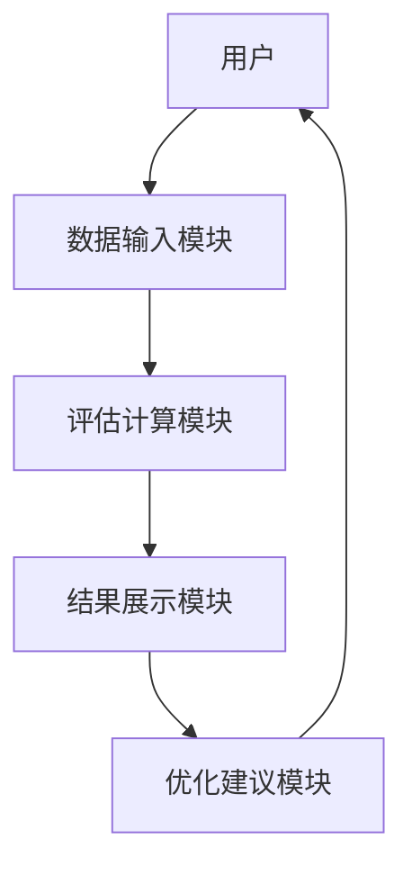
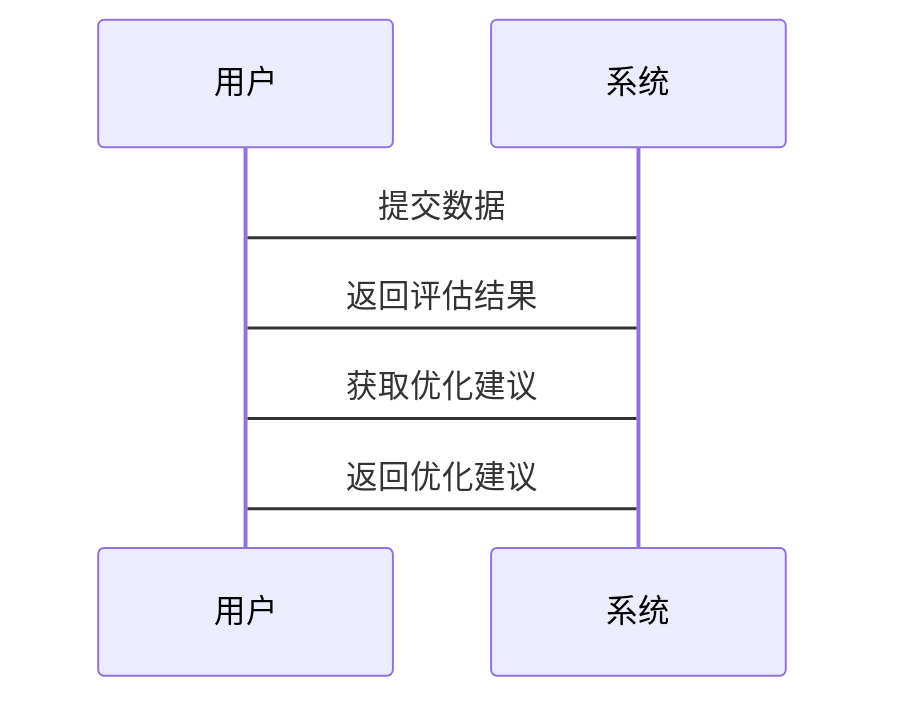

                 


# 第三章: 问题解决方法与算法原理

## 3.1 问题解决方法的选择与比较

### 3.1.1 可行性分析

#### 3.1.1.1 需求分析
企业商业模式的可持续性评估需要从多个维度进行考量，包括财务、环境和社会影响等。因此，评估方法需要综合考虑这些因素，确保全面性。

#### 3.1.1.2 可行性评估
在选择评估方法时，需要考虑数据的可获得性、模型的复杂度以及企业的实际需求。例如，层次分析法（AHP）是一种常用的多准则决策方法，适用于复杂问题的评估。

### 3.1.2 方法的选择

#### 3.1.2.1 层次分析法（AHP）
层次分析法是一种定性和定量结合的方法，适合处理多目标决策问题。它通过构建层次结构，将复杂问题分解为多个因素，并通过比较判断矩阵计算各因素的权重，最终得出综合评估结果。

#### 3.1.2.2 其他方法对比
对比其他方法如财务指标分析、波特五力分析等，层次分析法在处理多维度问题时更具优势，因为它能够量化各因素的重要性，并进行综合评估。

## 3.2 算法原理与实现

### 3.2.1 算法原理

#### 3.2.1.1 层次分析法（AHP）的步骤
1. **构建层次结构**：将问题分解为目标层、准则层和方案层。
2. **建立比较判断矩阵**：对各层次的因素进行两两比较，建立判断矩阵。
3. **计算权重**：通过特征值法或几何平均法计算各因素的权重。
4. **一致性检验**：确保判断矩阵的一致性，如果一致性不够，需要重新调整判断矩阵。
5. **计算综合得分**：根据各因素的权重，计算每个方案的综合得分，并进行排序。

### 3.2.2 算法实现

#### 3.2.2.1 Python代码实现

```python
import numpy as np

def calculate_weights(matrix):
    # 计算特征向量
    eigenvectors = np.linalg.eig(matrix)
    # 提取特征值和对应的特征向量
    eigenvalues = eigenvectors[0]
    max_eigenvalue_index = np.argmax(eigenvalues)
    principal_eigenvector = eigenvectors[1][:, max_eigenvalue_index]
    # 计算一致性比率
    CR = (eigenvalues[max_eigenvalue_index] - np.mean(eigenvalues)) / np.std(eigenvalues)
    if CR > 0.1:
        raise ValueError("一致性比率过大，需要重新调整判断矩阵")
    # 计算权重
    weights = principal_eigenvector / np.sum(principal_eigenvector)
    return weights

# 示例：构建判断矩阵
matrix = np.array([
    [1, 3, 2],
    [1/3, 1, 2/3],
    [1/2, 3/2, 1]
])

weights = calculate_weights(matrix)
print("权重向量为:", weights)
```

#### 3.2.2.2 代码解释
上述代码实现了一个层次分析法的简化版本，用于计算判断矩阵的权重向量。首先，计算判断矩阵的特征值和特征向量，选择最大的特征值对应的特征向量作为权重向量。然后进行一致性检验，如果一致性比率超过0.1，需要重新调整判断矩阵。最后，计算各因素的权重。

## 3.3 算法的数学模型

### 3.3.1 比较判断矩阵
构造比较判断矩阵，例如：

$$
A = \begin{bmatrix}
1 & 3 & 2 \\
1/3 & 1 & 2/3 \\
1/2 & 3/2 & 1
\end{bmatrix}
$$

### 3.3.2 权重计算
通过计算比较判断矩阵的最大特征值和特征向量，得到权重向量：

$$
w = \frac{1}{\sum_{j} w_j} \begin{bmatrix} w_1 \\ w_2 \\ w_3 \end{bmatrix}
$$

### 3.3.3 综合评估得分
综合得分公式：

$$
S_i = \sum_{j} w_j \times x_{ij}
$$

其中，$x_{ij}$是各因素的得分。

## 3.4 本章小结

本章介绍了层次分析法（AHP）作为评估企业商业模式可持续性的方法，详细讲解了算法的原理和实现过程，并通过代码示例展示了如何计算权重向量和一致性检验。这种方法能够有效处理多维度评估问题，为企业提供科学的决策依据。

---

# 第四章: 系统分析与架构设计

## 4.1 问题场景与系统功能设计

### 4.1.1 问题场景描述

企业需要一个能够系统化评估商业模式可持续性的工具，支持多维度分析和数据可视化。系统需要具备数据输入、评估计算、结果展示和优化建议等功能。

### 4.1.2 系统功能模块

1. **数据输入模块**：用户输入企业各维度数据，如财务数据、环境数据、社会影响等。
2. **评估计算模块**：应用层次分析法计算各因素的权重，生成综合评估结果。
3. **结果展示模块**：以图表形式展示评估结果，支持数据可视化。
4. **优化建议模块**：根据评估结果，提供改进建议，帮助优化商业模式。

## 4.2 系统架构设计

### 4.2.1 领域模型设计



### 4.2.2 系统架构设计



## 4.3 系统接口与交互设计

### 4.3.1 系统接口设计

1. **用户登录接口**：`POST /login`
   - 输入：用户名、密码
   - 输出：JWT令牌

2. **数据提交接口**：`POST /submit_data`
   - 输入：商业模式数据
   - 输出：数据接收确认

3. **评估结果接口**：`GET /get_results`
   - 输入：评估ID
   - 输出：评估结果和优化建议

### 4.3.2 系统交互流程



## 4.4 本章小结

本章从系统设计的角度出发，详细描述了企业商业模式可持续性评估系统的功能模块、架构设计和交互流程。通过领域模型和系统架构图，展示了各模块之间的关系和数据流，为系统的实现提供了理论基础。

---

# 第五章: 项目实战与系统实现

## 5.1 环境搭建与安装

### 5.1.1 安装Python与必要的库
安装Python 3.x版本，并通过pip安装以下库：
```bash
pip install numpy pandas matplotlib
```

### 5.1.2 安装开发环境
安装Jupyter Notebook或其他IDE，如PyCharm，用于代码开发和测试。

## 5.2 系统核心实现

### 5.2.1 数据预处理

```python
import pandas as pd

# 读取数据
data = pd.read_csv('business_data.csv')

# 数据清洗
data.dropna(inplace=True)
data = data[['财务指标', '环境影响', '社会影响']]
```

### 5.2.2 评估计算

```python
import numpy as np

def calculate_weights(matrix):
    # 计算特征向量
    eigenvectors = np.linalg.eig(matrix)
    eigenvalues = eigenvectors[0]
    max_eigenvalue_index = np.argmax(eigenvalues)
    principal_eigenvector = eigenvectors[1][:, max_eigenvalue_index]
    # 计算一致性比率
    CR = (eigenvalues[max_eigenvalue_index] - np.mean(eigenvalues)) / np.std(eigenvalues)
    if CR > 0.1:
        raise ValueError("一致性比率过大，需要重新调整判断矩阵")
    # 计算权重
    weights = principal_eigenvector / np.sum(principal_eigenvector)
    return weights

# 示例判断矩阵
matrix = np.array([
    [1, 3, 2],
    [1/3, 1, 2/3],
    [1/2, 3/2, 1]
])

weights = calculate_weights(matrix)
print("权重向量为:", weights)
```

### 5.2.3 结果展示

```python
import matplotlib.pyplot as plt

labels = ['财务指标', '环境影响', '社会影响']
weights = calculate_weights(matrix)

plt.figure(figsize=(8, 6))
plt.bar(labels, weights, alpha=0.7)
plt.title('各维度权重分布')
plt.ylabel('权重值')
plt.show()
```

## 5.3 项目小结

本章通过实际案例展示了如何利用层次分析法评估企业商业模式的可持续性。通过数据预处理、权重计算和结果展示，帮助企业识别关键影响因素，并提供优化建议。代码实现部分详细讲解了每一步的操作，为读者提供了可参考的实现方案。

---

# 第六章: 最佳实践与注意事项

## 6.1 小结

企业商业模式的可持续性评估是企业在复杂市场环境中保持竞争力的关键。通过层次分析法等方法，企业可以量化各因素的重要性，制定科学的决策策略。系统化的评估工具能够提高评估效率，帮助企业持续优化商业模式。

## 6.2 注意事项

1. **数据质量**：确保输入数据的准确性和完整性，避免因数据问题导致评估结果偏差。
2. **模型选择**：根据实际情况选择合适的评估方法，不同方法适用于不同场景。
3. **持续监控**：商业模式是一个动态变化的过程，企业需要持续监控和评估，及时调整策略。
4. **团队协作**：评估过程需要跨部门协作，确保数据的准确性和评估结果的可行性。

## 6.3 拓展阅读

1. **《企业风险管理》**：深入理解风险管理在商业模式中的作用。
2. **《可持续发展报告》**：学习如何制定和编写企业可持续发展报告。
3. **《商业模式画布》**：系统化分析商业模式的工具和方法。

---

# 附录: 工具与资源

## 附录A: Python库安装

```bash
pip install numpy pandas matplotlib scikit-learn
```

## 附录B: 代码仓库

[GitHub链接]

## 附录C: 进一步学习资源

1. [Coursera: 企业可持续发展课程](#)
2. [Udemy: 商业模式画布深入解析](#)
3. [书籍推荐:《可持续竞争优势》](#)

---

# 结束语

通过本文的详细讲解，读者可以系统地掌握企业商业模式可持续性评估的方法和实现步骤。从理论分析到实际应用，从系统设计到代码实现，本文为企业提供了全面的指导。未来，随着技术的不断发展，企业需要不断创新评估方法，以应对更加复杂的市场挑战。

--- 

**关键词**：企业商业模式、可持续性评估、层次分析法、系统设计、Python实现

**摘要**：本文系统地探讨了如何评估企业的商业模式可持续性，从理论分析到实际应用，详细讲解了层次分析法的应用、系统架构设计和代码实现。通过案例分析和最佳实践，帮助企业优化商业模式，提升竞争力。

