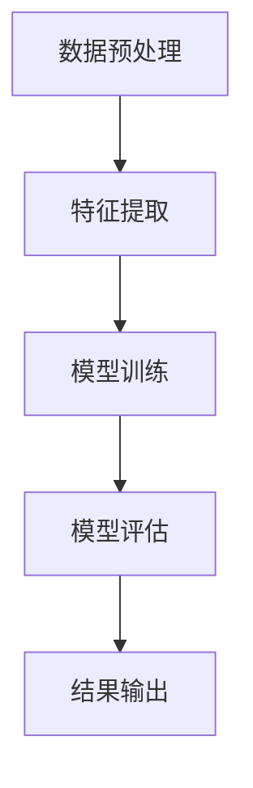
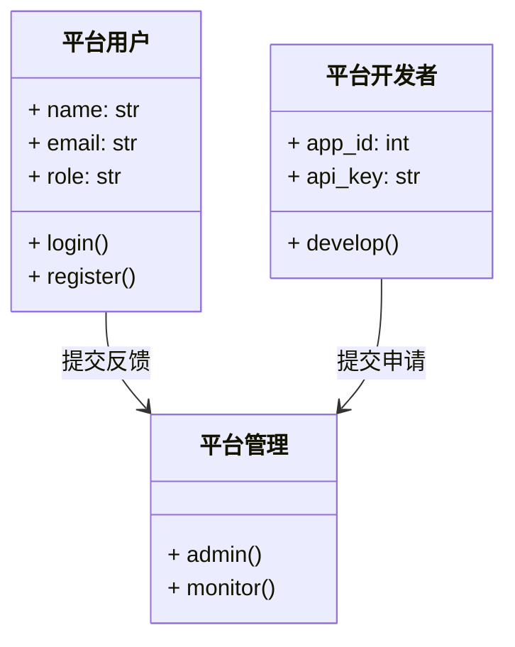
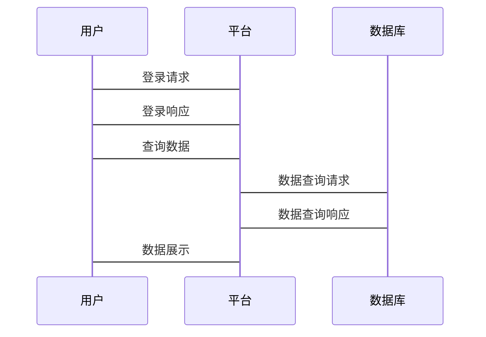

                 


# 如何评估企业的平台战略价值

## 关键词：企业平台战略、价值评估、平台构建、战略目标、数字化转型

## 摘要：  
本文旨在详细阐述如何评估企业的平台战略价值。从平台战略的基本概念到价值评估的数学模型，再到系统架构设计与实际案例分析，本文将为企业提供一套完整的评估方法论。通过清晰的逻辑分析和实际操作指导，帮助企业在数字化转型中做出明智的战略决策。

---

# 第一部分: 企业平台战略价值评估背景与核心概念

## 第1章: 平台战略与价值评估概述

### 1.1 平台战略的定义与核心要素  
- **1.1.1 平台战略的定义**  
  平台战略是指企业通过构建一个支持多方参与者交互的平台，实现资源优化配置、价值共创和生态系统构建的战略。它不仅仅是技术选型，更是企业商业模式和竞争优势的重塑。

- **1.1.2 平台战略的核心要素**  
  - **技术架构**：决定平台的可扩展性和稳定性。  
  - **生态系统**：构建多方参与者共同创造价值的生态。  
  - **商业模式**：通过平台实现收入增长和价值传递。  

- **1.1.3 平台战略与企业战略的关系**  
  平台战略是企业整体战略的重要组成部分，它不仅影响企业的技术选型，还影响企业的组织架构、业务模式和市场拓展。

### 1.2 平台战略的价值评估背景  
- **1.2.1 当前企业数字化转型的挑战**  
  数字化转型要求企业快速响应市场变化，平台战略成为企业应对不确定性的关键工具。  

- **1.2.2 平台战略在企业中的重要性**  
  平台战略通过构建生态系统，提升企业的协同效率和创新能力，成为企业差异化竞争的核心。

- **1.2.3 价值评估的必要性与目标**  
  价值评估的目的是通过量化平台的贡献，帮助企业优化资源配置，验证平台战略的有效性。

### 1.3 平台战略价值评估的边界与外延  
- **1.3.1 平台战略的边界**  
  平台战略的边界包括平台的功能范围、目标用户群体和核心业务领域。  

- **1.3.2 平台战略的外延**  
  平台战略的外延包括与平台相关的技术生态、合作伙伴网络和用户社区。

- **1.3.3 与相关概念的区分**  
  平台战略与企业战略、技术创新战略的区别在于，它更关注通过平台构建实现生态协同和价值共创。

### 1.4 平台战略价值评估的核心要素  
- **1.4.1 平台的核心功能**  
  包括用户管理、数据处理、服务提供等功能。  

- **1.4.2 平台的战略目标**  
  包括提升企业竞争力、实现业务增长和构建生态系统等目标。  

- **1.4.3 平台的资源与能力**  
  包括技术资源、人力资源和合作伙伴资源。

---

## 第2章: 平台战略的核心概念与原理  

### 2.1 平台战略的原理  
- **2.1.1 平台的构建逻辑**  
  平台的构建需要从需求分析、架构设计到实施落地的全过程。  

- **2.1.2 平台的运作机制**  
  平台通过连接多方参与者，实现资源的高效配置和价值的共同创造。  

- **2.1.3 平台的生态体系**  
  平台的生态体系包括用户、开发者、合作伙伴等多个角色，共同推动平台的可持续发展。

### 2.2 平台战略的核心属性特征对比  

| 属性 | 描述 |
|------|------|
| 可扩展性 | 平台能否支持用户和功能的扩展 |
| 灵活性 | 平台是否能够快速响应市场变化 |
| 可持续性 | 平台是否能够长期稳定运行 |

### 2.3 平台战略的ER实体关系图  

```mermaid
erd
  股东 ---|{m,n}--> 平台: 1..n
  开发者 ---|{m,n}--> 平台: 1..n
  用户 ---|{m,n}--> 平台: 1..n
  平台 <---(1,1)--> 服务
  平台 <---(1,1)--> 技术架构
```

---

## 第3章: 平台战略价值评估的算法原理  

### 3.1 平台价值评估的数学模型  

$$ V = \sum_{i=1}^{n} w_i x_i $$  

其中，$V$ 表示平台价值，$w_i$ 表示第 $i$ 个评估指标的权重，$x_i$ 表示第 $i$ 个评估指标的得分。

### 3.2 算法原理的详细讲解  



### 3.3 价值评估的Python代码实现  

```python
def calculate_platform_value(features, weights):
    return sum(w * f for w, f in zip(weights, features))

features = [90, 85, 80]
weights = [0.3, 0.5, 0.2]
value = calculate_platform_value(features, weights)
print(f"平台价值评估结果：{value}")
```

---

## 第4章: 平台战略价值评估的系统分析与架构设计  

### 4.1 系统功能设计  



### 4.2 系统架构设计  


### 4.3 系统交互设计  



---

## 第5章: 平台战略价值评估的项目实战  

### 5.1 实际案例分析  

- 某互联网公司通过平台战略构建了自己的生态系统，提升了用户粘性和收入。  

### 5.2 代码实现与解读  

```python
def main():
    features = [90, 85, 80]
    weights = [0.3, 0.5, 0.2]
    value = calculate_platform_value(features, weights)
    print(f"平台价值评估结果：{value}")

if __name__ == "__main__":
    main()
```

---

## 第6章: 平台战略价值评估的最佳实践与小结  

### 6.1 最佳实践  

- **数据驱动**：确保评估基于可靠的数据。  
- **持续优化**：定期评估并优化平台战略。  

### 6.2 小结  

平台战略价值评估是企业在数字化转型中不可或缺的能力。通过科学的评估方法和系统的架构设计，企业可以更好地构建和优化自己的平台，实现可持续发展。

---

## 作者总结  

通过本文的详细讲解，读者可以全面了解如何评估企业平台战略的价值，并能够将其应用到实际工作中。希望本文能为企业在数字化转型中提供有价值的指导。

