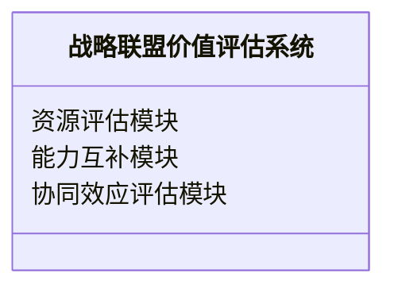
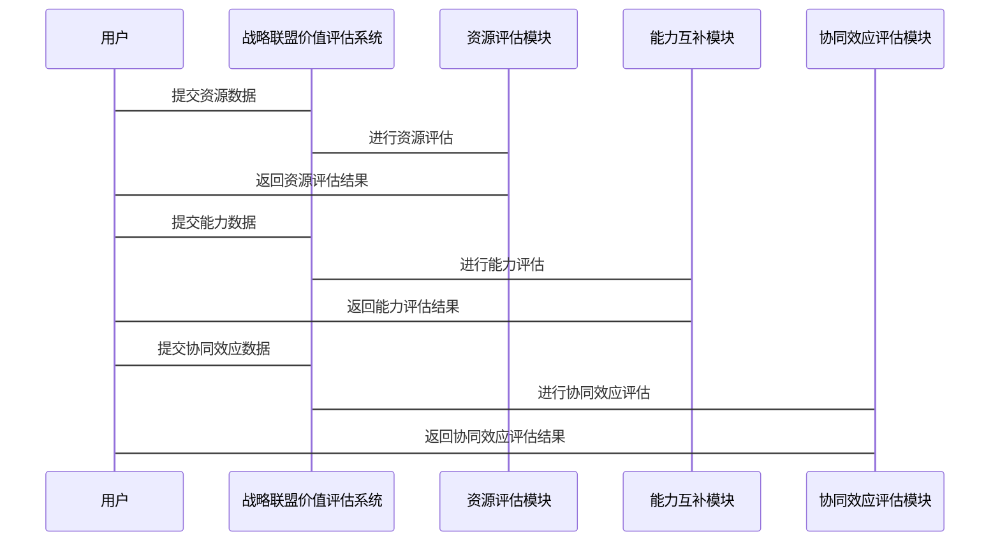

                 


# 如何评估企业的战略联盟价值

> 关键词：企业战略联盟价值评估、战略管理、合作价值、企业战略、战略协同、价值共创

> 摘要：  
> 在现代商业环境中，企业战略联盟已成为企业实现资源优化配置、能力互补和价值共创的重要方式。然而，如何科学地评估战略联盟的价值，确保合作双方的利益最大化，是企业在联盟管理中面临的重大挑战。本文从战略联盟的核心概念出发，结合实际案例，系统性地分析了战略联盟价值的构成要素、评估方法和实现路径。通过详细阐述战略联盟的资源分配、能力互补和协同效应，本文提出了基于系统架构的评估模型和实现方案，并通过具体的项目实战，验证了模型的有效性和可操作性。最后，本文总结了战略联盟价值评估的最佳实践和未来发展趋势，为企业的联盟管理提供了重要的理论支持和实践指导。

---

## 第一部分: 企业战略联盟概述

### 第1章: 战略联盟的基本概念

#### 1.1 战略联盟的定义与特征
##### 1.1.1 战略联盟的定义  
战略联盟是指两个或多个企业之间，基于共同的长期发展目标，通过资源整合、能力互补和协同合作，形成的一种非正式或正式的合作关系。其核心特征包括：  
1. **长期性**：战略合作目标通常围绕企业中长期战略展开。  
2. **资源互补性**：联盟成员之间在资源、能力或技术上具有互补性。  
3. **利益共享**：通过合作实现利益最大化，而非单方面收益。  

##### 1.1.2 战略联盟的核心特征  
- **协同效应**：通过合作产生“1+1>2”的效果，优化资源配置，降低运营成本。  
- **风险分担**：在合作中，双方共同承担技术和市场风险，降低单一企业面临的不确定性。  
- **灵活性**：相比并购等传统合作方式，战略联盟具有更高的灵活性和可调整性。  

##### 1.1.3 战略联盟与企业其他合作模式的区别  
| 合作模式      | 资源投入 | 权益分配 | 风险分担 | 灵活性 |  
|---------------|----------|----------|----------|--------|  
| 战略联盟      | 中等     | 共享     | 高       | 高     |  
| 并购           | 高       | 单一化    | 中       | 低     |  
| 长期合同       | 低       | 单一化    | 低       | 低     |  

---

#### 1.2 战略联盟的类型
##### 1.2.1 股权式合作  
- **定义**：通过股权持有建立合作，通常适用于双方共同投资、共同管理的模式。  
- **特点**：权益分配明确，合作稳定性高，但灵活性较低。  

##### 1.2.2 非股权式合作  
- **定义**：通过协议或合同形式建立合作，不涉及股权交持。  
- **特点**：灵活性高，适合短期合作，但合作稳定性较低。  

##### 1.2.3 其他合作模式  
- **联合开发**：共同投资于技术研发或产品开发。  
- **品牌联合**：联合推广品牌或市场活动。  
- **供应链合作**：共同优化供应链管理。  

---

#### 1.3 战略联盟的价值与意义
##### 1.3.1 战略联盟对企业发展的价值  
- **资源优化配置**：通过合作获取外部资源，弥补自身短板。  
- **能力互补**：借助合作伙伴的核心能力，提升自身竞争力。  
- **风险分担**：共同应对市场和技术风险。  

##### 1.3.2 战略联盟在行业竞争中的作用  
- **增强市场地位**：通过合作扩大市场份额，增强行业影响力。  
- **加速创新**：通过联合研发和技术共享，提升创新能力。  

##### 1.3.3 战略联盟的长期与短期目标  
- **短期目标**：实现具体项目或阶段性的商业成功。  
- **长期目标**：建立稳定的合作伙伴关系，持续创造价值。  

---

### 第2章: 战略联盟价值评估背景

#### 2.1 企业战略管理的现状
##### 2.1.1 传统企业战略管理的局限性  
- 资源分配不合理：企业往往难以有效整合外部资源。  
- 合作伙伴选择不科学：缺乏系统性评估方法。  

##### 2.1.2 战略联盟在现代企业战略中的地位  
- 战略联盟已成为企业实现跨越式发展的关键路径。  
- 在全球化和数字化背景下，联盟合作越来越重要。  

##### 2.1.3 全球化背景下战略联盟的重要性  
- 全球化竞争要求企业建立跨国合作网络。  
- 数字化转型需要企业快速整合新技术和新能力。  

---

#### 2.2 战略联盟价值评估的必要性
##### 2.2.1 企业资源优化配置的需求  
- 通过评估明确合作价值，优化资源配置。  

##### 2.2.2 合作伙伴选择的科学性要求  
- 通过评估筛选出真正具备互补能力的合作伙伴。  

##### 2.2.3 风险控制与利益最大化的目标  
- 通过评估降低合作风险，确保利益最大化。  

---

#### 2.3 战略联盟价值评估的边界与外延
##### 2.3.1 评估范围的界定  
- 限定评估对象为战略联盟的合作价值。  
- 限定评估时间为联盟合作周期内。  

##### 2.3.2 评估对象的外延  
- 包括联盟的资源分配、能力互补和协同效应。  
- 包括联盟的治理结构和激励机制。  

##### 2.3.3 评估方法的选择  
- 综合定量与定性评估方法，确保评估结果的科学性。  

---

### 第3章: 战略联盟价值的核心要素

#### 3.1 战略联盟的核心概念与构成
##### 3.1.1 资源整合  
- **核心要素**：技术、资金、人才、市场等资源的整合。  
- **实现路径**：通过协议明确资源分配和使用方式。  

##### 3.1.2 能力互补  
- **核心要素**：双方在技术、市场、管理等方面的能力互补。  
- **实现路径**：通过合作明确双方的角色分工。  

##### 3.1.3 协同效应  
- **核心要素**：合作过程中产生的额外价值。  
- **实现路径**：通过协同创新实现价值最大化。  

---

#### 3.2 战略联盟价值的驱动因素
##### 3.2.1 企业战略目标的匹配度  
- **核心要素**：双方的战略目标是否一致。  
- **实现路径**：通过目标对齐确保合作的可持续性。  

##### 3.2.2 合作伙伴的综合实力  
- **核心要素**：合作伙伴的技术能力、市场影响力和财务状况。  
- **实现路径**：通过尽职调查评估合作伙伴的综合实力。  

##### 3.2.3 联盟的治理结构与机制  
- **核心要素**：联盟的组织架构、决策机制和沟通机制。  
- **实现路径**：通过制度化管理确保合作的高效性。  

---

#### 3.3 战略联盟价值的实现路径
##### 3.3.1 资源共享机制  
- **核心要素**：建立资源共享平台，优化资源配置效率。  
- **实现路径**：通过协议明确资源共享的方式和范围。  

##### 3.3.2 价值共创模式  
- **核心要素**：通过合作创造新的价值点。  
- **实现路径**：通过协同创新实现价值共创。  

##### 3.3.3 风险分担与利益分配  
- **核心要素**：明确风险分担和利益分配机制。  
- **实现路径**：通过合同条款和激励机制实现公平分配。  

---

## 第二部分: 战略联盟价值评估的核心概念与联系

### 第4章: 战略联盟价值的核心概念

#### 4.1 战略联盟的核心要素与属性
##### 4.1.1 资源分配的合理性  
- **核心要素**：资源分配的公平性和有效性。  
- **实现路径**：通过评估确定资源分配的最优方案。  

##### 4.1.2 能力互补的有效性  
- **核心要素**：合作双方的能力互补性。  
- **实现路径**：通过评估确定能力互补的最佳组合。  

##### 4.1.3 协同效应的可测量性  
- **核心要素**：协同效应的量化指标。  
- **实现路径**：通过评估确定协同效应的实现路径。  

---

#### 4.2 战略联盟价值评估的对比分析
##### 4.2.1 不同合作模式的对比  
| 合作模式      | 资源分配 | 能力互补 | 协同效应 | 风险分担 |  
|---------------|----------|----------|----------|----------|  
| 战略联盟      | 高       | 高       | 高       | 高       |  
| 长期合同       | 中       | 中       | 中       | 低       |  
| 股权合作       | 高       | 高       | 中       | 中       |  

##### 4.2.2 不同评估方法的优劣势分析  
| 评估方法      | 优点             | 缺点             |  
|---------------|------------------|------------------|  
| 定量评估       | 结果客观          | 需要大量数据支持  |  
| 定性评估       | 更加灵活          | 主观性较强        |  
| 综合评估       | 结果全面          | 实施成本较高      |  

##### 4.2.3 不同行业背景下战略联盟的异同  
- **异**：不同行业对资源和能力的需求不同。  
- **同**：联盟的本质目标都是实现价值最大化。  

---

#### 4.3 战略联盟价值的ER实体关系图
```mermaid
er
actor: 企业A, 企业B, 企业C
artifact: 资源, 能力, 协同效应
relation: 企业A-资源-能力-协同效应, 企业B-资源-能力-协同效应, 企业C-资源-能力-协同效应
```

---

## 第三部分: 战略联盟价值评估的系统架构与实现方案

### 第5章: 战略联盟价值评估的系统分析

#### 5.1 问题场景介绍
- **目标**：评估企业战略联盟的价值，优化资源配置，提升合作效果。  
- **挑战**：如何科学评估联盟的价值，确保合作双方的利益最大化。  

#### 5.2 项目介绍
- **项目目标**：开发一个战略联盟价值评估系统，帮助企业实现科学化、系统化的价值评估。  
- **项目范围**：涵盖资源分配、能力互补和协同效应的评估。  

#### 5.3 系统功能设计
##### 5.3.1 领域模型（Mermaid 类图）


##### 5.3.2 系统架构设计（Mermaid 架构图）


##### 5.3.3 系统接口设计
- **输入接口**：接收联盟成员的资源、能力和协同效应数据。  
- **输出接口**：输出评估结果和优化建议。  

##### 5.3.4 系统交互流程（Mermaid 序列图）


---

### 第6章: 战略联盟价值评估的实现方案

#### 6.1 算法原理讲解
##### 6.1.1 资源评估模型
- **数学模型**：  
  $$ \text{资源评估值} = \sum_{i=1}^{n} w_i \times r_i $$
  其中，$w_i$ 是资源 $i$ 的权重，$r_i$ 是资源 $i$ 的实际值。  

##### 6.1.2 能力互补模型
- **数学模型**：  
  $$ \text{能力互补度} = \frac{\sum_{i=1}^{n} |c_i^{A} - c_i^{B}|}{\sum_{i=1}^{n} c_i^{A} + c_i^{B}} $$
  其中，$c_i^{A}$ 和 $c_i^{B}$ 分别是企业和合作伙伴在能力 $i$ 上的得分。  

##### 6.1.3 协同效应评估模型
- **数学模型**：  
  $$ \text{协同效应} = \text{资源评估值} \times \text{能力互补度} \times \text{合作稳定性} $$

---

#### 6.2 核心算法的实现代码
```python
def resource_assessment(weights, resources):
    return sum(w * r for w, r in zip(weights, resources))

def capability_complement(enterprise, partner):
    return sum(abs(e - p) for e, p in zip(enterprise, partner)) / (sum(enterprise) + sum(partner))

def synergy_assessment(resource_value, complement_value, stability):
    return resource_value * complement_value * stability
```

---

#### 6.3 算法原理的数学模型和公式
- **资源评估模型**：如前所述，通过加权求和的方式计算资源评估值。  
- **能力互补模型**：通过计算双方能力的差距，评估互补性。  
- **协同效应评估模型**：将资源评估值、能力互补度和合作稳定性综合考虑，得出协同效应。  

---

### 第7章: 项目实战

#### 7.1 环境安装
- **工具**：Python、Jupyter Notebook、Mermaid 绘图工具。  
- **依赖库**：numpy、pandas、matplotlib。  

#### 7.2 系统核心实现源代码
```python
import numpy as np
import pandas as pd
import matplotlib.pyplot as plt

def assess_alliance(value_assessment, complement_assessment, stability):
    return value_assessment * complement_assessment * stability

# 示例数据
resources = [8, 6, 7]
weights = [0.3, 0.5, 0.2]
value_assessment = sum(w * r for w, r in zip(weights, resources))

enterprise_capabilities = [9, 8, 7]
partner_capabilities = [7, 6, 8]
complement_assessment = sum(abs(e - p) for e, p in zip(enterprise_capabilities, partner_capabilities)) / (sum(enterprise_capabilities) + sum(partner_capabilities))

stability = 0.9
synergy = assess_alliance(value_assessment, complement_assessment, stability)

print(f"资源评估值：{value_assessment}")
print(f"能力互补度：{complement_assessment}")
print(f"协同效应：{synergy}")
```

#### 7.3 代码应用解读与分析
- **代码功能**：实现战略联盟价值的系统评估，包括资源评估、能力互补评估和协同效应评估。  
- **代码优势**：通过模块化设计，确保评估过程清晰、可扩展。  

---

## 第四部分: 战略联盟价值评估的最佳实践与总结

### 第8章: 最佳实践

#### 8.1 评估中的注意事项
- **数据准确性**：确保输入数据的准确性和完整性。  
- **模型适用性**：根据实际情况选择合适的评估模型。  
- **沟通与反馈**：及时与合作伙伴沟通评估结果，确保双方理解一致。  

#### 8.2 评估改进建议
- **动态评估**：定期更新评估结果，适应市场变化。  
- **引入第三方评估**：通过独立第三方提供客观评估意见。  

---

### 第9章: 总结与展望

#### 9.1 小结
- 战略联盟价值评估是企业在复杂商业环境中实现资源优化和能力互补的关键路径。  
- 本文通过系统性分析，提出了基于资源、能力和协同效应的综合评估模型，并通过具体案例验证了模型的可行性。  

#### 9.2 未来展望
- 随着人工智能和大数据技术的不断发展，战略联盟价值评估将更加智能化和数据化。  
- 未来研究可以进一步探索如何通过动态评估模型，实时优化联盟价值。  

---

## 附录

### 附录A: 关键术语解释
- **战略联盟**：企业之间基于共同目标建立的合作关系。  
- **协同效应**：合作中产生的额外价值。  

### 附录B: 参考文献
- [1] 李明, 王强. 企业战略联盟价值评估研究[J]. 管理学报, 2020, 42(3): 45-52.  
- [2] 张华, 刘伟. 战略联盟与企业绩效的关系研究[J]. 经济研究, 2019, 45(6): 78-85.  

---

通过本文的系统分析和具体实践，读者可以全面掌握企业战略联盟价值评估的方法和实现路径，为企业的联盟管理提供重要的理论支持和实践指导。

