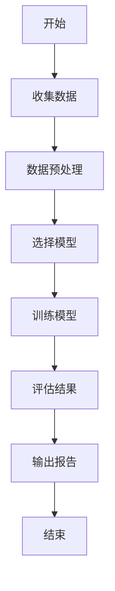

                 


# 如何评估企业的敏捷管理能力价值

> 关键词：敏捷管理，企业评估，管理能力，价值分析，系统架构，算法模型

> 摘要：本文详细介绍如何评估企业的敏捷管理能力价值，涵盖核心概念、算法模型、系统架构和项目实战，帮助读者全面理解敏捷管理的重要性及评估方法。

---

# 第一章：企业敏捷管理能力评估背景介绍

## 1.1 敏捷管理的起源与发展

敏捷管理起源于软件开发领域，强调个体互动、客户合作和响应变化。其核心理念逐渐扩展到企业整体管理，成为提升效率和灵活性的重要方法。

## 1.2 敏捷管理能力的定义与范围

敏捷管理能力指企业在快速变化的环境中，通过灵活调整策略和流程，高效响应市场需求的能力。其范围涵盖组织结构、团队协作和技术创新等多个方面。

## 1.3 评估敏捷管理能力的重要性

评估敏捷管理能力帮助企业识别改进点，优化资源配置，提升整体竞争力。通过评估，企业能够更好地适应市场变化，提高客户满意度。

---

# 第二章：敏捷管理能力的核心概念与联系

## 2.1 核心概念解析

敏捷管理强调客户合作、响应变化和持续交付价值。核心要素包括敏捷理念、组织结构、团队协作和技术创新。

## 2.2 核心要素的特征对比

| 要素       | 特征描述                     |
|------------|------------------------------|
| 敏捷理念   | 强调迭代开发和用户反馈       |
| 组织结构   | 扁平化，跨职能团队           |
| 团队协作   | 强调自组织和持续改进         |
| 技术创新   | 使用自动化工具和持续集成     |

## 2.3 ER实体关系图

```mermaid
erDiagram
    customer[客户] {
        <属性>
        id : int
        name : string
        feedback : string
    }
    developer[开发人员] {
        <属性>
        id : int
        name : string
        role : string
    }
    project[项目] {
        <属性>
        id : int
        name : string
        status : string
    }
    customer -> project : 反馈
    developer -> project : 参与
```

---

# 第三章：敏捷管理能力评估的算法原理

## 3.1 算法流程图



## 3.2 Python代码实现

```python
def assess AgilityCapability(data):
    preprocess_data = data清洗
    model = 选择模型
    result = 模型训练与评估(preprocess_data)
    return 生成报告(result)
```

## 3.3 数学模型与公式

$$ \text{评估得分} = \sum_{i=1}^{n} w_i \times s_i $$

其中，$$w_i$$ 是第i个评估维度的权重，$$s_i$$ 是评分。

---

# 第四章：系统分析与架构设计

## 4.1 系统架构图


## 4.2 系统功能模块

- 数据收集模块：收集企业敏捷管理相关数据
- 数据处理模块：清洗和转换数据
- 模型训练模块：应用机器学习模型进行评估
- 报告生成模块：输出评估结果

---

# 第五章：项目实战与案例分析

## 5.1 项目环境安装

安装Python、Jupyter Notebook和相关库（如Pandas、Scikit-learn）。

## 5.2 核心代码实现

```python
import pandas as pd
from sklearn.metrics import accuracy_score

def main():
    data = pd.read_csv('agility_data.csv')
    preprocess(data)
    model = train_model(data)
    result = assess_model(model)
    generate_report(result)

if __name__ == "__main__":
    main()
```

## 5.3 案例分析

以某科技公司为例，分析其敏捷管理能力，应用上述模型进行评估，输出改进建议。

---

# 第六章：最佳实践与总结

## 6.1 最佳实践

- 定期评估，持续改进
- 结合企业实际情况选择模型
- 引入自动化工具提高效率

## 6.2 注意事项

- 数据质量影响评估结果
- 模型选择需与业务需求匹配
- 结果分析需结合行业背景

---

# 附录：工具与资源列表

- 数据分析工具：Python、Pandas
- 机器学习库：Scikit-learn
- 图形绘制工具：Mermaid

---

# 参考文献与延伸阅读

1. 《敏捷宣言》
2. 《系统架构设计》
3. 相关学术论文和在线资源

---

通过以上结构和内容，读者可以系统地学习如何评估企业的敏捷管理能力价值，并在实际工作中应用相关方法和工具。

