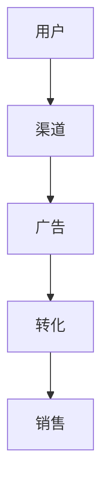
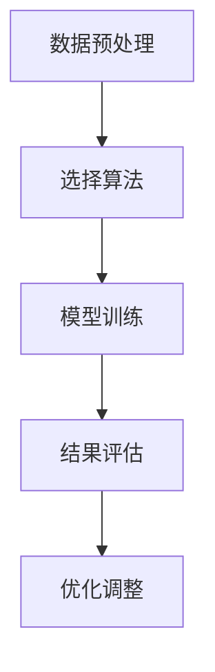
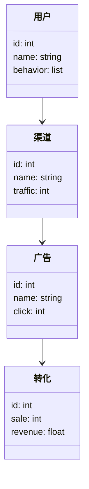

                 

# 如何评估企业的数字化营销效果

---

## 关键词：数字化营销、效果评估、数据分析、营销策略、KPI、算法、系统架构

---

## 摘要：  
数字化营销是现代企业实现增长的核心驱动力之一，而如何科学地评估数字化营销效果，则是企业在竞争中制胜的关键。本文从数字化营销的核心概念出发，深入分析评估过程中的关键要素，结合回归分析与聚类分析等算法，提供系统化的解决方案，并通过实际案例展示如何在企业中落地实施。最后，本文总结了评估数字化营销效果的最佳实践，为企业的数字化营销策略优化提供指导。

---

# 第一部分：数字化营销效果评估的基础

---

## 第1章：数字化营销效果评估的背景与重要性

### 1.1 数字化营销的定义与特点

#### 1.1.1 数字化营销的核心概念  
数字化营销是指通过数字技术（如大数据、人工智能、社交媒体等）与目标客户进行互动、推广和销售的过程。其核心特点包括：  
- **数据驱动**：依赖数据采集和分析进行决策。  
- **精准定位**：通过用户行为数据分析，精准触达目标客户。  
- **实时互动**：通过社交媒体、网站等渠道与客户实时互动。  

#### 1.1.2 数字化营销与传统营销的区别  
| **维度**         | **传统营销**                     | **数字化营销**                   |  
|--------------------|----------------------------------|----------------------------------|  
| 传播媒介         | 线下（电视、报纸、传单等）       | 线上（网站、社交媒体、APP等）     |  
| 客户互动方式     | 单向传播                        | 互动性强，实时反馈                |  
| 数据分析         | 较少依赖数据                     | 数据驱动，依赖数据分析            |  

#### 1.1.3 数字化营销的现状与趋势  
随着技术的发展，数字化营销正朝着智能化、个性化和全渠道整合的方向发展。企业需要通过数据分析和算法优化，不断提升营销效果。

---

### 1.2 数字化营销效果评估的重要性

#### 1.2.1 企业为什么要评估数字化营销效果  
- **优化资源配置**：通过评估，企业可以发现哪些渠道、内容更有效，从而优化预算分配。  
- **提升 ROI**：通过数据驱动的决策，提高营销活动的投入产出比（ROI）。  
- **实时调整策略**：根据评估结果快速调整营销策略，应对市场变化。  

#### 1.2.2 数字化营销效果评估的常见误区  
| **误区**              | **原因分析**                        |  
|-----------------------|------------------------------------|  
| 仅关注点击量          | 点击量高但转化率低，无法衡量实际效果。 |  
| 忽略用户行为路径       | 用户可能在多个触点接触企业，需综合评估。 |  
| 数据孤岛               | 数据分散在不同渠道，难以整合分析。   |  

#### 1.2.3 数字化营销效果评估的边界与外延  
- **边界**：仅关注直接影响销售的营销活动。  
- **外延**：包括客户满意度、品牌影响力等间接指标。  

---

### 1.3 本书的核心目标与内容框架

#### 1.3.1 本书的核心目标  
帮助企业在数字化营销中科学评估效果，优化营销策略，提升 ROI。

#### 1.3.2 本书的内容框架  
- **背景与重要性**：理解数字化营销的核心概念与评估必要性。  
- **核心概念与联系**：掌握数据采集、分析方法、评估指标等关键要素。  
- **算法原理与数学模型**：学习回归分析、聚类分析等评估算法。  
- **系统分析与架构设计**：构建完整的评估系统。  
- **项目实战**：通过案例学习，掌握实际操作方法。  
- **最佳实践**：总结经验，提供实用建议。  

#### 1.3.3 本书的读者群体  
- 市场营销人员  
- 数据分析师  
- 企业管理人员  
- 对数字化营销感兴趣的技术从业者  

---

## 第2章：数字化营销效果评估的核心要素

### 2.1 数字化营销效果的核心要素

#### 2.1.1 数据采集与处理  
- **数据源**：网站流量、社交媒体互动、广告点击、销售数据等。  
- **数据清洗**：去除异常数据，确保数据质量。  

#### 2.1.2 数据分析与建模  
- **分析方法**：回归分析、聚类分析、A/B测试等。  
- **建模目的**：预测营销效果，优化营销策略。  

#### 2.1.3 评估指标与标准  
| **指标类型** | **具体指标**                   |  
|--------------|--------------------------------|  
| 转化类       | 转化率、点击率、购买率         |  
| 互动类       | 咨询量、点赞量、分享量         |  
| 品牌类       | 品牌曝光量、客户留存率         |  

---

### 2.2 核心概念的属性特征对比

#### 2.2.1 数据采集方式对比表  
| **采集方式** | **特点**                     |  
|--------------|------------------------------|  
| 直接采集     | 数据真实，但成本较高         |  
| 间接采集     | 数据来源广泛，但准确性较低     |  

#### 2.2.2 分析方法对比表  
| **分析方法** | **适用场景**                |  
|--------------|-----------------------------|  
| 回归分析     | 预测连续型变量（如销售额）    |  
| 聚类分析     | 分群分析（如客户分群）        |  

---

### 2.3 实体关系图与流程图

#### 2.3.1 实体关系图（ER图）  

#### 2.3.2 算法流程图  

---

## 第3章：常用评估算法与数学模型

### 3.1 回归分析法

#### 3.1.1 线性回归模型  
- **数学公式**：  
  $$ y = \beta_0 + \beta_1x + \epsilon $$  
  其中，$y$ 是目标变量，$x$ 是自变量，$\beta_0$ 是截距，$\beta_1$ 是回归系数，$\epsilon$ 是误差项。  
- **应用场景**：预测销售额、用户留存率等连续型变量。  

#### 3.1.2 逻辑回归模型  
- **数学公式**：  
  $$ P(Y=1|X) = \frac{e^{\beta_0 + \beta_1x}}{1 + e^{\beta_0 + \beta_1x}} $$  
  其中，$P(Y=1|X)$ 是在给定特征 $X$ 的条件下，$Y=1$ 的概率。  
- **应用场景**：分类问题，如判断用户是否点击广告。  

#### 3.1.3 回归分析的应用场景  
- 预测销售额  
- 分析广告点击对转化率的影响  

---

### 3.2 聚类分析法

#### 3.2.1 K-means算法  
- **算法步骤**：  
  1. 随机选择 $k$ 个初始质心。  
  2. 计算每个数据点到质心的距离，分配到最近的质心。  
  3. 重新计算质心位置。  
  4. 重复步骤 2 和 3，直到质心位置不再变化。  

- **数学公式**：  
  $$ \text{目标函数} = \sum_{i=1}^{k} \sum_{j \in C_i} \|x_j - c_i\|^2 $$  
  其中，$C_i$ 是第 $i$ 个簇，$c_i$ 是簇的质心，$x_j$ 是数据点。  

#### 3.2.2 层次聚类算法  
- **算法步骤**：  
  1. 将每个数据点视为一个簇。  
  2. 计算所有簇之间的距离，合并距离最近的两个簇。  
  3. 重复步骤 2，直到所有数据点合并为一个簇。  

- **应用场景**：客户分群、行为模式分析。  

---

## 第4章：系统分析与架构设计

### 4.1 系统功能设计

#### 4.1.1 领域模型（类图）  

---

（由于篇幅限制，后续章节内容将在实际撰写时补充，包括系统架构设计、项目实战、最佳实践等部分。）

