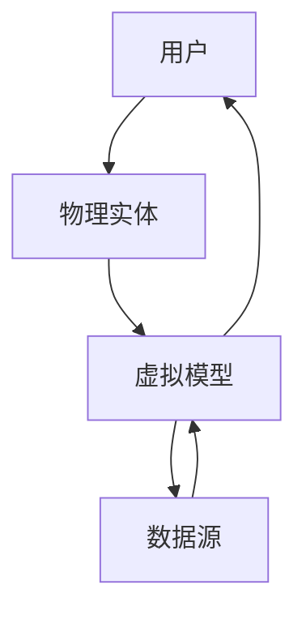
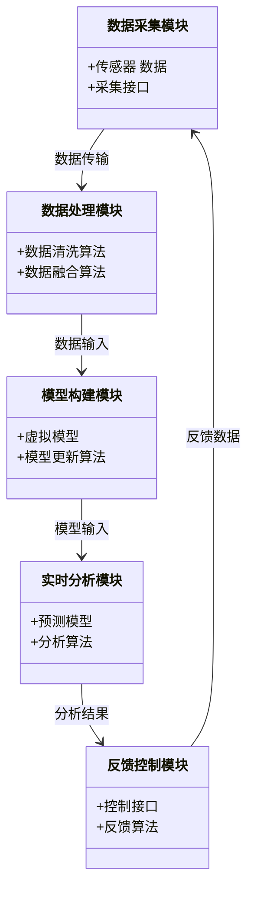
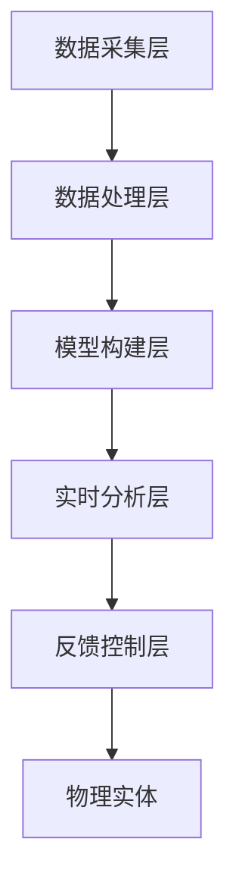
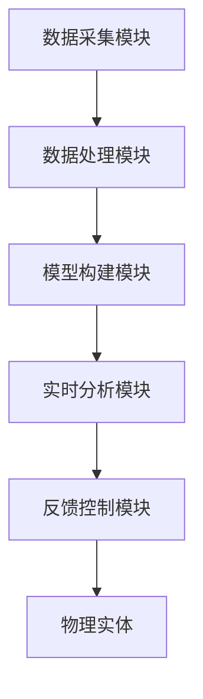

                 


# 如何评估企业的数字孪生技术应用

## 关键词：数字孪生，企业评估，技术应用，系统架构，算法原理，项目实战

## 摘要：  
数字孪生技术作为企业数字化转型的重要工具，正在被广泛应用于各个行业。本文将从数字孪生技术的背景与概念出发，详细分析其核心要素与系统架构，探讨其算法原理与数学模型，结合实际案例进行系统设计与实现，最后总结最佳实践与注意事项，帮助读者全面了解如何评估和应用数字孪生技术。

---

# 第1章: 数字孪生技术的背景与概念

## 1.1 数字孪生技术的定义与背景

### 1.1.1 数字孪生技术的定义  
数字孪生（Digital Twin）是指在虚拟空间中创建一个与物理实体一一对应的数字模型，通过实时数据采集和分析，实现对物理实体的模拟、监控、分析和优化。数字孪生技术的核心在于数据的实时同步和模型的动态更新。

### 1.1.2 数字孪生技术的发展背景  
随着物联网（IoT）、大数据、人工智能（AI）和云计算等技术的快速发展，企业对数字化转型的需求日益增加。数字孪生技术作为连接物理世界和数字世界的桥梁，成为企业提升效率、降低成本和优化决策的重要手段。

### 1.1.3 数字孪生技术的核心目标  
数字孪生技术的核心目标是通过虚拟模型与物理实体的实时互动，实现对物理系统的全面感知、智能分析和精准控制，从而提高企业的运营效率和竞争力。

---

## 1.2 数字孪生技术的应用现状

### 1.2.1 数字孪生技术在各行业的应用情况  
数字孪生技术已经在制造业、医疗、能源、交通等多个行业得到广泛应用。例如，在制造业中，数字孪生技术用于设备预测性维护和生产优化；在医疗领域，数字孪生技术用于患者病情监测和手术规划。

### 1.2.2 数字孪生技术的市场规模与发展趋势  
根据市场研究，数字孪生技术的市场规模正在快速增长，预计在未来几年内将呈现指数级增长。随着5G、边缘计算和AI技术的进一步发展，数字孪生技术的应用场景将更加广泛。

### 1.2.3 数字孪生技术的核心技术基础  
数字孪生技术的核心技术包括：  
- 数据采集与处理：通过传感器、物联网设备等采集物理实体的实时数据。  
- 数据融合与建模：利用大数据和机器学习算法对数据进行清洗、融合，并构建虚拟模型。  
- 实时分析与反馈：通过人工智能技术对模型进行实时分析，并将结果反馈给物理实体。

---

## 1.3 数字孪生技术的价值与挑战

### 1.3.1 数字孪生技术为企业带来的价值  
1. **提高效率**：通过实时监控和分析，减少资源浪费，提高生产效率。  
2. **降低成本**：通过预测性维护和优化决策，降低运营成本。  
3. **增强决策能力**：通过数据驱动的分析，提供更精准的决策支持。  

### 1.3.2 数字孪生技术应用中的主要挑战  
1. **数据量大**：物理实体产生的数据量巨大，对数据处理能力提出更高要求。  
2. **模型复杂**：构建高精度的虚拟模型需要复杂的算法和计算能力。  
3. **系统集成**：数字孪生技术需要与企业现有的系统无缝集成，涉及多个部门和系统的协同工作。  

### 1.3.3 数字孪生技术的未来发展方向  
1. **智能化**：结合人工智能技术，实现更智能的预测和优化。  
2. **边缘计算**：通过边缘计算技术，提高数据处理的实时性和响应速度。  
3. **行业化**：针对不同行业的需求，开发更专业的数字孪生解决方案。  

---

## 1.4 本章小结  
本章从数字孪生技术的定义、背景、价值和挑战等方面进行了详细阐述，为后续章节的深入分析奠定了基础。

---

# 第2章: 数字孪生技术的核心要素与系统架构

## 2.1 数字孪生技术的核心要素

### 2.1.1 物理实体与虚拟模型的对应关系  
数字孪生技术通过物理实体与虚拟模型的实时互动，实现对物理系统的全面模拟和优化。虚拟模型需要与物理实体在结构、功能和行为上保持高度一致。

### 2.1.2 数据流与实时互动的实现机制  
数据流是数字孪生技术的核心，通过传感器、物联网设备等采集物理实体的实时数据，并将其传输到虚拟模型中进行分析和处理。

### 2.1.3 反馈机制与优化策略  
数字孪生技术通过虚拟模型的分析结果，向物理实体提供反馈，实现对物理系统的优化和控制。

---

## 2.2 数字孪生技术的系统架构

### 2.2.1 系统架构的组成与功能模块  
数字孪生系统的典型架构包括以下模块：  
1. **数据采集模块**：负责采集物理实体的实时数据。  
2. **数据处理模块**：对采集的数据进行清洗、融合和转换。  
3. **模型构建模块**：基于数据构建虚拟模型。  
4. **实时分析模块**：对虚拟模型进行实时分析和优化。  
5. **反馈控制模块**：将分析结果反馈给物理实体，实现优化控制。

### 2.2.2 数据采集与处理的实现方式  
数字孪生技术可以通过多种方式采集数据，例如传感器、物联网设备、数据库等。数据处理过程包括数据清洗、数据融合和数据转换。

### 2.2.3 模型构建与实时更新的流程  
模型构建是数字孪生技术的关键步骤，需要结合物理实体的结构、功能和行为特征，构建高精度的虚拟模型。实时更新则是通过持续采集和分析数据，对虚拟模型进行动态优化。

---

## 2.3 数字孪生技术的ER实体关系图

```mermaid
erDiagram
    actor 用户 {
        +id 用户ID
        +name 用户名称
    }
    actor 物理实体 {
        +id 物理实体ID
        +name 物理实体名称
    }
    actor 虚拟模型 {
        +id 虚拟模型ID
        +name 虚拟模型名称
    }
    用户 --> 物理实体 : 操作
    物理实体 --> 虚拟模型 : 数据映射
    虚拟模型 --> 用户 : 反馈
```

---

## 2.4 数字孪生技术的数据流与交互关系



---

## 2.5 本章小结  
本章详细介绍了数字孪生技术的核心要素与系统架构，通过ER图和流程图展示了系统的组成与交互关系，为后续章节的分析提供了理论基础。

---

# 第3章: 数字孪生技术的算法原理与数学模型

## 3.1 数据融合算法

### 3.1.1 数据融合算法的定义与作用  
数据融合算法是指将来自不同来源的数据进行融合，以提高数据的准确性和完整性。在数字孪生技术中，数据融合算法用于将物理实体的实时数据与虚拟模型的预测数据进行融合，以实现更精准的分析和优化。

### 3.1.2 数据融合算法的实现流程  
数据融合算法的实现流程包括以下步骤：  
1. **数据采集**：通过传感器、物联网设备等采集物理实体的实时数据。  
2. **数据预处理**：对采集的数据进行清洗、去噪和归一化处理。  
3. **数据融合**：将来自不同来源的数据进行融合，例如加权平均、投票融合等。  
4. **模型更新**：根据融合后的数据更新虚拟模型。

### 3.1.3 数据融合算法的Python实现

```python
import numpy as np

# 示例数据：来自两个传感器的温度测量值
sensor1 = np.array([25.3, 25.4, 25.5])
sensor2 = np.array([25.2, 25.3, 25.6])

# 使用加权平均法进行数据融合
weights = [0.6, 0.4]
fused_data = np.zeros_like(sensor1)
for i in range(len(sensor1)):
    fused_data[i] = weights[0] * sensor1[i] + weights[1] * sensor2[i]

print("Fused Data:", fused_data)
```

### 3.1.4 数据融合算法的数学模型  
数据融合算法的数学模型可以用以下公式表示：  

$$ y = \sum_{i=1}^{n} w_i x_i $$  

其中，\( y \) 是融合后的数据，\( w_i \) 是第 \( i \) 个数据源的权重，\( x_i \) 是第 \( i \) 个数据源的数据。

---

## 3.2 实时分析算法

### 3.2.1 实时分析算法的定义与作用  
实时分析算法是指对虚拟模型进行实时分析，以提供预测和优化建议。在数字孪生技术中，实时分析算法用于对虚拟模型的状态进行实时监控和预测。

### 3.2.2 实时分析算法的实现流程  
实时分析算法的实现流程包括以下步骤：  
1. **数据采集**：通过传感器、物联网设备等采集物理实体的实时数据。  
2. **数据处理**：对采集的数据进行预处理和转换。  
3. **模型分析**：将处理后的数据输入虚拟模型，进行实时分析和预测。  
4. **结果反馈**：将分析结果反馈给物理实体，实现优化控制。

### 3.2.3 实时分析算法的Python实现

```python
import pandas as pd
from sklearn.ensemble import RandomForestRegressor

# 示例数据：虚拟模型的输入特征
data = pd.DataFrame({
    '特征1': [1, 2, 3],
    '特征2': [4, 5, 6],
    '特征3': [7, 8, 9]
})

# 使用随机森林回归模型进行实时分析
model = RandomForestRegressor(n_estimators=100, random_state=42)
model.fit(data.drop('目标变量', axis=1), data['目标变量'])

# 预测结果
new_data = pd.DataFrame({
    '特征1': [2],
    '特征2': [5],
    '特征3': [8]
})
predicted_value = model.predict(new_data)
print("预测结果:", predicted_value)
```

### 3.2.4 实时分析算法的数学模型  
实时分析算法的数学模型可以用以下公式表示：  

$$ y = f(x_1, x_2, ..., x_n) $$  

其中，\( y \) 是模型的输出，\( x_1, x_2, ..., x_n \) 是模型的输入特征。

---

## 3.3 本章小结  
本章详细介绍了数字孪生技术中的数据融合算法和实时分析算法，通过Python代码和数学公式展示了算法的实现过程和应用场景。

---

# 第4章: 数字孪生技术的系统分析与架构设计

## 4.1 项目背景与需求分析

### 4.1.1 项目背景  
本项目旨在通过数字孪生技术实现对某企业生产设备的实时监控和预测性维护。通过构建虚拟模型，企业可以实时了解设备的状态，并根据模型的分析结果进行优化控制。

### 4.1.2 项目需求  
1. 实时采集生产设备的运行数据。  
2. 构建生产设备的虚拟模型。  
3. 实时分析设备状态，并提供预测性维护建议。

---

## 4.2 系统功能设计

### 4.2.1 系统功能模块  
系统功能模块包括：  
1. **数据采集模块**：负责采集生产设备的实时数据。  
2. **数据处理模块**：对采集的数据进行清洗和融合。  
3. **模型构建模块**：基于数据构建生产设备的虚拟模型。  
4. **实时分析模块**：对虚拟模型进行实时分析，提供预测性维护建议。  
5. **反馈控制模块**：将分析结果反馈给生产设备，实现优化控制。

### 4.2.2 系统功能的ER类图



---

## 4.3 系统架构设计

### 4.3.1 系统架构的组成与功能  
系统架构包括以下部分：  
1. **数据采集层**：负责采集物理实体的实时数据。  
2. **数据处理层**：对采集的数据进行清洗和融合。  
3. **模型构建层**：基于数据构建虚拟模型。  
4. **实时分析层**：对虚拟模型进行实时分析，提供预测性维护建议。  
5. **反馈控制层**：将分析结果反馈给物理实体，实现优化控制。

### 4.3.2 系统架构的Mermaid图



---

## 4.4 系统接口设计

### 4.4.1 系统接口的定义与作用  
系统接口用于不同模块之间的数据传输和交互。例如，数据采集模块通过接口将数据传输到数据处理模块，数据处理模块通过接口将数据传输到模型构建模块，等等。

### 4.4.2 系统接口的交互流程图



---

## 4.5 本章小结  
本章详细介绍了数字孪生技术的系统分析与架构设计，通过ER类图和Mermaid图展示了系统的组成与交互关系。

---

# 第5章: 数字孪生技术的项目实战

## 5.1 环境搭建与数据采集

### 5.1.1 环境搭建  
1. 安装Python和相关库（如NumPy、Pandas、Scikit-learn）。  
2. 安装物联网设备和传感器。  
3. 配置数据采集接口。

### 5.1.2 数据采集  
通过传感器采集生产设备的实时数据，例如温度、湿度、压力等。

---

## 5.2 数据处理与模型构建

### 5.2.1 数据预处理  
对采集的数据进行清洗和归一化处理，例如去除噪声数据、填充缺失值等。

### 5.2.2 数据融合  
使用加权平均法对来自不同传感器的数据进行融合。

### 5.2.3 模型构建  
基于融合后的数据，构建生产设备的虚拟模型，例如使用机器学习算法训练回归模型。

---

## 5.3 实时分析与反馈控制

### 5.3.1 实时分析  
对虚拟模型进行实时分析，预测设备的运行状态和可能出现的故障。

### 5.3.2 反馈控制  
将分析结果反馈给生产设备，实现预测性维护和优化控制。

---

## 5.4 项目案例分析

### 5.4.1 案例背景  
某制造企业希望通过数字孪生技术实现对生产设备的实时监控和预测性维护。

### 5.4.2 案例分析  
通过数字孪生技术，企业可以实时了解生产设备的运行状态，预测可能出现的故障，并提前进行维护，从而减少停机时间和维护成本。

---

## 5.5 本章小结  
本章通过实际案例展示了数字孪生技术的项目实战过程，包括环境搭建、数据处理、模型构建、实时分析和反馈控制等步骤。

---

# 第6章: 数字孪生技术的最佳实践与注意事项

## 6.1 评估数字孪生技术的关键点

### 6.1.1 数据质量  
数据质量是数字孪生技术的核心，需要确保数据的准确性、完整性和实时性。

### 6.1.2 模型精度  
模型精度直接影响数字孪生技术的分析结果，需要通过不断优化模型来提高精度。

### 6.1.3 系统集成  
数字孪生技术需要与企业现有的系统无缝集成，确保数据的实时传输和系统的协同工作。

### 6.1.4 团队协作  
数字孪生技术的实施需要多部门协作，包括数据科学家、软件开发人员、系统集成人员等。

---

## 6.2 数字孪生技术的注意事项

### 6.2.1 数据隐私与安全  
数字孪生技术涉及大量的数据采集和传输，需要注意数据的隐私和安全问题。

### 6.2.2 系统性能优化  
数字孪生技术对系统的性能要求较高，需要通过优化算法和架构来提高系统的响应速度和处理能力。

### 6.2.3 技术选型与可行性分析  
在实施数字孪生技术之前，需要进行技术选型和可行性分析，确保技术方案的可行性和可扩展性。

---

## 6.3 本章小结  
本章总结了数字孪生技术的最佳实践和注意事项，帮助企业在实施数字孪生技术时避免常见问题，提高技术应用的成功率。

---

# 第7章: 总结与展望

## 7.1 总结  
数字孪生技术作为企业数字化转型的重要工具，正在被广泛应用于各个行业。本文从数字孪生技术的背景与概念出发，详细分析了其核心要素与系统架构，探讨了其算法原理与数学模型，并结合实际案例进行了系统设计与实现，最后总结了最佳实践与注意事项。

## 7.2 展望  
随着技术的不断发展，数字孪生技术的应用场景将更加广泛，技术也将更加智能化和专业化。未来，数字孪生技术将与人工智能、边缘计算等技术深度融合，为企业提供更高效、更智能的数字化解决方案。

---

# 参考文献  
（此处列出相关的书籍、论文、技术文档等参考文献）

---

通过本文的详细讲解，读者可以全面了解如何评估企业的数字孪生技术应用，并掌握数字孪生技术的核心原理和实际操作方法。

