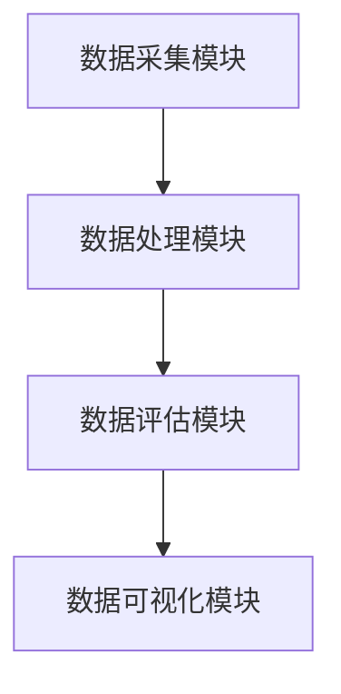
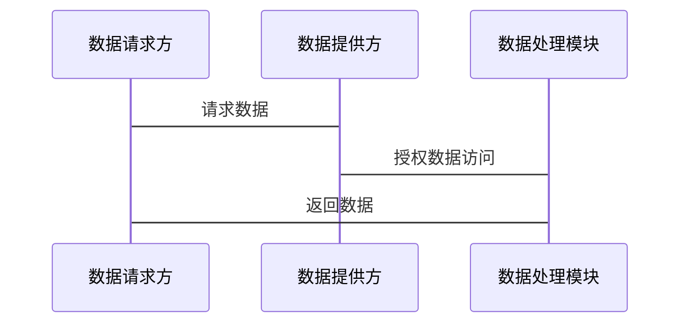

                 


# 如何评估企业的数据变现能力

> 关键词：数据变现能力，数据资产，数据质量，数据安全，数据隐私

> 摘要：随着数字化转型的深入，数据已成为企业的重要资产。本文将从数据资产的定义与特征、数据质量的核心要素、数据安全与隐私保护等多方面，系统地阐述如何评估企业的数据变现能力。通过详细分析数据资产评估的数学模型和算法实现，结合实际案例，为读者提供一套完整的评估框架和方法。

---

## 第一部分：数据变现能力评估的背景与核心概念

### 第1章：数据变现能力的定义与背景

#### 1.1 数据变现的定义与内涵

- **1.1.1 数据资产的定义与特征**
  - 数据资产是指企业通过业务活动收集、存储、处理和分析的有价值的信息。
  - 数据资产具有可衡量性、可共享性、可扩展性等特征。

- **1.1.2 数据变现的核心概念**
  - 数据变现是指将数据资产转化为实际收益的过程。
  - 数据变现的核心在于挖掘数据的潜在价值，并通过产品或服务实现商业价值。

- **1.1.3 数据变现的背景与趋势**
  - 随着大数据技术的发展，企业对数据的依赖日益增加。
  - 数据驱动的商业模式逐渐成为企业竞争的核心。

#### 1.2 数据变现能力的重要性

- **1.2.1 数据资产对企业价值的影响**
  - 数据资产是企业的重要无形资产，能够为企业创造新的收入来源。
  - 数据资产的质量和数量直接影响企业的市场竞争力。

- **1.2.2 数据驱动业务增长的潜力**
  - 数据驱动的决策能够提高企业的运营效率和盈利能力。
  - 数据驱动的创新能够帮助企业发现新的市场机会。

- **1.2.3 数据变现能力与企业竞争力的关系**
  - 数据变现能力是企业核心竞争力的重要组成部分。
  - 数据变现能力强的企业能够更快地响应市场需求，抓住商业机会。

#### 1.3 数据变现能力的评估维度

- **1.3.1 数据资产的质量评估**
  - 数据的完整性和准确性直接影响数据资产的价值。
  - 数据的更新频率和存储成本也是评估数据资产质量的重要指标。

- **1.3.2 数据变现的商业模式**
  - 数据变现可以通过直接销售数据、提供数据分析服务、开发数据驱动的产品等方式实现。
  - 企业的数据变现能力取决于其选择的商业模式的可行性和可持续性。

- **1.3.3 数据安全与隐私保护**
  - 数据安全是数据变现的前提条件，企业必须确保数据的机密性和安全性。
  - 随着数据隐私保护法律法规的不断完善，企业需要遵守相关法规，确保数据的合法使用。

---

### 第2章：数据资产与数据质量

#### 2.1 数据资产的分类与价值评估

- **2.1.1 数据资产的分类**
  - 结构化数据：如数据库中的表格数据。
  - 非结构化数据：如文本、图像、音频等。
  - 半结构化数据：如JSON、XML等格式的数据。

- **2.1.2 数据资产的价值评估方法**
  - 数据的稀缺性：数据的独特性和唯一性决定了其价值。
  - 数据的可操作性：数据的可用性和可处理性直接影响其价值。
  - 数据的关联性：数据之间的关联性越强，其潜在价值越大。

- **2.1.3 数据资产的生命周期管理**
  - 数据生成：通过业务活动收集数据。
  - 数据存储：将数据存储在数据库或其他存储系统中。
  - 数据处理：对数据进行清洗、转换和分析。
  - 数据应用：将数据应用于业务决策和产品开发。
  - 数据归档：对不再使用的数据进行归档或删除。

#### 2.2 数据质量的核心要素

- **2.2.1 数据完整性**
  - 数据完整性是指数据的完整性和准确性。
  - 数据的完整性要求数据没有缺失、重复或错误。

- **2.2.2 数据一致性**
  - 数据一致性是指数据在不同系统或存储中的一致性。
  - 数据一致性要求数据在格式、命名和内容上保持一致。

- **2.2.3 数据准确性**
  - 数据准确性是指数据的正确性和可靠性。
  - 数据的准确性要求数据反映真实的情况。

#### 2.3 数据安全与隐私保护

- **2.3.1 数据安全的基本原则**
  - 数据的安全性要求数据在存储和传输过程中不被未经授权的访问。
  - 数据的安全性需要通过加密技术、访问控制等手段实现。

- **2.3.2 数据隐私的保护措施**
  - 数据隐私保护需要遵循相关法律法规，如GDPR（通用数据保护条例）。
  - 数据隐私保护需要通过匿名化、脱敏等技术手段实现。

- **2.3.3 数据安全与隐私的法律合规**
  - 企业需要遵守数据隐私保护的法律法规，确保数据的合法使用。
  - 数据安全与隐私保护是企业数据变现的前提条件。

---

### 第3章：数据资产评估模型

#### 3.1 数据资产评估的数学模型

- **数据资产价值的计算公式**
  $$ V = \sum_{i=1}^{n} w_i \cdot f_i $$
  其中，\( V \) 表示数据资产价值，\( w_i \) 表示第 \( i \) 个特征的权重，\( f_i \) 表示第 \( i \) 个特征的评估值。

- **数据资产评估的步骤**
  1. 数据清洗与预处理：去除噪声数据，填补缺失值。
  2. 数据特征提取：提取与数据价值相关的特征。
  3. 数据资产评估：根据特征的权重和评估值计算数据资产价值。

#### 3.2 数据资产评估的算法实现

- **数据清洗与预处理**
  ```python
  import pandas as pd
  # 读取数据
  data = pd.read_csv('data.csv')
  # 去除缺失值
  data.dropna(inplace=True)
  # 填补缺失值
  data['age'].fillna(data['age'].mean(), inplace=True)
  ```

- **数据特征提取**
  ```python
  from sklearn.preprocessing import StandardScaler
  # 标准化数据
  scaler = StandardScaler()
  data_scaled = scaler.fit_transform(data)
  ```

- **数据资产评估的机器学习模型**
  ```python
  from sklearn.ensemble import RandomForestRegressor
  # 训练模型
  model = RandomForestRegressor()
  model.fit(data_scaled, target)
  # 预测数据资产价值
  predicted_value = model.predict(new_data)
  ```

#### 3.3 数据资产评估的案例分析

- **案例背景介绍**
  某电子商务公司希望通过评估其用户数据的价值，制定数据变现策略。

- **数据清洗与特征提取过程**
  - 数据清洗：去除无效用户数据，填补缺失的用户信息。
  - 数据特征提取：提取用户的行为数据、购买记录、地理位置等特征。

- **模型训练与评估结果**
  - 使用随机森林回归模型对数据资产价值进行预测。
  - 模型预测结果表明，用户的购买频率和地理位置是影响数据资产价值的关键因素。

---

### 第4章：数据变现能力评估系统架构

#### 4.1 系统功能设计

- **数据采集模块**
  - 数据采集：通过API或其他数据源采集数据。
  - 数据存储：将采集到的数据存储在数据库中。

- **数据处理模块**
  - 数据清洗：去除噪声数据，填补缺失值。
  - 数据转换：将数据转换为适合分析的格式。

- **数据评估模块**
  - 数据特征提取：提取与数据价值相关的特征。
  - 数据资产评估：根据特征的权重和评估值计算数据资产价值。

- **数据可视化模块**
  - 数据可视化：将评估结果以图表形式展示。
  - 可视化分析：通过图表分析数据资产的价值分布。

#### 4.2 系统架构设计



- **数据采集模块与数据处理模块的交互**
  - 数据采集模块将数据传递给数据处理模块进行清洗和转换。

- **数据处理模块与数据评估模块的交互**
  - 数据处理模块将清洗和转换后的数据传递给数据评估模块进行特征提取和资产评估。

- **数据评估模块与数据可视化模块的交互**
  - 数据评估模块将评估结果传递给数据可视化模块进行图表展示。

#### 4.3 系统接口设计

- **数据接口规范**
  - 数据接口需要支持多种数据格式，如CSV、JSON等。
  - 数据接口需要提供API访问权限，确保数据的安全性。

- **API调用流程**
  1. 数据请求方通过API获取数据。
  2. 数据提供方对数据进行认证和授权。
  3. 数据请求方获取数据并进行处理。

- **接口安全设计**
  - 数据接口需要使用SSL加密技术，确保数据在传输过程中的安全性。
  - 数据接口需要设置访问权限和认证机制，防止未经授权的访问。

#### 4.4 系统交互设计



- **数据请求方与数据提供方的交互**
  - 数据请求方通过API向数据提供方请求数据。
  - 数据提供方对数据请求方进行认证和授权，确保数据的安全性。

- **数据处理模块与数据请求方的交互**
  - 数据处理模块对获取的数据进行清洗和转换，并将结果返回给数据请求方。

---

### 第5章：项目实战与案例分析

#### 5.1 项目背景介绍

- 某电子商务公司希望通过评估其用户数据的价值，制定数据变现策略。

#### 5.2 环境安装与配置

- **安装Python环境**
  ```bash
  python --version
  ```

- **安装所需的库**
  ```bash
  pip install pandas sklearn matplotlib
  ```

#### 5.3 核心代码实现

- **数据清洗与预处理**
  ```python
  import pandas as pd
  data = pd.read_csv('data.csv')
  data.dropna(inplace=True)
  data['age'].fillna(data['age'].mean(), inplace=True)
  ```

- **数据特征提取与模型训练**
  ```python
  from sklearn.ensemble import RandomForestRegressor
  model = RandomForestRegressor()
  model.fit(data.drop('target', axis=1), data['target'])
  ```

- **数据资产评估与结果可视化**
  ```python
  import matplotlib.pyplot

