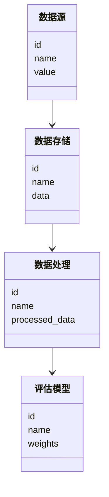
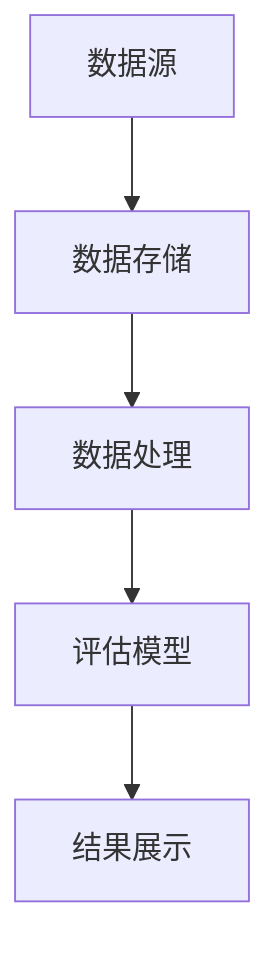

                 


# 如何评估企业的数据治理能力

> 关键词：数据治理能力，数据治理评估，数据质量，数据安全，数据合规性，数据治理框架

> 摘要：随着数据在企业中的战略地位日益重要，数据治理能力的评估成为企业优化数据管理和利用效率的关键。本文从数据治理的基本概念、核心要素、评估框架、算法原理、系统架构设计等多个维度，系统性地探讨如何科学评估企业的数据治理能力。通过理论分析与实际案例结合，为读者提供一套完整的方法论和实践指南。

---

# 第1章: 数据治理概述

## 1.1 数据治理的基本概念

### 1.1.1 数据治理的定义
数据治理是指通过制定和实施一系列政策、标准、流程和技术措施，确保数据的完整性、一致性、准确性、安全性和合规性。它是企业管理和利用数据的基石，贯穿数据全生命周期。

### 1.1.2 数据治理的核心目标
- 确保数据质量：完整性、一致性、准确性。
- 保障数据安全：防止数据泄露、篡改和未经授权的访问。
- 提升数据可用性：确保数据能够被及时、准确地访问和使用。
- 实现数据合规性：符合法律法规和行业标准。

### 1.1.3 数据治理的边界与外延
- 数据治理的边界：数据的全生命周期管理，从数据生成、存储、处理到归档和销毁。
- 数据治理的外延：与数据相关的企业战略、组织架构、文化建设和技术实现。

## 1.2 数据治理的必要性

### 1.2.1 数据的重要性与挑战
- 数据是企业决策的依据，是业务创新的驱动力。
- 数据孤岛、数据冗余、数据不一致等问题普遍存在于企业中，影响数据的利用效率和价值挖掘。

### 1.2.2 数据治理对企业价值的影响
- 提高数据可信度，增强企业决策的准确性。
- 降低数据管理成本，优化资源配置。
- 提升数据资产的价值，为企业创造新的收入来源。

### 1.2.3 数据治理与企业竞争力的关系
- 数据治理能力是企业数字化转型的核心竞争力。
- 数据治理能力强的企业能够更快响应市场变化，实现业务创新。

## 1.3 数据治理的关键要素

### 1.3.1 数据质量
- 数据完整性：数据是否包含所有必要信息。
- 数据一致性：数据在不同系统中的表现是否一致。
- 数据准确性：数据是否反映真实情况。

### 1.3.2 数据安全
- 数据加密：保护数据的机密性。
- 访问控制：确保只有授权人员能够访问数据。
- 安全审计：记录和监控数据访问行为。

### 1.3.3 数据合规性
- 符合数据保护法规（如GDPR、CCPA）。
- 遵守行业标准（如金融行业的监管要求）。

### 1.3.4 数据可用性
- 数据存储的可靠性：数据能否在需要时被访问。
- 数据处理的效率：数据处理的速度是否满足业务需求。

---

## 1.4 本章小结
本章从数据治理的基本概念出发，分析了数据治理的必要性，并总结了数据治理的关键要素。数据治理不仅是技术问题，更是企业战略层面的重要组成部分，直接关系到企业的核心竞争力。

---

# 第2章: 数据治理能力评估的核心概念

## 2.1 数据治理能力评估的框架

### 2.1.1 数据治理能力评估的维度
- 数据质量管理：数据的完整性、准确性、一致性。
- 数据安全管理：数据的机密性、完整性和可用性。
- 数据合规性管理：数据是否符合相关法律法规。
- 数据价值挖掘：数据是否被充分利用以创造价值。

### 2.1.2 数据治理能力评估的指标体系
- 数据质量管理指标：数据准确率、数据完整率。
- 数据安全管理指标：数据泄露事件发生率、数据访问控制的覆盖率。
- 数据合规性指标：合规性通过率、合规性整改完成率。
- 数据价值挖掘指标：数据驱动的业务创新数量、数据利用率。

### 2.1.3 数据治理能力评估的流程
1. 明确评估目标：确定评估的范围和重点。
2. 收集数据：获取与数据治理相关的各项数据。
3. 评估实施：根据评估指标和方法进行评估。
4. 分析结果：对评估结果进行分析，找出问题和改进方向。
5. 持续优化：根据评估结果制定改进措施，并持续监控。

---

## 2.2 数据治理能力评估的关键指标

### 2.2.1 数据质量管理指标
- 数据准确率：$ \text{数据准确率} = \frac{\text{准确数据量}}{\text{总数据量}} $
- 数据完整率：$ \text{数据完整率} = \frac{\text{完整数据量}}{\text{总数据量}} $

### 2.2.2 数据安全与隐私保护指标
- 数据泄露事件发生率：$ \text{数据泄露事件发生率} = \frac{\text{数据泄露事件数量}}{\text{总数据量}} $
- 数据访问控制的覆盖率：$ \text{访问控制覆盖率} = \frac{\text{受控数据量}}{\text{总数据量}} $

### 2.2.3 数据治理成熟度指标
- 数据治理成熟度模型：分为基础级、发展级、规范级、优化级和卓越级。

---

## 2.3 数据治理能力评估的模型与方法

### 2.3.1 数据治理成熟度模型
- 基础级：数据管理处于初步阶段，缺乏统一的政策和标准。
- 发展级：数据管理逐步规范化，开始建立基本的管理制度。
- 规范级：数据管理规范化，建立了完整的管理制度和流程。
- 优化级：数据管理持续优化，能够根据业务需求进行调整。
- 卓越级：数据管理达到最佳实践，数据成为企业核心竞争力。

### 2.3.2 数据治理能力评估方法
- 基于指标的评估方法：通过量化指标进行综合评分。
- 基于流程的评估方法：从数据管理流程的合规性进行评估。
- 基于风险的评估方法：识别和评估数据管理中的风险点。

---

## 2.4 本章小结
本章详细介绍了数据治理能力评估的框架、关键指标和模型方法。通过科学的评估框架和指标体系，企业可以全面了解自身的数据治理能力，并制定针对性的改进措施。

---

# 第3章: 数据治理能力评估的算法原理

## 3.1 数据治理能力评估的数学模型

### 3.1.1 数据质量评分模型
$$ \text{数据质量评分} = w_1 \times \text{准确性} + w_2 \times \text{完整性} + w_3 \times \text{一致性} $$
其中，$w_1, w_2, w_3$ 是权重系数，表示各个指标的重要程度。

### 3.1.2 数据安全风险评估模型
$$ \text{数据安全风险} = \frac{\text{潜在损失} \times \text{风险概率}}{\text{数据价值}} $$

### 3.1.3 数据治理成熟度评分公式
$$ \text{成熟度评分} = \sum_{i=1}^{n} (\text{指标评分}_i \times \text{权重}_i) $$

---

## 3.2 数据治理能力评估的算法流程

### 3.2.1 数据预处理
- 数据清洗：去除重复数据、填补缺失值、处理异常值。
- 数据转换：将数据转换为适合评估的格式。

### 3.2.2 数据特征提取
- 通过主成分分析（PCA）提取数据的关键特征。
- 使用聚类分析（K-means）识别数据的特征分布。

### 3.2.3 数据评估与评分
- 使用回归分析预测数据治理能力评分。
- 通过分类算法（如决策树、随机森林）对数据治理能力进行分类。

### 3.2.4 结果分析与优化
- 对评估结果进行可视化分析。
- 根据分析结果优化评估模型。

---

## 3.3 数据治理能力评估的代码实现

### 3.3.1 环境安装与依赖管理
```python
# 安装必要的库
import numpy as np
import pandas as pd
from sklearn.decomposition import PCA
from sklearn.ensemble import RandomForestClassifier
from sklearn.metrics import accuracy_score
```

### 3.3.2 核心算法实现
```python
def data_governance_score(X, weights):
    return np.dot(X, weights)

# 示例数据集
data = pd.DataFrame({
    '准确性': [0.8, 0.9, 0.7],
    '完整性': [0.9, 0.8, 0.6],
    '一致性': [0.7, 0.6, 0.8]
})

# 权重系数
weights = [0.4, 0.3, 0.3]

# 计算数据质量评分
scores = data_governance_score(data.values, weights)
print(scores)
```

---

## 3.4 本章小结
本章通过数学模型和算法流程，详细介绍了数据治理能力评估的实现方法。通过代码示例和算法分析，读者可以了解如何利用技术手段量化评估企业的数据治理能力。

---

# 第4章: 数据治理能力评估的系统架构设计

## 4.1 数据治理评估系统概述

### 4.1.1 系统目标与功能
- 数据采集：从企业系统中采集数据。
- 数据分析：对数据进行清洗、转换和特征提取。
- 数据评估：根据评估模型对数据进行评分。
- 结果展示：以可视化的方式展示评估结果。

### 4.1.2 系统用户角色
- 系统管理员：负责系统的配置和管理。
- 数据分析师：负责数据的采集和分析。
- 业务用户：根据评估结果优化业务流程。

---

## 4.2 数据治理评估系统的领域模型

### 4.2.1 领域模型的构建


### 4.2.2 领域模型的可视化


---

## 4.3 数据治理评估系统的架构设计

### 4.3.1 系统架构的分层设计


---

## 4.4 本章小结
本章通过系统架构设计，展示了如何构建一个完整的数据治理能力评估系统。通过分层设计和模块化实现，确保系统具备良好的扩展性和可维护性。

---

# 第5章: 数据治理能力评估的项目实战

## 5.1 项目背景与目标

### 5.1.1 项目背景
某企业希望通过数据治理能力评估，优化数据管理流程，提升数据资产的价值。

### 5.1.2 项目目标
- 建立数据治理能力评估模型。
- 实现数据质量、安全和合规性评估。
- 提供改进建议和优化方案。

---

## 5.2 项目实施步骤

### 5.2.1 数据采集
- 从企业系统中采集数据。
- 确保数据的完整性和准确性。

### 5.2.2 数据预处理
- 去除重复数据。
- 填补缺失值。
- 处理异常值。

### 5.2.3 数据评估
- 使用评估模型对数据进行评分。
- 分析评估结果，找出问题和改进方向。

---

## 5.3 项目成果与总结

### 5.3.1 项目成果
- 建立了完整的数据治理能力评估模型。
- 提供了数据质量、安全和合规性评估报告。
- 制定了针对性的改进措施。

### 5.3.2 项目总结
- 数据治理能力评估是一个复杂但重要的过程。
- 通过技术手段可以有效量化数据治理能力。
- 持续优化是提升数据治理能力的关键。

---

## 5.4 本章小结
本章通过一个实际的项目案例，展示了数据治理能力评估的实施过程和成果。读者可以通过本章了解如何将理论知识应用于实际工作中。

---

# 第6章: 数据治理能力评估的最佳实践与未来展望

## 6.1 数据治理能力评估的最佳实践

### 6.1.1 制定清晰的评估目标
- 明确评估的范围和重点。
- 确保评估目标与企业战略一致。

### 6.1.2 选择合适的评估方法
- 根据企业特点选择适合的评估模型。
- 确保评估方法的可操作性和可扩展性。

### 6.1.3 持续优化评估过程
- 定期评估数据治理能力。
- 根据评估结果优化数据管理策略。

---

## 6.2 数据治理能力评估的未来展望

### 6.2.1 数据治理能力评估的智能化
- 利用人工智能技术自动化评估数据治理能力。
- 通过机器学习模型预测数据治理风险。

### 6.2.2 数据治理能力评估的全球化
- 随着全球化进程的加快，数据治理能力评估需要考虑不同国家和地区的法律法规。
- 建立全球统一的数据治理标准。

### 6.2.3 数据治理能力评估的生态化
- 数据治理能力评估将融入企业整体生态系统。
- 数据治理能力成为企业核心竞争力的重要组成部分。

---

## 6.3 本章小结
本章总结了数据治理能力评估的最佳实践，并展望了未来的发展方向。通过持续优化和创新，数据治理能力评估将为企业创造更大的价值。

---

# 第7章: 总结与展望

## 7.1 总结
本文从数据治理的基本概念出发，详细探讨了数据治理能力评估的核心要素、评估框架、算法原理和系统架构设计。通过理论分析与实际案例结合，为读者提供了一套完整的方法论和实践指南。

## 7.2 展望
随着数据的重要性日益增加，数据治理能力评估将成为企业数字化转型的关键能力。未来，数据治理能力评估将更加智能化、全球化和生态化，为企业创造更大的价值。

---

# 附录: 参考文献

- [1] 《数据治理：概念、方法与实践》，某某出版社。
- [2] 某某权威机构发布的数据治理白皮书。
- [3] 某某学术期刊上发表的数据治理相关论文。

---

以上是《如何评估企业的数据治理能力》的完整目录大纲，涵盖了从理论到实践的各个方面，内容详实，结构清晰，适合技术背景的读者阅读和应用。

