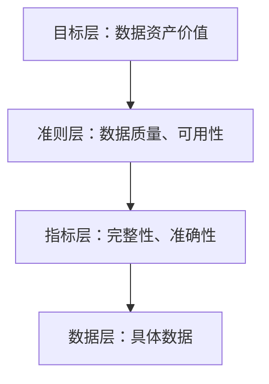
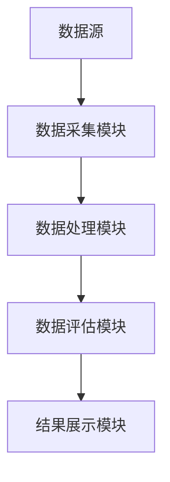

                 


# 如何评估企业的数据资产价值

## 关键词：数据资产，数据价值，价值评估，数据管理，企业资产

## 摘要： 
数据资产是企业在数字化转型中最为重要的资源之一。随着数据量的爆炸式增长，如何准确评估数据资产的价值成为企业面临的重要挑战。本文从数据资产的基本概念出发，详细探讨了数据资产价值评估的核心要素、方法论、系统架构设计以及实际案例。通过层次分析法（AHP）和数学模型的应用，帮助企业科学评估数据资产价值，优化数据管理策略。

---

# 第1章: 数据资产价值评估的背景与概念

## 1.1 数据资产的基本概念

### 1.1.1 数据资产的定义
数据资产是指企业拥有或控制的、能够为企业创造经济价值的数据资源。这些数据可以是结构化的（如数据库中的记录）或非结构化的（如文档、图像），它们通过分析和利用，能够支持企业的决策、优化运营或创新产品。

### 1.1.2 数据资产的分类与特征
数据资产可以分为以下几类：
1. **结构化数据**：如数据库中的表格数据。
2. **非结构化数据**：如文本文件、图像和视频。
3. **半结构化数据**：如JSON、XML格式的数据。

数据资产的特征包括：
- **完整性**：数据是否完整无缺。
- **准确性**：数据是否真实反映实际情况。
- **一致性**：数据是否符合既定标准。
- **及时性**：数据是否更新及时。

### 1.1.3 数据资产与企业价值的关系
数据资产是企业价值的重要组成部分，尤其是在数据驱动的决策中，高质量的数据资产能够显著提升企业的竞争力和盈利能力。

---

## 1.2 数据资产价值评估的重要性

### 1.2.1 数据资产对企业战略的意义
数据资产是企业制定战略决策的重要依据，能够帮助企业在市场中占据优势。

### 1.2.2 数据资产在数字化转型中的作用
在数字化转型中，数据资产是企业实现创新和优化的关键资源。

### 1.2.3 数据资产价值评估的挑战与机遇
评估数据资产价值的挑战包括数据复杂性和价值难以量化，而机遇则是通过科学评估提升数据资产的利用效率。

---

## 1.3 数据资产价值评估的边界与外延

### 1.3.1 数据资产的边界
数据资产的边界通常由企业的所有权和使用权决定。

### 1.3.2 数据资产外延的定义
数据资产的外延包括与数据相关的技术、工具和流程。

### 1.3.3 数据资产与相关概念的区别与联系
数据资产与信息资产的区别在于，信息资产包括数据和系统，而数据资产仅指数据本身。

---

## 1.4 数据资产价值评估的核心要素

### 1.4.1 数据质量
数据质量是影响数据资产价值的关键因素，包括完整性、准确性和一致性。

### 1.4.2 数据的可用性
数据的可用性取决于其是否能够被快速访问和处理。

### 1.4.3 数据的稀缺性
稀缺的数据资产通常具有更高的价值。

### 1.4.4 数据的经济价值
数据的经济价值可以通过其对业务的影响来衡量。

---

# 第2章: 数据资产价值评估的核心概念与联系

## 2.1 数据资产的属性特征

### 2.1.1 数据的完整性
完整性确保数据没有缺失或不一致。

### 2.1.2 数据的准确性
准确性确保数据反映真实情况。

### 2.1.3 数据的及时性
及时性确保数据是最新的。

### 2.1.4 数据的可访问性
可访问性确保数据能够被相关人员获取。

---

## 2.2 数据资产与相关概念的对比分析

### 2.2.1 数据资产与信息资产
| 概念 | 数据资产 | 信息资产 |
|------|----------|----------|
| 定义 | 数据本身 | 包括数据和技术 |

### 2.2.2 数据资产与数据隐私
数据资产关注数据的利用，而数据隐私关注数据的保护。

### 2.2.3 数据资产与数据安全
数据资产与数据安全相辅相成，确保数据在利用过程中安全可靠。

---

## 2.3 数据资产价值评估的ER实体关系图

```mermaid
er
    entity 数据资产 {
        id 数据资产ID
        string 名称
        string 类型
        decimal 价值
        date 创建时间
        date 更新时间
    }
    entity 数据评估维度 {
        id 维度ID
        string 维度名称
        decimal 权重
    }
    entity 数据资产评估结果 {
        id 评估结果ID
        foreign key 数据资产ID -> 数据资产
        foreign key 维度ID -> 数据评估维度
        decimal 评估分数
        date 评估时间
    }
```

---

## 2.4 数据资产价值评估的层次分析法（AHP）流程



---

## 2.5 层次分析法（AHP）的数学模型

### 2.5.1 构造比较矩阵
$$ A = \begin{bmatrix} 1 & 3 & 2 \\ 1/3 & 1 & 1 \end{bmatrix} $$

### 2.5.2 计算特征向量
$$ \text{特征向量} = \frac{A \cdot [1,1]^T}{[1,1]^T} $$

### 2.5.3 一致性检验
$$ \text{一致性比} = \frac{\lambda_{\text{max}}}{n} $$

---

## 2.6 数据资产价值评估的Python实现

```python
import numpy as np

# 定义比较矩阵
A = np.array([[1, 3, 2], [1/3, 1, 1]])

# 计算特征向量
eig_vals, eig_vecs = np.linalg.eig(A)

# 计算一致性检验
CI = (eig_vals.max() - 1) / (eig_vals.sum() - 1)
CR = CI / np.random一致性指标（RI）（需根据矩阵大小查表）

print("特征向量:", eig_vecs)
print("一致性比:", CI)
print("一致性检验结果:", CR < 0.1)
```

---

## 2.7 数据资产价值评估的系统架构设计

### 2.7.1 系统功能模块
- 数据采集模块
- 数据处理模块
- 数据评估模块
- 结果展示模块

### 2.7.2 系统架构图



---

## 2.8 数据资产价值评估的实际案例

### 2.8.1 项目背景
某电商企业希望通过评估客户购买行为数据资产的价值，优化营销策略。

### 2.8.2 项目实现
1. 数据采集：收集过去一年的交易数据。
2. 数据处理：清洗和转换数据。
3. 数据评估：使用层次分析法评估数据资产价值。
4. 结果分析：确定高价值客户群体。

---

## 2.9 数据资产价值评估的最佳实践

### 2.9.1 小结
数据资产价值评估需要综合考虑数据的质量、可用性和经济价值。

### 2.9.2 注意事项
- 确保数据的准确性和完整性。
- 结合企业实际需求选择评估方法。
- 定期更新和维护数据资产评估结果。

### 2.9.3 拓展阅读
- 《数据驱动的决策管理》
- 《企业数据治理实战》

---

通过以上详细分析，企业可以科学评估数据资产价值，优化数据管理策略，提升竞争力。

