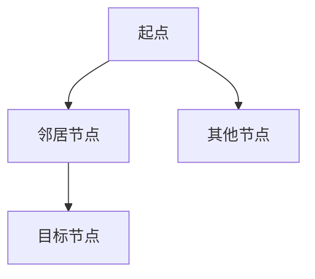

                 


# 如何评估企业的智能机器人技术

> 关键词：智能机器人、技术评估、系统架构、算法原理、企业应用、技术博客、深度分析

> 摘要：本文将从多个角度分析企业智能机器人技术，包括核心概念、算法原理、系统架构、项目实战和最佳实践。通过深入的技术解析和实际案例，帮助读者全面理解如何评估和优化企业智能机器人技术。

---

## 第1章：智能机器人技术的背景与概念

### 1.1 智能机器人的定义与特点
智能机器人是一种结合了人工智能技术的自动化设备，能够感知环境、执行任务并做出决策。其核心特点包括自主性、适应性、智能性和人机交互能力。

### 1.2 智能机器人技术的发展历程
智能机器人技术经历了从简单自动化到复杂人工智能的演变。当前，深度学习和计算机视觉技术的快速发展推动了智能机器人技术的成熟。

### 1.3 智能机器人技术的应用领域
智能机器人广泛应用于制造业、医疗、服务和物流等领域。在企业中，智能机器人能够提高效率、降低成本并提升产品质量。

---

## 第2章：智能机器人技术的核心概念与联系

### 2.1 智能机器人技术的核心原理
智能机器人通过感知系统获取环境信息，利用决策系统进行分析，并通过执行系统完成任务。

### 2.2 智能机器人技术的关键特征对比
以下是不同类型智能机器人的对比分析：

| 特性         | 自主移动机器人 | 工业机器人 | 服务机器人 |
|--------------|----------------|-------------|-------------|
| 主要功能     | 物品搬运        | 生产制造    | 人机交互    |
| 知识库       | 地图、路径      | 生产流程    | 服务流程    |
| 决策方式     | 路径规划        | 顺序执行    | 用户指令    |

### 2.3 智能机器人技术的ER实体关系图
以下是智能机器人技术的ER图：

```mermaid
er
actor(用户) --> Robot(智能机器人)
Robot --> Environment(环境)
Robot --> Task(任务)
Task --> Goal(目标)
```

---

## 第3章：智能机器人技术的算法原理

### 3.1 智能机器人路径规划算法
路径规划是智能机器人移动的关键技术。以下是几种常见的路径规划算法：

#### 3.1.1 A*算法
A*算法基于广度优先搜索，结合启发式评估函数进行路径规划：

$$\text{公式：} \text{估价函数} = \text{实际成本} + \text{估计成本}$$

流程图如下：



---

## 第4章：智能机器人技术的系统分析与架构设计

### 4.1 智能机器人系统的功能设计
智能机器人系统主要由感知模块、决策模块和执行模块组成。以下是系统架构图：


---

## 第5章：智能机器人技术的项目实战

### 5.1 仓储物流机器人的环境配置
以下是仓储物流机器人项目的环境配置：

```bash
# 安装依赖
pip install numpy
pip install matplotlib
pip install scikit-learn
```

### 5.2 核心代码实现
以下是路径规划的核心代码：

```python
import numpy as np

def a_star(start, goal):
    open_set = set([start])
    came_from = {}
    g_score = {start: 0}
    f_score = {start: heuristic(start, goal)}
    
    while open_set:
        current = pop_min(open_set)
        if current == goal:
            break
        for neighbor in neighbors(current):
            tentative_g_score = g_score[current] + cost(current, neighbor)
            if neighbor not in g_score or tentative_g_score < g_score[neighbor]:
                came_from[neighbor] = current
                g_score[neighbor] = tentative_g_score
                f_score[neighbor] = g_score[neighbor] + heuristic(neighbor, goal)
                if neighbor not in open_set:
                    open_set.add(neighbor)
    return came_from, g_score
```

---

## 第6章：最佳实践与小结

### 6.1 最佳实践 tips
1. 在选择智能机器人技术时，需考虑企业的实际需求和预算。
2. 确保团队具备相关技术能力，或寻求外部技术支持。
3. 定期更新和优化智能机器人系统，以应对环境变化。

### 6.2 小结
通过本文的分析，读者可以全面了解企业智能机器人技术的评估方法和实现路径。希望本文能为企业技术决策者提供有价值的参考。

---

以上是《如何评估企业的智能机器人技术》的完整目录大纲和文章内容。如果需要进一步的扩展或细节补充，请随时告知！

