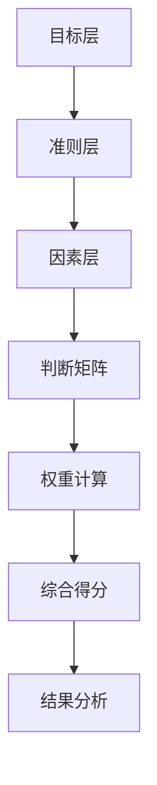
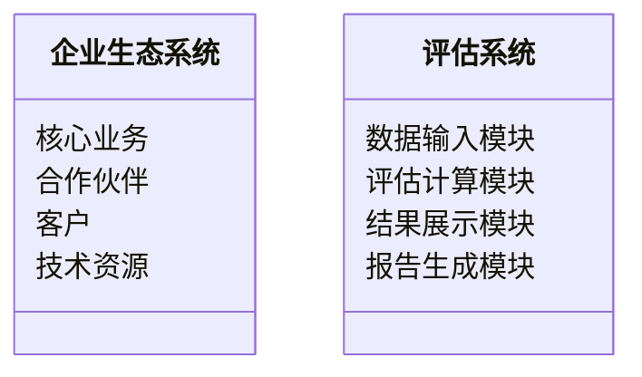
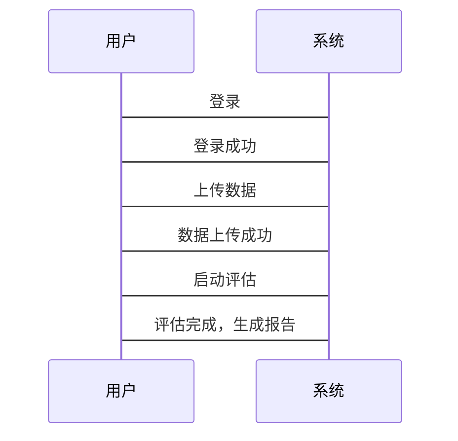

                 


# 如何评估企业的生态系统价值

## 关键词：企业生态系统、生态系统价值、层次分析法、系统架构设计、项目实战

## 摘要：本文系统地探讨了如何评估企业的生态系统价值，从核心概念、评估方法、系统架构到项目实战，详细分析了每个步骤的实现细节，帮助读者掌握评估企业生态系统价值的技巧。

---

## 第一部分：背景介绍

### 第1章：企业生态系统价值概述

#### 1.1 企业生态系统的基本概念

- **1.1.1 什么是企业生态系统**  
  企业生态系统是指由企业与其外部合作伙伴（如供应商、客户、技术资源等）共同构成的复杂系统。它不仅包括企业的核心业务，还包括与之相关的各种资源和关系。

- **1.1.2 企业生态系统的核心要素**  
  企业生态系统的核心要素包括：  
  - **核心业务**：企业的主营业务和核心产品。  
  - **合作伙伴**：与企业协同工作的供应商、代理商等。  
  - **客户**：企业的目标客户群体。  
  - **技术资源**：企业的技术资产和创新能力。  

- **1.1.3 企业生态系统与企业价值的关系**  
  企业生态系统的健康和活力直接影响企业的市场竞争力和长期价值。一个强大的生态系统能够为企业带来更多的协同效应和创新机会。

#### 1.2 企业生态系统价值评估的背景与问题

- **1.2.1 当前企业面临的挑战与机会**  
  在数字化转型的背景下，企业需要更高效地整合内外部资源，以应对快速变化的市场环境。

- **1.2.2 企业生态系统价值评估的重要性**  
  评估生态系统价值有助于企业识别优势和短板，优化资源配置，提升整体竞争力。

- **1.2.3 企业生态系统价值评估的难点与误区**  
  评估过程中可能面临数据不完整、权重设定主观等问题。常见的误区包括过于依赖单一指标和忽视动态变化。

#### 1.3 企业生态系统价值评估的目的与意义

- **1.3.1 评估企业生态系统价值的目的**  
  通过评估，帮助企业明确各部分的贡献，优化资源配置，提升整体价值。

- **1.3.2 企业生态系统价值评估的意义**  
  评估结果能够为企业战略决策提供数据支持，帮助企业在复杂市场中保持竞争优势。

- **1.3.3 企业生态系统价值评估的边界与外延**  
  评估的边界通常包括直接影响企业价值的核心要素，而外延则可能扩展到更广泛的市场环境。

---

## 第二部分：核心概念与联系

### 第2章：企业生态系统价值的核心要素

#### 2.1 企业生态系统的核心概念

- **2.1.1 企业核心业务的价值评估**  
  核心业务是企业价值的主要来源，需要通过市场表现、利润率等指标进行评估。

- **2.1.2 企业合作伙伴的价值评估**  
  合作伙伴的价值不仅体现在经济利益上，还包括战略协同效应。

- **2.1.3 企业客户的价值评估**  
  客户的价值可以通过客户生命周期价值（CLV）等指标进行衡量。

- **2.1.4 企业技术资源的价值评估**  
  技术资源的价值体现在创新能力和技术壁垒上，可以通过专利数量、技术领先性等指标评估。

#### 2.2 企业生态系统价值的核心要素对比

- **2.2.1 核心业务与合作伙伴的价值对比**  
  核心业务通常是企业收入的主要来源，而合作伙伴的价值更多体现在协同效应上。

- **2.2.2 客户与技术资源的价值对比**  
  客户价值侧重于当前的收入贡献，而技术资源价值则关注未来的创新能力。

- **2.2.3 不同核心要素的权重分析**  
  根据企业战略和所处行业，各要素的权重可能不同。例如，技术驱动型行业可能更重视技术资源的价值。

#### 2.3 企业生态系统价值的ER实体关系图

```mermaid
er
    企业生态系统
    ----> 核心业务
    ----> 合作伙伴
    ----> 客户
    ----> 技术资源
```

---

## 第三部分：算法原理讲解

### 第3章：企业生态系统价值评估的算法

#### 3.1 层次分析法（AHP）的应用

- **3.1.1 确定目标和层次结构**  
  目标是评估企业生态系统价值，层次结构包括目标层、准则层和因素层。

- **3.1.2 构建判断矩阵**  
  根据专家意见或数据，构建准则层和因素层的判断矩阵。

- **3.1.3 计算权重**  
  通过计算判断矩阵的最大特征值和特征向量，得到各因素的权重。

- **3.1.4 计算综合得分**  
  根据各因素的权重和实际表现，计算综合得分。

#### 3.2 层次分析法的数学模型

- **3.2.1 判断矩阵的构造**  
  判断矩阵$A = [a_{ij}]$，其中$a_{ij}$表示因素$i$相对于因素$j$的重要性。

- **3.2.2 权重计算**  
  通过特征向量法计算权重$w_i$，并进行一致性检验。

- **3.2.3 综合得分计算**  
  综合得分$S_i = \sum_{j=1}^{n} w_j \times x_{ij}$，其中$x_{ij}$是因素$j$的表现值。

#### 3.3 算法实现

```python
import numpy as np

def calculate_weights(matrix):
    # 计算判断矩阵的最大特征值及其对应的特征向量
    eigenvalues, eigenvectors = np.linalg.eig(matrix)
    max_eigen = eigenvalues.max()
    max_eigenvector = eigenvectors[:, np.argmax(eigenvalues)]
    return max_eigenvector / max_eigenvector.sum()

# 示例判断矩阵
matrix = np.array([
    [1, 3, 2, 4],
    [1/3, 1, 2, 3],
    [1/2, 1/2, 1, 2],
    [1/4, 1/3, 1/2, 1]
])

weights = calculate_weights(matrix)
print("权重:", weights)
```

#### 3.4 算法流程图



---

## 第四部分：系统分析与架构设计方案

### 第4章：企业生态系统价值评估系统

#### 4.1 问题场景介绍

- **4.1.1 问题场景**  
  企业需要通过系统化的方法评估其生态系统价值，以优化资源配置和提升竞争力。

- **4.1.2 项目介绍**  
  开发一个基于层次分析法的企业生态系统价值评估系统，帮助企业在复杂环境中快速评估和优化生态系统。

#### 4.2 系统功能设计

- **4.2.1 领域模型类图**



- **4.2.2 系统架构设计**


- **4.2.3 系统接口设计**



---

## 第五部分：项目实战

### 第5章：企业生态系统价值评估实战

#### 5.1 环境安装与配置

- **5.1.1 环境要求**  
  - Python 3.8+
  - NumPy库

#### 5.2 核心代码实现

```python
import numpy as np

def calculate_weights(matrix):
    eigenvalues, eigenvectors = np.linalg.eig(matrix)
    max_eigen = eigenvalues.max()
    max_eigenvector = eigenvectors[:, np.argmax(eigenvalues)]
    return max_eigenvector / max_eigenvector.sum()

def main():
    # 示例判断矩阵
    matrix = np.array([
        [1, 3, 2, 4],
        [1/3, 1, 2, 3],
        [1/2, 1/2, 1, 2],
        [1/4, 1/3, 1/2, 1]
    ])
    weights = calculate_weights(matrix)
    print("权重:", weights)

if __name__ == "__main__":
    main()
```

#### 5.3 实际案例分析

- **案例选择**：假设我们选择一家科技公司作为案例，评估其核心业务、合作伙伴、客户和技术资源的价值。

- **案例分析**：通过层次分析法，计算各部分的权重和综合得分，识别出合作伙伴的价值相对较低，需要优化。

#### 5.4 项目小结

- 通过项目实战，验证了层次分析法的有效性，同时也发现了一些实施中的问题，如数据获取的难度和权重设定的主观性。

---

## 第六部分：最佳实践与小结

### 第6章：最佳实践与小结

#### 6.1 最佳实践

- **明确评估目标**：确保评估的目的是为了优化资源配置和提升竞争力。
- **选择合适的评估方法**：根据企业特点选择层次分析法或其他方法。
- **持续监控与优化**：生态系统是一个动态系统，需要定期评估和优化。

#### 6.2 小结

- 本文详细探讨了如何评估企业的生态系统价值，从理论到实践，系统地分析了每个步骤的实现细节。
- 通过层次分析法和系统架构设计，帮助企业在复杂环境中优化资源配置，提升整体竞争力。

#### 6.3 展望

- 随着人工智能和大数据技术的发展，企业生态系统价值评估将更加智能化和数据驱动，为企业提供更精准的决策支持。

---

通过以上步骤，您可以系统地评估企业的生态系统价值，优化资源配置，提升整体竞争力。

