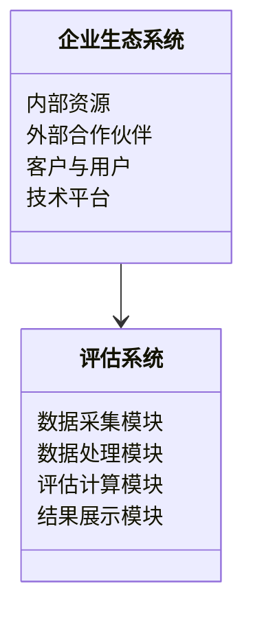

                 


# 如何评估企业的生态系统价值

> 关键词：企业生态系统价值、生态系统评估、企业价值、系统论、网络理论

> 摘要：企业生态系统价值是现代企业评估的重要维度，涵盖了企业内部资源、外部合作伙伴、客户、技术平台等多方面因素。本文从系统论和网络理论的视角，详细分析企业生态系统价值的构成要素及其相互关系，提出基于层次分析法（AHP）和网络分析的评估模型，并通过实际案例展示如何在数字化时代下评估企业的生态系统价值。

---

# 第一部分: 企业生态系统价值评估基础

## 第1章: 企业生态系统概述

### 1.1 企业生态系统的核心概念

#### 1.1.1 企业生态系统的定义
企业生态系统是指由企业内部资源、外部合作伙伴、客户、技术平台等多方面构成的复杂系统，其核心在于各要素之间的互动与协同。

#### 1.1.2 企业生态系统的核心要素
企业生态系统由以下核心要素组成：
- **内部资源**：包括企业的人力资源、财务资源、技术资源等。
- **外部合作伙伴**：包括供应商、客户、合作伙伴等。
- **技术平台**：企业的技术基础设施，如云平台、数据平台等。
- **客户与用户**：直接或间接使用企业产品或服务的用户群体。
- **行业环境**：包括行业政策、市场趋势、竞争环境等。

#### 1.1.3 企业生态系统与传统企业价值评估的区别
传统的企业价值评估主要关注财务指标（如收入、利润、资产等），而企业生态系统价值评估更关注系统内部各要素的互动关系和协同效应。

---

### 1.2 企业生态系统价值的重要性

#### 1.2.1 企业生态系统价值的内涵
企业生态系统价值是指企业在其生态系统中各要素协同作用下所能创造的整体价值，包括直接的经济价值和间接的网络价值。

#### 1.2.2 企业生态系统价值对企业战略的意义
- 优化资源配置，提升效率。
- 建立战略合作伙伴关系，增强竞争力。
- 提高企业的抗风险能力。

#### 1.2.3 企业生态系统价值对利益相关者的影响
- **股东**：获得更高的投资回报。
- **合作伙伴**：通过协同效应实现共赢。
- **客户**：获得更好的产品和服务体验。

---

### 1.3 企业生态系统价值的评估背景

#### 1.3.1 传统企业价值评估的局限性
传统评估方法仅关注财务指标，忽略了企业生态系统中的协同效应和网络价值。

#### 1.3.2 现代企业生态系统评估的必要性
随着企业数字化转型的推进，企业生态系统中的技术平台和合作伙伴网络变得越来越重要，需要专门的评估方法。

#### 1.3.3 数字化时代对企业生态系统价值的影响
数字化技术（如大数据、人工智能）的应用，使得企业生态系统中的数据驱动型协同效应更加显著。

---

## 第2章: 企业生态系统价值的核心要素

### 2.1 企业内部资源与能力

#### 2.1.1 核心业务能力
- 核心技术能力。
- 核心服务能力。

#### 2.1.2 组织结构与文化
- 组织架构的灵活性。
- 企业文化对生态系统的影响。

#### 2.1.3 技术与数据资产
- 核心技术平台。
- 数据资产的价值。

---

### 2.2 企业外部合作伙伴

#### 2.2.1 供应商与合作伙伴关系
- 供应商的稳定性。
- 合作伙伴的创新能力。

#### 2.2.2 客户与用户群体
- 客户的需求多样性。
- 用户群体的规模与质量。

#### 2.2.3 行业生态与竞争环境
- 行业政策的合规性。
- 竞争环境的分析。

---

### 2.3 企业生态系统中的利益相关者

#### 2.3.1 股东与投资者
- 投资者的期望。
- 股东的回报需求。

#### 2.3.2 员工与管理层
- 员工的工作积极性。
- 管理层的战略决策。

#### 2.3.3 客户与合作伙伴
- 客户满意度。
- 合作伙伴的忠诚度。

---

## 第3章: 企业生态系统价值的理论框架

### 3.1 系统论视角下的企业生态系统

#### 3.1.1 系统论的基本概念
- 系统论的核心思想：整体大于部分之和。
- 企业生态系统是一个开放的复杂系统。

#### 3.1.2 企业生态系统作为复杂系统的特征
- 多层次性。
- 多维度性。
- 动态性。

#### 3.1.3 系统论对企业生态系统价值评估的启示
- 强调整体性思维。
- 关注系统内部各要素的协同关系。

---

### 3.2 网络理论视角下的企业生态系统

#### 3.2.1 网络理论的基本概念
- 网络理论的核心思想：节点之间的连接创造了价值。
- 企业生态系统中的网络结构。

#### 3.2.2 企业生态系统中的网络结构
- 节点：企业内部资源、外部合作伙伴、客户。
- 边：互动关系。

#### 3.2.3 网络理论对企业生态系统价值评估的应用
- 网络的中心性分析。
- 网络的密度分析。

---

## 第4章: 企业生态系统价值的评估方法

### 4.1 层次分析法（AHP）在生态系统价值评估中的应用

#### 4.1.1 AHP的基本原理
- 将复杂问题分解为多个层次，通过比较判断矩阵确定各因素的权重。

#### 4.1.2 AHP的步骤
1. 确定目标层（企业生态系统价值）。
2. 设计判断矩阵。
3. 计算各因素的权重。
4. 进行一致性检验。

#### 4.1.3 AHP的数学模型
$$ AHP权重计算公式：$$
$$ w_i = \frac{a_{i1} + a_{i2} + \dots + a_{in}}{\sum_{j=1}^n a_{ij}}} $$

---

### 4.2 网络分析法在生态系统价值评估中的应用

#### 4.2.1 网络分析法的基本原理
- 将企业生态系统视为一个网络，通过分析节点的中心性来评估其价值。

#### 4.2.2 网络分析法的步骤
1. 构建企业生态系统网络图。
2. 计算各节点的中心性指标。
3. 根据中心性指标确定各节点的价值贡献。

#### 4.2.3 网络分析法的数学模型
$$ 网络中心性计算公式：$$
$$ C(i) = \frac{\sum_{j=1}^n a_{ij}}{\sum_{i=1}^n \sum_{j=1}^n a_{ij}}} $$

---

### 4.3 综合评估模型

#### 4.3.1 综合评估模型的设计
- 结合层次分析法和网络分析法，构建多维度的评估模型。

#### 4.3.2 综合评估模型的应用
- 确定各因素的权重。
- 计算各节点的中心性指标。
- 综合评估企业生态系统价值。

---

## 第5章: 企业生态系统价值评估的系统架构设计

### 5.1 系统功能设计

#### 5.1.1 领域模型


---

### 5.2 系统架构设计

#### 5.2.1 系统架构图
```mermaid
container 企业生态系统 {
    component 内部资源
    component 外部合作伙伴
    component 客户与用户
    component 技术平台
}
container 评估系统 {
    component 数据采集模块
    component 数据处理模块
    component 评估计算模块
    component 结果展示模块
}
```

---

## 第6章: 项目实战

### 6.1 项目背景与目标

#### 6.1.1 项目背景
选择一个具体企业（如科技公司）作为案例，分析其生态系统价值。

#### 6.1.2 项目目标
- 收集企业生态系统数据。
- 构建评估模型。
- 计算并展示评估结果。

---

### 6.2 环境安装与数据采集

#### 6.2.1 环境安装
- 安装Python和相关库（如networkx、numpy、scipy）。
- 安装Mermaid和LaTeX工具。

#### 6.2.2 数据采集
- 数据来源：企业内部数据、公开数据、合作伙伴数据。

---

### 6.3 核心实现源代码

#### 6.3.1 层次分析法实现
```python
import numpy as np

def calculate_weights(matrix):
    # 计算判断矩阵的归一化权重
    n = len(matrix)
    weights = []
    for i in range(n):
        sum_row = np.sum(matrix[i])
        weight = [matrix[i][j] / sum_row for j in range(n)]
        weights.append(weight)
    return weights

# 示例判断矩阵
matrix = np.array([[1, 2, 3],
                   [1/2, 1, 4],
                   [1/3, 1/4, 1]])

weights = calculate_weights(matrix)
print(weights)
```

---

### 6.4 网络分析法实现

#### 6.4.1 网络中心性计算
```python
import networkx as nx

G = nx.DiGraph()
G.add_nodes_from(["A", "B", "C", "D"])
G.add_edges_from([("A", "B"), ("B", "C"), ("C", "D"), ("D", "A")])

# 计算中心性
betweenness = nx.betweenness_centrality(G)
print(betweenness)
```

---

## 第7章: 最佳实践与总结

### 7.1 最佳实践

#### 7.1.1 数据准确性
- 确保数据来源的可靠性和准确性。

#### 7.1.2 模型适用性
- 根据实际情况选择合适的评估模型。

#### 7.1.3 持续优化
- 定期更新数据和模型，确保评估结果的有效性。

---

### 7.2 小结

通过本文的详细讲解，我们了解了企业生态系统价值的构成要素、理论框架和评估方法，并通过实际案例展示了如何在数字化时代下评估企业的生态系统价值。企业生态系统价值评估是一项复杂但重要的任务，需要综合运用系统论、网络理论和数学模型等多方面的知识。

---

### 7.3 注意事项

- 在评估过程中，要注意数据的完整性和相关性。
- 要确保模型的可解释性和实用性。
- 要结合企业的实际情况，灵活调整评估方法。

---

### 7.4 拓展阅读

- 《系统论与企业战略管理》
- 《网络理论与组织行为学》
- 《层次分析法在企业管理中的应用》

---

### 7.5 思考与实践

通过本文的学习，您是否能够：
1. 理解企业生态系统价值的核心概念？
2. 掌握层次分析法和网络分析法的应用？
3. 在实际项目中应用这些方法进行企业生态系统价值评估？

希望本文能为您提供有价值的参考，帮助您更好地理解和应用企业生态系统价值评估的方法。

---

通过以上结构，您可以逐步完成一篇详细的《如何评估企业的生态系统价值》的技术博客文章。

