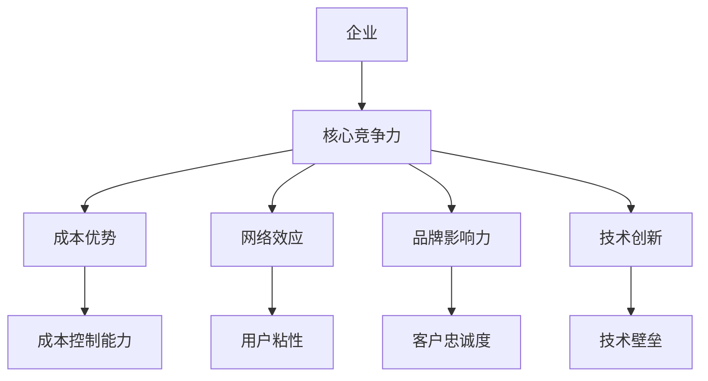
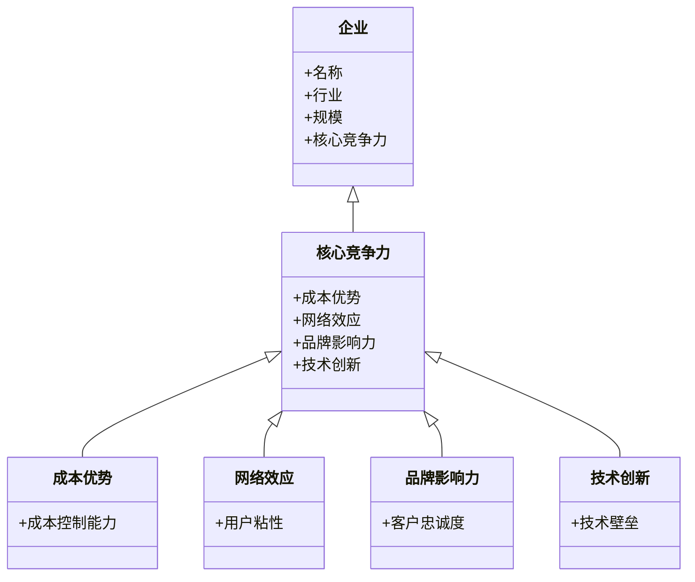

                 


# 如何评估企业的经济护城河

---

## 关键词：
经济护城河、企业评估、竞争优势、可持续发展、投资决策

---

## 摘要：
经济护城河是企业在市场竞争中建立的核心竞争优势，能够为企业创造持续的经济价值。本文将从经济护城河的定义、核心要素、评估方法等多个维度进行深入分析，结合实际案例和系统架构，探讨如何有效评估企业的经济护城河，为企业制定战略和投资决策提供科学依据。

---

# 第1章: 企业经济护城河的定义与重要性

## 1.1 经济护城河的定义
经济护城河是指企业在市场竞争中建立的长期竞争优势，这种优势使得企业在面对竞争对手时能够保持领先地位，并在经济环境变化时依然能够保持稳健发展。经济护城河的核心在于企业通过独特的资源、技术、品牌和网络效应等手段，形成难以被竞争对手复制的核心竞争力。

## 1.2 经济护城河的重要性
经济护城河的重要性主要体现在以下几个方面：
1. **竞争优势的来源**：经济护城河是企业在市场中获得超额收益的关键因素，能够帮助企业在激烈的竞争中占据优势。
2. **企业可持续发展**：拥有强大经济护城河的企业能够在经济波动中保持稳定，并通过持续创新实现长期发展。
3. **投资决策的依据**：投资者通过分析企业的经济护城河，能够更好地评估企业的长期价值和投资潜力。

## 1.3 经济护城河的分类与特征
经济护城河可以根据其来源和特征分为以下几种类型：
1. **成本优势型**：企业通过规模效应、技术优化等手段降低生产成本，形成成本优势。
2. **网络效应型**：企业通过用户的相互依赖和数据积累，形成网络效应，提高用户的转换成本。
3. **品牌忠诚型**：企业通过长期的品牌建设，形成强大的品牌忠诚度，吸引稳定的客户群体。
4. **技术壁垒型**：企业通过专利、技术诀窍等手段，形成技术壁垒，防止竞争对手的模仿。

---

# 第2章: 经济护城河的核心要素与结构

## 2.1 经济护城河的核心要素
经济护城河的核心要素包括以下几个方面：
1. **成本优势**：企业能够以更低的成本生产产品或提供服务，从而在价格上具有竞争力。
2. **网络效应**：用户的增加会增强产品的价值，形成正反馈效应，提高用户的转换成本。
3. **品牌影响力**：强大的品牌能够吸引更多的客户，并提高客户的忠诚度。
4. **技术创新**：通过持续的技术创新，企业能够不断推出新产品或改进现有产品，保持竞争优势。

## 2.2 经济护城河的结构与层次
经济护城河的结构可以分为以下几个层次：
1. **核心竞争力**：企业内部的核心能力和资源，如技术创新能力、管理能力等。
2. **外部资源整合**：企业通过与供应商、合作伙伴等外部资源的协同，形成更强大的竞争优势。
3. **内部能力强化**：通过优化内部管理、提高员工素质等方式，进一步增强企业的核心竞争力。

## 2.3 经济护城河的属性特征对比
以下是不同类型经济护城河的对比表格：

| 类型         | 成本优势 | 网络效应 | 品牌忠诚 | 技术创新 |
|--------------|----------|----------|----------|----------|
| **特征**     | 成本低，规模化生产 | 用户数量越多，价值越高 | 品牌知名度高，客户忠诚度高 | 技术领先，难以复制 |
| **动态变化** | 稳定，依赖规模效应 | 需要持续用户增长 | 品牌形象需要长期维护 | 技术更新迭代快 |

## 2.4 经济护城河的ER实体关系图
以下是经济护城河的ER实体关系图：



---

# 第3章: 经济护城河的评估方法与数学模型

## 3.1 经济护城河的定性评估方法
### 3.1.1 基于波特五力模型的分析
波特五力模型包括：
1. **潜在进入者的威胁**：行业的进入壁垒高低。
2. **替代品的威胁**：替代品的可替代程度。
3. **供应商的议价能力**：供应商的集中度和替代性。
4. **客户的议价能力**：客户的集中度和购买量。
5. **行业内的竞争程度**：行业内竞争的激烈程度。

### 3.1.2 基于价值链分析的评估
价值链分析帮助企业识别其在各个价值环节中的优势和劣势，从而优化资源配置。

### 3.1.3 基于SWOT分析的评估
SWOT分析包括：
1. **优势（Strengths）**：企业的内部优势。
2. **劣势（Weaknesses）**：企业的内部劣势。
3. **机会（Opportunities）**：外部的机会。
4. **威胁（Threats）**：外部的威胁。

## 3.2 经济护城河的定量评估方法
### 3.2.1 基于财务指标的评估
常用的财务指标包括：
1. **净利率**：衡量企业的盈利能力。
2. **资产回报率**：衡量企业资产的使用效率。
3. **市场份额**：衡量企业在市场中的地位。

### 3.2.2 基于市场份额的评估
通过分析企业在市场中的份额变化，评估其经济护城河的强弱。

### 3.2.3 基于边际成本的评估
边际成本是指每增加一单位产品或服务所增加的成本，边际成本越低，企业的护城河越强。

## 3.3 经济护城河的综合评估模型
### 3.3.1 层次分析法（AHP）的应用
层次分析法是一种常用的决策分析方法，适用于多指标综合评价。

#### 步骤：
1. **构建层次模型**：将问题分解为多个层次，包括目标层、准则层和方案层。
2. **构建判断矩阵**：根据专家意见，构建各层次的判断矩阵。
3. **计算权重**：通过计算判断矩阵的最大特征值和特征向量，得到各准则的权重。
4. **综合评价**：根据各准则的权重，对方案进行综合评价。

#### 数学模型：
$$ AHP权重计算模型 $$

### 3.3.2 综合评分模型的构建
综合评分模型通过将多个指标进行加权评分，得出企业的经济护城河综合评分。

#### 数学模型：
$$ \text{综合评分} = \sum (\text{指标权重} \times \text{指标评分}) $$

---

# 第4章: 经济护城河的系统分析与架构设计

## 4.1 系统功能设计
### 4.1.1 领域模型（Mermaid类图）


---

# 第5章: 经济护城河的项目实战

## 5.1 项目背景
以某电商平台为例，评估其经济护城河。

## 5.2 环境安装
安装必要的工具和库，如Python、Pandas、Matplotlib等。

## 5.3 系统核心实现
以下是Python代码实现经济护城河的评估：

```python
import pandas as pd
import numpy as np
from sklearn.preprocessing import MinMaxScaler

# 定义评估指标
def calculate Economic_Moat(company_data):
    # 成本优势
    cost_advantage = company_data['成本优势']
    # 网络效应
    network_effects = company_data['网络效应']
    # 品牌忠诚度
    brand_loyalty = company_data['品牌忠诚度']
    # 技术创新
    technologicalnovation = company_data['技术创新']

    # 综合评分
    scores = [cost_advantage, network_effects, brand_loyalty, technologicalnovation]
    max_score = max(scores)
    min_score = min(scores)

    # 标准化评分
    normalized_scores = (scores - min_score) / (max_score - min_score)
    # 综合评分
    overall_score = np.mean(normalized_scores)
    return overall_score

# 示例数据
data = {
    '成本优势': [0.8, 0.7, 0.9],
    '网络效应': [0.6, 0.8, 0.7],
    '品牌忠诚度': [0.9, 0.5, 0.8],
    '技术创新': [0.7, 0.6, 0.8]
}
df = pd.DataFrame(data)

# 计算经济护城河评分
result = calculate Economic_Moat(df)
print(f"经济护城河综合评分: {result}")
```

## 5.4 案例分析
以某电商平台为例，分析其经济护城河的具体表现，包括成本优势、网络效应、品牌忠诚度和技术创新等方面。

## 5.5 项目小结
通过项目实战，验证了经济护城河评估方法的有效性，并为企业的经济护城河建设提供了实践指导。

---

# 第6章: 经济护城河评估的最佳实践

## 6.1 小结
本文从理论和实践两个方面，详细探讨了企业经济护城河的评估方法，为企业制定战略和投资决策提供了重要参考。

## 6.2 注意事项
1. **数据准确性**：评估结果依赖于数据的准确性和完整性。
2. **方法选择**：根据企业的实际情况选择合适的评估方法。
3. **动态调整**：经济护城河是一个动态变化的过程，需要持续关注和调整。

## 6.3 拓展阅读
推荐阅读《竞争优势》（迈克尔·波特著）、《商业模式创新》（埃里森·格鲁夫著）等书籍，深入了解经济护城河的构建和优化。

---

# 第7章: 总结

经济护城河是企业在市场竞争中建立核心竞争优势的关键要素。通过本文的分析，读者可以全面了解经济护城河的定义、核心要素、评估方法以及实际应用。未来，随着技术的进步和市场的变化，经济护城河的构建和评估也将不断进化，为企业创造更大的价值。

--- 

希望这篇文章能够为企业评估经济护城河提供清晰的思路和实用的方法。

