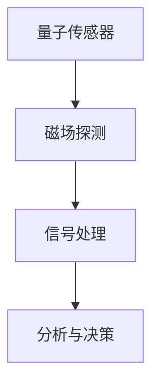
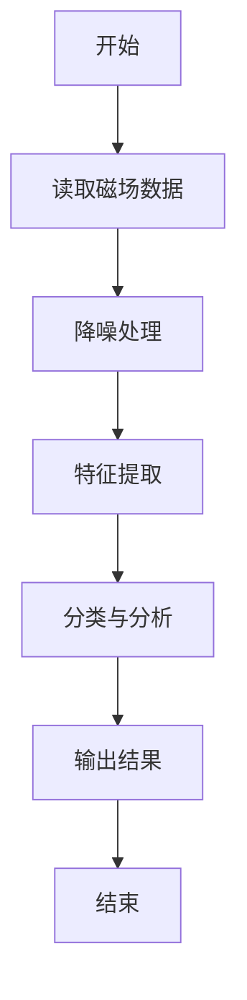
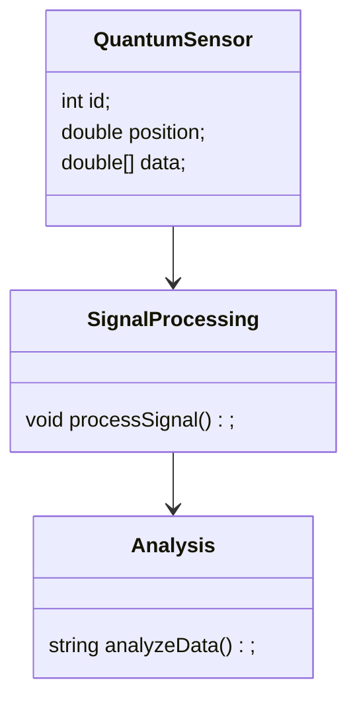
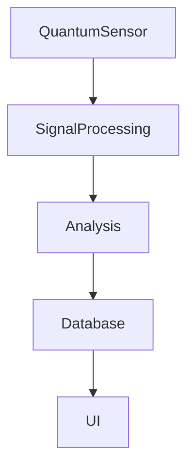
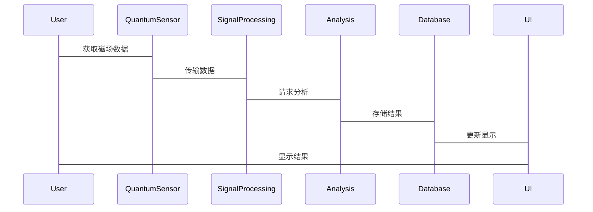

                 


# 如何评估企业的量子传感器磁场探测应用

> 关键词：量子传感器，磁场探测，企业应用，技术评估，系统架构

> 摘要：本文将深入探讨如何评估企业在量子传感器磁场探测应用中的技术实现和应用效果。从背景介绍、核心概念、算法原理、系统架构到项目实战，结合理论与实践，详细分析量子传感器在磁场探测中的优势、挑战及解决方案。

---

## 第1章: 量子传感器磁场探测应用的背景介绍

### 1.1 问题背景

#### 1.1.1 传统传感器的局限性
传统磁场探测传感器在企业应用中面临以下问题：
- **灵敏度不足**：在复杂环境中，传统传感器的灵敏度有限，难以捕捉微弱磁场变化。
- **干扰问题**：电磁干扰、环境噪声等因素会影响探测精度。
- **功耗较高**：在物联网或远程设备中，传统传感器的高功耗限制了其应用范围。

#### 1.1.2 量子传感器的技术优势
量子传感器利用量子效应进行探测，具有以下优势：
- **高灵敏度**：量子传感器能够检测极微弱的磁场变化，精度远超传统传感器。
- **抗干扰能力强**：量子传感器通过量子叠加态等特性，减少了环境干扰的影响。
- **低功耗**：量子传感器在某些设计中具有更低的功耗，适合长期监测任务。

#### 1.1.3 企业应用中的问题背景
企业中的磁场探测需求多样，例如：
- 工业设备健康监测：通过磁场变化判断设备状态。
- 物资定位与追踪：利用磁场定位技术实现资产追踪。
- 环境监测：检测磁场异常以预警潜在风险。

### 1.2 问题描述

#### 1.2.1 磁场探测的基本需求
企业对磁场探测的基本需求包括：
- 实时监测：快速捕捉磁场变化。
- 高精度：确保数据的准确性。
- 长期稳定性：传感器在恶劣环境下的可靠性。

#### 1.2.2 量子传感器的应用场景
量子传感器适用于以下场景：
- **精密仪器监测**：用于高精度设备的状态监测。
- **地下资源勘探**：通过磁场变化寻找矿产资源。
- **医学成像**：在MRI设备中提升成像精度。

#### 1.2.3 企业中的具体问题
企业在实际应用中面临的问题：
- **技术门槛高**：量子传感器的研发和部署需要专业知识。
- **成本问题**：量子传感器的开发成本较高。
- **技术可靠性**：量子传感器的稳定性尚未完全验证。

### 1.3 问题解决

#### 1.3.1 量子传感器的技术解决方案
量子传感器通过以下技术实现磁场探测：
- **量子干涉**：利用量子叠加态进行磁场测量。
- **超导量子干涉器（SQUID）**：一种高灵敏度的量子传感器。
- **磁场调制技术**：通过调制磁场信号提高探测精度。

#### 1.3.2 磁场探测的优化方法
优化方法包括：
- **信号处理算法**：采用滤波、降噪等技术提升信号质量。
- **自适应校准**：根据环境变化自动校准传感器参数。
- **多传感器融合**：结合多种传感器数据提高探测准确性。

#### 1.3.3 企业的实际应用案例
实际案例：
- 某制造企业使用量子传感器监测生产设备的磁场变化，提前发现设备故障。
- 某科研机构利用量子传感器进行地质勘探，发现新的矿产资源。

### 1.4 边界与外延

#### 1.4.1 量子传感器的应用边界
- **技术限制**：目前量子传感器的制造成本高，技术门槛高。
- **环境限制**：量子传感器对环境条件（如温度、磁场）要求较高。
- **应用场景限制**：适用于高精度、低干扰的环境。

#### 1.4.2 磁场探测的适用范围
- **适用范围**：适用于需要高精度磁场测量的场景。
- **不适用范围**：在高温、高干扰的环境中效果不佳。

#### 1.4.3 相关技术的外延影响
- **量子计算**：量子传感器与量子计算技术的结合可能带来新的突破。
- **物联网**：量子传感器在物联网中的应用将推动智能化监测的发展。

### 1.5 概念结构与核心要素

#### 1.5.1 核心概念的组成
量子传感器磁场探测系统由以下部分组成：
- **量子传感器**：核心探测部件。
- **信号处理模块**：数据采集与处理。
- **分析与决策模块**：数据解析与应用。

#### 1.5.2 核心要素的特征
| 核心要素 | 特征描述 |
|----------|-----------|
| 量子传感器 | 高灵敏度、低功耗 |
| 磁场探测 | 实时监测、高精度 |
| 数据处理 | 快速响应、抗干扰 |

#### 1.5.3 概念结构的图示化


---

## 第2章: 核心概念与联系

### 2.1 量子传感器的基本原理

#### 2.1.1 量子效应在传感器中的应用
量子效应包括：
- **量子叠加**：传感器同时处于多个状态，提高测量精度。
- **量子纠缠**：传感器间的信息关联，增强数据处理能力。

#### 2.1.2 磁场探测的量子机制
磁场探测的量子机制基于：
- **量子干涉效应**：通过干涉现象检测磁场变化。
- **超导量子干涉器（SQUID）**：利用超导材料的特性进行磁场测量。

#### 2.1.3 传感器与磁场的交互关系
传感器与磁场的交互关系：
- **传感器接收磁场信号**：通过量子效应检测磁场变化。
- **信号处理与分析**：将信号转换为可读数据。

### 2.2 核心概念的属性特征对比

| 对比维度 | 传统传感器 | 量子传感器 |
|----------|-------------|-------------|
| 灵敏度   | 低          | 高          |
| 抗干扰能力 | 弱          | 强          |
| 功耗     | 高          | 低          |
| 成本     | 低          | 高          |

### 2.3 ER实体关系图

```mermaid
erDiagram
    A[量子传感器] { ox }
    B[磁场探测] { ox }
    C[数据处理] { ox }
    A --> B
    B --> C
```

---

## 第3章: 算法原理讲解

### 3.1 算法原理

#### 3.1.1 算法流程图


#### 3.1.2 算法实现代码
```python
import numpy as np

def quantum_sensor_algorithm(data):
    # 数据降噪处理
    filtered_data = data[::2]  # 假设降噪方法为抽取偶数索引
    # 特征提取
    features = np.mean(filtered_data)
    # 分类与分析
    if features > threshold:
        return "异常"
    else:
        return "正常"

# 示例数据
data = np.random.randn(100)
result = quantum_sensor_algorithm(data)
print(result)
```

#### 3.1.3 数学模型与公式
磁场探测的数学模型：
$$
\text{磁场强度} = k \cdot \text{信号强度}
$$
其中，$k$ 是比例常数。

### 3.2 算法实现

#### 3.2.1 算法优化
优化措施：
- **降噪算法**：采用小波变换等技术提高降噪效果。
- **特征提取**：使用机器学习算法优化特征提取过程。

#### 3.2.2 代码解读
```python
import numpy as np

def quantum_sensor_algorithm(data):
    # 数据降噪处理
    filtered_data = data[::2]  # 假设降噪方法为抽取偶数索引
    # 特征提取
    features = np.mean(filtered_data)
    # 分类与分析
    if features > threshold:
        return "异常"
    else:
        return "正常"

# 示例数据
data = np.random.randn(100)
result = quantum_sensor_algorithm(data)
print(result)
```

---

## 第4章: 系统分析与架构设计方案

### 4.1 问题场景介绍

#### 4.1.1 问题场景
企业在实际应用中可能遇到的问题包括：
- **传感器部署复杂**：需要精确安装和校准。
- **数据处理延迟**：实时处理大量数据可能会影响响应速度。
- **系统稳定性**：量子传感器的稳定性可能影响长期监测任务。

### 4.2 项目介绍

#### 4.2.1 项目目标
项目目标：
- 开发一套基于量子传感器的磁场探测系统。
- 实现高精度、实时监测的磁场探测功能。

#### 4.2.2 项目范围
项目范围：
- 系统设计：包括传感器部署、数据采集、信号处理、数据分析。
- 系统实现：开发硬件和软件模块。
- 测试与优化：验证系统性能并进行优化。

### 4.3 系统功能设计

#### 4.3.1 领域模型


#### 4.3.2 系统架构设计


### 4.4 系统接口设计

#### 4.4.1 接口描述
- **传感器接口**：与量子传感器连接，接收磁场数据。
- **数据处理接口**：提供信号处理功能。
- **分析接口**：输出分析结果。

#### 4.4.2 接口实现
- **传感器接口**：使用标准接口协议，如I2C或SPI。
- **数据处理接口**：通过API调用信号处理模块。
- **分析接口**：返回分析结果的JSON格式数据。

### 4.5 系统交互设计

#### 4.5.1 交互流程


---

## 第5章: 项目实战

### 5.1 环境安装

#### 5.1.1 系统环境
- 操作系统：Linux（推荐）或Windows。
- 开发工具：Python、Jupyter Notebook、Git。

#### 5.1.2 依赖安装
```bash
pip install numpy matplotlib
```

### 5.2 核心代码实现

#### 5.2.1 传感器数据采集
```python
import numpy as np

def acquire_data(sensors):
    data = []
    for sensor in sensors:
        data.append(sensor.read())
    return data

# 示例传感器列表
sensors = [1, 2, 3, 4]
data = acquire_data(sensors)
print(data)
```

#### 5.2.2 数据处理与分析
```python
import numpy as np

def process_data(data):
    filtered = np.fft.fft(data)
    return filtered

def analyze_data(filtered_data):
    peaks = np.argmax(filtered_data)
    return peaks

data = np.random.randn(100)
filtered = process_data(data)
result = analyze_data(filtered)
print(result)
```

### 5.3 代码解读与分析

#### 5.3.1 数据采集模块
- **功能**：从多个传感器采集磁场数据。
- **实现**：通过循环读取每个传感器的数据。

#### 5.3.2 数据处理模块
- **功能**：对采集的数据进行降噪处理。
- **实现**：使用快速傅里叶变换（FFT）去除噪声。

### 5.4 实际案例分析

#### 5.4.1 案例背景
某企业希望利用量子传感器监测生产设备的磁场变化，提前发现设备故障。

#### 5.4.2 数据分析
- **数据采集**：部署多个量子传感器，实时采集磁场数据。
- **数据处理**：使用降噪算法处理数据，提取有效特征。
- **数据分析**：通过机器学习算法预测设备状态。

### 5.5 项目小结

#### 5.5.1 项目成果
- 成功开发了一套基于量子传感器的磁场探测系统。
- 实现了高精度、实时监测的磁场探测功能。

#### 5.5.2 经验总结
- 传感器部署需要精确校准。
- 数据处理算法的选择对系统性能影响重大。
- 系统稳定性需要长期验证。

---

## 第6章: 最佳实践与小结

### 6.1 最佳实践

#### 6.1.1 技术选型
- 根据实际需求选择合适的量子传感器。
- 结合传统传感器进行多传感器融合。

#### 6.1.2 系统设计
- 确保系统架构的可扩展性。
- 优化数据处理流程，减少延迟。

### 6.2 小结

#### 6.2.1 核心要点回顾
- 量子传感器的高灵敏度和抗干扰能力是其核心优势。
- 系统设计中需要考虑传感器部署、数据处理和分析等多个方面。

#### 6.2.2 总结
通过本文的分析与实践，我们可以看到量子传感器在磁场探测中的巨大潜力。企业需要结合自身需求，合理选择和部署量子传感器，以充分发挥其优势。

---

## 第7章: 注意事项与拓展阅读

### 7.1 注意事项

#### 7.1.1 技术风险
- 量子传感器的技术尚未完全成熟，存在一定的技术风险。
- 系统的稳定性和可靠性需要长期验证。

#### 7.1.2 应用风险
- 在高温、高干扰的环境中，量子传感器的性能可能下降。
- 数据处理算法的复杂性可能影响系统的实时性。

### 7.2 拓展阅读

#### 7.2.1 相关书籍
- 《Quantum Sensors and Applications》
- 《Modern Sensor Technology and Applications》

#### 7.2.2 相关技术博客
- [量子传感器技术博客](https://example.com)
- [磁场探测技术博客](https://example.com)

---

## 第8章: 总结与展望

### 8.1 总结
通过本文的详细分析，我们了解了如何评估企业的量子传感器磁场探测应用。从背景介绍到系统设计，再到项目实战，本文为读者提供了全面的指导。

### 8.2 展望
未来，随着量子技术的不断发展，量子传感器在磁场探测中的应用将更加广泛。企业需要持续关注技术动态，抓住机遇，迎接挑战。

---

# 结语
感谢您的阅读！希望本文对您评估企业的量子传感器磁场探测应用有所帮助。如果需要进一步探讨，请随时联系！

