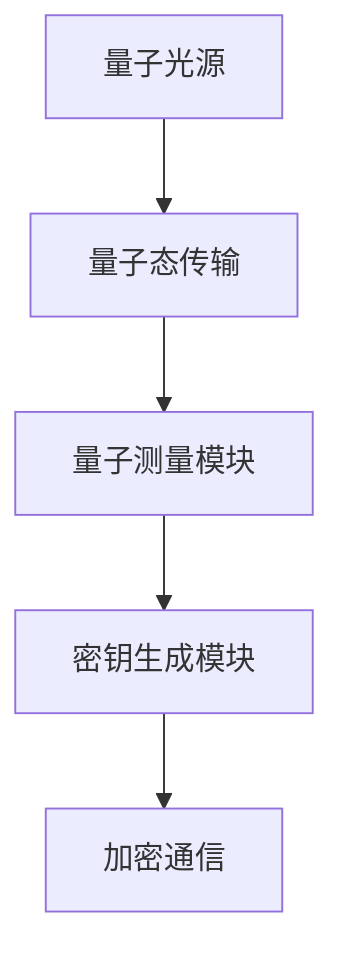

                 

# 如何评估企业的量子加密技术应用

> 关键词：量子加密技术、企业应用、安全评估、加密算法、量子计算

> 摘要：随着量子计算的快速发展，传统加密技术面临前所未有的威胁。本文将详细探讨如何评估企业在量子加密技术的应用，涵盖量子加密的基本原理、系统架构、算法实现、项目实战以及未来展望，帮助读者全面了解并有效实施量子加密技术。

---

# 第1章: 量子加密技术的背景与核心概念

## 1.1 量子加密技术的背景

### 1.1.1 传统加密技术的局限性
传统加密技术，如RSA和AES，基于数学难题提供安全性。然而，随着量子计算的发展，这些算法可能在几十年内被破解，尤其是 RSA 的大整数分解问题和椭圆曲线加密的离散对数问题在量子计算机前变得脆弱。

### 1.1.2 量子计算的崛起与威胁
量子计算机利用量子叠加和纠缠效应，能够在某些特定问题上远超经典计算机，尤其是分解大整数和大数质因数分解，这对传统加密算法构成了巨大威胁。

### 1.1.3 量子加密技术的提出与目标
量子加密技术，尤其是量子密钥分发（QKD），旨在利用量子力学原理提供信息的绝对安全性，确保加密通信无法被窃听或破解。

---

## 1.2 量子加密技术的核心概念

### 1.2.1 量子密钥分发（QKD）的定义
量子密钥分发是一种利用量子力学原理在两个用户之间安全共享密钥的技术，确保密钥的传输过程无法被窃听或篡改。

### 1.2.2 量子加密与经典加密的对比
| 对比维度         | 量子加密                  | 经典加密                  |
|------------------|---------------------------|---------------------------|
| 安全性           | 绝对安全性                 | 可能被量子计算机破解       |
| 实现复杂性       | 高                        | 较低                      |
| 传输速度         | 较慢                     | 较快                      |
| 适用场景         | 高安全需求场景            | 通用场景                  |

### 1.2.3 量子加密技术的关键属性
- **不可克隆性**：量子态无法被精确复制。
- **不可分割性**：量子态在被测量时会坍塌，确保信息传输的完整性。
- **检测窃听**：通过量子态的异常检测，可以发现窃听行为。

---

## 1.3 量子加密技术的数学基础

### 1.3.1 量子态与叠加原理
量子态可以表示为一个向量，如 $|0\rangle$ 或 $|1\rangle$，叠加态为 $|+\rangle = \frac{1}{\sqrt{2}}(|0\rangle + |1\rangle)$。

### 1.3.2 量子测量与纠缠现象
测量量子态会破坏其状态，纠缠态如 $| \Psi \rangle = \frac{1}{\sqrt{2}}(|0\rangle|1\rangle + |1\rangle|0\rangle)$，确保双方共享的状态一致。

### 1.3.3 量子密钥分发的数学模型
QKD协议中，双方通过交换量子态并公开讨论生成密钥，确保密钥的安全性。

---

## 1.4 量子加密技术的应用场景

### 1.4.1 金融领域的加密需求
保护银行交易和支付系统中的敏感数据。

### 1.4.2 政府与军事领域的应用
保障通信安全，防止敌方窃取情报。

### 1.4.3 企业数据保护的新兴需求
保护企业内部数据和客户信息，防止数据泄露。

---

## 1.5 本章小结
本章介绍了量子加密技术的背景、核心概念和数学基础，解释了其在企业中的应用场景，为后续分析奠定了基础。

---

# 第2章: 量子加密技术的核心原理

## 2.1 量子密钥分发（QKD）的原理

### 2.1.1 QKD的基本流程
1. 两个用户 Alice 和 Bob 通过量子态交换密钥。
2. 通过公开通信确认共享密钥，检测窃听行为。
3. 使用共享密钥进行加密通信。

### 2.1.2 量子态的传输与测量
量子态在传输过程中保持叠加态，接收方通过测量确定态，但测量会破坏叠加态，从而检测窃听。

### 2.1.3 量子密钥的生成与分发
通过协议如BB84，Alice 发射量子态，Bob 接收并测量，随后双方通过通信确认密钥。

---

## 2.2 量子加密算法的数学模型

### 2.2.1 量子态的数学表示
量子态可以表示为向量，如 $|0\rangle = \begin{bmatrix}1 \\ 0\end{bmatrix}$，$|1\rangle = \begin{bmatrix}0 \\ 1\end{bmatrix}$。

### 2.2.2 量子密钥分发的数学公式
BB84协议中，Alice 和 Bob 分别选择基矢进行编码和测量，确保密钥的一致性。

### 2.2.3 量子加密协议的数学推导
通过量子态的传输和测量，确保密钥的安全性，推导出共享密钥的数学模型。

---

## 2.3 量子加密技术的优缺点

### 2.3.1 优点：安全性与不可破解性
量子加密提供了理论上不可破解的安全性，尤其适用于高安全需求的场景。

### 2.3.2 缺点：技术复杂性与成本高
量子加密技术复杂，设备昂贵，且通信距离受限。

### 2.3.3 适用场景与局限性
适用于金融、政府等高安全需求领域，但目前在企业中的应用仍有限。

---

## 2.4 本章小结
本章详细讲解了量子加密技术的核心原理，分析了其优缺点及适用场景，为后续的系统设计和实现提供了理论基础。

---

# 第3章: 量子加密技术的系统架构

## 3.1 量子加密系统的组成

### 3.1.1 量子光源模块
用于生成量子态，如单光子源或纠缠光源。

### 3.1.2 量子态传输模块
光纤或自由空间传输量子态，确保传输过程中的安全性。

### 3.1.3 量子测量模块
接收方使用特定基矢进行测量，确保量子态的正确接收。

### 3.1.4 密钥生成模块
根据测量结果和通信协议生成共享密钥。

---

## 3.2 量子加密系统的功能设计

### 3.2.1 密钥分发功能
实现量子态传输和密钥生成，确保密钥的安全分发。

### 3.2.2 加密通信功能
使用生成的密钥对数据进行加密和解密，确保通信内容的安全。

### 3.2.3 系统管理功能
监控系统运行状态，检测潜在的安全威胁和异常情况。

---

## 3.3 量子加密系统的架构图

### 3.3.1 系统架构的Mermaid图

### 3.3.2 功能模块的交互流程
1. 量子光源生成量子态，通过传输模块发送给接收方。
2. 接收方测量量子态，生成测量结果。
3. 双方通过通信确认密钥，生成共享密钥。
4. 使用密钥进行加密通信。

---

## 3.4 本章小结
本章分析了量子加密系统的组成和功能设计，通过架构图和交互流程展示了系统的整体结构，为后续的实现提供了框架。

---

# 第4章: 量子加密技术的算法实现

## 4.1 量子密钥分发协议的实现

### 4.1.1 BB84协议的实现
BB84协议中，Alice 和 Bob 分别选择基矢进行编码和测量，通过公开通信确认密钥的一致性。

### 4.1.2 EPR协议的实现
EPR协议利用纠缠态进行密钥分发，确保双方共享相同的量子态。

### 4.1.3 其他量子密钥分发协议的对比
对比不同协议的优缺点，分析其在实际应用中的适用性。

---

## 4.2 量子加密算法的数学模型

### 4.2.1 量子态的数学表示
量子态可以用密度矩阵表示，如 $|0\rangle$ 表示为 $\rho = |0\rangle \langle 0|$。

### 4.2.2 量子密钥分发的数学公式
BB84协议中，Alice 发射量子态 $|0\rangle$ 或 $|1\rangle$，Bob 测量基矢为 Z 或 X。

### 4.2.3 量子加密协议的数学推导
通过数学推导，证明QKD协议的安全性，确保密钥无法被窃听。

---

## 4.3 本章小结
本章详细讲解了量子密钥分发协议的实现，分析了不同协议的优缺点，并通过数学模型证明了其安全性。

---

接下来将按照目录继续完成后续章节的内容，包括系统分析与架构设计方案、项目实战、总结与展望等部分，确保整篇文章逻辑清晰、内容详实，帮助读者全面理解和评估企业在量子加密技术中的应用。

