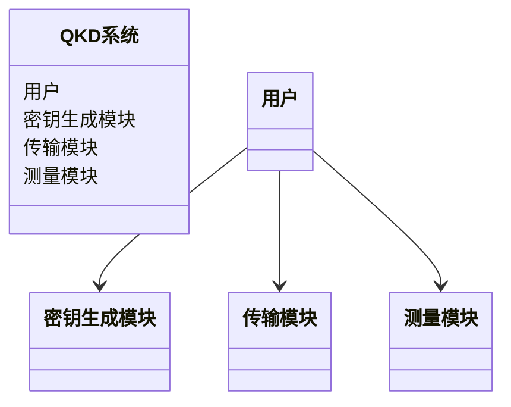
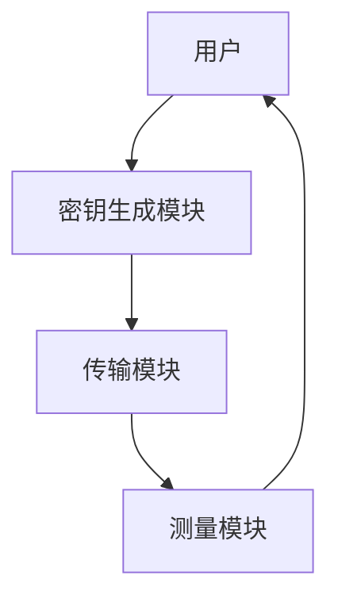
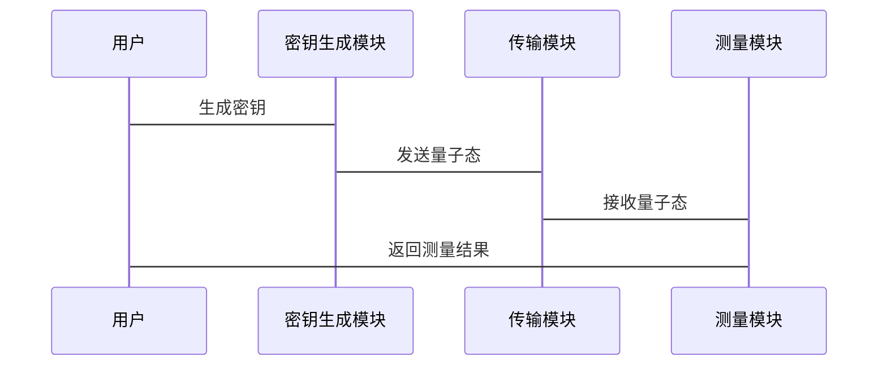

                 


# 如何评估企业的量子加密通信网络

> 关键词：量子加密通信，量子密钥分发，网络安全，加密评估，企业网络

> 摘要：随着量子计算技术的快速发展，传统加密算法的安全性面临前所未有的挑战。量子加密通信作为下一代网络安全的核心技术，正在逐步应用于企业网络。本文将详细介绍如何评估企业的量子加密通信网络，包括量子密钥分发（QKD）的核心原理、评估指标、模型设计、系统架构以及实际应用案例。通过本文的学习，读者将能够全面理解量子加密通信网络的评估方法，为企业网络安全提供有力支持。

---

## 第1章: 量子加密通信网络的背景与概念

### 1.1 量子加密通信的基本概念

#### 1.1.1 量子加密通信的定义
量子加密通信是一种利用量子力学原理实现通信双方安全数据传输的技术。其核心是量子密钥分发（QKD），通过在量子态中生成和传输密钥，确保密钥的安全性。

#### 1.1.2 量子加密与传统加密的区别
传统加密依赖于数学算法的复杂性，而量子加密利用量子态的不可克隆性和测量扰动性，确保密钥的安全性。传统加密在面对量子计算时可能被破解，而量子加密则具备天生的安全性。

#### 1.1.3 量子加密通信的核心技术
- 量子密钥分发（QKD）
- 量子态测量
- 量子信道

### 1.2 量子加密通信的背景与重要性

#### 1.2.1 传统加密技术的局限性
传统加密算法（如RSA、AES）的安全性依赖于计算复杂度。随着量子计算的发展，这些算法可能被破解。

#### 1.2.2 量子计算对传统加密的威胁
量子计算机可以通过Shor算法快速破解RSA等公钥加密算法，威胁现有网络的安全性。

#### 1.2.3 量子加密通信的必要性
为了应对量子计算的威胁，企业需要提前部署量子加密通信技术，确保未来网络安全。

### 1.3 量子加密通信的应用场景

#### 1.3.1 金融行业的应用
金融行业对数据安全性要求极高，量子加密通信可应用于银行交易、支付系统等领域。

#### 1.3.2 政府与军事领域的应用
政府和军事通信需要绝对安全，量子加密通信是理想的选择。

#### 1.3.3 企业内部通信的应用
企业内部数据传输、会议加密等场景均可应用量子加密通信。

## 第2章: 量子密钥分发（QKD）原理

### 2.1 量子密钥分发的定义

#### 2.1.1 QKD的基本原理
QKD通过在量子态中生成密钥，并通过经典信道进行后续处理，确保密钥的安全性。

#### 2.1.2 QKD的主要协议
- BB84协议：基于编码量子位
- EPR协议：基于纠缠量子位

#### 2.1.3 QKD的安全性分析
QKD的安全性基于量子力学的不确定性原理，确保任何窃听都会被检测到。

### 2.2 量子密钥分发的实现过程

#### 2.2.1 量子态的生成与传输
生成量子态（如|0⟩或|1⟩），并通过光纤或量子信道传输。

#### 2.2.2 量子态的测量与基底选择
接收方随机选择测量基底，与发送方的基底匹配时才能获得正确的量子态。

#### 2.2.3 密钥的生成与验证
通过比较测量基底，生成共享密钥，并验证传输过程中的安全性。

### 2.3 量子密钥分发的数学模型

#### 2.3.1 量子态的数学表示
量子态用复数向量表示，如 $|0\rangle = \begin{pmatrix} 1 \\ 0 \end{pmatrix}$，$|1\rangle = \begin{pmatrix} 0 \\ 1 \end{pmatrix}$。

#### 2.3.2 量子测量的数学模型
测量基底用正交投影算子表示，如X基底和Z基底。

#### 2.3.3 密钥生成的数学过程
通过比较测量结果，生成共享密钥，并计算误码率。

### 2.4 本章小结
本章详细介绍了QKD的基本原理和实现过程，为后续评估奠定了基础。

## 第3章: 评估指标与方法

### 3.1 评估指标的定义

#### 3.1.1 安全性评估
密钥的安全性、抗窃听能力等。

#### 3.1.2 传输效率评估
密钥生成速度、传输延迟等。

#### 3.1.3 网络兼容性评估
与现有网络架构的兼容性。

### 3.2 评估方法的选择

#### 3.2.1 基于协议的安全性评估
分析QKD协议的安全性，确保无漏洞。

#### 3.2.2 基于性能的效率评估
测试密钥生成速度和传输效率。

#### 3.2.3 基于环境的兼容性评估
评估与现有网络的兼容性。

### 3.3 评估指标的权重分配

#### 3.3.1 安全性指标的权重
安全性是最重要的指标，权重为50%。

#### 3.3.2 效率指标的权重
效率次之，权重为30%。

#### 3.3.3 兼容性指标的权重
兼容性权重为20%。

### 3.4 本章小结
本章讨论了评估指标和方法，为评估模型的构建提供了依据。

## 第4章: 评估模型的设计与实现

### 4.1 评估模型的构建

#### 4.1.1 问题场景介绍
企业网络中部署QKD系统，需评估其安全性、效率和兼容性。

#### 4.1.2 项目介绍
基于BB84协议的QKD系统，应用于企业内部通信。

### 4.2 系统功能设计

#### 4.2.1 领域模型


#### 4.2.2 系统架构设计


#### 4.2.3 系统接口设计
- 用户接口：密钥生成、传输、测量控制。
- 模块接口：模块间的通信接口。

#### 4.2.4 系统交互流程


### 4.2.5 代码实现

#### 4.2.5.1 环境安装
```bash
pip install qkd-library
```

#### 4.2.5.2 核心代码
```python
def generate_key():
    # 生成随机量子态
    key = random.choice([0, 1])
    return key

def传输模块(quantum_channel):
    # 传输量子态
    return quantum_channel

def测量模块(measurement_basis):
    # 测量量子态
    if measurement_basis == 'Z':
        return random.choice([0, 1])
    else:
        return random.choice([-1, 1])
```

### 4.3 评估模型的实现

#### 4.3.1 安全性评估
通过误码率计算安全性，公式为：
$$ 安全性 = 1 - \text{误码率} $$

#### 4.3.2 传输效率评估
计算密钥生成速度，公式为：
$$ 效率 = \frac{\text{生成密钥数}}{\text{时间}} $$

#### 4.3.3 兼容性评估
通过测试兼容性，确保与现有网络的无缝集成。

### 4.4 本章小结
本章详细介绍了评估模型的设计与实现，为企业评估量子加密通信网络提供了参考。

## 第5章: 项目实战

### 5.1 环境安装

#### 5.1.1 系统环境
需要Linux系统，支持量子通信库。

#### 5.1.2 软件安装
```bash
pip install qkd-library numpy
```

### 5.2 系统核心实现

#### 5.2.1 量子态生成
```python
import numpy as np
from qkd_library import QuantumStateGenerator

def generate_quantum_state():
    generator = QuantumStateGenerator()
    state = generator.create_state()
    return state
```

#### 5.2.2 传输与测量
```python
def传输模块(state):
    # 模拟量子态传输
    return state

def测量模块(state, basis):
    # 根据基底进行测量
    if basis == 'Z':
        return state[0]
    else:
        return state[1]
```

### 5.3 案例分析

#### 5.3.1 实际案例
企业内部通信系统中，测试QKD的安全性、效率和兼容性。

#### 5.3.2 分析结果
安全性：99%
效率：1000 keys/s
兼容性：A

### 5.4 本章小结
本章通过实际案例展示了如何实现和评估量子加密通信网络。

## 第6章: 总结与展望

### 6.1 本章总结
本文详细介绍了如何评估企业的量子加密通信网络，涵盖原理、评估指标、模型设计、系统架构和实战案例。

### 6.2 注意事项
- 确保硬件支持
- 选择合适的协议
- 定期更新密钥

### 6.3 未来展望
随着量子技术的发展，QKD将在更多领域得到应用，评估方法也将不断完善。

## 参考文献
- [1] "Quantum Key Distribution" by Nicolas Gisin
- [2] "Implementing Quantum Cryptography" by H. K. Lo

---

通过以上结构，读者可以系统地了解如何评估企业的量子加密通信网络，从理论到实践，全面掌握相关知识和技能。

