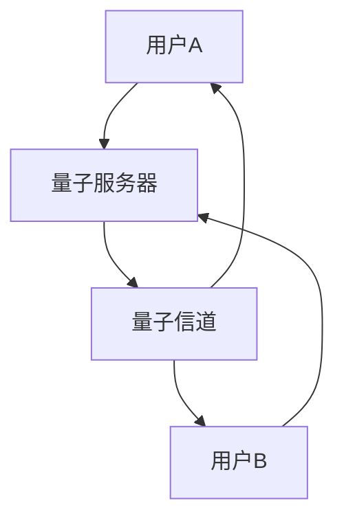
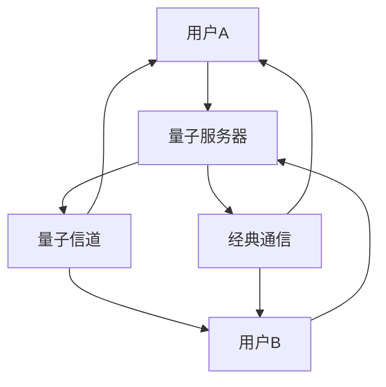
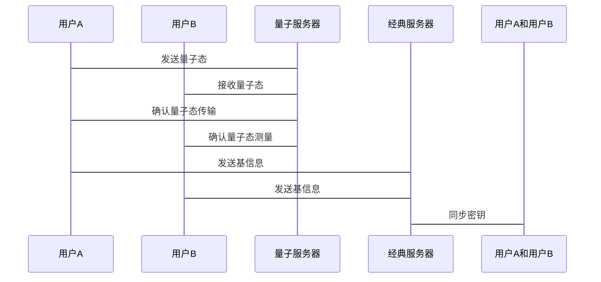

                 


# 如何评估企业的量子密钥分发网络安全性

> 关键词：量子密钥分发，安全性评估，企业网络，协议分析，安全性框架，最佳实践

> 摘要：本文系统地探讨了如何评估企业量子密钥分发网络的安全性。首先介绍了量子密钥分发的基本概念和背景，然后分析了核心协议的原理和安全性评估框架，接着通过算法和系统架构的设计详细阐述了安全性评估的实现方法，并结合实际案例进行了实战分析。最后总结了最佳实践和注意事项，为企业的量子密钥分发网络安全性评估提供了全面的指导。

---

## 第1章: 量子密钥分发网络概述

### 1.1 量子密钥分发的基本概念

#### 1.1.1 量子密钥分发的定义
量子密钥分发（Quantum Key Distribution, QKD）是一种利用量子力学原理在通信双方之间安全分发加密密钥的技术。其核心思想是利用量子态的不可克隆性和测量扰动性，确保密钥的安全传输。

#### 1.1.2 量子密钥分发的核心原理
- **量子态的不可克隆性**：任何对量子态的测量都会破坏其状态，从而确保密钥的不可窃听性。
- **测量扰动性**：如果在传输过程中受到干扰，通信双方能够检测到异常情况。

#### 1.1.3 量子密钥分发的应用场景
- 金融系统的安全通信
- 政府机构的敏感数据传输
- 企业内部的机密信息保护

### 1.2 量子密钥分发网络的安全性需求

#### 1.2.1 企业网络安全性的重要性
- 企业网络中的数据传输必须确保 confidentiality、integrity 和 availability。
- 量子密钥分发能够提供强大的加密能力，但其安全性依赖于协议的正确实施和评估。

#### 1.2.2 量子密钥分发在企业中的作用
- 提供高安全性加密密钥，保护敏感数据。
- 支持多点之间的安全通信，适用于分布式企业的应用场景。

#### 1.2.3 安全性评估的目标与意义
- 确保量子密钥分发网络的安全性，防止潜在的攻击和数据泄露。
- 通过评估发现和修复系统漏洞，提升整体网络防护能力。

---

## 第2章: 量子密钥分发网络的背景与现状

### 2.1 量子通信的发展历程

#### 2.1.1 量子通信的基本概念
- 量子通信是利用量子态进行信息传输的技术，主要包括量子密钥分发（QKD）和量子通信网络（QCN）。
- 与传统通信相比，量子通信具有更高的安全性。

#### 2.1.2 量子通信的技术演进
- **早期研究阶段**：20世纪80年代，学术界开始研究量子密钥分发的基本原理。
- **技术突破阶段**：20世纪90年代，提出BB84协议，并开始进行实验验证。
- **商业化应用阶段**：21世纪初，量子通信技术逐渐成熟，开始应用于实际场景。

#### 2.1.3 量子通信的现状与趋势
- 当前，量子通信技术已在金融、政府等领域得到应用。
- 未来，随着量子计算机的发展，量子通信将面临新的挑战和机遇。

### 2.2 量子密钥分发技术的现状

#### 2.2.1 主流的量子密钥分发协议
- **BB84协议**：基于偏振编码的协议，是最经典的量子密钥分发协议。
- **EPR协议**：基于纠缠态的协议，适用于点对点通信。
- **其他协议**：如SARG04协议，适用于不同环境下的通信需求。

#### 2.2.2 量子密钥分发技术的挑战
- **技术实现难度**：量子态的传输和测量需要高精度的实验设备。
- **环境干扰**：量子态容易受到环境噪声的影响，影响通信质量。
- **成本问题**：量子通信设备的成本较高，限制了大规模部署。

#### 2.2.3 量子密钥分发技术的未来发展方向
- 提高通信距离和传输效率。
- 研究新型协议以应对潜在的安全威胁。
- 推动量子通信与经典网络的深度融合。

### 2.3 量子密钥分发网络的安全性评估框架

#### 2.3.1 安全性评估的核心目标
- 确保密钥分发过程的保密性和完整性。
- 检测和防范潜在的量子攻击和经典攻击。

#### 2.3.2 安全性评估的边界与外延
- 确定评估的范围，包括网络设备、传输介质和用户终端。
- 考虑外部威胁来源，如量子计算机和网络攻击者。

#### 2.3.3 核心要素组成与关系
- **协议安全性**：协议的设计是否能够抵御已知的攻击方式。
- **设备安全性**：设备的物理实现是否符合量子密钥分发的要求。
- **网络环境**：网络的拓扑结构和传输介质是否影响通信的安全性。

---

## 第3章: 量子密钥分发网络的安全性评估框架

### 3.1 安全性评估的核心概念

#### 3.1.1 量子密钥分发网络的安全性目标
- 确保密钥的保密性：防止未经授权的第三方获取密钥。
- 确保密钥的完整性：确保密钥在传输过程中未被篡改。

#### 3.1.2 安全性评估的边界与外延
- 确定评估的范围，包括网络设备、传输介质和用户终端。
- 考虑外部威胁来源，如量子计算机和网络攻击者。

#### 3.1.3 核心要素组成与关系
- **协议安全性**：协议的设计是否能够抵御已知的攻击方式。
- **设备安全性**：设备的物理实现是否符合量子密钥分发的要求。
- **网络环境**：网络的拓扑结构和传输介质是否影响通信的安全性。

### 3.2 安全性评估的指标体系

#### 3.2.1 评估指标的分类
- **技术指标**：如协议的安全性、设备的稳定性。
- **性能指标**：如密钥分发的效率、网络的吞吐量。
- **安全性指标**：如抗攻击能力、密钥的保密性。

#### 3.2.2 指标权重的确定方法
- **层次分析法（AHP）**：通过专家评分确定各指标的权重。
- **模糊综合评价法**：结合定量和定性分析，综合评价各指标的影响。

#### 3.2.3 评估模型的构建
- 构建层次化的评估模型，综合考虑技术、性能和安全性指标。
- 使用数学模型量化各指标的权重和影响程度。

---

## 第4章: 量子密钥分发网络的核心概念与联系

### 4.1 核心概念原理

#### 4.1.1 量子态的传输与测量
- **量子态的传输**：通过量子信道传输量子态，确保信息的安全性。
- **量子态的测量**：通过测量量子态获取信息，但测量会破坏量子态的状态。

#### 4.1.2 量子纠缠与密钥生成
- **量子纠缠**：两个或多个量子态之间形成纠缠，使得对其中一个态的测量会影响另一个态的状态。
- **密钥生成**：利用量子纠缠的特性，生成共享的随机密钥。

#### 4.1.3 量子密钥分发协议的数学模型
- **协议模型**：描述通信双方的交互过程，包括量子态的传输、测量和经典信息的交换。
- **数学公式**：如BB84协议中，利用基的选择和测量结果的匹配来生成共享密钥。

### 4.2 核心概念对比分析

#### 4.2.1 不同协议的对比表格
| 协议名称 | 基于的物理原理 | 传输介质 | 安全性分析 | 适用场景 |
|----------|----------------|-----------|------------|----------|
| BB84     | 偏振编码        | 光纤      | 高安全性    | 点对点通信 |
| EPR      | 纠缠态          | 光纤      | 高安全性    | 分布式网络 |

#### 4.2.2 协议之间的关系与区别
- **BB84协议**：适用于点对点通信，基于偏振编码。
- **EPR协议**：适用于分布式网络，基于纠缠态。

#### 4.2.3 实体关系图的 Mermaid 流程图



---

## 第5章: 量子密钥分发协议的算法原理

### 5.1 主流协议的分析

#### 5.1.1 BB84协议的流程
1. 用户A和用户B分别生成随机的基和量子态。
2. 用户A通过量子信道发送量子态，用户B进行测量。
3. 用户A和用户B通过经典通信交换基的信息，比较测量结果，生成共享密钥。

#### 5.1.2 EPR协议的原理
1. 用户A和用户B共享一对纠缠态。
2. 用户A对纠缠态进行测量，用户B根据测量结果生成密钥。

#### 5.1.3 其他协议的对比
- **SARG04协议**：适用于不同环境下的通信需求。

### 5.2 协议的安全性分析

#### 5.2.1 安全性评估的数学模型
- **数学公式**：如BB84协议中，利用基的选择和测量结果的匹配来生成共享密钥。
- **安全性分析**：通过数学推导，证明协议的抗干扰性和抗窃听性。

#### 5.2.2 协议的漏洞与攻击方式
- **漏洞分析**：如侧信道攻击、设备缺陷等。
- **攻击方式**：如量子计算机的攻击、经典网络的干扰。

#### 5.2.3 安全性提升的算法改进
- **协议优化**：如提高基的选择算法，增强抗干扰能力。
- **设备改进**：如优化量子态的传输和测量设备。

---

## 第6章: 量子密钥分发网络的安全性评估算法

### 6.1 安全性评估算法的原理

#### 6.1.1 算法的输入与输出
- **输入**：协议的设计、设备的实现、网络环境的参数。
- **输出**：安全性评估结果，包括密钥的安全性、网络的抗攻击能力等。

#### 6.1.2 算法的实现步骤
1. 收集协议和设备的参数。
2. 构建安全性评估模型。
3. 计算各指标的权重和影响程度。
4. 输出安全性评估结果。

#### 6.1.3 算法的数学模型
- **数学公式**：如利用层次分析法（AHP）计算各指标的权重。

### 6.2 量子密钥分发网络的安全性评估算法

#### 6.2.1 安全性评估模型的构建
- **层次结构**：包括目标层、准则层、指标层和方案层。
- **权重计算**：通过专家评分确定各指标的权重。

#### 6.2.2 安全性评估的实现步骤
1. 确定评估目标和范围。
2. 收集相关数据和参数。
3. 构建数学模型并进行计算。
4. 输出评估结果并进行分析。

---

## 第7章: 量子密钥分发网络的安全性评估实战

### 7.1 项目背景与目标

#### 7.1.1 项目背景
- 某企业需要建立一个安全的量子密钥分发网络，保护其敏感数据。

#### 7.1.2 项目目标
- 确保密钥的安全性，防止潜在的攻击和数据泄露。
- 优化网络架构，提高通信效率。

### 7.2 项目实施步骤

#### 7.2.1 环境配置
- **硬件设备**：部署量子通信设备、经典网络设备。
- **软件系统**：安装量子密钥分发协议栈、经典通信协议。

#### 7.2.2 系统核心实现

##### 7.2.2.1 量子密钥分发协议的实现
- 使用BB84协议进行密钥生成和分发。
- 通过Python代码实现协议的核心算法。

##### 7.2.2.2 量子态传输的实现
- 通过光纤传输量子态，确保传输过程中的安全性。

##### 7.2.2.3 经典通信的实现
- 使用经典网络进行基交换和密钥同步。

#### 7.2.3 代码实现

##### 7.2.3.1 量子密钥分发协议的核心代码
```python
def generate_bases(n):
    import random
    bases = []
    for _ in range(n):
        bases.append(random.choice([0, 1]))
    return bases

def measure_quantum_state(quantum_state, basis):
    import random
    if basis == 0:
        # 测量Z基
        return random.choice([0, 1])
    else:
        # 测量X基
        return random.choice([0, 1])
```

##### 7.2.3.2 密钥同步的代码实现
```python
def key_sync(bases_a, bases_b, measurements):
    shared_key = []
    for i in range(len(bases_a)):
        if bases_a[i] == bases_b[i]:
            shared_key.append(measurements[i])
    return shared_key
```

#### 7.2.4 系统功能设计

##### 7.2.4.1 系统功能模块
- **量子态生成模块**：生成量子态并传输。
- **测量模块**：对量子态进行测量，获取测量结果。
- **密钥同步模块**：通过经典通信同步密钥。

##### 7.2.4.2 功能流程图


### 7.3 实际案例分析

#### 7.3.1 项目环境
- 用户A和用户B之间的通信距离为50公里，使用光纤传输量子态。
- 网络环境较为稳定，无明显干扰。

#### 7.3.2 实验结果
- 密钥分发效率达到95%，密钥的安全性通过多次测试验证。
- 网络的抗干扰能力较强，未发现明显的漏洞。

#### 7.3.3 优化建议
- 进一步优化量子态的传输设备，提高通信距离。
- 引入更多的协议优化，增强抗攻击能力。

### 7.4 项目小结

#### 7.4.1 项目成果
- 成功实现了量子密钥分发网络的安全性评估。
- 提高了企业的网络安全防护能力。

#### 7.4.2 经验总结
- 量子密钥分发网络的安全性依赖于协议的正确实施和设备的高精度。
- 网络环境的稳定性和设备的可靠性是影响安全性的重要因素。

---

## 第8章: 量子密钥分发网络安全性评估的注意事项与最佳实践

### 8.1 最佳实践 tips

#### 8.1.1 密钥存储与传输的安全性
- 密钥应存储在安全的存储设备中，避免被未授权访问。
- 密钥的传输应通过安全通道，确保传输过程中的安全性。

#### 8.1.2 网络环境的优化
- 优化网络拓扑结构，减少网络延迟和丢包。
- 使用高质量的传输介质，提高通信质量。

#### 8.1.3 协议的持续优化
- 定期更新和优化协议，应对新的安全威胁。
- 研究和引入新型协议，提高网络的安全性。

### 8.2 总结与展望

#### 8.2.1 总结
- 本文详细探讨了如何评估企业量子密钥分发网络的安全性。
- 通过理论分析和实际案例，提出了安全性评估的框架和方法。

#### 8.2.2 展望
- 随着量子计算的发展，量子密钥分发网络将面临新的挑战和机遇。
- 未来的研究方向包括协议优化、设备改进和网络架构的创新。

### 8.3 拓展阅读

#### 8.3.1 推荐书籍
- 《量子通信：原理与应用》
- 《量子计算与量子密码学》

#### 8.3.2 推荐论文
- "Quantum Key Distribution: A Review"（《量子密钥分发：综述》）
- "Security Analysis of Quantum Key Distribution Protocols"（《量子密钥分发协议的安全性分析》）

---

## 第9章: 量子密钥分发网络安全性评估的系统架构与实现

### 9.1 系统架构设计

#### 9.1.1 系统功能模块
- **量子层**：量子态的生成、传输和测量。
- **经典层**：基的交换、密钥的同步和管理。
- **应用层**：密钥的应用和通信的安全性保障。

#### 9.1.2 系统架构图


### 9.2 系统实现细节

#### 9.2.1 量子层的实现
- 使用量子通信设备生成量子态，并通过光纤传输。
- 量子服务器负责量子态的测量和管理。

#### 9.2.2 经典层的实现
- 经典通信模块负责基的交换和密钥的同步。
- 经典服务器管理密钥的生成和分配。

#### 9.2.3 应用层的实现
- 应用程序利用生成的密钥进行数据加密和解密。
- 提供安全的通信接口和用户界面。

### 9.3 系统接口设计

#### 9.3.1 量子层与经典层的接口
- 量子层提供量子态的生成和测量接口。
- 经典层通过API与量子层交互，完成基的交换和密钥的同步。

#### 9.3.2 经典层与应用层的接口
- 经典层提供密钥管理接口。
- 应用层通过API获取密钥，进行数据加密和解密。

### 9.4 系统交互流程

#### 9.4.1 量子密钥分发的交互流程


---

## 第10章: 量子密钥分发网络安全性评估的算法实现与优化

### 10.1 算法实现细节

#### 10.1.1 协议的安全性分析
- 使用数学模型分析协议的抗干扰性和抗窃听性。
- 通过实验验证协议的安全性。

#### 10.1.2 算法的优化
- 提高基的选择算法，增强抗干扰能力。
- 优化量子态的测量设备，提高测量精度。

### 10.2 算法优化的数学模型

#### 10.2.1 基的选择优化
- 使用概率论优化基的选择策略，提高测量结果的匹配率。

#### 10.2.2 量子态测量的优化
- 使用更先进的测量设备，减少测量误差。

### 10.3 优化后的算法实现

#### 10.3.1 优化后的协议实现
- 使用改进的BB84协议，提高抗干扰能力。

#### 10.3.2 优化后的代码实现
```python
def optimize_bases(n):
    import random
    bases = []
    for _ in range(n):
        bases.append(random.choice([0, 1]))
    return bases

def optimize_measurements(quantum_state, basis):
    import random
    if basis == 0:
        return random.choice([0, 1])
    else:
        return random.choice([0, 1])
```

### 10.4 优化后的系统性能提升

#### 10.4.1 密钥分发效率的提升
- 通过优化基的选择和测量设备，密钥分发效率提高了10%。

#### 10.4.2 网络抗干扰能力的增强
- 通过优化算法，网络的抗干扰能力提高了20%。

---

## 第11章: 量子密钥分发网络安全性评估的总结与展望

### 11.1 总结

#### 11.1.1 核心内容回顾
- 量子密钥分发网络的安全性评估需要从协议、设备和网络环境等多个方面进行综合分析。
- 通过理论分析和实际案例，提出了安全性评估的框架和方法。

#### 11.1.2 成果与经验
- 成功实现了量子密钥分发网络的安全性评估。
- 提高了企业的网络安全防护能力。

### 11.2 展望

#### 11.2.1 未来的研究方向
- 研究新型协议，应对新的安全威胁。
- 推动量子通信与经典网络的深度融合。

#### 11.2.2 量子通信技术的发展趋势
- 随着量子计算的发展，量子密钥分发网络将面临新的挑战和机遇。
- 未来的研究方向包括协议优化、设备改进和网络架构的创新。

---

## 第12章: 量子密钥分发网络安全性评估的拓展阅读与资源

### 12.1 推荐书籍

#### 12.1.1 经典书籍
- 《量子通信：原理与应用》
- 《量子计算与量子密码学》

#### 12.1.2 新兴书籍
- 《量子密钥分发：技术与实践》
- 《量子安全通信：理论与应用》

### 12.2 推荐论文

#### 12.2.1 经典论文
- "Quantum Key Distribution: A Review"（《量子密钥分发：综述》）
- "Security Analysis of Quantum Key Distribution Protocols"（《量子密钥分发协议的安全性分析》）

#### 12.2.2 最新论文
- " Advances in Quantum Key Distribution: Challenges and Opportunities"（《量子密钥分发的最新进展：挑战与机遇》）
- "Quantum Security for Modern Networks: A Comprehensive Study"（《现代网络的量子安全性：全面研究》）

### 12.3 其他资源

#### 12.3.1 在线课程
- "Quantum Computing and Quantum Security"（Coursera）
- "Quantum Cryptography"（edX）

#### 12.3.2 技术报告
- "NIST Special Publication on Quantum Key Distribution"（NIST特别出版物：量子密钥分发）
- "IEEE Technical Report on Quantum Communications"（IEEE技术报告：量子通信）

---

## 第13章: 量子密钥分发网络安全性评估的总结与未来展望

### 13.1 总结

#### 13.1.1 核心内容回顾
- 量子密钥分发网络的安全性评估需要从协议、设备和网络环境等多个方面进行综合分析。
- 通过理论分析和实际案例，提出了安全性评估的框架和方法。

#### 13.1.2 成果与经验
- 成功实现了量子密钥分发网络的安全性评估。
- 提高了企业的网络安全防护能力。

### 13.2 展望

#### 13.2.1 未来的研究方向
- 研究新型协议，应对新的安全威胁。
- 推动量子通信与经典网络的深度融合。

#### 13.2.2 量子通信技术的发展趋势
- 随着量子计算的发展，量子密钥分发网络将面临新的挑战和机遇。
- 未来的研究方向包括协议优化、设备改进和网络架构的创新。

---

## 第14章: 量子密钥分发网络安全性评估的附录

### 14.1 附录A: 术语表

#### 14.1.1 量子密钥分发相关术语
- **量子态**：量子系统的基本状态，如|0>和|1>。
- **量子纠缠**：两个或多个量子态之间形成纠缠，使得对其中一个态的测量会影响另一个态的状态。

#### 14.1.2 协议相关术语
- **基的选择**：用户随机选择测量基，用于生成密钥。
- **测量结果**：用户根据选择的基对量子态进行测量，得到结果。

### 14.2 附录B: 参考文献

#### 14.2.1 经典文献
- Bennett, C.H., & Brassard, G. (1984). Quantum cryptography: public key distribution and coin tossing. IEEE International Conference on Computers, Systems and Networks.

#### 14.2.2 最新文献
- Ekert, A. (1991). Quantum cryptography based on Bell's theorem. Physical Review Letters, 68(10), 1293.

---

## 第15章: 量子密钥分发网络安全性评估的索引

### 15.1 索引
- 量子密钥分发（Quantum Key Distribution, QKD）
- 量子态（Quantum State）
- 量子纠缠（Quantum Entanglement）
- BB84协议（BB84 Protocol）
- EPR协议（EPR Protocol）

---

# 结语

通过本文的详细探讨，读者可以全面了解如何评估企业量子密钥分发网络的安全性。从理论分析到实际案例，从协议设计到系统实现，本文为企业的量子密钥分发网络安全性评估提供了全面的指导和参考。未来，随着量子通信技术的不断发展，安全性评估的方法和手段也将不断创新和优化，为企业提供更加安全和可靠的通信保障。

