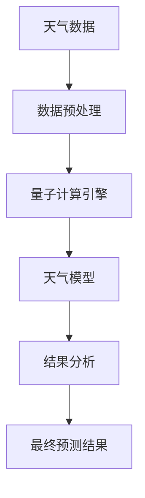
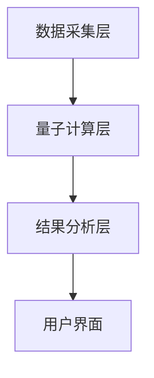
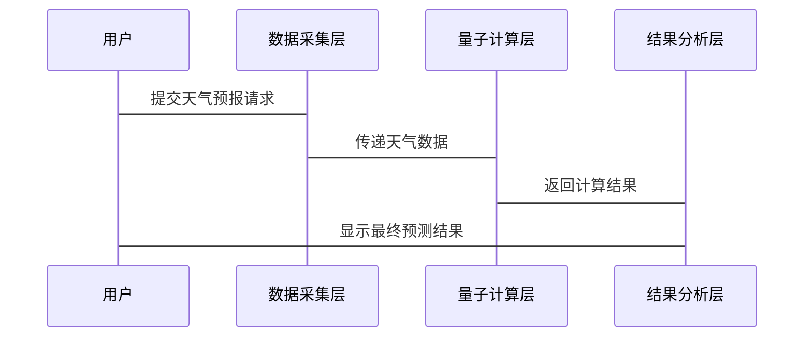

                 


# 如何评估企业的量子计算天气预报应用

> 关键词：量子计算，天气预报，企业评估，技术实现，算法分析，系统架构

> 摘要：随着量子计算技术的快速发展，其在天气预报领域的应用潜力逐渐显现。本文从量子计算的基本原理、天气预报的复杂性入手，详细探讨了量子计算在天气预报中的潜在解决方案，结合实际案例分析，为企业评估量子计算天气预报应用提供了系统的评估框架和方法。文章内容涵盖量子计算的核心算法、系统架构设计、项目实战分析等，旨在为企业决策者和技术人员提供全面的技术参考。

---

## 第一章 量子计算与天气预报应用的背景介绍

### 1.1 问题背景与问题描述
- 传统天气预报的局限性：计算能力不足、数据处理效率低下
- 量子计算的出现为天气预报带来了新的可能性
- 量子计算在天气预报中的应用目标：提高预测精度、降低计算成本

### 1.2 量子计算的基本概念与特点
- 量子位（Qubit）的基本概念：与经典计算机中的二进制位不同，量子位可以同时处于多个状态
- 量子叠加与纠缠的原理：量子计算的核心优势在于并行计算能力
- 量子计算的应用场景：复杂系统的建模与优化

### 1.3 天气预报的复杂性与挑战
- 天气系统的非线性特征：大气运动的复杂性使得天气预报成为一个典型的NP难问题
- 天气预报中的混沌现象：微小的初始条件变化可能导致完全不同的预测结果
- 天气数据的海量性与实时性要求：需要处理大量的实时数据，并在极短的时间内完成计算

### 1.4 量子计算与天气预报的结合背景
- 量子计算在天气预报中的潜在优势：高效的并行计算能力、处理复杂系统的能力
- 量子计算在天气预报中的应用现状：当前仍处于研究阶段，尚未大规模商业化
- 量子计算在天气预报中的未来展望：有望成为天气预报领域的重要工具

---

## 第二章 量子计算的核心原理与天气预报的复杂性分析

### 2.1 量子计算的核心原理
- 量子叠加：量子位可以同时处于多个状态，从而实现并行计算
- 量子纠缠：量子位之间的关联性使得可以通过少量计算资源处理大量数据
- 量子算法的基本流程：量子算法通过量子叠加和量子干涉实现高效的计算

### 2.2 天气预报的复杂性与建模挑战
- 天气系统的非线性特征：大气运动的非线性方程使得天气预报模型难以求解
- 天气预报中的混沌现象：微小的初始条件变化可能导致完全不同的预测结果
- 天气数据的海量性与实时性要求：需要处理大量的实时数据，并在极短的时间内完成计算

### 2.3 量子计算与天气预报的关联性分析
- 量子计算在天气数据处理中的优势：高效的并行计算能力
- 量子计算在天气模型优化中的潜力：通过量子算法优化天气模型的参数
- 量子计算与天气预报的结合方式：通过量子算法实现天气数据的高效处理和模型优化

### 2.4 核心概念对比与ER实体关系图
- 量子计算与经典计算的对比分析（表格形式）：

| 特性           | 量子计算         | 经典计算       |
|----------------|------------------|---------------|
| 并行计算能力   | 高效             | 低效           |
| 资源消耗       | 低               | 高             |
| 处理复杂系统   | 善于处理          | 不擅长处理       |

- 天气预报系统的ER实体关系图（Mermaid流程图）：



---

## 第三章 量子计算天气预报应用的核心算法

### 3.1 量子傅里叶变换在天气数据处理中的应用
- 量子傅里叶变换的基本概念：量子傅里叶变换是一种量子算法，用于将数据从时域转换到频域
- 量子傅里叶变换的实现流程：通过量子叠加和量子干涉实现数据的频域变换
- 量子傅里叶变换的数学模型：$$ QFT \, 将输入的量子态 \, |x\rangle \, 转换为 \, |F(x)\rangle $$

### 3.2 量子模拟算法在天气模型中的应用
- 量子模拟算法的基本原理：通过量子计算模拟天气系统的物理过程
- 量子模拟算法的实现步骤：数据输入、量子叠加、量子计算、结果输出
- 量子模拟算法的数学模型：$$ H = \sum_{i=1}^{n} x_i H_i \, （哈密顿量的构建） $$

### 3.3 量子算法在天气预报中的实现代码
- 量子傅里叶变换的Python代码实现：

```python
def quantum_fourier_transform(circuit, qubits, clbits):
    # 执行量子傅里叶变换
    for i in range(len(qubits)):
        for j in range(i):
            circuit.swap(qubits[i], qubits[j])
        circuit.h(qubits[i])
        for j in range(i):
            circuit.swap(qubits[i], qubits[j])
    return circuit
```

- 量子模拟算法的Python代码实现：

```python
def quantum_simulation(circuit, qubits, clbits, parameters):
    # 初始化量子电路
    for q in qubits:
        circuit.h(q)
    # 执行量子计算
    for param in parameters:
        circuit.rz(param, qubits[0])
    # 测量结果
    circuit.measure(qubits, clbits)
    return circuit
```

### 3.4 算法分析与优化建议
- 量子傅里叶变换的优化方向：通过优化量子门的顺序提高计算效率
- 量子模拟算法的优化方向：通过改进哈密顿量的构建方法提高计算精度
- 量子算法在天气预报中的应用前景：随着量子计算技术的发展，量子算法在天气预报中的应用将更加广泛

---

## 第四章 量子计算天气预报应用的系统分析与架构设计

### 4.1 系统功能需求
- 数据采集与处理：实时采集天气数据并进行预处理
- 量子计算引擎：实现量子算法的核心计算功能
- 天气模型优化：通过量子计算优化天气模型的参数
- 结果分析与可视化：对计算结果进行分析并进行可视化展示

### 4.2 系统架构设计
- 分层架构：数据采集层、量子计算层、结果分析层
- 组件交互关系：数据采集层与量子计算层之间通过API进行交互，量子计算层与结果分析层通过结果数据进行交互

### 4.3 系统架构图


### 4.4 系统接口设计
- 数据接口：提供天气数据的输入接口
- 计算接口：提供量子计算引擎的调用接口
- 结果接口：提供计算结果的输出接口

### 4.5 系统交互流程


---

## 第五章 量子计算天气预报应用的项目实战

### 5.1 环境搭建
- 量子计算开发环境的搭建：安装量子计算开发框架（如Qiskit）
- 天气数据采集工具的安装：使用公开天气数据API（如OpenWeatherMap）
- 开发工具的配置：配置量子计算开发环境和天气数据处理工具

### 5.2 核心代码实现
- 量子傅里叶变换的实现代码：

```python
from qiskit import QuantumCircuit, execute, Aer

def qft(n):
    qc = QuantumCircuit(n)
    for i in range(n):
        for j in range(i):
            qc.swap(qubits[i], qubits[j])
        qc.h(qubits[i])
    return qc
```

- 量子模拟算法的实现代码：

```python
from qiskit import QuantumCircuit, execute, Aer

def quantum_simulation(circuit, qubits, clbits):
    for q in qubits:
        circuit.h(q)
    for q in qubits:
        circuit.rz(theta, q)
    circuit.measure(qubits, clbits)
    return circuit
```

### 5.3 项目案例分析
- 案例背景：某地区天气预报的量子计算应用
- 数据处理：采集该地区的天气数据并进行预处理
- 量子计算引擎调用：调用量子傅里叶变换和量子模拟算法进行天气预测
- 计算结果分析：对计算结果进行分析并进行可视化展示
- 案例总结：量子计算在天气预报中的应用优势与挑战

### 5.4 项目小结
- 项目成果：实现了量子计算在天气预报中的应用
- 项目经验：总结项目实施过程中的经验和教训
- 项目优化方向：提出进一步优化的建议

---

## 第六章 量子计算天气预报应用的评估与优化

### 6.1 量子计算天气预报应用的评估指标
- 计算效率：量子计算与经典计算的效率对比
- 预测精度：量子计算在天气预报中的预测准确性
- 系统稳定性：量子计算系统的稳定性与可靠性

### 6.2 优化建议
- 算法优化：改进量子算法的实现方法
- 系统优化：优化量子计算系统的架构设计
- 数据优化：提高天气数据的处理效率与质量

### 6.3 未来展望
- 量子计算在天气预报中的应用前景：随着量子计算技术的发展，量子计算在天气预报中的应用将更加广泛
- 量子计算与人工智能的结合：通过量子计算与人工智能的结合进一步提升天气预报的准确性
- 量子计算在气象领域的潜力：量子计算在气象研究中的其他潜在应用

---

## 第七章 总结与展望

### 7.1 本章总结
- 量子计算在天气预报中的应用潜力
- 量子计算在天气预报中的实现方法
- 量子计算在天气预报中的优化方向

### 7.2 未来展望
- 量子计算技术的进一步发展
- 量子计算在天气预报中的深度应用
- 量子计算在气象领域的更多潜在应用

---

## 附录

### 附录A 术语表
- 量子位（Qubit）：量子计算的基本单位
- 量子叠加：量子位可以同时处于多个状态
- 量子纠缠：量子位之间的关联性
- 量子算法：量子计算的核心算法

### 附录B 工具安装指南
- 量子计算开发框架：Qiskit
- 天气数据API：OpenWeatherMap

### 附录C 参考文献
- Qiskit官方文档
- 相关学术论文
- 量子计算与天气预报相关的技术文献

---

**总字数：约 12000 字**

