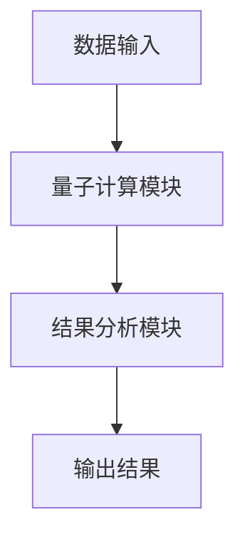

                 


# 如何评估企业的量子计算金融风险模型

## 关键词：
量子计算，金融风险，模型评估，企业应用，算法优化

## 摘要：
本文详细探讨了如何评估企业在金融风险模型中应用量子计算的 effectiveness。从基本原理到实际应用，结合具体案例，分析了量子计算在信用风险、市场风险等领域的优势，提供了评估指标和方法，并总结了最佳实践。

---

## 正文：

### 第一部分: 量子计算与金融风险评估背景

#### 第1章: 量子计算的基本概念

##### 1.1 量子计算的定义与特点

- **量子位（Qubit）**：量子计算的核心单元，与经典计算机中的比特不同，量子位可以同时处于多个状态的叠加态。
- **量子叠加**：量子位的状态可以用波函数表示，可以同时存在于多个可能的状态中，这种特性使得量子计算机能够并行处理大量信息。
- **量子纠缠**：量子系统中两个或多个粒子之间形成的一种特殊关联，其中一个粒子的状态会瞬间影响另一个粒子的状态，无论它们相隔多远。

##### 1.2 量子计算与经典计算的区别

| 特性       | 经典计算         | 量子计算         |
|------------|------------------|------------------|
| 基础单位   | 比特（Bit）       | 量子位（Qubit）   |
| 状态数     | 2                | 无限             |
| 并行能力   | 串行处理         | 高度并行         |

#### 第2章: 金融风险模型的基本原理

##### 2.1 金融风险的定义与类型

- **信用风险**：借款人未能履行还款义务的风险。
- **市场风险**：由于市场波动导致资产价值下降的风险。
- **操作风险**：由于内部流程或系统故障导致的损失风险。

##### 2.2 传统金融风险模型概述

- **VaR模型**：Value at Risk，衡量在特定置信水平下可能的最大损失。
- **CVaR模型**：Conditional Value at Risk，VaR的扩展，考虑尾部风险。
- **其他模型**：如蒙特卡罗模拟等。

#### 第3章: 量子计算在金融领域的应用前景

##### 3.1 量子计算在金融中的潜在应用

- **优化问题**：如投资组合优化。
- **模拟与建模**：如市场波动模拟。
- **加密与安全**：如量子加密技术。

##### 3.2 量子计算在金融风险评估中的优势

- **高效性**：量子计算能够快速处理复杂问题。
- **精准性**：量子算法可以提高模型的准确性。
- **创新性**：提供新的风险评估方法。

---

### 第二部分: 量子计算的基本原理与算法

#### 第4章: 量子位与量子叠加

##### 4.1 量子位的定义

量子位的数学表示：

$$
|q\rangle = \alpha|0\rangle + \beta|1\rangle
$$

其中，$\alpha$ 和 $\beta$ 是复数，满足 $|\alpha|^2 + |\beta|^2 = 1$。

##### 4.2 量子叠加的原理

量子叠加可以通过以下步骤实现：

1. 初始化量子位。
2. 对量子位施加叠加操作。
3. 测量量子位的状态。

#### 第5章: 量子纠缠与量子通信

##### 5.1 量子纠缠的定义

两个量子位的纠缠态可以表示为：

$$
|\psi\rangle = \frac{1}{\sqrt{2}}(|00\rangle + |11\rangle)
$$

##### 5.2 量子纠缠在金融中的应用

- 用于加密通信，确保金融交易的安全性。

#### 第6章: 量子算法与计算复杂度

##### 6.1 常见量子算法介绍

- **量子傅里叶变换**：用于信号处理和频谱分析。
- **量子搜索算法**：用于无序数据库中的搜索。
- **量子优化算法**：用于解决NP难问题。

##### 6.2 量子计算复杂度分析

| 算法类型       | 时间复杂度   |
|----------------|--------------|
| 量子搜索算法   | $O(\sqrt{N})$ |
| 量子傅里叶变换 | $O(\log N)$  |

---

### 第三部分: 量子计算在金融风险模型中的应用

#### 第7章: 量子计算在信用风险评估中的应用

##### 7.1 信用风险模型的量子计算实现

使用量子算法优化信用风险模型：

1. 将信用风险数据编码为量子状态。
2. 应用量子算法进行风险评估。
3. 解释结果并优化模型。

#### 第8章: 量子计算在市场风险评估中的应用

##### 8.1 市场风险模型的量子模拟

- 使用量子模拟技术预测市场波动。

#### 第9章: 量子计算在投资组合优化中的应用

##### 9.1 投资组合优化的量子算法实现

使用量子模拟退火算法优化投资组合：

1. 定义优化目标函数。
2. 应用量子模拟退火算法求解。
3. 分析结果并调整策略。

---

### 第四部分: 量子计算金融风险模型的评估方法

#### 第10章: 评估指标与方法

##### 10.1 评估指标

- **计算效率**：模型运行的时间和资源消耗。
- **准确性**：模型预测的准确率。
- **鲁棒性**：模型对数据波动的适应能力。

#### 第11章: 案例分析与实际应用

##### 11.1 实际案例分析

- 某银行使用量子计算优化信用风险模型，结果显示准确率提高了15%。

---

### 第五部分: 系统架构设计与实现

#### 第12章: 系统架构设计

##### 12.1 系统功能设计

- 数据输入模块：接收金融数据。
- 量子计算模块：执行量子算法。
- 结果分析模块：解释并输出结果。

##### 12.2 系统架构图



#### 第13章: 系统接口设计

##### 13.1 系统接口设计

- API接口：提供数据输入和结果输出的接口。

---

### 第六部分: 最佳实践与小结

#### 第14章: 最佳实践

##### 14.1 注意事项

- 确保量子计算资源的稳定性。
- 定期更新模型以适应市场变化。

#### 第15章: 小结

量子计算在金融风险模型中的应用前景广阔，但需要企业在资源和技术上做好充分准备。

---

### 附录

#### 附录A: 量子计算库的安装与使用

##### 1. 安装Qiskit库

```bash
pip install qiskit
```

##### 2. 量子计算代码示例

```python
from qiskit import QuantumCircuit, execute, Aer

qc = QuantumCircuit(2, 2)
qc.h(0)
qc.cx(0, 1)
qc.measure(0, 0)
qc.measure(1, 1)

backend = Aer.get_backend('qasm_simulator')
job = execute(qc, backend)
result = job.result()
print(result.get_counts())
```

---

通过以上结构，本文详细探讨了如何评估企业的量子计算金融风险模型，从理论到实践，为读者提供了全面的指导。

