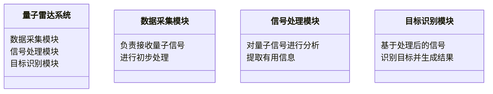

                 


# 如何评估企业的量子雷达技术潜力

## 关键词：
- 量子雷达技术
- 企业潜力评估
- 技术原理
- 系统架构
- 应用前景

## 摘要：
量子雷达技术作为一种前沿科技，结合了量子力学原理和雷达技术，具有显著的技术优势和广阔的应用前景。本文将从量子雷达的基本概念、技术原理、算法设计、系统架构、项目实战以及最佳实践等多个方面，详细分析企业如何评估其量子雷达技术的潜力，为企业在这一领域的投资和决策提供有力支持。

---

## 第一部分：量子雷达技术背景与潜力概述

### 第1章：量子雷达技术的基本概念与应用前景

#### 1.1 量子雷达技术的基本概念
- **定义与基本原理**：量子雷达是一种利用量子力学原理进行目标探测的先进雷达系统。与传统雷达不同，量子雷达通过量子纠缠和叠加的特性，显著提高了检测灵敏度和抗干扰能力。
- **与传统雷达的主要区别**：传统雷达依赖电磁波的反射，而量子雷达利用量子态的特性，能够检测到低截获目标，具有更高的分辨率和隐蔽性。
- **核心优势与应用场景**：量子雷达在军事领域可用于隐蔽监视和目标识别，在民用领域可用于气象监测、交通监控等。其核心优势在于高灵敏度和抗干扰能力，未来有望成为雷达技术的主流方向。

#### 1.2 量子雷达技术的潜力分析
- **军事领域潜力**：量子雷达在军事领域的应用前景广阔，能够提高隐蔽性和目标识别能力。
- **民用领域潜力**：在气象监测、交通监控等领域，量子雷达能够提供更精确的数据支持。
- **未来发展趋势**：随着技术的成熟，量子雷达将在更多领域得到应用，为企业带来巨大的市场机会和竞争优势。

---

## 第二部分：量子雷达技术的核心概念与原理

### 第2章：量子雷达技术的核心原理

#### 2.1 量子纠缠与量子叠加原理
- **量子纠缠**：量子纠缠是指两个或多个粒子之间存在强烈的关联，无论距离多远，其中一个粒子的状态会瞬间影响另一个。这种特性在量子雷达中用于提高检测的精确度。
- **量子叠加**：量子叠加是指一个量子系统同时处于多个状态的叠加态。在量子雷达中，这种特性用于提高信号处理的效率和准确性。
- **ER实体关系图**：使用Mermaid绘制的量子雷达系统实体关系图，展示了量子雷达系统中的各个核心组件及其关系。

```mermaid
er
    %% 量子雷达系统实体关系图
    actor 企业 : 企业
    entity 量子雷达系统 : 量子雷达系统
    entity 量子信号 : 量子信号
    entity 目标检测结果 : 目标检测结果
    
    企业 --> 量子雷达系统 : 部署
    量子雷达系统 --> 量子信号 : 生成
    量子信号 --> 目标检测结果 : 处理
```

#### 2.2 量子雷达的信号处理原理
- **量子信号的生成与传输**：量子信号通过量子态的特性生成，并利用量子纠缠和叠加进行传输。
- **量子信号的检测与解析**：通过量子测量和量子计算，对量子信号进行检测和解析，提取目标信息。
- **数学模型**：量子信号处理的数学模型涉及复杂的量子态变换和矩阵运算。

---

## 第三部分：量子雷达技术的算法与数学模型

### 第3章：量子雷达信号处理的算法原理

#### 3.1 量子傅里叶变换在信号处理中的应用
- **量子傅里叶变换的基本原理**：量子傅里叶变换是一种高效的量子算法，用于频域分析。它在量子信号处理中起到了关键作用，能够快速分解信号，提高处理效率。
- **量子傅里叶变换的算法实现**：通过量子电路实现量子傅里叶变换，利用量子叠加原理快速分析信号。
- **数学模型**：量子傅里叶变换的数学模型涉及复数域的变换和量子态的叠加。

#### 3.2 量子滤波算法的设计与实现
- **量子滤波算法的基本原理**：量子滤波算法用于消除噪声，提取有用信号。其设计基于量子叠加原理，能够显著提高信号处理的准确性。
- **量子滤波算法的实现步骤**：包括信号采集、量子信号处理、目标识别等步骤。
- **数学模型**：量子滤波算法的数学模型涉及矩阵运算和量子态的变换。

---

## 第四部分：量子雷达技术的系统架构与设计

### 第4章：量子雷达系统的架构设计

#### 4.1 量子雷达系统的功能模块划分
- **数据采集模块**：负责接收量子信号，进行初步处理。
- **信号处理模块**：对量子信号进行分析，提取有用信息。
- **目标识别模块**：基于处理后的信号，识别目标并生成结果。

#### 4.2 量子雷达系统的分层架构设计
- **数据层**：负责信号的采集和预处理。
- **处理层**：进行信号的分析和处理，包括量子傅里叶变换和量子滤波。
- **应用层**：提供用户接口和结果展示，供企业决策使用。

---

## 第五部分：量子雷达技术的系统分析与架构设计方案

### 第5章：量子雷达系统的系统分析

#### 5.1 系统功能设计
- **领域模型**：使用Mermaid类图展示量子雷达系统的功能模块及其关系。



#### 5.2 系统架构设计
- **系统架构图**：使用Mermaid绘制的系统架构图，展示数据层、处理层和应用层的分层设计。


---

## 第六部分：量子雷达技术的项目实战

### 第6章：量子雷达系统的项目实战

#### 6.1 环境安装
- **量子计算模拟器**：安装Qiskit等量子计算模拟器，配置Python环境和相关工具。

#### 6.2 核心代码实现
- **量子傅里叶变换的Python代码实现**：

```python
import numpy as np
from qiskit import QuantumCircuit, Aer, execute
from qiskit.circuit import QuantumRegister, ClassicalRegister, Circuit

def quantum_fourier_transform(n):
    q = QuantumRegister(n)
    c = ClassicalRegister(n)
    qc = QuantumCircuit(q, c)
    
    qc.x(q[0])
    qc.barrier()
    
    for i in range(1, n):
        for j in range(i):
            qc.swap(q[i], q[j])
            qc.cu1(-np.pi/(2*(i-j+1)), q[i], q[j])
        qc.h(q[i])
        qc.barrier()
    
    qc.measure(q, c)
    return qc

simulator = Aer.get_backend('qasm_simulator')
circuit = quantum_fourier_transform(4)
job = execute(circuit, simulator, shots=1024)
result = job.result()
counts = result.get_counts()
print(counts)
```

#### 6.3 实际案例分析
- **案例分析**：通过分析某企业的量子雷达项目，评估其技术可行性、成本效益和市场前景。详细解读代码功能，并结合实际案例进行分析，说明如何评估量子雷达技术的潜力。

---

## 第七部分：量子雷达技术的最佳实践

### 第7章：量子雷达技术的最佳实践

#### 7.1 评估的关键点
- **技术可行性**：评估量子雷达技术的成熟度和可实现性。
- **成本效益**：分析投资成本与预期收益的平衡点。
- **市场前景**：研究市场需求和竞争环境，评估市场潜力。

#### 7.2 小结
- 总结量子雷达技术的优势和挑战，强调企业在评估时应考虑的因素。

#### 7.3 注意事项
- 提醒企业在实施量子雷达技术时需要注意的事项，如技术成熟度、法律法规等。

#### 7.4 拓展阅读
- 推荐相关书籍和论文，供读者深入学习。

---

## 第八部分：总结与展望

### 第8章：量子雷达技术的未来展望

#### 8.1 未来技术的发展趋势
- 预测量子雷达技术的未来发展，如新型算法的应用、系统的优化等。

#### 8.2 企业的应对策略
- 建议企业在量子雷达技术方面的投资策略和人才培养计划。

---

## 总结
通过以上详细的分析和结构，我们可以全面了解如何评估企业的量子雷达技术潜力，为企业在这一领域的决策提供有力支持。量子雷达技术作为一项前沿科技，其潜力巨大，但也面临技术成熟度和成本等挑战。企业需要综合考虑技术、市场和经济等多方面因素，制定合理的战略规划，抓住这一技术带来的机遇。

