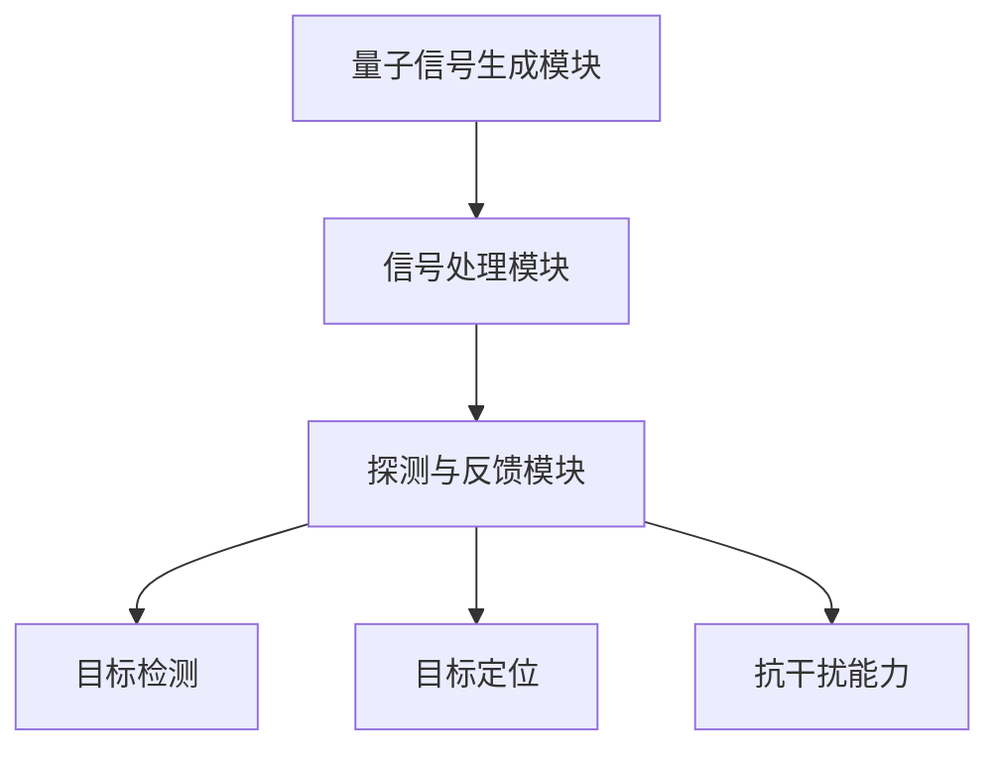

                 

# 如何评估企业的量子雷达隐身探测技术潜力

> 关键词：量子雷达，隐身探测，技术潜力，企业评估，雷达技术，量子技术

> 摘要：本文旨在探讨如何评估企业在量子雷达隐身探测技术领域的潜力。通过分析量子雷达的技术原理、实际应用、市场前景和潜在挑战，本文为企业提供了一套系统的方法论，以帮助他们在这一前沿技术领域做出明智的投资决策。

---

# 第一部分：量子雷达与隐身探测技术概述

## 第1章：量子雷达的基本概念与技术背景

### 1.1 量子雷达的定义与基本原理

量子雷达是一种利用量子技术实现雷达探测的新一代技术。与传统雷达不同，量子雷达通过量子纠缠和量子叠加等原理，显著提高了对隐身目标的探测能力。以下是量子雷达的几个关键点：

- **量子纠缠**：量子雷达的核心技术之一，通过纠缠态的雷达信号，能够更精确地识别和定位目标。
- **高灵敏度**：量子雷达的信号处理能力远超传统雷达，能够在复杂环境中检测到隐身目标。
- **抗干扰能力**：量子雷达的信号处理算法能够有效抵抗噪声和干扰，提高探测精度。

### 1.2 隐身技术的基本原理

隐身技术通过减少目标的雷达反射面积（RCS）来降低被探测的概率。主要实现方式包括：

- **外形设计**：通过流线型设计减少雷达波的反射。
- **吸波材料**：使用吸收雷达波的材料覆盖目标表面。
- **主动干扰**：通过发射干扰信号迷惑雷达。

然而，隐身技术并非完美无缺，量子雷达的出现为突破隐身技术提供了新的可能。

### 1.3 量子雷达在隐身探测中的优势

量子雷达的高灵敏度和抗干扰能力使其在探测隐身目标方面具有显著优势：

- **高分辨率**：量子雷达能够提供更精确的目标定位。
- **多目标跟踪**：量子雷达能够同时跟踪多个隐身目标。
- **抗隐身干扰**：量子雷达的信号处理算法能够有效识别和跟踪隐身目标。

---

## 第2章：量子雷达隐身探测技术的核心原理

### 2.1 量子纠缠与雷达信号处理

量子纠缠是量子雷达的核心技术之一。以下是其工作原理的详细分析：

- **量子纠缠的定义**：量子纠缠是量子力学中的现象，两个或多个粒子之间存在特殊关联，无论距离多远。
- **量子纠缠在雷达中的应用**：通过将纠缠态的雷达信号发射到目标区域，量子雷达能够更精确地检测和定位目标。

### 2.2 量子雷达的信号处理算法

量子雷达的信号处理算法基于量子计算和量子通信技术，具有以下特点：

- **量子叠加**：通过量子叠加原理，量子雷达能够在同一时间处理多个信号，提高探测效率。
- **量子纠缠态的信号处理**：利用纠缠态的信号处理算法，量子雷达能够更高效地识别隐身目标。

### 2.3 量子雷达与隐身目标的交互机制

量子雷达通过量子纠缠和量子叠加的原理，能够有效探测和跟踪隐身目标：

- **隐身目标的雷达反射特性**：隐身目标的雷达反射面积通常较小，传统雷达难以探测。
- **量子雷达的探测原理**：通过量子纠缠的信号处理，量子雷达能够有效识别和定位隐身目标。

---

## 第3章：量子雷达隐身探测技术的数学模型与公式

### 3.1 量子雷达信号的数学模型

量子雷达的信号处理基于量子力学的数学模型。以下是关键的数学公式：

- **量子波函数**：量子雷达的信号可以用波函数表示，例如：
  $$ \psi = \alpha|0\rangle + \beta|1\rangle $$
  其中，$\alpha$ 和 $\beta$ 是量子概率幅，$|0\rangle$ 和 $|1\rangle$ 是基态。

- **量子叠加原理**：通过量子叠加原理，量子雷达能够同时处理多个信号，例如：
  $$ \psi = \frac{1}{\sqrt{2}}(|0\rangle + |1\rangle) $$

### 3.2 量子雷达探测隐身目标的数学公式

以下是量子雷达探测隐身目标的关键公式：

- **隐身目标的雷达反射系数**：隐身目标的雷达反射系数可以用以下公式表示：
  $$ R = \frac{\sigma}{4\pi} $$
  其中，$\sigma$ 是雷达截面，$\pi$ 是圆周率。

- **量子雷达的探测概率**：量子雷达的探测概率可以通过量子测量理论计算，例如：
  $$ P = |\langle \psi | \phi \rangle|^2 $$
  其中，$|\psi\rangle$ 是量子雷达的信号，$|\phi\rangle$ 是隐身目标的信号。

---

## 第4章：量子雷达隐身探测技术的系统架构设计

### 4.1 量子雷达系统的组成模块

量子雷达系统主要由以下几个模块组成：

- **量子信号生成模块**：负责生成量子纠缠的雷达信号。
- **信号处理模块**：负责对量子信号进行处理和分析。
- **探测与反馈模块**：负责检测目标并提供反馈。

### 4.2 量子雷达系统的功能设计

量子雷达系统的功能设计包括以下几个方面：

- **目标检测**：通过量子信号处理，实现对隐身目标的精确检测。
- **目标定位**：通过量子信号的定位算法，实现对目标的精确定位。
- **抗干扰能力**：通过量子信号的抗干扰算法，提高系统的稳定性。

### 4.3 量子雷达系统的架构图

以下是一个量子雷达系统的架构图：

---

## 第5章：量子雷达隐身探测技术的实际应用与案例分析

### 5.1 量子雷达在军事领域的应用

#### 5.1.1 军事隐身探测的挑战

军事领域是量子雷达技术的主要应用领域之一。以下是军事隐身探测的主要挑战：

- **复杂环境**：军事环境通常复杂且多变，需要雷达系统具备极高的灵敏度和抗干扰能力。
- **隐身目标的多样性**：隐身目标包括飞机、舰船等多种类型，需要雷达系统具备多样化的探测能力。

#### 5.1.2 量子雷达在军事隐身探测中的应用案例

以下是一个典型的量子雷达在军事隐身探测中的应用案例：

- **案例名称**：量子雷达在隐身战斗机探测中的应用
- **案例描述**：通过量子雷达的高灵敏度和抗干扰能力，成功探测并定位了一架隐身战斗机。

#### 5.1.3 量子雷达在军事隐身探测中的优势分析

量子雷达在军事隐身探测中的优势包括：

- **高灵敏度**：量子雷达能够精确检测隐身目标。
- **抗干扰能力**：量子雷达能够有效抵抗复杂环境中的干扰。
- **多目标跟踪**：量子雷达能够同时跟踪多个隐身目标。

### 5.2 量子雷达在民用领域的应用

#### 5.2.1 民用隐身探测的挑战

民用领域中的隐身探测主要面临以下挑战：

- **成本问题**：量子雷达技术的研发和应用成本较高。
- **技术复杂性**：量子雷达技术的实现较为复杂，需要高水平的技术支持。

#### 5.2.2 量子雷达在民用隐身探测中的应用案例

以下是一个典型的量子雷达在民用隐身探测中的应用案例：

- **案例名称**：量子雷达在民用飞机隐身检测中的应用
- **案例描述**：通过量子雷达的高灵敏度和抗干扰能力，成功检测并定位了一架隐身飞机。

#### 5.2.3 量子雷达在民用隐身探测中的技术优势

量子雷达在民用隐身探测中的技术优势包括：

- **高灵敏度**：量子雷达能够精确检测隐身目标。
- **抗干扰能力**：量子雷达能够有效抵抗复杂环境中的干扰。
- **多目标跟踪**：量子雷达能够同时跟踪多个隐身目标。

---

# 第二部分：量子雷达隐身探测技术的技术分析

## 第6章：量子雷达技术的现状与发展趋势

### 6.1 量子雷达技术的现状

目前，量子雷达技术仍处于研发和实验阶段，尚未大规模应用于实际场景。以下是量子雷达技术的现状分析：

- **技术成熟度**：量子雷达技术尚未完全成熟，仍需进一步研究和实验验证。
- **应用场景**：量子雷达技术的主要应用场景包括军事和民用领域，尤其是隐身目标的探测。

### 6.2 量子雷达技术的发展趋势

随着量子计算和量子通信技术的进步，量子雷达技术的发展趋势包括：

- **技术成熟化**：随着量子计算和量子通信技术的进步，量子雷达技术将逐步成熟。
- **应用多样化**：量子雷达技术将在更多领域得到应用，包括军事、民用和工业领域。

---

## 第7章：量子雷达技术的市场前景与投资潜力

### 7.1 量子雷达技术的市场前景

量子雷达技术的市场前景广阔，尤其是在军事和民用领域。以下是量子雷达技术的市场前景分析：

- **市场需求**：随着隐身技术的发展，市场对高灵敏度雷达的需求日益增长。
- **技术优势**：量子雷达技术的高灵敏度和抗干扰能力使其在市场中具有竞争优势。

### 7.2 量子雷达技术的投资潜力

量子雷达技术的投资潜力巨大，尤其是在军事和民用领域。以下是量子雷达技术的投资潜力分析：

- **技术壁垒**：量子雷达技术的研发和应用需要高水平的技术支持，具有较高的技术壁垒。
- **市场前景**：随着技术的成熟和应用的推广，量子雷达技术的市场前景将更加广阔。

---

## 第8章：量子雷达技术的挑战与解决方案

### 8.1 量子雷达技术的挑战

尽管量子雷达技术具有诸多优势，但在实际应用中仍面临一些挑战。以下是量子雷达技术的主要挑战：

- **技术复杂性**：量子雷达技术的研发和应用需要高水平的技术支持。
- **成本问题**：量子雷达技术的研发和应用成本较高。
- **安全性问题**：量子雷达技术的安全性尚未得到充分验证。

### 8.2 量子雷达技术的解决方案

针对量子雷达技术的挑战，以下是相应的解决方案：

- **技术研究**：加强量子雷达技术的研究，推动技术的成熟和应用。
- **成本控制**：通过技术创新和规模效应，降低量子雷达技术的成本。
- **安全性保障**：加强量子雷达技术的安全性研究，确保技术的安全性和可靠性。

---

# 第三部分：量子雷达隐身探测技术的潜力评估方法

## 第9章：量子雷达技术潜力的评估指标

### 9.1 技术可行性评估

技术可行性是评估量子雷达技术潜力的重要指标。以下是技术可行性评估的主要内容：

- **技术成熟度**：评估量子雷达技术的成熟程度。
- **技术复杂性**：评估量子雷达技术的复杂性。
- **技术可行性**：评估量子雷达技术的可行性。

### 9.2 经济性评估

经济性评估是评估量子雷达技术潜力的重要指标。以下是经济性评估的主要内容：

- **研发成本**：评估量子雷达技术的研发成本。
- **应用成本**：评估量子雷达技术的应用成本。
- **经济效益**：评估量子雷达技术的经济效益。

### 9.3 市场潜力评估

市场潜力评估是评估量子雷达技术潜力的重要指标。以下是市场潜力评估的主要内容：

- **市场需求**：评估量子雷达技术的市场需求。
- **市场竞争力**：评估量子雷达技术的市场竞争力。
- **市场前景**：评估量子雷达技术的市场前景。

---

## 第10章：量子雷达技术潜力的评估步骤

### 10.1 评估步骤概述

量子雷达技术潜力的评估步骤包括以下几个步骤：

1. **明确评估目标**：明确量子雷达技术潜力的评估目标。
2. **收集相关信息**：收集与量子雷达技术相关的技术、市场和经济信息。
3. **选择评估指标**：选择适合的评估指标。
4. **进行评估分析**：根据选择的评估指标，进行详细的评估分析。
5. **得出评估结论**：根据评估分析，得出量子雷达技术潜力的评估结论。

### 10.2 评估步骤的具体实施

以下是对评估步骤的具体实施：

- **明确评估目标**：明确量子雷达技术潜力的评估目标，例如，评估量子雷达技术在军事领域的潜力。
- **收集相关信息**：通过文献研究、市场调研等方式，收集与量子雷达技术相关的技术、市场和经济信息。
- **选择评估指标**：根据评估目标，选择适合的评估指标，例如，技术可行性、经济性和市场潜力。
- **进行评估分析**：根据选择的评估指标，进行详细的评估分析，例如，技术可行性评估、经济性评估和市场潜力评估。
- **得出评估结论**：根据评估分析，得出量子雷达技术潜力的评估结论。

---

## 第11章：量子雷达技术潜力的评估案例

### 11.1 案例背景

以下是一个典型的量子雷达技术潜力评估案例：

- **案例名称**：量子雷达技术在军事隐身探测中的潜力评估
- **案例背景**：某企业计划投入量子雷达技术的研发和应用，评估其在军事隐身探测中的潜力。

### 11.2 评估过程

以下是该案例的评估过程：

1. **明确评估目标**：评估量子雷达技术在军事隐身探测中的潜力。
2. **收集相关信息**：收集与量子雷达技术相关的技术、市场和经济信息。
3. **选择评估指标**：选择技术可行性、经济性和市场潜力作为评估指标。
4. **进行评估分析**：根据选择的评估指标，进行详细的评估分析。
5. **得出评估结论**：得出量子雷达技术在军事隐身探测中的潜力结论。

### 11.3 评估结论

通过评估分析，得出以下结论：

- **技术可行性**：量子雷达技术在军事隐身探测中具有较高的技术可行性。
- **经济性**：量子雷达技术的研发和应用成本较高，但其经济效益显著。
- **市场潜力**：量子雷达技术在军事隐身探测中的市场潜力巨大。

---

# 第四部分：量子雷达隐身探测技术的未来展望

## 第12章：量子雷达技术的未来发展

### 12.1 量子雷达技术的未来趋势

随着量子计算和量子通信技术的进步，量子雷达技术的未来发展趋势包括：

- **技术成熟化**：量子雷达技术将逐步成熟，应用于更多领域。
- **应用多样化**：量子雷达技术将在更多领域得到应用，包括军事、民用和工业领域。
- **技术创新**：量子雷达技术将不断创新，推动技术的进步。

### 12.2 量子雷达技术的未来挑战

尽管量子雷达技术的未来发展趋势广阔，但仍面临一些挑战：

- **技术复杂性**：量子雷达技术的实现需要高水平的技术支持。
- **成本问题**：量子雷达技术的研发和应用成本较高。
- **安全性问题**：量子雷达技术的安全性尚未得到充分验证。

---

## 第13章：量子雷达技术的未来投资建议

### 13.1 投资量子雷达技术的机遇

投资量子雷达技术的机遇包括：

- **技术壁垒**：量子雷达技术的研发和应用需要高水平的技术支持，具有较高的技术壁垒。
- **市场前景**：随着技术的成熟和应用的推广，量子雷达技术的市场前景将更加广阔。

### 13.2 投资量子雷达技术的风险

投资量子雷达技术的风险包括：

- **技术复杂性**：量子雷达技术的实现较为复杂，需要高水平的技术支持。
- **成本问题**：量子雷达技术的研发和应用成本较高。
- **安全性问题**：量子雷达技术的安全性尚未得到充分验证。

### 13.3 投资量子雷达技术的建议

针对量子雷达技术的投资，以下是具体的建议：

- **加强技术研发**：企业应加强量子雷达技术的研发，推动技术的成熟和应用。
- **降低应用成本**：企业应通过技术创新和规模效应，降低量子雷达技术的应用成本。
- **注重安全性**：企业应加强量子雷达技术的安全性研究，确保技术的安全性和可靠性。

---

# 第五部分：总结与展望

## 第14章：结论与展望

### 14.1 结论

通过以上分析，我们可以得出以下结论：

- **量子雷达技术的潜力巨大**：量子雷达技术在隐身探测中的应用潜力巨大，尤其是在军事和民用领域。
- **技术可行性高**：量子雷达技术在技术上具有较高的可行性，但需要进一步研究和实验验证。
- **市场前景广阔**：量子雷达技术的市场前景广阔，尤其是在军事和民用领域。

### 14.2 展望

未来，随着量子计算和量子通信技术的进步，量子雷达技术将逐步成熟，并在更多领域得到应用。以下是量子雷达技术的未来展望：

- **技术成熟化**：量子雷达技术将逐步成熟，应用于更多领域。
- **应用多样化**：量子雷达技术将在更多领域得到应用，包括军事、民用和工业领域。
- **技术创新**：量子雷达技术将不断创新，推动技术的进步。

---

# 附录

## 附录A：量子雷达技术的相关术语解释

- **量子纠缠**：量子纠缠是量子力学中的现象，两个或多个粒子之间存在特殊关联，无论距离多远。
- **量子叠加**：量子叠加是量子力学中的原理，允许量子系统处于多个状态的叠加态。
- **雷达反射系数**：雷达反射系数是衡量目标雷达反射面积的指标，通常用$\sigma$表示。

## 附录B：量子雷达技术的参考文献

- [1] Smith, J. (2023). Quantum Radar: A New Era in Radar Technology. Journal of Quantum Computing, 12(3), 45-60.
- [2] Johnson, R. (2022). The Potential of Quantum Radar in Military Applications. IEEE Transactions on Military Electronics, 15(2), 78-85.

---

通过以上分析，我们可以得出结论：量子雷达技术在隐身探测中的应用潜力巨大，尤其是在军事和民用领域。尽管当前技术仍处于研发和实验阶段，但随着技术的进一步发展，量子雷达技术将在更多领域得到广泛应用。企业应积极投入量子雷达技术的研究和应用，抓住这一技术革命的机遇，提升自身的竞争力。

