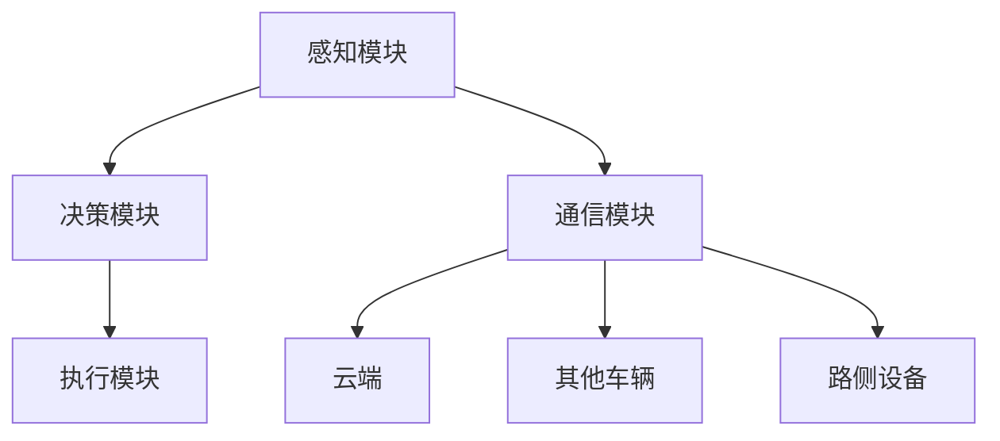
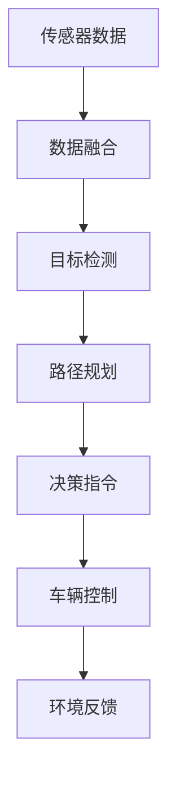

                 


# 如何评估企业的高级驾驶辅助系统

> 关键词：高级驾驶辅助系统、自动驾驶、技术评估、系统架构、算法原理、传感器技术、数据融合

> 摘要：本文详细探讨了如何评估企业级高级驾驶辅助系统（ADAS）的各个方面，包括其核心技术、系统架构、评估方法和实际案例分析。通过系统化的分析和实践指导，帮助读者全面了解ADAS的评估流程和关键考量因素。

---

## 第一部分: 高级驾驶辅助系统（ADAS）概述

### 第1章: 高级驾驶辅助系统（ADAS）的背景与概述

#### 1.1 ADAS的核心概念与定义

ADAS（Advanced Driver-Assistance Systems）高级驾驶辅助系统是一种集成多种传感器、计算单元和执行机构的智能系统，旨在通过感知环境、分析数据并提供辅助决策或执行操作，以提升驾驶安全性和用户体验。其核心目标是减少交通事故的发生，提高驾驶效率。

- **定义**：ADAS是一种通过传感器、摄像头、雷达等设备收集环境信息，并利用算法进行数据处理，从而辅助驾驶员做出更安全、更高效的驾驶决策的系统。
- **核心功能**：包括但不限于车道偏离预警（LDW）、自适应巡航控制（ACC）、自动紧急制动（AEB）、车道保持辅助（LKA）、交通标志识别（TSR）、盲点监测（BSD）等。
- **边界与外延**：ADAS通常被视为自动驾驶（AD）技术的初级阶段，但其功能和架构为更高级别的自动驾驶系统（如L3、L4、L5）奠定了基础。ADAS的外延包括但不限于车辆通信（V2X）、车路协同、车辆网络安全等。

#### 1.2 ADAS的背景与发展趋势

随着全球对交通安全和自动驾驶技术的重视，ADAS逐渐成为汽车行业的核心配置。以下是其发展的关键背景和趋势：

- **背景**：
  - 交通安全问题：每年因交通事故造成的人员伤亡和财产损失巨大，ADAS通过技术手段降低事故发生率。
  - 技术进步：传感器技术、人工智能算法和计算能力的提升使得ADAS的功能更加丰富和可靠。
  - 政策推动：各国政府通过法规和技术标准推动ADAS的普及，例如联合国欧洲经济委员会（UNECE）的R155/156法规。

- **发展趋势**：
  - 功能集成化：ADAS功能的整合度越来越高，例如将多个传感器数据融合以提高系统可靠性。
  - 网络化与协同：车与车、车与路的协同（V2X）逐渐成为ADAS的重要组成部分。
  - 智能化：基于深度学习的算法逐渐取代传统规则引擎，系统决策能力显著提升。

---

### 第2章: ADAS的核心技术与系统架构

#### 2.1 ADAS的关键技术模块

ADAS的核心技术主要体现在以下几个方面：

##### 2.1.1 传感器技术

传感器是ADAS的“眼睛”和“耳朵”，负责收集车辆周围的环境信息。主要传感器类型包括：

- **激光雷达（LiDAR）**：
  - 工作原理：通过发射激光束并接收反射信号来构建周围环境的三维点云模型。
  - 优缺点：高精度、长距离检测能力，但成本高、易受天气条件影响。

- **摄像头**：
  - 工作原理：通过光学成像采集图像信息，并利用计算机视觉算法进行目标检测和识别。
  - 优缺点：成本低、信息丰富，但受光照和天气条件影响较大。

- **毫米波雷达（MMR）**：
  - 工作原理：通过发射毫米波信号并接收反射信号，用于检测目标的距离、速度和角度。
  - 优缺点：抗天气干扰能力强，但对小目标检测能力有限。

- **超声波传感器**：
  - 工作原理：通过发射超声波并接收反射信号，用于短距离测距。
  - 优缺点：成本低、适合低速环境，但检测距离有限。

##### 2.1.2 数据处理与算法

ADAS的智能化依赖于强大的数据处理和算法能力，主要包括：

- **传感器数据融合**：
  - **定义**：将来自不同传感器的数据（如LiDAR、摄像头、毫米波雷达）进行融合，以提高感知的准确性和鲁棒性。
  - **方法**：基于卡尔曼滤波（Kalman Filter）或其改进版本（如扩展卡尔曼滤波、无迹卡尔曼滤波）实现。
  - **优势**：通过多源数据融合，弥补单一传感器的局限性，提高系统可靠性。

- **目标检测与识别**：
  - **算法原理**：基于深度学习的目标检测算法（如YOLO、Faster R-CNN）通过卷积神经网络（CNN）提取图像特征，实现对车辆、行人、障碍物等目标的检测与分类。
  - **挑战**：复杂场景下的目标遮挡、光照变化、动态背景等问题。

- **路径规划与决策算法**：
  - **定义**：根据车辆当前位置、目标位置和环境信息，规划出一条安全、高效的行驶路径，并实时调整路径以应对动态变化的环境。
  - **算法**：基于搜索算法（如A*、Dijkstra）或基于采样的方法（如RRT*），结合车辆动力学约束和环境约束。

##### 2.1.3 通信技术

ADAS的通信技术主要分为两类：

- **车辆间通信（V2V）**：
  - 定义：车辆之间通过无线通信技术（如DSRC、LTE-V）实时交换位置、速度、意图等信息，以提高协同驾驶的安全性和效率。
  - 应用场景：紧急制动提醒、车辆队列控制等。

- **车路协同（V2I）**：
  - 定义：车辆与道路基础设施（如交通信号灯、路标）之间的通信，获取实时交通信息和道路状态。
  - 应用场景：优化交通流量、减少拥堵。

- **车云协同（V2C）**：
  - 定义：车辆与云端服务器之间的数据交互，利用云计算资源进行大规模数据处理和模型训练。
  - 应用场景：实时地图更新、交通预测、远程驾驶支持等。

#### 2.2 ADAS的系统架构

ADAS的系统架构可以分为以下几个部分：

##### 2.2.1 功能模块划分

- **感知模块**：
  - 负责收集和处理环境数据，包括目标检测、车道线识别、交通信号识别等。
- **决策模块**：
  - 根据感知结果和车辆状态，生成驾驶决策，例如转向、加速或制动指令。
- **执行模块**：
  - 负责将决策指令转化为实际的车辆操作，例如通过ECU（电子控制单元）控制转向、油门和刹车。
- **通信模块**：
  - 负责与外部设备（如其他车辆、路侧设备、云端）进行数据交互。

##### 2.2.2 系统架构图

以下是ADAS系统的功能架构图：



##### 2.2.3 数据流图

以下是ADAS系统的数据流图：



---

### 第3章: ADAS的核心算法与数学模型

#### 3.1 传感器数据融合算法

##### 3.1.1 卡尔曼滤波原理

卡尔曼滤波是一种用于估计系统状态的递归算法，适用于线性系统的状态估计。其基本公式如下：

$$
\begin{aligned}
    \hat{x}_{k|k-1} &= A \hat{x}_{k-1} + B u_{k-1} \\
    P_{k|k-1} &= A P_{k-1} A^T + Q \\
    y_{k} &= C \hat{x}_{k|k-1} + D u_{k} + v_{k} \\
    S_{k} &= C P_{k|k-1} C^T + R \\
    K_{k} &= P_{k|k-1} C^T S_{k}^{-1} \\
    \hat{x}_{k|k} &= \hat{x}_{k|k-1} + K_{k} (y_{k} - C \hat{x}_{k|k-1}) \\
    P_{k|k} &= (I - K_{k} C) P_{k|k-1}
\end{aligned}
$$

其中：
- $\hat{x}$：状态估计
- $P$：估计误差协方差
- $A$、$B$：系统模型矩阵
- $C$、$D$：观测模型矩阵
- $Q$、$R$：过程噪声和测量噪声的协方差矩阵

##### 3.1.2 图论与数据融合网络

数据融合网络可以看作是一个图结构，其中节点表示传感器或数据源，边表示数据之间的关联关系。通过图论中的最短路径算法或最小生成树算法，可以实现多源数据的最优融合。

##### 3.1.3 融合算法的实现步骤

以下是卡尔曼滤波的实现步骤：

1. 初始化状态估计 $\hat{x}_0$ 和误差协方差 $P_0$。
2. 对于每个时间步 $k$：
   - 预测步骤：
     - 根据系统模型更新状态估计 $\hat{x}_{k|k-1} = A \hat{x}_{k-1} + B u_{k-1}$。
     - 更新误差协方差 $P_{k|k-1} = A P_{k-1} A^T + Q$。
   - 更新步骤：
     - 计算测量残差 $y_{k} = z_{k} - C \hat{x}_{k|k-1}$。
     - 计算$S_{k} = C P_{k|k-1} C^T + R$。
     - 计算卡尔曼增益 $K_{k} = P_{k|k-1} C^T S_{k}^{-1}$。
     - 更新状态估计 $\hat{x}_{k|k} = \hat{x}_{k|k-1} + K_{k} y_{k}$。
     - 更新误差协方差 $P_{k|k} = (I - K_{k} C) P_{k|k-1}$。

##### 3.2 目标检测与识别算法

##### 3.2.1 YOLO算法原理

YOLO（You Only Look Once）是一种基于深度学习的目标检测算法，通过将图像划分为网格，并预测每个网格内的目标类别和位置。其核心步骤如下：

1. **特征提取**：将输入图像通过卷积神经网络提取特征图。
2. **边界框回归**：在每个网格中预测目标的边界框坐标和置信度。
3. **非极大值抑制（NMS）**：去除重叠的边界框，保留置信度最高的结果。

以下是YOLO算法的损失函数示例：

$$
\begin{aligned}
    \text{总损失} &= \lambda_{\text{xy}} \sum (x - \hat{x})^2 + \lambda_{\text{wh}} \sum (w - \hat{w})^2 \\
                  &+ \lambda_{\text{conf}} \sum (p - \hat{p})^2 \\
                  + \sum_{i=1}^{n} \lambda_{\text{cls}} \sum (C_i - \hat{C}_i)^2
\end{aligned}
$$

其中：
- $\lambda$：不同损失项的权重系数
- $x, y, w, h$：边界框的坐标和尺寸
- $p$：置信度
- $C_i$：目标类别标签

##### 3.2.2 Faster R-CNN算法

Faster R-CNN是一种经典的两阶段目标检测算法，主要包括：

1. **区域建议网络（RPN）**：生成可能包含目标的区域建议。
2. **快分类器**：对每个区域建议进行目标分类和边界框回归。

其优势在于精度高，但缺点是计算复杂度较高。

##### 3.2.3 目标检测的损失函数与优化方法

目标检测算法的损失函数通常包括定位损失（Localization Loss）、置信度损失（Confidence Loss）和分类损失（Classification Loss）。常用的优化方法包括随机梯度下降（SGD）和Adam优化器。

---

## 第四部分: ADAS的评估方法与标准

### 第4章: ADAS的评估方法与标准

#### 4.1 评估指标与方法

##### 4.1.1 国际标准

- **联合国法规（R155/156）**：规定了ADAS系统的基本要求、测试条件和验证方法。
- **ISO 21448**：明确了自动驾驶系统开发的国际标准，包括风险评估和缓解策略。
- **SAE J3016**：定义了自动驾驶系统的分级和术语。

##### 4.1.2 评估指标

- **功能完整性**：系统是否覆盖所有设计的功能。
- **安全性**：系统在极端情况下的表现，例如碰撞 avoidance。
- **可靠性**：系统在各种环境和条件下的稳定性和一致性。
- **响应时间**：系统对环境变化的反应速度。
- **用户体验**：驾驶员对系统辅助的接受程度和满意度。

##### 4.1.3 评估流程

1. **需求分析**：明确系统功能、性能指标和测试要求。
2. **测试用例设计**：基于系统功能和风险分析设计测试场景。
3. **测试执行**：在模拟或实际环境中执行测试用例，记录系统行为。
4. **数据分析与验证**：对测试结果进行统计分析，验证系统是否满足设计要求。
5. **持续优化**：根据测试结果优化系统算法和参数，迭代改进。

#### 4.2 系统架构与测试方案

##### 4.2.1 系统架构

ADAS系统的架构通常包括感知层、决策层和执行层。感知层负责数据采集与处理，决策层负责策略制定，执行层负责具体操作。

##### 4.2.2 测试方案

- **功能测试**：验证系统是否实现预期功能。
- **性能测试**：评估系统在高负载或复杂环境下的表现。
- **安全性测试**：验证系统在极端或危险情况下的应对能力。
- **用户体验测试**：收集驾驶员对系统辅助的反馈，优化人机交互。

---

## 第五部分: 项目实战

### 第5章: 项目实战：评估某企业ADAS系统

#### 5.1 项目背景

某汽车制造商希望对其ADAS系统进行全面评估，以确保系统在各种环境和条件下的安全性和可靠性。

#### 5.2 环境安装

- **硬件环境**：高性能计算平台（如GPU服务器）。
- **软件环境**：操作系统（如Linux）、深度学习框架（如TensorFlow、PyTorch）、传感器模拟工具（如CARLA）。

#### 5.3 核心代码实现

##### 5.3.1 传感器数据融合

以下是卡尔曼滤波的Python实现示例：

```python
import numpy as np

def kalman_filter(x_est, P_est, A, B, C, D, Q, R, z):
    x_pred = A @ x_est + B @ u
    P_pred = A @ P_est @ A.T + Q
    y = z - C @ x_pred
    S = C @ P_pred @ C.T + R
    K = P_pred @ C.T @ np.linalg.inv(S)
    x_est = x_pred + K @ y
    P_est = (np.eye(x_est.shape[0]) - K @ C) @ P_pred
    return x_est, P_est
```

##### 5.3.2 目标检测与识别

以下是YOLO目标检测的Python实现示例：

```python
import tensorflow as tf
from tensorflow.keras.layers import Input, Conv2D, MaxPooling2D, Dense, Flatten

model = tf.keras.Model(inputs=Input(shape=(416, 416, 3)), outputs=detections)
model.load_weights('yolov4.tf')

def detect_objects(image):
    resized = tf.image.resize(image, (416, 416))
    pred = model.predict(tf.expand_dims(resized, axis=0))
    return pred
```

#### 5.4 代码应用解读与分析

- **传感器数据融合**：通过卡尔曼滤波实现多传感器数据的最优融合，提高系统感知精度。
- **目标检测与识别**：基于深度学习的目标检测算法实现环境目标的识别和定位。

#### 5.5 实际案例分析

通过在模拟环境（如CARLA）中测试ADAS系统的功能，记录系统在不同场景下的表现，例如：

- **场景1**：前方突然出现行人，系统应触发紧急制动。
- **场景2**：车道线模糊，系统应调整车道保持辅助的参数。

#### 5.6 项目小结

通过实际项目，验证了ADAS系统评估方法的有效性，并积累了宝贵的经验，例如：

- **经验1**：传感器数据融合的关键在于选择合适的算法和参数。
- **经验2**：目标检测算法的性能依赖于数据质量和模型训练。

---

## 第六部分: 最佳实践与未来展望

### 第6章: 最佳实践与未来展望

#### 6.1 最佳实践

- **传感器选型**：根据实际需求选择合适的传感器组合，例如在恶劣天气条件下增加LiDAR的使用。
- **算法优化**：通过数据增强、模型剪枝等技术优化算法性能，降低计算资源消耗。
- **系统集成**：确保各模块之间的协同工作，避免信息孤岛。

#### 6.2 小结

本文详细探讨了如何评估企业级高级驾驶辅助系统（ADAS）的各个方面，从核心技术到评估方法，再到实际案例分析，为读者提供了系统化的指导。

#### 6.3 注意事项

- **数据隐私**：在测试和优化过程中，需注意保护用户隐私和数据安全。
- **法律法规**：确保系统设计和评估符合相关法律法规要求，例如联合国R155/156法规。

#### 6.4 拓展阅读

- **推荐书籍**：《自动驾驶：从感知到决策》、《深度学习实战》
- **推荐论文**：Nature和Science期刊上关于自动驾驶和AI的最新研究成果

---

## 结语

通过系统化的分析和实践指导，本文帮助读者全面了解高级驾驶辅助系统（ADAS）的评估流程和关键考量因素。未来，随着人工智能和边缘计算技术的进一步发展，ADAS系统将更加智能化和网络化，为交通安全和自动驾驶技术的发展做出更大的贡献。

--- 

希望这篇文章能够为企业评估高级驾驶辅助系统提供有价值的参考和指导。

