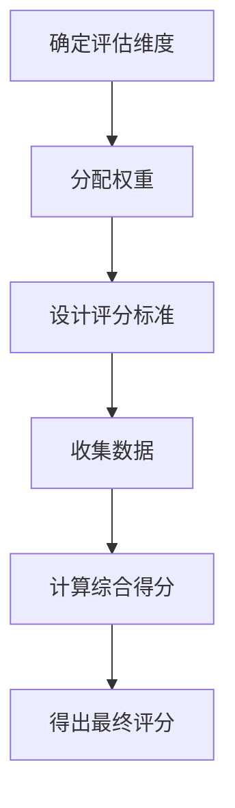
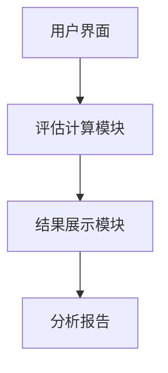
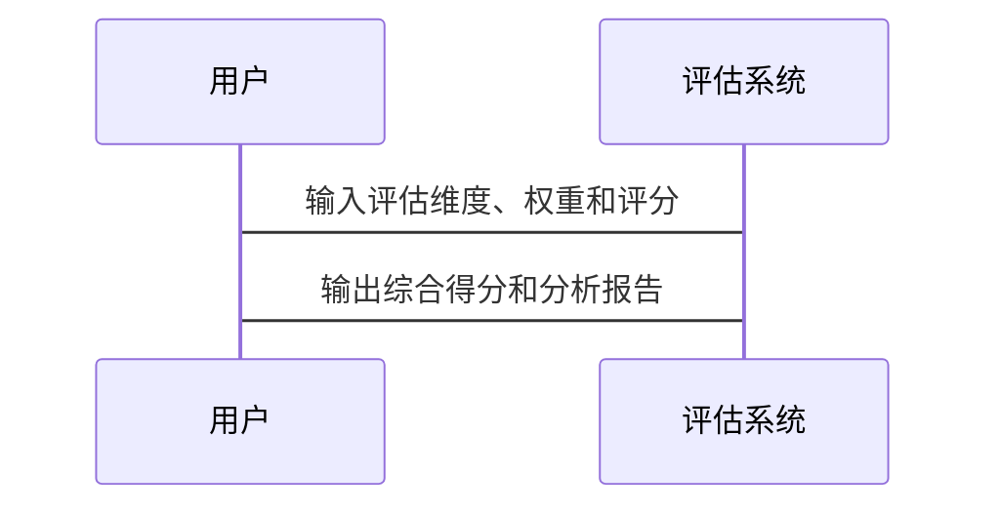

                 


# 如何评估初创企业的价值

> 关键词：初创企业、价值评估、财务状况、市场潜力、团队能力、数学模型、系统架构

> 摘要：本文将详细介绍如何评估初创企业的价值。从背景介绍到具体分析，再到算法与模型，系统架构和项目实战，本文将从多个维度深入剖析初创企业价值评估的核心要素和方法，帮助读者全面掌握评估技巧。

---

## 第一部分: 初创企业价值评估的背景与核心概念

### 第1章: 初创企业价值评估的背景与问题描述

#### 1.1 问题背景
随着全球创业浪潮的兴起，越来越多的初创企业如雨后春笋般涌现。然而，这些企业能否在未来市场中生存并获得成功，往往取决于其价值的评估。投资者、创业者和相关利益方都需要一个科学的方法来衡量企业的价值，以便做出合理的决策。

#### 1.2 问题描述
初创企业价值评估是指通过对企业的财务状况、市场潜力、团队能力等多方面因素的综合分析，确定其在当前市场中的价值。然而，由于初创企业具有高风险、高不确定性的特点，传统的评估方法往往难以适用。如何制定一套适合初创企业的价值评估体系，是当前亟待解决的问题。

#### 1.3 核心概念
- **价值评估**：通过分析企业的各项指标，确定其市场价值的过程。
- **财务状况**：企业的财务健康程度，包括收入、利润、现金流等。
- **市场潜力**：企业在目标市场中的发展空间和潜力。
- **团队能力**：企业核心团队的能力和稳定性。

#### 1.4 本章小结
本章从背景介绍和问题描述入手，明确了初创企业价值评估的核心概念和重要性。

---

## 第二部分: 初创企业价值评估的核心因素

### 第2章: 财务状况评估

#### 2.1 财务状况的核心指标
- **收入与利润**：企业的收入来源和盈利能力是评估其价值的重要指标。
- **资产负债表**：企业的资产、负债和所有者权益状况。
- **现金流**：企业的资金流动情况，包括经营活动、投资活动和筹资活动的现金流。

#### 2.2 财务健康度的评估模型
- **偿债能力分析**：通过流动比率、速动比率等指标评估企业的短期偿债能力。
- **运营效率分析**：通过存货周转率、应收账款周转率等指标评估企业的运营效率。
- **盈利能力分析**：通过净利润率、毛利率等指标评估企业的盈利能力。

#### 2.3 财务风险与机会
- **财务风险**：企业因财务状况不佳而可能面临的危机。
- **财务机会**：通过优化财务结构、提升盈利能力等方式带来的潜在收益。

#### 2.4 本章小结
本章详细分析了财务状况对企业价值评估的重要性，并介绍了常用的财务指标和评估模型。

---

### 第3章: 市场潜力评估

#### 3.1 市场潜力的核心要素
- **市场规模**：目标市场的总体容量。
- **市场增长率**：市场容量的增长速度。
- **竞争格局**：市场中的主要竞争对手及其市场份额。

#### 3.2 市场定位与目标客户
- **目标客户画像**：企业的目标客户群体特征。
- **市场定位策略**：企业在市场中的定位和策略。
- **竞争优势分析**：企业相对于竞争对手的核心优势。

#### 3.3 市场风险与机会
- **市场风险**：市场变化对企业的影响。
- **市场机会**：通过市场调研和分析发现的潜在市场机会。

#### 3.4 本章小结
本章从市场潜力的角度分析了企业价值评估的关键因素，并强调了市场定位和竞争优势的重要性。

---

### 第4章: 团队能力评估

#### 4.1 团队结构与分工
- **核心团队成员**：企业的创始人和高管团队。
- **团队协作能力**：团队成员之间的协作效率和默契程度。
- **团队文化与凝聚力**：团队的文化氛围和凝聚力。

#### 4.2 团队历史与过往表现
- **创业历史**：企业的创业历程和历史成就。
- **团队稳定性**：团队的稳定性和长期发展能力。
- **团队学习能力**：团队的学习能力和适应能力。

#### 4.3 团队风险与机会
- **团队风险**：团队内部存在的潜在风险。
- **团队机会**：通过团队能力提升带来的潜在机会。

#### 4.4 本章小结
本章从团队能力的角度分析了企业价值评估的关键因素，并强调了团队稳定性和协作能力的重要性。

---

## 第三部分: 初创企业价值评估的算法与模型

### 第5章: 价值评估的加权评分法

#### 5.1 加权评分法的原理
加权评分法是一种通过给各个评估维度分配权重，然后根据评分结果计算综合得分的方法。其核心在于将各个维度的重要性量化，并通过加权的方式得出最终的综合评分。

#### 5.2 加权评分法的流程图


#### 5.3 加权评分法的数学模型
$$ \text{综合得分} = \sum_{i=1}^{n} w_i \times s_i $$
其中，\( w_i \) 是第 \( i \) 个维度的权重，\( s_i \) 是第 \( i \) 个维度的评分。

#### 5.4 加权评分法的Python实现
```python
def weighted_score(assessment_results, weights):
    return sum(w * s for w, s in zip(weights, assessment_results))

# 示例
assessment_results = [8, 6, 7]
weights = [0.4, 0.3, 0.3]
print(weighted_score(assessment_results, weights))  # 输出：7.3
```

#### 5.5 本章小结
本章详细介绍了加权评分法的原理和实现方法，并通过示例展示了其在价值评估中的应用。

---

## 第四部分: 系统架构与实现

### 第6章: 系统架构设计

#### 6.1 问题场景介绍
为了实现初创企业价值评估的自动化，我们设计了一个基于加权评分法的评估系统。

#### 6.2 系统功能设计
- **用户界面**：包括评估维度的选择、权重的设置和评分的输入。
- **评估计算**：根据输入的权重和评分，计算综合得分。
- **结果展示**：展示评估结果和分析报告。

#### 6.3 系统架构图


#### 6.4 系统接口设计
- **输入接口**：用户输入评估维度、权重和评分。
- **输出接口**：输出综合得分和分析报告。

#### 6.5 系统交互图


#### 6.6 本章小结
本章从系统架构的角度分析了初创企业价值评估的实现方式，并展示了系统的整体架构和交互流程。

---

## 第五部分: 项目实战

### 第7章: 项目实战与案例分析

#### 7.1 环境安装
需要安装Python和相关的开发工具。

#### 7.2 核心代码实现
```python
def calculate_value_assessment(financial_scores, market_scores, team_scores, financial_weights, market_weights, team_weights):
    total_score = (financial_scores * financial_weights + 
                   market_scores * market_weights + 
                   team_scores * team_weights)
    return total_score

# 示例数据
financial_scores = 8
market_scores = 7
team_scores = 6
financial_weights = 0.4
market_weights = 0.3
team_weights = 0.3

print(calculate_value_assessment(financial_scores, market_scores, team_scores, financial_weights, market_weights, team_weights))  # 输出：7.3
```

#### 7.3 实际案例分析
以一家互联网初创企业为例，通过实际数据计算其综合得分。

#### 7.4 本章小结
本章通过实际案例展示了初创企业价值评估的实现过程，并验证了评估模型的有效性。

---

## 第六部分: 总结与注意事项

### 第8章: 总结与注意事项

#### 8.1 最佳实践
- 在评估过程中，建议结合多种方法进行综合评估。
- 定期更新评估模型，以适应市场变化。

#### 8.2 小结
本文从多个维度详细分析了初创企业价值评估的核心要素和方法，并通过实际案例展示了其应用过程。

#### 8.3 注意事项
- 评估模型的结果仅供参考，需结合实际情况进行调整。
- 数据的准确性和完整性对评估结果有重要影响。

#### 8.4 拓展阅读
推荐阅读《创业企业价值评估与融资》和《初创企业风险管理》等相关书籍。

---

## 附录

### 附录A: 术语表
- 加权评分法：一种通过给各个评估维度分配权重，计算综合得分的方法。

### 附录B: 工具与资源
- Python编程语言
- 相关开发工具和库

---

通过本文的详细分析和实际案例，读者可以全面掌握初创企业价值评估的核心要素和方法，并能够在实际工作中灵活运用这些技巧。

