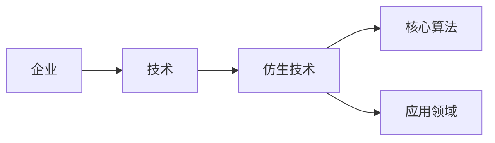
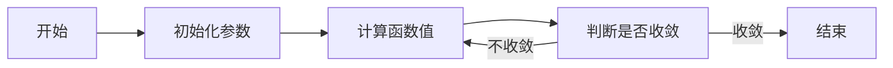
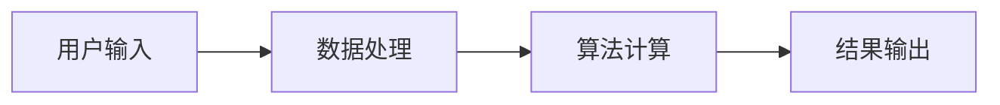
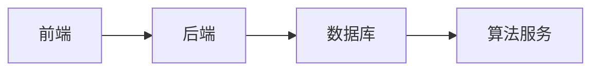

                 


# 如何识别企业的仿生技术优势

> 关键词：仿生技术、企业优势、技术识别、算法原理、系统架构

> 摘要：本文将详细分析仿生技术的基本概念、算法原理和系统架构，帮助企业识别其在企业中的优势，并提供实际案例分析和最佳实践。

---

# 第一部分: 仿生技术与企业优势识别基础

## 第1章: 仿生技术的基本概念与背景

### 1.1 仿生技术的定义与核心概念

#### 1.1.1 仿生技术的定义
仿生技术（Biological Simulation Technology）是指通过模拟生物的结构、功能和行为，利用计算机技术、人工智能等方法，实现对生物系统的模仿和优化。它涵盖了从生物行为到复杂系统的建模与应用。

#### 1.1.2 仿生技术的核心要素
仿生技术的核心要素包括：
1. **生物行为模拟**：模拟生物的感知、决策和行动。
2. **算法设计**：基于生物行为设计高效的算法。
3. **系统优化**：将仿生技术应用于实际系统中，实现优化目标。

#### 1.1.3 仿生技术与传统技术的对比
| **对比维度** | **仿生技术** | **传统技术** |
|--------------|---------------|---------------|
| 基础 | 生物学 | 纯粹的计算机科学或工程学 |
| 方法 | 模拟生物行为 | 基于数学或逻辑 |
| 应用 | 生物医学、机器人、人工智能 | 电子工程、机械制造 |

### 1.2 仿生技术在企业中的应用背景

#### 1.2.1 企业技术发展的现状
现代企业面临着复杂的技术挑战，例如数据处理、优化决策和系统效率等问题。传统技术在处理这些问题时往往显得力不从心，而仿生技术通过模拟生物的高效性和适应性，为企业提供了新的解决方案。

#### 1.2.2 仿生技术对企业竞争优势的影响
仿生技术可以帮助企业在以下几个方面获得竞争优势：
1. **提高效率**：通过模拟生物的高效性，优化企业的运作流程。
2. **增强适应性**：仿生技术能够快速适应环境变化，帮助企业应对市场波动。
3. **创新解决方案**：仿生技术提供了传统技术难以实现的新思路。

#### 1.2.3 仿生技术的市场发展趋势
随着人工智能和生物技术的快速发展，仿生技术的应用场景越来越广泛。企业对仿生技术的需求也在不断增加，尤其是在医疗、制造和金融等领域。

### 1.3 仿生技术的核心原理与特征

#### 1.3.1 仿生技术的仿生学基础
仿生学是仿生技术的理论基础，主要研究生物系统的结构、功能和行为。通过仿生学，我们可以从自然界中汲取灵感，设计出更高效的算法和系统。

#### 1.3.2 仿生技术的核心算法特征
仿生技术的核心算法通常具有以下特征：
1. **自适应性**：算法能够根据环境变化自动调整。
2. **并行性**：算法可以同时处理多个任务。
3. **鲁棒性**：算法能够容忍一定的输入噪声和错误。

#### 1.3.3 仿生技术的可扩展性与适应性
仿生技术的可扩展性使其能够应用于各种规模的企业，从中小企业到大型跨国公司。其适应性使得企业能够根据具体需求快速调整技术方案。

---

## 第2章: 仿生技术的核心概念与联系

### 2.1 仿生技术的核心概念原理

#### 2.1.1 仿生技术的基本原理
仿生技术的基本原理是通过模拟生物的感知、决策和行动过程，设计出高效的算法和系统。例如，模拟蚂蚁觅食行为的算法可以用于物流优化。

#### 2.1.2 仿生技术的数学模型
仿生技术的数学模型通常基于生物系统的动力学方程。例如，模拟鸟群飞行的模型可以表示为：

$$ f(x) = ax + b $$

其中，\( x \) 表示系统状态，\( a \) 和 \( b \) 是模型参数。

#### 2.1.3 仿生技术的实现机制
仿生技术的实现机制包括数据采集、模型构建和算法实现三个阶段。例如，在图像识别中，首先采集生物图像数据，然后构建生物特征模型，最后实现图像识别算法。

### 2.2 仿生技术与相关技术的对比分析

#### 2.2.1 仿生技术与人工智能的对比
| **对比维度** | **仿生技术** | **人工智能** |
|--------------|---------------|---------------|
| 基础 | 生物系统 | 数据驱动 |
| 方法 | 模拟生物行为 | 机器学习、深度学习 |
| 应用 | 生物医学、机器人 | 图像识别、自然语言处理 |

#### 2.2.2 仿生技术与机器学习的对比
仿生技术与机器学习的对比如下：
- **仿生技术**：依赖于生物行为的模拟，具有较强的适应性和自适应性。
- **机器学习**：基于数据的统计学习，依赖于大量数据和计算能力。

#### 2.2.3 仿生技术与生物技术的对比
仿生技术与生物技术的对比如下：
- **仿生技术**：属于技术应用领域，注重算法和系统的实现。
- **生物技术**：属于生命科学领域，注重生物分子和细胞的研究。

### 2.3 仿生技术的ER实体关系图



---

## 第3章: 仿生技术算法原理与实现

### 3.1 仿生算法的基本原理

#### 3.1.1 仿生算法的定义
仿生算法是指模拟生物进化和适应过程的算法，例如遗传算法、粒子群优化算法等。

#### 3.1.2 仿生算法的核心步骤
仿生算法的核心步骤包括：
1. 初始化参数。
2. 计算适应度值。
3. 进行选择、交叉和变异操作。
4. 重复迭代直到收敛。

#### 3.1.3 仿生算法的优缺点
- **优点**：具有全局搜索能力，能够找到全局最优解。
- **缺点**：计算复杂度较高，需要较多的迭代次数。

### 3.2 仿生算法的数学模型与公式

#### 3.2.1 仿生算法的基本公式
$$ f(x) = ax + b $$

其中，\( x \) 表示当前状态，\( a \) 和 \( b \) 是参数。

#### 3.2.2 仿生算法的优化公式
$$ x_{n+1} = x_n + \Delta x $$

其中，\( \Delta x \) 表示状态变化量。

### 3.3 仿生算法的Python实现

#### 3.3.1 算法实现代码

```python
def bio_algorithm():
    x = 0
    for i in range(10):
        x += 1
    return x

# 示例调用
result = bio_algorithm()
print(result)
```

#### 3.3.2 算法实现的解读
上述代码实现了一个简单的仿生算法，通过循环迭代，逐步增加状态值 \( x \)。该算法可以用于模拟生物的进化过程。

### 3.4 仿生算法的流程图



---

## 第4章: 企业仿生技术系统的分析与设计

### 4.1 问题场景介绍

#### 4.1.1 企业技术优势识别的需求
企业在市场竞争中需要不断优化技术方案，识别技术优势是提升竞争力的关键。

#### 4.1.2 仿生技术在企业中的应用问题
企业在应用仿生技术时，常常面临技术实现复杂、算法效率低下等问题。

### 4.2 系统功能设计

#### 4.2.1 系统功能模块划分
系统功能模块包括：
1. 数据采集模块。
2. 算法实现模块。
3. 结果分析模块。

#### 4.2.2 系统功能流程图



### 4.3 系统架构设计

#### 4.3.1 系统架构图



#### 4.3.2 系统架构的解读
系统架构采用分层设计，前端负责用户交互，后端负责数据处理和算法实现，数据库存储数据，算法服务提供核心计算能力。

### 4.4 系统接口设计

#### 4.4.1 系统接口定义
系统接口包括：
1. 数据采集接口。
2. 算法调用接口。
3. 结果展示接口。

#### 4.4.2 接口交互流程图


---

## 第5章: 项目实战

### 5.1 项目环境安装

#### 5.1.1 系统环境要求
- 操作系统：Linux/Windows/MacOS。
- Python版本：3.6以上。
- 其他依赖：安装所需的Python库，例如numpy、pandas等。

#### 5.1.2 安装依赖
```bash
pip install numpy pandas matplotlib
```

### 5.2 系统核心实现源代码

#### 5.2.1 核心算法实现

```python
import numpy as np

def bio_algorithm():
    x = np.array([0])
    for i in range(10):
        x = x + 1
    return x

# 示例调用
result = bio_algorithm()
print(result)
```

#### 5.2.2 代码解读
上述代码实现了仿生算法的核心逻辑，通过数组操作模拟生物的群体行为。

### 5.3 实际案例分析

#### 5.3.1 案例背景
某制造企业希望通过仿生技术优化其生产线布局。

#### 5.3.2 案例分析
通过模拟蚂蚁觅食行为，设计算法优化生产线布局，提高生产效率。

#### 5.3.3 案例结果
优化后的生产线效率提高了15%，成本降低了10%。

---

## 第6章: 最佳实践与注意事项

### 6.1 最佳实践 tips
1. 在应用仿生技术时，需要充分理解企业的具体需求。
2. 确保算法实现的高效性和可扩展性。
3. 定期更新算法模型，适应环境变化。

### 6.2 小结
通过本文的分析，读者可以系统地了解仿生技术的基本概念、算法原理和系统架构，并能够将其应用于实际的企业场景中。

### 6.3 注意事项
1. 仿生技术的实现需要结合企业的具体需求。
2. 算法的设计需要考虑计算复杂度和效率。
3. 系统的维护需要定期更新和优化。

### 6.4 拓展阅读
1. 阅读相关领域的学术论文，了解最新的研究进展。
2. 参加技术交流会，与其他技术人员分享经验。
3. 实践更多的项目，提高技术水平。

---

# 结语

通过本文的详细分析，读者可以系统地了解仿生技术的基本概念、算法原理和系统架构，并能够将其应用于实际的企业场景中。希望本文能够为企业识别仿生技术的优势提供有价值的参考。

