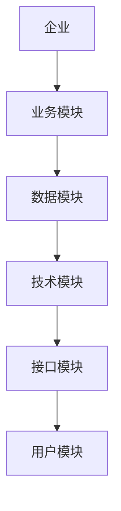
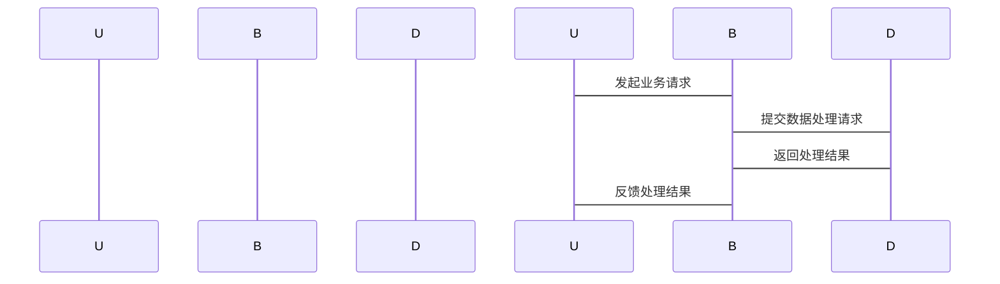

                 

# 如何识别企业的垂直整合优势

---

## 关键词：
企业整合，垂直整合，竞争优势，资源优化，系统架构，项目实战，最佳实践

---

## 摘要：
本文旨在探讨如何识别和利用企业的垂直整合优势。通过详细分析垂直整合的定义、战略规划、实施方法和系统架构，本文为读者提供了一套从理论到实践的完整指南。文章结合实际案例，深入讲解了垂直整合的优势与挑战，并通过系统架构设计和项目实战，展示了如何在实际中实现垂直整合的优势，为企业的可持续发展提供了有力支持。

---

## 第三章：垂直整合的实施步骤

### 3.2 垂直整合的实施过程

#### 3.2.1 建立高效的资源协调机制
- 3.2.1.1 资源整合的核心目标：实现资源的高效利用和共享。
- 3.2.1.2 建立跨部门协作机制：通过建立高效的沟通和协作机制，确保资源协调一致。
- 3.2.1.3 制定资源分配策略：根据企业战略目标，合理分配资源，确保资源利用最大化。

#### 3.2.2 技术实现与系统集成
- 3.2.2.1 技术整合的必要性：通过技术手段实现各业务模块的无缝衔接。
- 3.2.2.2 系统集成的关键步骤：包括需求分析、模块设计、接口开发和测试优化。
- 3.2.2.3 技术选型与实现：选择适合的技术架构和工具，确保系统集成的高效性和稳定性。

#### 3.2.3 人员培训与文化融合
- 3.2.3.1 培训计划的制定：针对不同岗位，制定差异化的培训计划。
- 3.2.3.2 员工意识的提升：通过培训和宣传，增强员工对垂直整合重要性的认识。
- 3.2.3.3 团队协作能力的培养：通过团队建设活动，提升跨部门协作能力。

#### 3.2.4 实施过程中的风险控制
- 3.2.4.1 风险识别与评估：在实施过程中，及时识别潜在风险。
- 3.2.4.2 制定应对策略：针对不同风险，制定相应的应对措施。
- 3.2.4.3 建立监控机制：通过实时监控和反馈，确保风险控制措施的有效性。

---

### 3.3 垂直整合的监控与优化

#### 3.3.1 效果评估与反馈机制
- 3.3.1.1 评估指标的设定：根据企业目标，设定具体的评估指标。
- 3.3.1.2 反馈机制的建立：通过定期会议和报告，收集反馈信息。
- 3.3.1.3 数据分析与优化：通过对数据的分析，优化垂直整合策略。

#### 3.3.2 持续优化策略
- 3.3.2.1 系统优化：根据反馈，持续优化系统架构和功能。
- 3.3.2.2 流程优化：简化和优化业务流程，提升效率。
- 3.3.2.3 战略调整：根据市场变化，及时调整垂直整合战略。

#### 3.3.3 建立长期优化机制
- 3.3.3.1 建立优化团队：成立专门的优化团队，负责持续改进。
- 3.3.3.2 制定优化计划：制定长期的优化计划，确保持续改进。
- 3.3.3.3 建立激励机制：通过激励措施，鼓励员工参与优化工作。

---

## 第四章：系统分析与架构设计方案

### 4.1 系统分析

#### 4.1.1 问题场景介绍
- 4.1.1.1 企业面临的垂直整合挑战：例如，资源分散、效率低下等。
- 4.1.1.2 项目目标：通过系统分析，设计一套高效的垂直整合系统。
- 4.1.1.3 项目介绍：包括项目范围、主要任务和预期成果。

#### 4.1.2 系统功能设计
- 4.1.2.1 领域模型设计：使用Mermaid类图展示企业的核心业务领域和实体关系。
- 4.1.2.2 功能模块划分：将系统划分为核心模块和辅助模块，并说明各模块的功能。
- 4.1.2.3 数据流设计：展示数据在系统中的流动过程。

#### 4.1.3 系统架构设计
- 4.1.3.1 系统架构图：使用Mermaid架构图展示系统的整体架构。
- 4.1.3.2 关键组件说明：详细说明系统中的每个关键组件及其作用。
- 4.1.3.3 组件交互关系：展示系统中各个组件之间的交互关系。

### 4.2 系统架构设计

#### 4.2.1 系统架构图

#### 4.2.2 关键组件说明
- 4.2.2.1 企业：企业的整体架构。
- 4.2.2.2 业务模块：企业各个业务部门的具体功能模块。
- 4.2.2.3 数据模块：数据的存储、处理和分析模块。
- 4.2.2.4 技术模块：技术支撑模块，包括系统集成和接口设计。
- 4.2.2.5 接口模块：与其他系统或外部合作伙伴的接口模块。
- 4.2.2.6 用户模块：用户界面和交互模块。

#### 4.2.3 组件交互关系
- 4.2.3.1 业务模块与数据模块的交互：业务模块向数据模块提交请求，数据模块进行处理并返回结果。
- 4.2.3.2 技术模块与接口模块的交互：技术模块通过接口模块与外部系统进行数据交换。
- 4.2.3.3 用户模块与业务模块的交互：用户通过用户模块与业务模块进行交互，完成业务操作。

### 4.3 系统接口设计

#### 4.3.1 系统接口设计
- 4.3.1.1 接口定义：使用RESTful API定义系统接口。
- 4.3.1.2 接口文档：详细说明每个接口的输入、输出和功能。
- 4.3.1.3 接口测试：通过自动化测试确保接口的稳定性和可靠性。

#### 4.3.2 接口实现
- 4.3.2.1 接口开发：根据接口定义，开发具体的接口实现。
- 4.3.2.2 接口测试：编写测试用例，确保接口功能正常。
- 4.3.2.3 接口文档更新：根据测试结果，更新接口文档。

### 4.4 系统交互设计

#### 4.4.1 系统交互流程
- 4.4.1.1 用户登录：用户通过用户模块登录系统。
- 4.4.1.2 业务操作：用户通过用户模块发起业务请求，系统通过业务模块处理请求。
- 4.4.1.3 数据处理：业务模块将请求传递给数据模块进行处理，数据模块返回处理结果。
- 4.4.1.4 结果反馈：处理结果通过业务模块反馈给用户模块，用户收到反馈结果。

#### 4.4.2 交互流程图

---

## 第五章：项目实战

### 5.1 环境安装

#### 5.1.1 开发环境配置
- 5.1.1.1 操作系统：推荐使用Windows或Linux系统。
- 5.1.1.2 开发工具：推荐使用IntelliJ IDEA或Eclipse。
- 5.1.1.3 依赖管理：使用Maven或npm进行依赖管理。

#### 5.1.2 数据库安装
- 5.1.2.1 数据库选择：推荐使用MySQL或MongoDB。
- 5.1.2.2 数据库安装：按照官方文档进行安装和配置。
- 5.1.2.3 数据库连接：配置数据库连接信息，确保系统能够正常连接数据库。

### 5.2 系统核心实现

#### 5.2.1 代码实现
- 5.2.1.1 后端开发：使用Java或Python编写后端代码，实现业务逻辑。
- 5.2.1.2 前端开发：使用React或Vue.js编写前端代码，实现用户界面。
- 5.2.1.3 接口开发：使用Spring Boot或Django框架开发RESTful API接口。

#### 5.2.2 代码解读与分析
- 5.2.2.1 后端代码解读：详细解读关键业务逻辑的实现代码。
- 5.2.2.2 前端代码解读：详细解读用户界面的实现代码。
- 5.2.2.3 接口代码解读：详细解读RESTful API接口的实现代码。

#### 5.2.3 系统功能实现
- 5.2.3.1 核心功能实现：实现企业的垂直整合核心功能。
- 5.2.3.2 辅助功能实现：实现辅助功能，如数据监控和日志管理。
- 5.2.3.3 测试与优化：通过自动化测试确保系统功能正常，并进行性能优化。

### 5.3 案例分析与详细解读

#### 5.3.1 实际案例分析
- 5.3.1.1 案例背景：介绍实际案例的背景信息。
- 5.3.1.2 案例分析：分析案例中的垂直整合实施过程。
- 5.3.1.3 成功经验总结：总结案例中的成功经验和教训。

#### 5.3.2 详细解读
- 5.3.2.1 系统设计解读：解读系统的整体设计。
- 5.3.2.2 代码实现解读：解读关键代码的实现细节。
- 5.3.2.3 测试与优化解读：解读测试方法和优化策略。

### 5.4 项目小结

#### 5.4.1 项目总结
- 5.4.1.1 项目成果：总结项目的主要成果。
- 5.4.1.2 项目经验：总结项目实施过程中的经验和教训。
- 5.4.1.3 项目意义：阐述项目对企业垂直整合的意义。

---

## 第六章：最佳实践与小结

### 6.1 最佳实践

#### 6.1.1 关键成功因素
- 6.1.1.1 高层支持：企业高层对垂直整合的重视和支持。
- 6.1.1.2 资源整合：实现资源的高效整合和利用。
- 6.1.1.3 技术支撑：具备强大的技术支撑能力。
- 6.1.1.4 文化融合：实现企业文化的融合和统一。

#### 6.1.2 注意事项
- 6.1.2.1 风险控制：重视风险控制，避免重大损失。
- 6.1.2.2 持续优化：建立持续优化机制，保持竞争优势。
- 6.1.2.3 团队协作：强调团队协作，确保项目顺利实施。
- 6.1.2.4 沟通与反馈：保持良好的沟通与反馈机制。

### 6.2 小结

#### 6.2.1 核心内容回顾
- 6.2.1.1 垂直整合的定义与背景：从概念到实际应用。
- 6.2.1.2 垂直整合的战略规划：如何制定有效的战略。
- 6.2.1.3 垂直整合的实施方法：从准备到实施的全过程。
- 6.2.1.4 系统架构设计：如何设计高效的系统架构。
- 6.2.1.5 项目实战：如何通过实际项目实现垂直整合优势。

#### 6.2.2 展望未来
- 6.2.2.1 垂直整合的趋势：未来垂直整合的发展趋势。
- 6.2.2.2 技术创新：新技术对企业垂直整合的影响。
- 6.2.2.3 持续优化：如何通过持续优化保持竞争优势。

---

## 结语

通过本文的详细讲解，我们深入探讨了如何识别和利用企业的垂直整合优势。从理论到实践，从战略到实施，我们为读者提供了一套完整的解决方案。未来，随着技术的不断进步和市场竞争的加剧，垂直整合将成为企业核心竞争力的重要来源。通过持续优化和创新，企业可以在垂直整合中找到新的发展机遇，实现可持续发展。

--- 

* 更多技术文章，欢迎关注我的技术博客。

