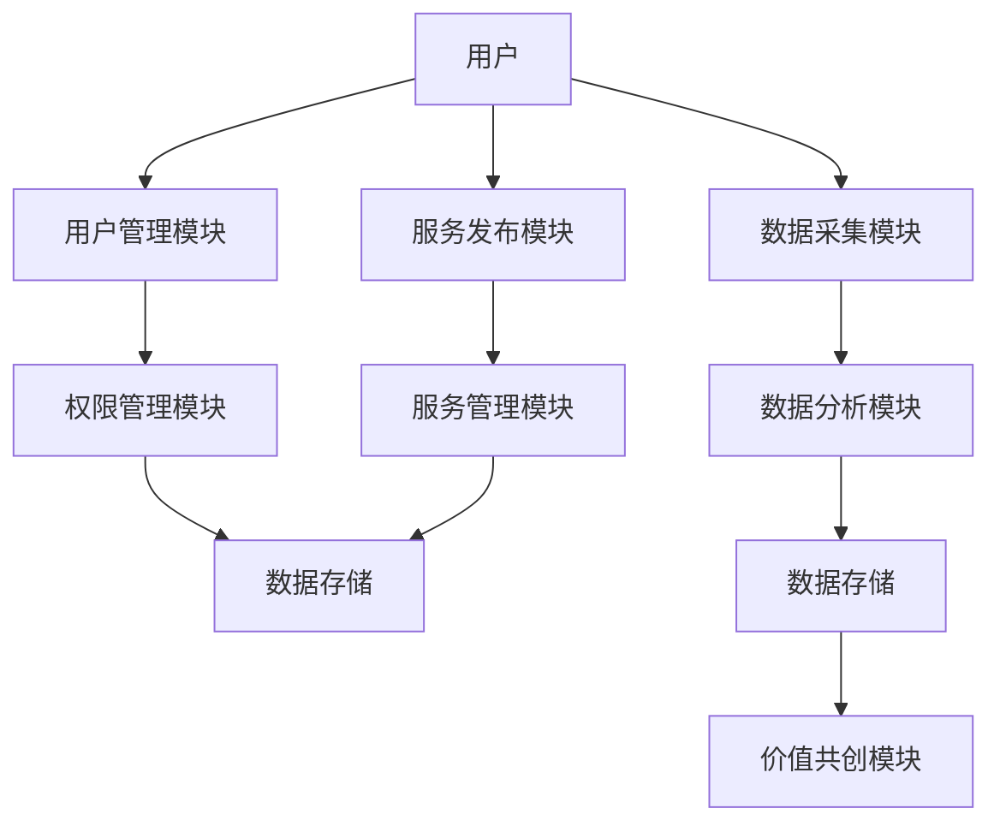
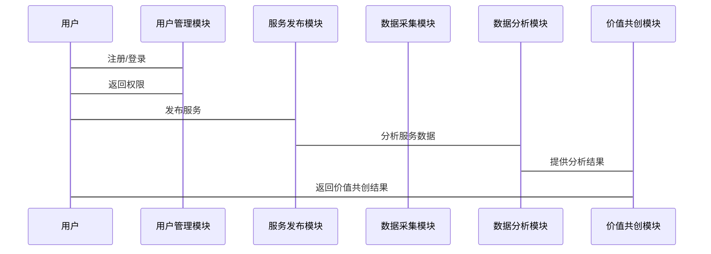
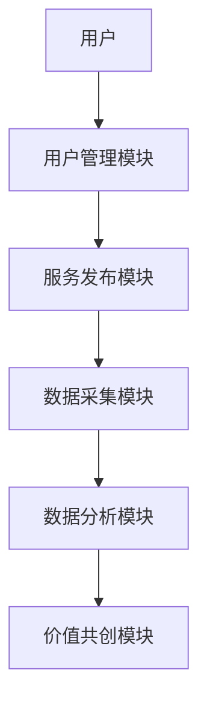

                 


# 如何识别企业的平台化转型优势

## 关键词：平台化转型、数字化转型、企业架构、生态系统、协同过滤推荐算法、系统架构设计

## 摘要：  
企业平台化转型是当前数字化转型的重要趋势，通过构建平台生态系统，企业可以实现多方价值共创和共享。本文从背景、核心概念、算法原理、系统架构设计到项目实战，详细分析了平台化转型的优势和实现路径。通过协同过滤推荐算法和系统架构设计的实例，帮助读者理解平台化转型的关键要素，并提供实际案例分析，总结出平台化转型的成功关键点。

---

# 第一部分: 企业平台化转型的背景与概念

## 第1章: 企业平台化转型的背景与意义

### 1.1 企业数字化转型的背景

#### 1.1.1 传统企业面临的挑战
传统企业在运营中常常面临以下挑战：
- 业务流程复杂，效率低下。
- 信息孤岛问题严重，部门间协作困难。
- 市场变化快，难以快速响应客户需求。
- 数据利用率低，难以通过数据驱动决策。

#### 1.1.2 数字化转型的必要性
数字化转型是企业适应市场变化和提升竞争力的必然选择：
- 提高业务流程的效率，降低成本。
- 通过数据驱动优化决策，提升企业洞察力。
- 构建灵活的组织架构，快速响应市场变化。
- 利用新技术（如AI、大数据）赋能业务。

#### 1.1.3 平台化转型的定义与内涵
平台化转型是指企业通过构建平台化架构，将内部资源和外部生态有机整合，形成多方参与、价值共创的商业模式。其内涵包括：
- **平台架构**：通过技术手段将企业资源、服务、数据等抽象为可复用的模块。
- **生态系统**：构建一个多利益相关方参与的平台，实现价值共创和共享。
- **数据驱动**：通过数据的采集、分析和应用，优化业务流程和决策。

### 1.2 平台化转型的核心价值

#### 1.2.1 平台化转型对企业的影响
平台化转型可以带来以下影响：
- **提升效率**：通过平台化架构，企业可以实现资源的高效利用和流程的自动化。
- **降低成本**：通过共享资源和模块化设计，减少重复开发和浪费。
- **创造价值**：通过构建生态系统，企业可以拓展新的收入来源和商业机会。

#### 1.2.2 平台化转型的驱动因素
平台化转型的驱动因素包括：
- **技术进步**：云计算、大数据、AI等技术为企业构建平台提供了技术支撑。
- **市场需求**：客户期望获得更加个性化和高效的服务。
- **竞争压力**：传统企业面临新兴平台企业的竞争压力，必须转型以保持竞争力。

#### 1.2.3 平台化转型与企业竞争力的关系
平台化转型是提升企业竞争力的关键：
- 通过平台化转型，企业可以快速响应市场变化，提供创新的产品和服务。
- 平台化模式能够吸引更多的合作伙伴，形成强大的生态系统，增强企业的市场影响力。

### 1.3 平台化转型的边界与外延

#### 1.3.1 平台化转型的边界
平台化转型的边界包括：
- **技术边界**：平台化转型依赖于先进的技术架构，如微服务架构、容器化等。
- **业务边界**：平台化转型需要与企业的核心业务紧密结合，避免盲目转型。
- **生态边界**：平台化转型需要构建健康的生态系统，吸引和留住合作伙伴。

#### 1.3.2 平台化转型的外延
平台化转型的外延包括：
- **数字化转型**：平台化转型是数字化转型的重要组成部分，通过技术手段实现业务的数字化和智能化。
- **智能化转型**：平台化转型为企业智能化转型提供了基础，通过数据和AI技术实现智能决策。

#### 1.3.3 平台化转型与其他转型模式的区别
平台化转型与其他转型模式的主要区别在于：
- **数字化转型**：更注重技术的实现，而平台化转型更注重商业模式的创新。
- **智能化转型**：更注重AI的应用，而平台化转型更注重生态系统和价值共创。

---

## 第2章: 平台化转型的核心概念与联系

### 2.1 平台化转型的核心要素

#### 2.1.1 平台架构
平台架构是平台化转型的基础，包括：
- **技术架构**：采用微服务架构、容器化等技术，确保系统的可扩展性和灵活性。
- **数据架构**：构建统一的数据湖，实现数据的高效存储和分析。
- **服务架构**：通过API接口实现服务的标准化和模块化，方便合作伙伴的接入。

#### 2.1.2 生态系统
生态系统是平台化转型的核心，包括：
- **合作伙伴**：吸引开发者、供应商、客户等多方参与平台生态。
- **价值共创**：通过平台实现多方的价值共创和共享，形成良性循环。
- **生态治理**：通过规则和机制，确保生态系统的健康发展。

#### 2.1.3 数据驱动
数据驱动是平台化转型的关键，包括：
- **数据采集**：通过传感器、API、用户行为等多渠道采集数据。
- **数据分析**：利用大数据和AI技术，对数据进行深度分析，提取有价值的信息。
- **数据应用**：将分析结果应用到业务决策和优化中，形成数据闭环。

### 2.2 平台化转型的核心原理

#### 2.2.1 平台化转型的原理
平台化转型的原理包括：
- **模块化设计**：将企业资源和服务抽象为可复用的模块，方便组合和扩展。
- **生态系统构建**：通过平台吸引多方参与者，形成协同效应。
- **数据驱动优化**：通过数据的采集、分析和应用，不断优化平台的功能和性能。

#### 2.2.2 平台化转型的机制
平台化转型的机制包括：
- **供需匹配**：通过平台实现资源的高效匹配和优化配置。
- **价值共创**：通过平台实现多方的价值共创和共享，增强生态系统的活力。
- **持续创新**：通过平台的开放性和灵活性，不断引入新技术和新理念，推动企业的持续创新。

#### 2.2.3 平台化转型的实现路径
平台化转型的实现路径包括：
- **明确目标**：企业需要明确平台化转型的目标和愿景。
- **构建架构**：设计合理的平台架构，确保系统的可扩展性和灵活性。
- **吸引生态**：积极吸引合作伙伴，构建健康的生态系统。
- **数据驱动**：利用数据优化平台的功能和性能，实现数据闭环。

### 2.3 平台化转型的核心概念对比

#### 2.3.1 平台化转型与传统模式的对比
平台化转型与传统模式的主要区别在于：
- **商业模式**：传统模式以产品和服务为主，平台化模式以生态系统和价值共创为主。
- **组织架构**：传统模式以部门为中心，平台化模式以平台为中心。
- **资源利用**：传统模式资源利用率低，平台化模式资源利用率高。

#### 2.3.2 平台化转型与数字化转型的对比
平台化转型与数字化转型的主要区别在于：
- **目标**：数字化转型注重技术的实现，平台化转型注重商业模式的创新。
- **核心要素**：数字化转型以数据和技术为主，平台化转型以生态系统和价值共创为主。

#### 2.3.3 平台化转型与智能化转型的对比
平台化转型与智能化转型的主要区别在于：
- **核心技术**：智能化转型以AI和大数据为主，平台化转型以平台架构和生态系统为主。
- **应用场景**：智能化转型注重智能化决策，平台化转型注重生态系统和价值共创。

---

## 第3章: 平台化转型的系统分析与架构设计

### 3.1 平台化转型的系统分析

#### 3.1.1 系统目标
平台化转型的系统目标包括：
- **提高效率**：通过平台化架构，提高企业的运营效率。
- **降低成本**：通过资源的共享和复用，降低企业的运营成本。
- **创造价值**：通过生态系统和价值共创，为企业创造新的价值增长点。

#### 3.1.2 系统功能
平台化转型的系统功能包括：
- **用户管理**：实现用户的注册、登录、权限管理等功能。
- **服务发布**：允许合作伙伴发布服务和产品。
- **数据采集**：采集用户行为、服务使用情况等数据。
- **数据分析**：对数据进行分析，提取有价值的信息。
- **价值共创**：通过平台实现多方的价值共创和共享。

#### 3.1.3 系统边界
平台化转型的系统边界包括：
- **用户界面**：平台的前端界面，供用户使用。
- **服务接口**：平台与其他系统或合作伙伴的接口。
- **数据存储**：平台的数据存储和管理模块。

### 3.2 平台化转型的系统架构设计

#### 3.2.1 系统架构图
以下是平台化转型的系统架构图：



#### 3.2.2 系统模块划分
平台化转型的系统模块划分包括：
- **用户管理模块**：负责用户的注册、登录和权限管理。
- **服务发布模块**：允许合作伙伴发布服务和产品。
- **数据采集模块**：采集用户行为、服务使用情况等数据。
- **数据分析模块**：对数据进行分析，提取有价值的信息。
- **价值共创模块**：通过平台实现多方的价值共创和共享。

#### 3.2.3 系统接口设计
平台化转型的系统接口设计包括：
- **API接口**：通过RESTful API实现平台与其他系统的对接。
- **服务接口**：通过WebSocket实现实时通信。
- **数据接口**：通过数据库连接实现数据的读写操作。

### 3.3 平台化转型的系统交互设计

#### 3.3.1 用户角色与权限
平台化转型的用户角色与权限包括：
- **普通用户**：访问平台的服务和产品。
- **合作伙伴**：发布服务和产品。
- **管理员**：管理平台的用户、服务和数据。

#### 3.3.2 系统交互流程
以下是平台化转型的系统交互流程：



#### 3.3.3 系统交互图
以下是平台化转型的系统交互图：



---

# 第二部分: 平台化转型的算法与数学模型

## 第4章: 平台化转型的核心算法

### 4.1 平台化转型的协同过滤推荐算法

#### 4.1.1 算法原理
协同过滤推荐算法是一种基于用户行为和偏好推荐相关内容的算法。其原理包括：
- **用户行为分析**：通过分析用户的行为（如点击、购买、收藏等），找到用户的兴趣偏好。
- **相似性计算**：通过计算用户之间的相似性，找到与目标用户相似的用户群体。
- **推荐生成**：根据相似用户的偏好，推荐相关内容。

#### 4.1.2 算法实现
以下是协同过滤推荐算法的Python实现：

```python
import numpy as np

def collaborative_filtering(user_item_matrix):
    # 计算用户相似性矩阵
    user_similarity = np.corrcoef(user_item_matrix)
    
    # 为目标用户推荐相似用户的平均评分
    target_user = 0  # 假设目标用户为第一个用户
    target_user_ratings = user_item_matrix[target_user]
    
    # 找到与目标用户相似的用户
    similar_users = np.argsort(user_similarity[target_user])[::-1]
    
    # 根据相似用户的评分加权平均，生成推荐
   推荐评分 = np.mean(user_item_matrix[similar_users], axis=0)
    
    return 推荐评分
```

#### 4.1.3 算法优化
协同过滤推荐算法的优化包括：
- **基于矩阵分解**：通过矩阵分解技术（如SVD）优化推荐效果。
- **基于邻域扩展**：通过扩展邻域范围，提高推荐的多样性。
- **基于实时计算**：通过实时计算用户行为，提高推荐的实时性。

#### 4.1.4 算法应用
协同过滤推荐算法在平台化转型中的应用包括：
- **个性化推荐**：通过协同过滤算法，为用户提供个性化的产品和服务推荐。
- **精准营销**：通过分析用户行为，实现精准的营销策略。
- **用户体验优化**：通过推荐算法，提升用户的平台使用体验。

#### 4.1.5 算法案例分析
以下是一个协同过滤推荐算法的案例分析：

假设我们有一个用户-商品评分矩阵：

| 用户 | 商品1 | 商品2 | 商品3 |
|------|-------|-------|-------|
| 用户1 | 5     | 3     | 4     |
| 用户2 | 3     | 5     | 2     |
| 用户3 | 4     | 2     | 5     |

通过计算用户相似性矩阵，我们可以发现用户1与用户3相似性较高。因此，我们可以为目标用户推荐用户3喜欢的商品，如商品3。

---

### 4.2 平台化转型的聚类算法

#### 4.2.1 算法原理
聚类算法是一种将数据点分组的算法，其原理包括：
- **数据预处理**：对数据进行标准化或归一化处理。
- **选择聚类算法**：根据数据特点选择合适的聚类算法（如K-means、DBSCAN等）。
- **执行聚类**：通过算法将数据点分成不同的簇。
- **结果分析**：分析聚类结果，提取有价值的信息。

#### 4.2.2 算法实现
以下是聚类算法的Python实现：

```python
from sklearn.cluster import KMeans

def clustering_algorithm(data):
    # 数据预处理
    normalized_data = data / np.linalg.norm(data, axis=0)
    
    # 选择聚类算法
    kmeans = KMeans(n_clusters=3, random_state=42)
    
    # 执行聚类
    kmeans.fit(normalized_data)
    
    # 返回聚类结果
    return kmeans.labels_
```

#### 4.2.3 算法优化
聚类算法的优化包括：
- **选择合适的聚类算法**：根据数据特点选择合适的算法。
- **确定聚类数目**：通过 elbow 方法或 silhouette 方法确定最佳聚类数目。
- **数据预处理**：对数据进行标准化或归一化处理，提高聚类效果。

#### 4.2.4 算法应用
聚类算法在平台化转型中的应用包括：
- **用户分群**：通过聚类算法，将用户分成不同的群体，进行精准营销。
- **市场细分**：通过聚类算法，实现市场的细分，制定针对性的营销策略。
- **产品推荐**：通过聚类算法，为不同群体的用户推荐不同的产品和服务。

#### 4.2.5 算法案例分析
以下是一个聚类算法的案例分析：

假设我们有以下用户数据：

| 年龄 | 收入 | 消费习惯 |
|------|------|-----------|
| 25   | 3000 | 高        |
| 35   | 5000 | 中        |
| 45   | 7000 | 低        |

通过聚类算法，我们可以将用户分成不同的群体，如高收入、中收入和低收入群体，并根据消费习惯制定不同的营销策略。

---

## 第5章: 平台化转型的数学模型

### 5.1 平台化转型的数学模型

#### 5.1.1 协同过滤推荐算法的数学模型
协同过滤推荐算法的数学模型包括：

$$ \text{相似性} = \frac{\sum_{i=1}^{n} (x_i - \bar{x})(y_i - \bar{y})}{\sqrt{\sum_{i=1}^{n} (x_i - \bar{x})^2} \cdot \sqrt{\sum_{i=1}^{n} (y_i - \bar{y})^2}} $$

其中，$$ x_i $$ 和 $$ y_i $$ 分别表示两个用户的评分，$$ \bar{x} $$ 和 $$ \bar{y} $$ 分别表示两个用户的平均评分。

#### 5.1.2 聚类算法的数学模型
聚类算法的数学模型包括：

$$ \text{目标函数} = \sum_{i=1}^{n} \sum_{j=1}^{k} w_{ij} d(x_i, x_j) $$

其中，$$ w_{ij} $$ 表示用户 $$ i $$ 和 $$ j $$ 之间的权重，$$ d(x_i, x_j) $$ 表示用户 $$ i $$ 和 $$ j $$ 之间的距离。

---

# 第三部分: 平台化转型的项目实战

## 第6章: 平台化转型的项目实战

### 6.1 项目背景

#### 6.1.1 项目介绍
本项目旨在通过平台化转型，帮助一家传统企业实现数字化和智能化转型。通过构建平台化架构，实现资源的高效利用和生态系统的构建。

#### 6.1.2 项目目标
- 构建平台化架构，实现资源的高效利用。
- 构建生态系统，实现多方价值共创和共享。
- 通过数据驱动优化业务流程和决策。

### 6.2 项目核心实现

#### 6.2.1 环境安装
以下是项目所需的环境和工具：

- **Python 3.8+**
- **Jupyter Notebook**
- **Pandas**
- **NumPy**
- **Scikit-learn**
- **Flask**

#### 6.2.2 核心代码实现

##### 6.2.2.1 用户管理模块

```python
from flask import Flask, jsonify, request

app = Flask(__name__)

users = {}

@app.route('/api/register', methods=['POST'])
def register():
    data = request.json
    users[data['username']] = {'password': data['password'], 'email': data['email']}
    return jsonify({'message': '注册成功'})

@app.route('/api/login', methods=['POST'])
def login():
    data = request.json
    if data['username'] in users and users[data['username']]['password'] == data['password']:
        return jsonify({'message': '登录成功', 'token': 'jwt_token'})
    else:
        return jsonify({'message': '登录失败'})

if __name__ == '__main__':
    app.run()
```

##### 6.2.2.2 服务发布模块

```python
from flask_restful import Resource, Api

app = Flask(__name__)
api = Api(app)

class Service(Resource):
    def post(self):
        data = request.json
        services.append({'name': data['name'], 'description': data['description'], 'price': data['price']})
        return jsonify({'message': '服务发布成功'})

api.add_resource(Service, '/api/service')

if __name__ == '__main__':
    app.run()
```

##### 6.2.2.3 数据采集模块

```python
import pandas as pd
import requests

def collect_data():
    response = requests.get('https://api.example.com/data')
    data = response.json()
    df = pd.DataFrame(data)
    return df

data = collect_data()
print(data)
```

##### 6.2.2.4 数据分析模块

```python
import numpy as np
from sklearn.cluster import KMeans

def analyze_data(data):
    normalized_data = data / np.linalg.norm(data, axis=0)
    kmeans = KMeans(n_clusters=3, random_state=42)
    kmeans.fit(normalized_data)
    return kmeans.labels_

data = collect_data()
labels = analyze_data(data)
print(labels)
```

##### 6.2.2.5 价值共创模块

```python
def create_value(labels, data):
    for i in range(len(labels)):
        print(f"用户{i+1}的聚类标签为：{labels[i]}")
        print(f"用户{i+1}的消费习惯分析：{data.iloc[i]}")

create_value(labels, data)
```

### 6.3 项目实战总结

#### 6.3.1 环境安装总结
通过安装必要的工具和库，为项目的实施提供了基础支持。

#### 6.3.2 核心代码实现总结
通过实现用户管理、服务发布、数据采集、数据分析和价值共创模块，构建了一个完整的平台化转型系统。

#### 6.3.3 项目案例分析总结
通过案例分析，验证了平台化转型在实际中的应用价值，证明了平台化转型能够有效提升企业的效率和竞争力。

#### 6.3.4 项目小结
本项目通过平台化转型，帮助企业实现了资源的高效利用和生态系统的构建，为企业的数字化和智能化转型提供了有力支持。

---

# 第四部分: 平台化转型的最佳实践与总结

## 第7章: 平台化转型的最佳实践

### 7.1 平台化转型的最佳实践

#### 7.1.1 明确目标
企业需要明确平台化转型的目标和愿景，确保转型的顺利进行。

#### 7.1.2 构建架构
设计合理的平台架构，确保系统的可扩展性和灵活性。

#### 7.1.3 吸引生态
积极吸引合作伙伴，构建健康的生态系统。

#### 7.1.4 数据驱动
利用数据优化平台的功能和性能，实现数据闭环。

#### 7.1.5 持续创新
通过平台的开放性和灵活性，不断引入新技术和新理念，推动企业的持续创新。

### 7.2 平台化转型的注意事项

#### 7.2.1 系统设计
系统设计需要考虑可扩展性、可维护性和可测试性。

#### 7.2.2 数据安全
数据安全是平台化转型的重要考虑因素，需要采取有效的数据保护措施。

#### 7.2.3 生态治理
生态系统需要通过规则和机制进行治理，确保生态系统的健康发展。

#### 7.2.4 技术选型
技术选型需要根据企业的实际情况和需求进行，确保技术的可行性和可扩展性。

## 第8章: 平台化转型的总结与展望

### 8.1 平台化转型的总结

#### 8.1.1 企业平台化转型的必要性
平台化转型是企业适应市场变化和提升竞争力的必然选择。

#### 8.1.2 平台化转型的核心要素
平台化转型的核心要素包括平台架构、生态系统和数据驱动。

#### 8.1.3 平台化转型的实现路径
平台化转型的实现路径包括明确目标、构建架构、吸引生态和数据驱动。

### 8.2 平台化转型的未来展望

#### 8.2.1 技术发展趋势
未来，随着AI和大数据技术的不断发展，平台化转型将更加智能化和自动化。

#### 8.2.2 商业模式创新
平台化转型将推动商业模式的创新，为企业创造更多的价值增长点。

#### 8.2.3 生态系统发展
未来，平台化转型将更加注重生态系统的建设，通过多方协作实现更大的价值共创。

---

# 总结

企业平台化转型是数字化转型的重要趋势，通过构建平台生态系统，企业可以实现多方价值共创和共享。本文从背景、核心概念、算法原理、系统架构设计到项目实战，详细分析了平台化转型的优势和实现路径。通过协同过滤推荐算法和系统架构设计的实例，帮助读者理解平台化转型的关键要素，并提供实际案例分析，总结出平台化转型的成功关键点。未来，随着技术的不断发展，平台化转型将更加智能化和自动化，为企业创造更多的价值增长点。

