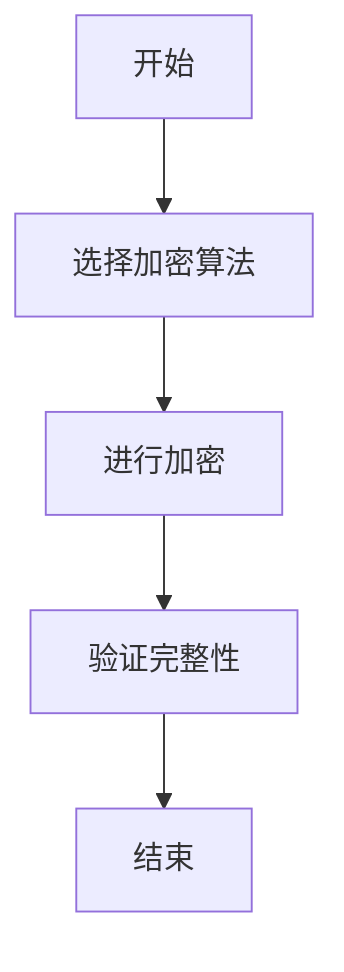
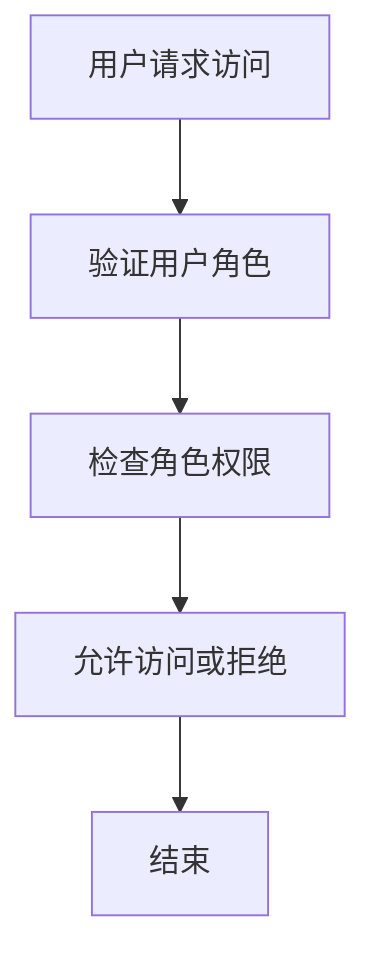
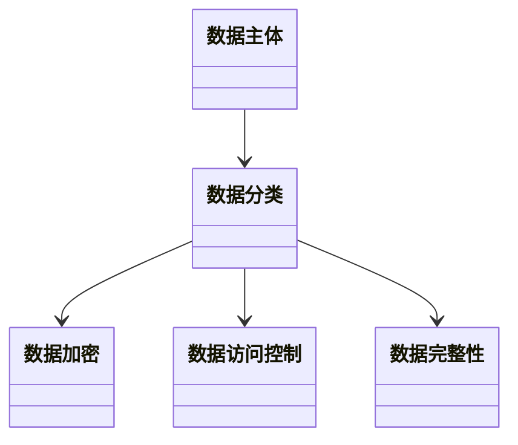
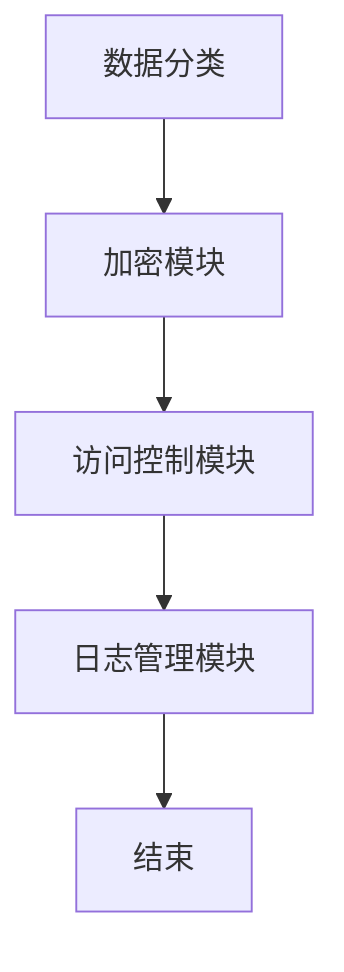
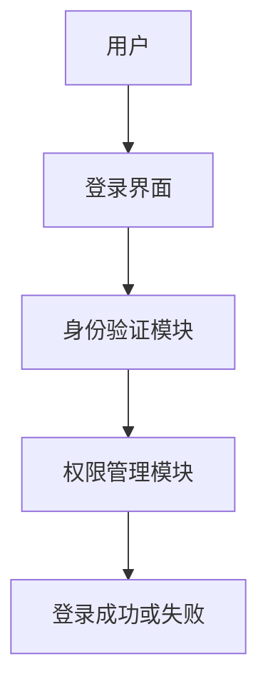
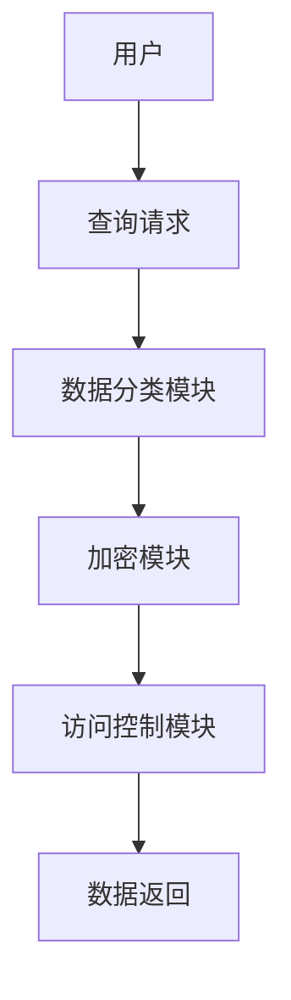

                 


# 第三章: 数据安全算法原理

## 3.1 数据加密算法

### 3.1.1 对称加密算法
对称加密算法是一种加密方法，其加密和解密使用相同的密钥。常见算法包括AES（高级加密标准）、DES（数据加密标准）和RC4。

#### AES加密算法
AES是一种广泛使用的加密算法，支持128、192和256位密钥长度。其加密过程包括以下几个步骤：
1. 初始轮：将明文分成多个块。
2. 多轮加密：每个轮次包括四个基本操作：字节代换、行移位、列混淆和轮密钥加。
3. 最后轮：省略列混淆操作。

**数学模型**：
$$ AES加密过程 = f_{key}(plaintext) $$

**代码实现示例**：
```python
from cryptography.hazmat.primitives.ciphers import Cipher, algorithms, modes
from cryptography.hazmat.primitives.asymmetric import padding

# 创建AES加密对象
key = b'your-secret-key'
cipher = Cipher(algorithms.AES(key), modes.ECB())
encryptor = cipher.encryptor()

# 加密明文
plaintext = b'Hello World'
ciphertext = encryptor.update(plaintext) + encryptor.finalize()
```

### 3.1.2 非对称加密算法
非对称加密算法使用公钥和私钥进行加密和解密。常见算法包括RSA和ECDSA。

#### RSA算法
RSA是一种基于大整数分解的公钥加密算法，主要步骤包括：
1. 生成大质数p和q。
2. 计算n = p * q。
3. 计算欧拉函数φ(n)。
4. 选择加密指数e（满足e和φ(n)互质）。
5. 计算解密指数d（满足e * d ≡ 1 mod φ(n)）。

**数学模型**：
$$ C = (M^e \mod n) $$
$$ M = (C^d \mod n) $$

**代码实现示例**：
```python
from cryptography.hazmat.primitives.asymmetric import rsa

# 生成RSA密钥对
private_key = rsa.generate_private_key(
    public_exponent=65537,
    key_size=2048
)
public_key = private_key.public_key()

# 加密明文
plaintext = b'Hello World'
ciphertext = public_key.encrypt(plaintext, padding.PKCS1v15())
```

### 3.1.3 哈希函数
哈希函数用于生成数据的唯一摘要。常见算法包括MD5和SHA-256。

#### SHA-256哈希函数
SHA-256是一种常用的哈希算法，其输出长度为256位。

**数学模型**：
$$ H = SHA256(message) $$

**代码实现示例**：
```python
import hashlib

# 生成SHA256哈希值
message = b'Hello World'
hash_object = hashlib.sha256(message)
hex_dig = hash_object.hexdigest()
```

## 3.2 数据访问控制算法

### 3.2.1 基于角色的访问控制（RBAC）
RBAC是一种常用的数据访问控制模型，基于用户角色分配权限。

#### RBAC模型
RBAC模型包括以下四个核心概念：
1. 用户（User）
2. 角色（Role）
3. 权限（Permission）
4. 资源（Resource）

**关系表示**：
$$ 用户 \in 角色 $$
$$ 角色 \subseteq 权限 $$
$$ 权限 \subseteq 资源 $$

### 3.2.2 基于属性的访问控制（ABAC）
ABAC是一种更灵活的访问控制模型，基于用户属性、资源属性和环境因素动态分配权限。

#### ABAC模型
ABAC模型涉及以下要素：
1. 用户属性（User Attributes）
2. 资源属性（Resource Attributes）
3. 环境属性（Environment Attributes）
4. 权限决策（Access Decision）

**决策逻辑**：
$$ 决策 = f(user, resource, environment) $$

## 3.3 数据完整性校验算法

### 3.3.1 CRC校验
CRC校验是一种常用的错误检测码，用于验证数据完整性。

#### CRC校验计算步骤
1. 初始化校验值为1。
2. 将数据流逐位与校验值异或。
3. 使用生成多项式进行移位和校验。

**数学模型**：
$$ CRC(message) = (message \times G(x)) \mod x^r - 1 $$

### 3.3.2 SHA哈希算法
SHA哈希算法用于生成数据的固定长度摘要，确保数据完整性。

#### SHA校验流程
1. 计算数据的哈希值。
2. 比较哈希值是否一致。

**数学模型**：
$$ H = SHA(message) $$
$$ 如果 H == 期望哈希，则数据完整。 $$

## 3.4 算法流程图

### 数据加密流程图


### 数据访问控制流程图


## 3.5 数学模型与公式

### AES加密算法
$$ AES加密过程 = f_{key}(plaintext) $$

### RSA加密算法
$$ C = M^e \mod n $$
$$ M = C^d \mod n $$

### SHA-256哈希函数
$$ H = SHA256(message) $$

## 3.6 本章小结
本章详细讲解了数据安全中的关键算法，包括数据加密、访问控制和完整性校验。通过对对称加密和非对称加密的对比，以及哈希函数的应用，帮助读者理解如何选择合适的算法来保护数据安全。同时，通过流程图和数学模型的展示，进一步明确了算法的实现步骤和原理。

---

# 第四章: 数据安全系统分析与架构设计

## 4.1 数据安全系统概述
数据安全系统是一种用于保护企业数据资产的系统，通过多种安全措施确保数据的机密性、完整性和可用性。

### 4.1.1 系统功能需求
1. 数据分类与分级
2. 数据加密与解密
3. 访问控制管理
4. 数据完整性校验
5. 安全审计与日志管理

## 4.2 数据安全系统分析

### 4.2.1 系统功能分析
#### 领域模型
数据安全系统涉及多个功能模块，包括数据分类、访问控制、加密传输和安全审计。

**领域模型类图**：


### 4.2.2 系统架构分析
数据安全系统采用分层架构设计，包括数据处理层、安全管理层和交互层。

**系统架构图**：


## 4.3 系统架构设计

### 4.3.1 模块划分
1. 数据分类模块
2. 加密模块
3. 访问控制模块
4. 日志管理模块

### 4.3.2 模块交互
1. 数据分类模块接收数据并进行分类。
2. 加密模块根据分类结果进行加密。
3. 访问控制模块验证用户权限。
4. 日志管理模块记录操作日志。

**模块交互流程图**：


## 4.4 系统接口设计

### 4.4.1 系统接口
1. 数据分类接口：`/api/classify`
2. 加密接口：`/api/encrypt`
3. 访问控制接口：`/api/access`

### 4.4.2 接口交互流程
1. 用户发送数据分类请求。
2. 系统调用数据分类模块。
3. 分类完成后，调用加密模块。
4. 加密完成后，调用访问控制模块。
5. 访问控制模块验证权限，返回结果。

## 4.5 系统交互流程图

### 用户登录流程


### 数据查询流程


## 4.6 本章小结
本章通过对数据安全系统的功能需求、架构设计和模块交互的详细分析，展示了如何构建一个高效且安全的数据安全系统。通过分层架构和模块化设计，确保系统的可扩展性和可维护性。同时，通过接口设计和交互流程图，明确了系统各部分之间的协作关系。

---

# 第五章: 项目实战

## 5.1 项目概述

### 5.1.1 项目背景
某企业需要构建一个数据安全系统，用于保护其核心数据资产。

### 5.1.2 项目目标
1. 数据分类与分级
2. 数据加密与解密
3. 访问控制管理
4. 安全审计与日志管理

## 5.2 项目环境与工具

### 5.2.1 开发环境
1. 操作系统：Linux Ubuntu 20.04
2. 开发工具：PyCharm
3. 依赖管理：pip

### 5.2.2 开发工具
1. 数据库：MySQL
2. 加密库：cryptography
3. 访问控制库：django guardian

## 5.3 项目核心实现

### 5.3.1 数据分类模块

#### 数据分类实现
数据分类模块根据数据的重要性和敏感性进行分类。

**代码实现示例**：
```python
def classify_data(data):
    # 数据分类逻辑
    if data.is_sensitive:
        return 'high'
    elif data.is_private:
        return 'medium'
    else:
        return 'low'
```

### 5.3.2 数据加密模块

#### 数据加密实现
使用AES加密算法对数据进行加密。

**代码实现示例**：
```python
from cryptography.hazmat.primitives.ciphers import Cipher, algorithms, modes
from cryptography.hazmat.primitives.asymmetric import padding

def encrypt_data(plaintext, key):
    cipher = Cipher(algorithms.AES(key), modes.ECB())
    encryptor = cipher.encryptor()
    return encryptor.update(plaintext) + encryptor.finalize()
```

### 5.3.3 访问控制模块

#### 访问控制实现
基于角色的访问控制（RBAC）实现数据访问权限管理。

**代码实现示例**：
```python
from django.contrib.auth.models import User, Group
from guardian.shortcuts import assign_perm

def assign_access(user, role):
    group = Group.objects.get(name=role)
    assign_perm('view_data', user, group)
```

### 5.3.4 安全日志模块

#### 安全日志实现
记录用户的操作日志，便于后续审计。

**代码实现示例**：
```python
import logging

logger = logging.getLogger('security_log')

def log_activity(user, action):
    logger.info(f"{user} performed {action}")
```

## 5.4 项目实战案例分析

### 5.4.1 案例分析
假设某企业需要保护其客户数据，可以通过以下步骤实现：

1. 数据分类：将客户数据分为高、中、低三个级别。
2. 数据加密：对敏感数据进行AES加密。
3. 访问控制：基于角色分配访问权限。
4. 安全日志：记录用户的操作日志。

### 5.4.2 项目总结
通过该项目，我们验证了数据安全系统的可行性和有效性。在实际应用中，可以根据企业需求进行功能扩展和性能优化。

## 5.5 本章小结
本章通过一个实际案例，详细讲解了如何在企业中实施数据安全系统。从环境搭建、模块实现到案例分析，全面展示了数据安全项目的实施过程。通过本章的学习，读者可以掌握数据安全系统的核心技术，并能够将其应用到实际项目中。

---

# 第六章: 总结与展望

## 6.1 全书总结
本书系统地介绍了如何识别企业的数据安全优势，涵盖了数据安全的基础知识、算法原理、系统设计和项目实战。通过理论与实践相结合的方式，帮助读者全面掌握数据安全的核心技术。

### 6.1.1 核心知识点回顾
1. 数据安全的定义与重要性
2. 数据安全的核心要素与概念
3. 数据安全算法的原理与实现
4. 数据安全系统的架构设计
5. 项目实战与案例分析

## 6.2 未来展望
随着数据安全威胁的不断增加，数据安全技术将不断发展和创新。未来，数据安全将更加智能化和自动化，人工智能和区块链等技术将在数据安全领域发挥重要作用。

### 6.2.1 数据安全的未来趋势
1. AI在数据安全中的应用
2. 区块链技术在数据完整性中的应用
3. 零信任架构的普及
4. 自适应安全架构的推广

## 6.3 最佳实践 Tips
1. 定期进行安全演练，确保安全措施的有效性。
2. 关注数据安全领域的最新技术和发展趋势。
3. 加强员工的安全意识培训，减少人为失误。

## 6.4 本章小结
本章总结了全书的核心内容，并展望了数据安全领域的未来发展趋势。通过最佳实践 Tips，为读者提供了实用的建议，帮助他们在实际工作中更好地识别和利用数据安全优势。

---

# 关键词
数据安全、企业优势、算法原理、系统设计、项目实战、安全威胁、数据加密、访问控制

# 摘要
本书详细介绍了如何识别和利用企业的数据安全优势。通过分析数据安全的核心概念、算法原理和系统设计，结合实际项目案例，帮助读者掌握数据安全的核心技术。全书内容涵盖了数据安全的基础知识、算法实现、系统架构设计和项目实战，为企业的数据安全建设提供了全面的指导。

---

以上是《如何识别企业的数据安全优势》的完整目录和内容框架，涵盖了从基础理论到实际应用的各个方面，适合企业技术人员、安全管理人员和相关领域的读者阅读。

