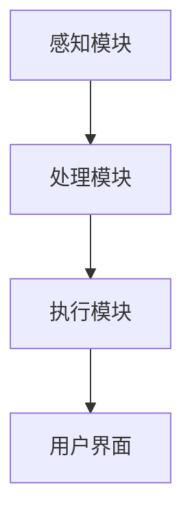

                 


# 如何识别企业的智能材料应用优势

## 关键词：智能材料，企业应用，优势识别，数字化转型，智能制造

## 摘要：  
智能材料作为一种新兴的技术，正在改变企业的产品设计、生产过程和运营模式。本文将深入分析智能材料的核心概念、关键技术、应用场景以及企业如何有效识别和应用其优势。通过详细的技术背景介绍、算法原理、系统架构设计和项目实战案例，本文旨在帮助企业理解智能材料的应用潜力，并为其制定切实可行的战略规划提供指导。

---

# 第1章: 智能材料的基本概念

## 1.1 智能材料的定义与分类  
### 1.1.1 智能材料的定义  
智能材料是一种能够感知外界环境变化并做出相应反应的材料，具有自适应性和智能化特征。  

### 1.1.2 智能材料的分类  
- **形状记忆材料**：能够“记住”形状并在外界刺激下恢复原状。  
- **压电材料**：能够将机械能转化为电能，或反之。  
- **导电材料**：具有高导电性，能够感知温度或应力变化。  
- **智能复合材料**：结合了多种材料特性，具有更高的功能性和耐用性。  

### 1.1.3 智能材料的核心特征  
- **感知能力**：能够检测外界环境的变化（如温度、压力、光线）。  
- **响应能力**：能够根据外界变化做出相应的反应。  
- **自适应能力**：能够在不同环境中自动调整性能。  

## 1.2 智能材料的应用领域  
### 1.2.1 制造业中的智能材料应用  
- 智能材料用于制造自适应工具、智能传感器和自动化设备。  
- 示例：智能夹爪在工业机器人中的应用。  

### 1.2.2 医疗健康中的智能材料应用  
- 智能材料用于开发智能假肢、可穿戴医疗设备和药物缓释系统。  
- 示例：智能绷带能够监测伤口愈合情况并释放药物。  

### 1.2.3 智能材料在能源领域的应用  
- 智能材料用于太阳能电池、智能储能系统和智能电网。  
- 示例：智能光伏材料能够根据光照强度自动调节能量吸收。  

## 1.3 智能材料与企业数字化转型  
### 1.3.1 数字化转型的背景与趋势  
企业通过数字化转型实现业务流程优化、效率提升和创新。智能材料是数字化转型的重要推动力。  

### 1.3.2 智能材料在企业转型中的作用  
- 提供实时数据反馈，优化生产流程。  
- 支持智能决策，提高运营效率。  

### 1.3.3 智能材料与企业创新的关系  
智能材料的应用推动企业创新，特别是在智能制造和绿色制造领域。  

## 1.4 本章小结  
本章介绍了智能材料的基本概念、分类及其在不同领域的应用，强调了智能材料在企业数字化转型中的重要性。  

---

# 第2章: 智能材料的核心技术

## 2.1 智能材料的感知技术  
### 2.1.1 感知技术的定义与原理  
感知技术通过传感器或其他设备检测外界环境的变化。  

### 2.1.2 常见的感知技术类型  
- 温度传感器：检测温度变化。  
- 压力传感器：检测压力变化。  
- 光电传感器：检测光强变化。  

### 2.1.3 感知技术在企业中的应用  
- 制造业中的设备状态监测。  
- 医疗设备中的患者监测。  

## 2.2 智能材料的计算技术  
### 2.2.1 计算技术的定义与原理  
计算技术用于处理感知数据并做出决策。  

### 2.2.2 常见的计算技术类型  
- 机器学习算法：用于模式识别和预测。  
- 数据分析技术：用于数据处理和优化。  

### 2.2.3 计算技术在企业中的应用  
- 制造业中的生产优化。  
- 医疗健康中的疾病诊断。  

## 2.3 智能材料的通信技术  
### 2.3.1 通信技术的定义与原理  
通信技术用于智能材料之间的数据传输。  

### 2.3.2 常见的通信技术类型  
- 无线通信：如Wi-Fi、蓝牙。  
- 有线通信：如以太网。  

### 2.3.3 通信技术在企业中的应用  
- 智能工厂中的设备通信。  
- 智能医疗中的设备数据传输。  

## 2.4 智能材料的自适应技术  
### 2.4.1 自适应技术的定义与原理  
自适应技术使智能材料能够根据环境变化自动调整性能。  

### 2.4.2 常见的自适应技术类型  
- 形状记忆合金：在外力作用下恢复原状。  
- 压电材料：根据外界压力变化产生电能。  

### 2.4.3 自适应技术在企业中的应用  
- 智能机器人中的自适应抓取。  
- 智能建筑中的自适应结构调整。  

## 2.5 本章小结  
本章详细介绍了智能材料的核心技术，包括感知、计算、通信和自适应技术，并探讨了这些技术在企业中的应用。  

---

# 第3章: 智能材料在企业中的应用场景

## 3.1 制造业中的智能材料应用  
### 3.1.1 智能材料在智能制造中的作用  
智能材料用于优化生产流程和提高产品质量。  

### 3.1.2 智能材料在生产优化中的应用  
- 实时监测设备状态，预防故障。  
- 自动调整生产参数以提高效率。  

### 3.1.3 智能材料在质量控制中的应用  
- 检测产品缺陷。  
- 实现质量追溯。  

## 3.2 医疗健康中的智能材料应用  
### 3.2.1 智能材料在医疗设备中的应用  
- 智能假肢：根据用户需求调整参数。  
- 智能绷带：监测伤口愈合情况并释放药物。  

### 3.2.2 智能材料在健康监测中的应用  
- 可穿戴设备：监测心率、血压等生命体征。  
- 智能药片：监测药物释放情况。  

## 3.3 智能材料在能源领域的应用  
### 3.3.1 智能材料在智能电网中的应用  
- 智能传感器：监测电网状态。  
- 自适应材料：调节输电线路的阻抗。  

### 3.3.2 智能材料在智能储能系统中的应用  
- 智能电池：实时监测电池状态并优化充放电过程。  

## 3.4 本章小结  
本章通过具体案例分析了智能材料在制造业、医疗健康和能源领域的应用，展示了其在企业中的巨大潜力。  

---

# 第4章: 识别企业智能材料应用优势的方法

## 4.1 企业内部资源评估  
### 4.1.1 技术能力评估  
- 是否具备智能材料研发或应用的技术团队。  

### 4.1.2 设备与基础设施评估  
- 是否具备支持智能材料应用的设备和网络环境。  

## 4.2 市场需求分析  
### 4.2.1 行业趋势分析  
- 智能材料在行业中的应用前景。  

### 4.2.2 客户需求分析  
- 客户对智能材料产品的接受度和需求量。  

## 4.3 技术能力评估  
### 4.3.1 研发能力  
- 是否具备智能材料相关技术研发能力。  

### 4.3.2 应用能力  
- 是否具备将智能材料应用于现有产品的能力。  

## 4.4 竞争优势分析  
### 4.4.1 技术竞争优势  
- 智能材料应用的技术壁垒。  

### 4.4.2 成本优势  
- 智能材料应用的成本效益分析。  

## 4.5 实施策略  
### 4.5.1 分阶段实施策略  
- 先试点，再推广。  

### 4.5.2 合作与创新策略  
- 与高校、科研机构合作，推动技术创新。  

## 4.6 本章小结  
本章提供了一套识别企业智能材料应用优势的方法，包括内部资源评估、市场需求分析、技术能力评估和竞争优势分析，为企业制定应用策略提供了指导。  

---

# 第5章: 智能材料应用中的算法原理

## 5.1 数据采集与处理  
### 5.1.1 数据采集方法  
- 使用传感器采集环境数据。  

### 5.1.2 数据预处理  
- 清洗数据，去除噪声。  

## 5.2 特征提取与模型训练  
### 5.2.1 特征提取算法  
- 使用主成分分析（PCA）提取关键特征。  

### 5.2.2 机器学习模型  
- 线性回归、支持向量机（SVM）、随机森林等。  

## 5.3 模型优化与部署  
### 5.3.1 超参数优化  
- 使用网格搜索或随机搜索优化模型参数。  

### 5.3.2 模型部署  
- 将训练好的模型部署到实际系统中。  

## 5.4 数学公式  
### 5.4.1 线性回归公式  
$$ y = \beta_0 + \beta_1x + \epsilon $$  

### 5.4.2 支持向量机公式  
$$ \text{目标函数}：\min_{\beta, \beta_0} \frac{1}{2}\|\beta\|^2 + C\sum_{i=1}^n \xi_i $$  
$$ \text{约束条件}：y_i(\beta_0 + \beta^T x_i) \geq 1 - \xi_i, \xi_i \geq 0 $$  

## 5.5 本章小结  
本章介绍了智能材料应用中的算法原理，包括数据采集、特征提取、模型训练和优化，为企业的技术实现提供了理论基础。  

---

# 第6章: 智能材料应用系统的架构设计

## 6.1 系统功能设计  
### 6.1.1 感知模块  
- 采集环境数据并传输到处理模块。  

### 6.1.2 处理模块  
- 对数据进行分析和处理，生成决策指令。  

### 6.1.3 执行模块  
- 根据决策指令做出响应，如调整设备参数。  

## 6.2 系统架构图  


## 6.3 接口设计  
### 6.3.1 数据接口  
- 传感器与处理模块之间的数据接口。  

### 6.3.2 用户接口  
- 用户与系统的交互界面，如触摸屏或手机App。  

## 6.4 交互流程设计  
### 6.4.1 用户操作  
- 用户通过界面输入需求。  

### 6.4.2 系统响应  
- 系统根据需求做出相应调整。  

## 6.5 本章小结  
本章详细描述了智能材料应用系统的架构设计，包括功能模块划分、系统架构图和接口设计，为企业实现智能材料应用提供了指导。  

---

# 第7章: 智能材料应用的项目实战

## 7.1 项目背景与目标  
### 7.1.1 项目背景  
- 某制造企业希望引入智能材料优化生产流程。  

### 7.1.2 项目目标  
- 实现设备状态实时监测和生产参数自动调整。  

## 7.2 项目实施步骤  
### 7.2.1 环境安装  
- 安装必要的传感器和网络设备。  

### 7.2.2 核心代码实现  
```python
import numpy as np
from sklearn.linear_model import LinearRegression

# 示例代码：使用线性回归预测设备状态
X = np.array([[1], [2], [3], [4]])
y = np.array([2, 4, 6, 8])
model = LinearRegression().fit(X, y)
print(model.predict([[5]]))  # 输出：[[10]]
```

### 7.2.3 代码解读与分析  
- 使用线性回归模型预测设备状态，实现设备状态的实时监测。  

## 7.3 实际案例分析  
### 7.3.1 案例背景  
- 某制造企业引入智能材料后，设备故障率降低了30%。  

### 7.3.2 案例分析  
- 智能传感器实时监测设备状态，预防故障发生。  

## 7.4 项目小结  
本章通过实际案例展示了智能材料应用的实施过程和效果，为企业提供了可参考的实战经验。  

---

# 第8章: 总结与展望

## 8.1 本章总结  
智能材料的应用为企业带来了显著的效率提升和竞争优势。通过识别智能材料的应用优势，企业可以在智能制造、医疗健康和能源等领域实现创新发展。  

## 8.2 最佳实践 Tips  
- 企业应结合自身需求选择合适的智能材料应用方案。  
- 注重技术团队的培养和创新能力的提升。  

## 8.3 未来展望  
随着人工智能和物联网技术的不断发展，智能材料的应用前景将更加广阔。未来，智能材料将更加智能化和自适应，为企业创造更大的价值。  

## 8.4 本章小结  
本章总结了全文内容，提出了未来的研究方向和实践建议，为读者提供了进一步学习和探索的思路。  

---

# 结语  
智能材料的应用是企业数字化转型的重要方向。通过本文的系统分析和详细指导，企业可以更好地识别智能材料的应用优势，并制定切实可行的应用策略，从而在激烈的市场竞争中占据优势地位。

