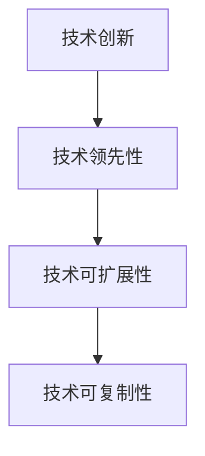
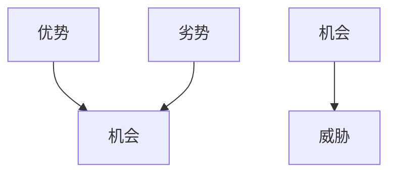
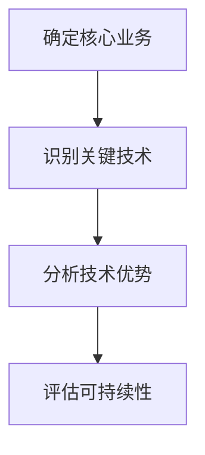
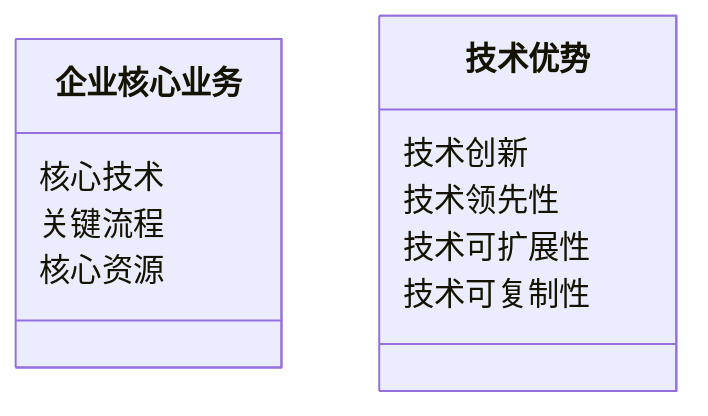
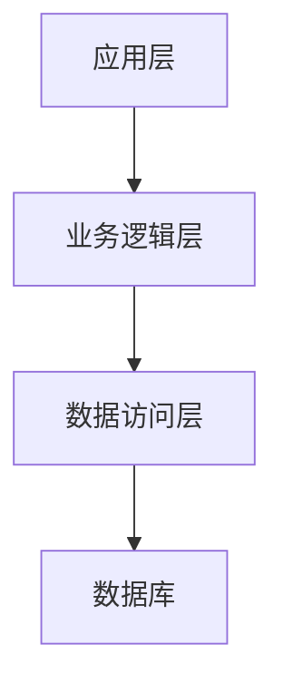
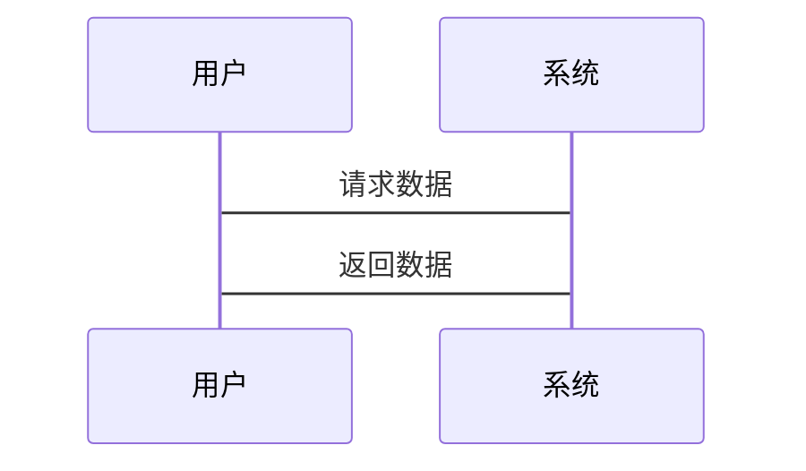

                 


# 如何识别企业的核心技术优势

## 关键词：
核心技术优势、企业竞争力、技术分析、系统架构、竞争优势

## 摘要：
识别企业的核心技术优势是企业在竞争激烈的市场中保持优势的关键。本文将从定义、核心要素、识别方法论、系统分析与架构设计以及实战案例等方面，详细阐述如何识别和评估企业的核心技术优势，帮助企业在技术竞争中立于不败之地。

---

# 第1章: 核心技术优势的定义与重要性

## 1.1 核心技术优势的定义

### 1.1.1 核心技术的定义
核心技术是指企业在其核心业务中所依赖的关键技术，这些技术是企业产品或服务的核心竞争力所在，通常具有较高的技术门槛和难以替代性。

### 1.1.2 核心技术优势的内涵
核心技术优势是指企业在特定领域内，通过其核心技术所形成的优势，这些优势能够使企业在市场上获得差异化竞争能力。

### 1.1.3 核心技术优势与企业竞争力的关系
核心技术优势是企业竞争力的核心来源，它决定了企业在市场中的地位和盈利能力。拥有强大的核心技术优势，企业能够更好地应对市场竞争和技术创新的挑战。

## 1.2 核心技术优势的重要性

### 1.2.1 核心技术优势对企业生存的意义
核心技术优势是企业生存和发展的基石，特别是在技术驱动的行业中，核心技术优势能够确保企业在技术更新和市场竞争中占据主动地位。

### 1.2.2 核心技术优势与企业创新的关系
核心技术优势为企业创新提供了基础和方向。企业可以通过对其核心技术的持续优化和创新，进一步巩固和扩大其技术优势。

### 1.2.3 核心技术优势在行业竞争中的作用
在行业竞争中，核心技术优势能够使企业在产品性能、成本控制、用户体验等方面形成差异化竞争，从而在市场中占据更大的份额。

## 1.3 核心技术优势的边界与外延

### 1.3.1 核心技术优势的边界
核心技术优势的边界通常由企业的核心业务和核心技术决定。企业的非核心业务和技术通常不被纳入核心技术优势的范畴。

### 1.3.2 核心技术优势的外延
核心技术优势的外延包括与核心技术相关的技术储备、研发能力、技术团队等，这些因素共同构成了企业核心技术优势的综合实力。

### 1.3.3 核心技术优势与其他概念的区分
以下是核心技术优势与其他相关概念的对比：

| 概念                | 定义                                                                 | 区别                     |
|---------------------|--------------------------------------------------------------------|--------------------------|
| 核心技术            | 企业核心业务所依赖的关键技术                                         | 核心技术是核心技术优势的基础     |
| 竞争优势            | 企业在市场中相对于竞争对手的优势                                     | 竞争优势可能来自多个方面，包括技术、成本等 |
| 核心竞争力          | 企业能够在市场上持续竞争并获胜的能力                                 | 核心竞争力通常基于核心技术优势   |

---

# 第2章: 核心技术优势的核心要素与概念结构

## 2.1 核心技术优势的核心要素

### 2.1.1 技术的创新性
核心技术优势通常基于创新的技术，这种创新性使得企业在技术上具有领先地位，能够满足市场的新需求。

### 2.1.2 技术的领先性
核心技术优势要求企业在技术上具有领先性，能够通过技术领先在市场上占据优势地位。

### 2.1.3 技术的可扩展性
核心技术优势需要具有较强的可扩展性，能够适应市场的变化和技术的进步，支持企业的持续发展。

### 2.1.4 技术的可复制性
核心技术优势的可复制性决定了其在企业内部和其他业务中的应用潜力，可复制性越强，技术优势的影响力越大。

## 2.2 核心技术优势的概念结构

### 2.2.1 核心技术优势的组成要素
核心技术优势的组成要素包括技术创新、技术领先性、技术可扩展性和技术可复制性。

### 2.2.2 核心技术优势的系统架构
以下是核心技术优势的系统架构图：



### 2.2.3 核心技术优势的动态演进
核心技术优势并非一成不变，它需要随着市场需求和技术发展的变化而不断演进和优化。

## 2.3 核心技术优势的属性特征对比

### 2.3.1 核心技术与非核心技术的对比
以下是核心技术与非核心技术的对比：

| 属性               | 核心技术                 | 非核心技术               |
|--------------------|--------------------------|--------------------------|
| 对企业的影响         | 对企业核心竞争力影响大   | 对企业竞争力影响较小     |
| 技术门槛             | 技术门槛高              | 技术门槛低              |
| 可替代性             | 可替代性低              | 可替代性高              |

### 2.3.2 核心技术优势与竞争优势的对比
以下是核心技术优势与竞争优势的对比：

| 属性               | 核心技术优势            | 竞争优势                |
|--------------------|-------------------------|-------------------------|
| 来源               | 技术创新和领先性         | 多方面，包括技术、成本等 |
| 持续性             | 具有较强的持续性         | 可能受到市场变化影响     |
| 对企业的影响         | 是企业核心竞争力的来源   | 是企业市场表现的结果     |

### 2.3.3 核心技术优势与企业资源的对比
以下是核心技术优势与企业资源的对比：

| 属性               | 核心技术优势            | 企业资源                |
|--------------------|-------------------------|-------------------------|
| 类型               | 技术资源                | 包括技术、资金、人才等   |
| 核心性             | 是企业核心竞争力的来源   | 是企业运营的基础        |
| 可转化性           | 可转化为市场优势        | 可转化为市场优势        |

---

# 第3章: 核心技术优势的识别方法论

## 3.1 核心技术优势的识别步骤

### 3.1.1 确定企业的核心业务
首先，企业需要明确其核心业务，即企业的主要收入来源和核心价值主张。

### 3.1.2 识别核心业务中的关键技术
在核心业务中，识别出支撑核心业务的关键技术，这些技术通常是企业的核心技术。

### 3.1.3 分析关键技术的竞争优势
对这些关键技术进行分析，评估它们在市场上的竞争优势，包括技术的创新性、领先性、可扩展性和可复制性。

### 3.1.4 评估核心技术优势的可持续性
评估这些技术优势的可持续性，包括技术的更新速度、市场的接受度以及技术的可扩展性。

## 3.2 核心技术优势的识别工具与方法

### 3.2.1 SWOT分析法
SWOT分析法是一种常用的战略分析工具，可以帮助企业识别其核心技术优势。



### 3.2.2 PEST分析法
PEST分析法是一种用于分析外部环境的工具，可以帮助企业识别核心技术优势的外部影响因素。

### 3.2.3 价值链分析法
价值链分析法可以帮助企业识别其核心业务中的关键价值活动，并分析这些活动中的技术优势。

### 3.2.4 核心竞争力评估模型
核心竞争力评估模型是一种用于评估企业核心竞争力的工具，可以帮助企业识别其核心技术优势。

## 3.3 核心技术优势识别的流程图



---

# 第4章: 核心技术优势的系统分析与架构设计

## 4.1 系统分析方法

### 4.1.1 问题场景介绍
在识别核心技术优势的过程中，企业需要对核心业务和技术进行系统分析，以确保识别的准确性和全面性。

### 4.1.2 领域模型设计
以下是领域模型设计的类图：



## 4.2 系统架构设计

### 4.2.1 分层架构
以下是系统架构设计的分层架构图：



### 4.2.2 接口设计
以下是系统接口设计的序列图：



---

# 第5章: 项目实战

## 5.1 环境配置
以下是项目实战的环境配置：

```bash
# 安装必要的依赖
pip install numpy pandas matplotlib
```

## 5.2 核心代码实现

### 5.2.1 数据预处理

```python
import pandas as pd

# 加载数据
data = pd.read_csv('data.csv')

# 数据清洗
data.dropna(inplace=True)
data = data.drop_duplicates()
```

### 5.2.2 核心算法实现

```python
import numpy as np

def identify_core_technology(data):
    # 计算技术优势评分
    scores = data.apply(lambda x: x.sum(), axis=1)
    # 识别核心技术
    core_technology = data.loc[scores > scores.mean(), :]
    return core_technology

# 应用算法
core_technology = identify_core_technology(data)
```

### 5.2.3 结果分析

```python
print("核心技术优势：")
print(core_technology)
```

## 5.3 案例分析

### 5.3.1 案例背景
假设我们正在分析一家互联网企业的核心技术优势，其核心业务包括在线教育、金融科技和云计算服务。

### 5.3.2 案例分析过程
通过上述算法，我们识别出在线教育的核心技术优势在于其智能推荐算法，而金融科技的核心技术优势在于其区块链技术。

## 5.4 项目小结
通过项目实战，我们成功识别了企业的核心技术优势，并为企业的技术创新和市场竞争提供了有力支持。

---

# 总结与展望

## 6.1 总结
识别企业的核心技术优势是企业在竞争激烈的市场中保持优势的关键。本文从定义、核心要素、识别方法论、系统分析与架构设计以及实战案例等方面，详细阐述了如何识别和评估企业的核心技术优势。

## 6.2 最佳实践 tips
- 定期评估核心技术优势，确保其持续性。
- 通过技术创新和优化，巩固和扩大核心技术优势。
- 建立技术团队和研发能力，支持核心技术优势的实现和应用。

## 6.3 小结
核心技术优势是企业竞争力的核心来源，通过本文的方法和工具，企业可以有效识别和评估其核心技术优势，从而在市场竞争中占据优势地位。

## 6.4 注意事项
- 核心技术优势的识别需要结合企业的实际情况和市场需求。
- 技术优势的评估需要考虑多方面的因素，包括技术、市场和竞争环境。

## 6.5 拓展阅读
- 技术创新与企业竞争力
- 核心竞争力评估模型
- 技术战略与企业规划

---

通过本文的详细阐述和实战案例，读者可以更好地理解和掌握如何识别和评估企业的核心技术优势，为企业的发展和市场竞争提供有力支持。

