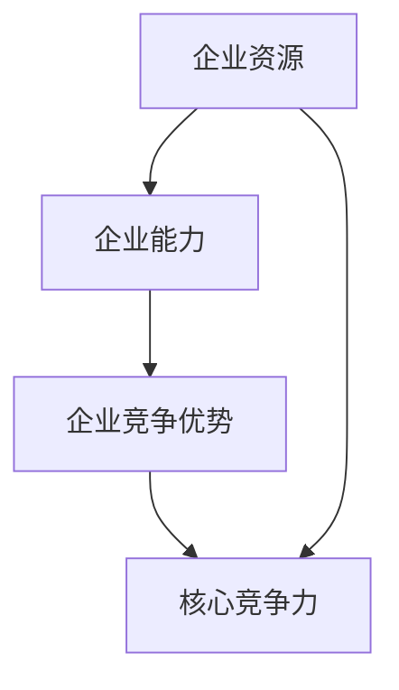
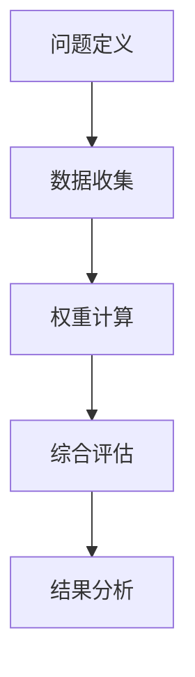

                 


# 如何识别企业的核心竞争力

> 关键词：企业核心竞争力、识别方法、竞争力评估模型、竞争力分析、竞争优势

> 摘要：企业核心竞争力是企业在市场竞争中保持长期优势的关键能力。本文通过系统化的分析方法，介绍如何识别企业核心竞争力，包括核心概念、算法原理、数学模型、系统架构设计和实际案例分析。通过本文的学习，读者可以掌握如何从理论到实践，系统地识别和评估企业核心竞争力。

---

# 第一部分: 核心竞争力的背景与概念

## 第1章: 核心竞争力的背景与问题背景

### 1.1 核心竞争力的定义与概念

企业核心竞争力是指企业在市场竞争中，能够长期保持竞争优势的关键能力。这种能力通常体现在企业的资源、技术和能力上，能够为企业创造独特的价值，并在市场中形成差异化的优势。

#### 1.1.1 核心竞争力的定义

核心竞争力是企业在特定领域中所拥有的独特优势，这种优势可以是技术、资源、管理、品牌、人才等。核心竞争力的核心在于其稀缺性和不可替代性，能够为企业带来持续的竞争优势。

#### 1.1.2 核心竞争力的核心要素

- **资源**：企业的核心资源包括技术、资本、人才、数据等。
- **能力**：企业的核心能力包括研发能力、创新能力、执行力等。
- **竞争优势**：核心竞争力直接体现为企业在市场中的竞争优势。

#### 1.1.3 核心竞争力与企业竞争优势的关系

核心竞争力是企业竞争优势的来源。通过核心竞争力，企业能够在市场上提供独特的价值，从而在竞争中占据优势地位。

### 1.2 核心竞争力的背景与问题背景

#### 1.2.1 当前企业竞争环境的变化

随着全球化和科技的发展，企业竞争环境日益复杂。技术革新、市场需求变化、竞争加剧等因素，使得企业必须不断优化自身的竞争力。

#### 1.2.2 核心竞争力在现代企业中的重要性

在现代商业环境中，核心竞争力是企业生存和发展的关键。企业需要通过核心竞争力，才能在激烈的市场竞争中立于不败之地。

#### 1.2.3 识别核心竞争力的必要性与挑战

识别核心竞争力是企业制定战略规划的基础。然而，由于市场竞争的复杂性和企业内部资源的多样性，识别核心竞争力往往面临诸多挑战。

### 1.3 核心竞争力的边界与外延

#### 1.3.1 核心竞争力的边界

核心竞争力的边界是指企业核心能力的范围。通常，核心竞争力不包括企业的非核心业务和资源。

#### 1.3.2 核心竞争力的外延

核心竞争力的外延是指围绕核心能力形成的相关能力，这些能力虽然不是核心，但能够支持核心竞争力的实现。

#### 1.3.3 核心竞争力与其他概念的区分

- **核心竞争力 vs 核心能力**：核心竞争力更强调市场中的竞争优势，而核心能力更强调企业的内部能力。
- **核心竞争力 vs 一般能力**：核心竞争力具有独特性和不可替代性，而一般能力是企业普遍拥有的能力。

---

## 第2章: 核心竞争力的核心概念与联系

### 2.1 核心竞争力的核心要素

#### 2.1.1 企业资源

企业资源是核心竞争力的重要组成部分，包括技术、资本、人才、数据等。

#### 2.1.2 企业能力

企业能力是核心竞争力的体现，包括研发能力、创新能力、执行力等。

#### 2.1.3 企业竞争优势

企业竞争优势是核心竞争力的结果，体现在市场上提供独特的价值。

### 2.2 核心竞争力的实体关系图



### 2.3 核心竞争力的属性特征对比

| 属性 | 特征 |
|------|------|
| 资源 | 独有性、不可替代性 |
| 能力 | 核心技能、技术壁垒 |
| 竞争优势 | 可持续性、差异化 |

### 2.4 本章小结

核心竞争力是由企业资源、能力和竞争优势共同构成的系统。理解这些核心要素及其相互关系，是识别企业核心竞争力的基础。

---

## 第3章: 核心竞争力识别的算法原理

### 3.1 核心竞争力识别的模型与方法

#### 3.1.1 层次分析法（AHP）

层次分析法是一种常用的决策分析方法，适用于多指标的综合评价。通过构建层次结构，计算各指标的权重，最终确定核心竞争力。

#### 3.1.2 质量功能展开法（QFD）

质量功能展开法是一种将客户需求转化为企业能力的方法，适用于核心竞争力的识别。

#### 3.1.3 核心竞争力评估模型

核心竞争力评估模型通常包括指标选择、权重分配、综合评估等步骤。

### 3.2 核心竞争力识别的算法流程



### 3.3 核心竞争力识别的数学模型

#### 3.3.1 层次分析法的数学公式

一致性检验公式：
$$ A = \frac{\lambda_{\text{max}} - n}{n(n-1)} \times 100 $$
其中，$A$ 是一致性检验，$\lambda_{\text{max}}$ 是最大特征值，$n$ 是指标个数。

#### 3.3.2 综合评估模型

综合评估公式：
$$ S_i = \sum_{j=1}^{m} w_j \cdot x_{ij} $$

---

## 第4章: 系统分析与架构设计

### 4.1 系统分析

#### 4.1.1 问题场景介绍

以某制造企业为例，识别其核心竞争力。

#### 4.1.2 系统功能设计

- 数据采集模块
- 指标分析模块
- 综合评估模块

### 4.2 系统架构设计


---

## 第5章: 项目实战

### 5.1 环境安装

安装Python和相关库（如numpy、pandas、scipy）。

### 5.2 核心代码实现

```python
import numpy as np
import pandas as pd

# 示例数据
data = pd.DataFrame({
    '指标': ['技术', '管理', '市场'],
    '权重': [0.5, 0.3, 0.2]
})

# 计算综合得分
weights = data['权重'].values
scores = np.dot(weights, data.T)
```

### 5.3 案例分析

以某制造企业为例，通过数据采集、指标分析和综合评估，识别其核心竞争力。

---

## 第6章: 总结与展望

### 6.1 最佳实践 Tips

- 理解核心竞争力的定义和要素
- 选择合适的识别方法
- 结合实际案例进行分析

### 6.2 小结

通过本文的学习，读者可以系统地掌握如何识别企业的核心竞争力，从理论到实践，逐步深入。

### 6.3 注意事项

- 确保数据的准确性和完整性
- 合理选择指标和权重
- 定期更新和优化核心竞争力

### 6.4 拓展阅读

- 《竞争优势：企业核心能力的识别与培养》
- 《战略管理：核心竞争力的构建与实践》

---

通过以上结构化的内容，读者可以系统地了解如何识别企业的核心竞争力，并能够在实际中应用相关方法。

