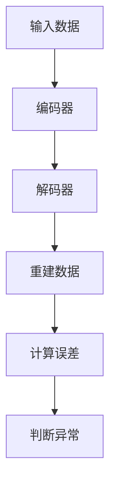
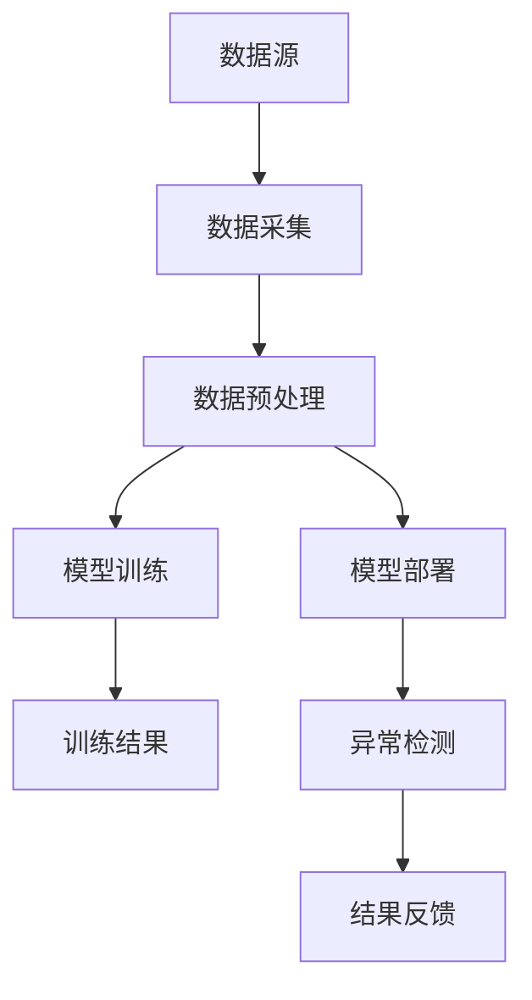
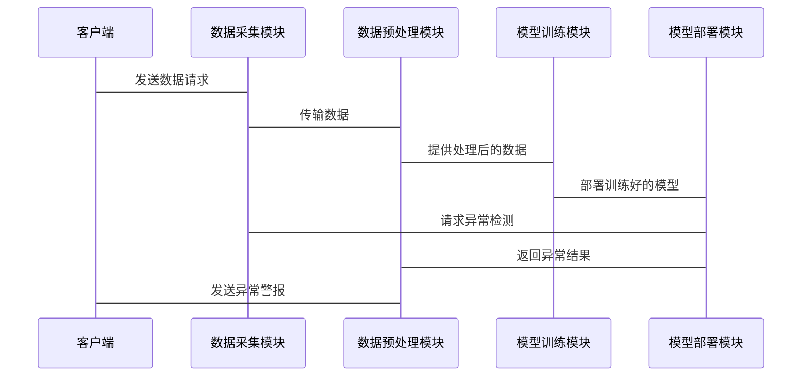

                 


# 如何识别企业的深度学习异常检测优势

## 关键词：深度学习，异常检测，企业应用，自编码器，生成对抗网络

## 摘要：深度学习技术在企业异常检测中发挥着越来越重要的作用。本文将从背景介绍、核心概念、算法原理、系统架构、项目实战到最佳实践，逐步解析如何识别和应用深度学习在异常检测中的优势，帮助企业提升数据安全和业务效率。

---

## 第一部分：背景介绍

### 第1章：深度学习异常检测概述

#### 1.1 异常检测的基本概念

- **1.1.1 异常检测的定义**
  异常检测是指识别数据中与预期模式或行为显著不同的数据点。这些数据点通常表示潜在的问题或机会。

- **1.1.2 异常检测的应用场景**
  - 金融行业：检测欺诈交易。
  - 健康医疗：识别异常的生理指标。
  - 网络安全：发现入侵行为。
  - 企业运营：监控生产过程中的异常情况。

- **1.1.3 异常检测与正常数据的区分**
  异常数据通常数量少、影响大，可能对业务造成重大影响，因此需要及时识别。

---

## 第二部分：核心概念与联系

### 第2章：异常检测的核心原理

#### 2.1 异常检测的分类

- **2.1.1 基于统计的方法**
  - 使用统计指标（如均值、标准差）识别异常。
  - 适用于数据分布已知的情况，但对复杂数据效果有限。

- **2.1.2 基于机器学习的方法**
  - 使用监督学习（如SVM、随机森林）或无监督学习（如聚类）。
  - 适用于数据量较大且分布较复杂的场景。

- **2.1.3 基于深度学习的方法**
  - 使用神经网络模型（如自编码器、GAN）进行特征提取和异常识别。
  - 适合处理高维、非线性数据，能够捕捉复杂模式。

#### 2.2 深度学习模型在异常检测中的应用

- **2.2.1 神经网络模型**
  - 使用多层感知机（MLP）进行非线性特征提取。
  - 示例：输入为时间序列数据，输出为异常概率。

- **2.2.2 卷积神经网络（CNN）**
  - 适用于图像或时间序列数据的局部特征提取。
  - 示例：在金融交易中识别异常交易模式。

- **2.2.3 循环神经网络（RNN）**
  - 适用于序列数据，能够捕捉时序依赖关系。
  - 示例：在自然语言处理中检测异常文本。

#### 2.3 异常检测的核心概念对比

- **2.3.1 异常检测与分类的对比**
  - 分类：数据分为已知类别，目标是准确分类。
  - 异常检测：寻找与大多数数据不同的样本，通常类别是“正常”和“异常”。

- **2.3.2 异常检测与聚类的对比**
  - 聚类：将数据分成相似的组别，无监督学习。
  - 异常检测：识别与大多数数据不一致的个体。

- **2.3.3 异常检测与回归的对比**
  - 回归：预测连续变量的值。
  - 异常检测：识别数据点的异常程度。

#### 2.4 异常检测的核心概念ER实体关系图

```mermaid
erDiagram
    客户 --> 异常检测系统 : 使用
    异常检测系统 --> 数据源 : 采集
    异常检测系统 --> 模型训练 : 训练
    模型训练 --> 训练数据 : 输入
    模型训练 --> 训练结果 : 输出
    异常检测系统 --> 异常检测 : 执行
    异常检测 --> 待测数据 : 输入
    异常检测 --> 异常结果 : 输出
```

---

## 第三部分：算法原理讲解

### 第3章：基于深度学习的异常检测算法

#### 3.1 基于自编码器的异常检测

- **3.1.1 自编码器的基本原理**
  自编码器是一种无监督学习模型，由编码器和解码器组成，目标是最小化输入与重建输出之间的误差。

- **3.1.2 自编码器在异常检测中的应用**
  - 训练阶段：使用正常数据训练自编码器。
  - 检测阶段：输入数据，计算重建误差，误差高的数据点为异常。

- **3.1.3 自编码器的优缺点**
  - 优点：能够捕捉数据的潜在特征，适用于高维数据。
  - 缺点：需要大量正常数据进行训练，对异常数据的训练不足。

#### 3.2 基于生成对抗网络（GAN）的异常检测

- **3.2.1 GAN的基本原理**
  GAN由生成器和判别器组成，生成器生成数据，判别器区分真实数据和生成数据。

- **3.2.2 GAN在异常检测中的应用**
  - 使用判别器识别异常数据，生成器生成正常数据用于对抗训练。

- **3.2.3 GAN的优缺点**
  - 优点：能够生成逼真的数据，适用于数据增强。
  - 缺点：训练不稳定，难以控制生成器和判别器的平衡。

#### 3.3 基于变分自编码器（VAE）的异常检测

- **3.3.1 VAE的基本原理**
  VAE是一种生成模型，通过概率建模和重参数化技术生成数据。

- **3.3.2 VAE在异常检测中的应用**
  - 使用VAE的重建误差识别异常数据点。

- **3.3.3 VAE的优缺点**
  - 优点：能够处理复杂的概率分布，生成多样化的数据。
  - 缺点：重建质量可能不如GAN，且对异常数据的检测能力有限。

#### 3.4 深度学习异常检测的算法流程



---

## 第四部分：系统分析与架构设计

### 第4章：企业深度学习异常检测系统

#### 4.1 问题场景介绍

- 企业面临的数据异常问题：如网络攻击、欺诈交易、设备故障等。
- 异常检测的重要性：及时发现异常，避免损失。

#### 4.2 项目介绍

- 项目目标：开发一个基于深度学习的异常检测系统，实时监控企业数据。
- 项目范围：涵盖数据采集、模型训练、异常检测和结果反馈。

#### 4.3 系统功能设计

- **4.3.1 数据采集模块**
  - 从数据库、日志文件或其他数据源采集数据。
  - 数据预处理：清洗、归一化、特征提取。

- **4.3.2 模型训练模块**
  - 使用采集的数据训练深度学习模型。
  - 超参调优：调整学习率、批量大小、 epochs 等参数。

- **4.3.3 异常检测模块**
  - 输入实时数据，通过模型检测异常。
  - 输出异常结果并触发警报。

#### 4.4 系统架构设计



#### 4.5 系统接口设计

- API接口：RESTful API，提供数据输入和结果输出接口。
- 数据格式：JSON格式，便于前后端交互。

#### 4.6 系统交互设计



---

## 第五部分：项目实战

### 第5章：深度学习异常检测系统实现

#### 5.1 环境安装

- **Python 3.8+**
- **TensorFlow 2.5+**
- **Keras 2.4+**
- **Jupyter Notebook**（可选）

安装命令：

```bash
pip install tensorflow==2.5.0 keras==2.4.0
```

#### 5.2 系统核心实现源代码

##### 数据预处理

```python
import pandas as pd
import numpy as np

# 加载数据
data = pd.read_csv('input.csv')

# 删除缺失值
data = data.dropna()

# 标准化处理
from sklearn.preprocessing import StandardScaler
scaler = StandardScaler()
data_scaled = scaler.fit_transform(data)
```

##### 模型训练

```python
from tensorflow.keras.models import Model
from tensorflow.keras.layers import Input, Dense

# 定义自编码器模型
input_layer = Input(shape=(data_scaled.shape[1],))
encoded = Dense(32, activation='relu')(input_layer)
decoded = Dense(data_scaled.shape[1], activation='sigmoid')(encoded)

autoencoder = Model(inputs=input_layer, outputs=decoded)
autoencoder.compile(optimizer='adam', loss='binary_crossentropy')
autoencoder.fit(data_scaled, data_scaled, epochs=100, batch_size=32)
```

##### 异常检测

```python
# 计算重建误差
reconstructed = autoencoder.predict(data_scaled)
errors = np.mean(np.square(data_scaled - reconstructed), axis=1)

# 设定阈值
threshold = np.percentile(errors, 95)
anomalies = np.where(errors > threshold)[0]

# 输出异常点
print(f"检测到 {len(anomalies)} 个异常点")
```

#### 5.3 代码解读与分析

- 数据预处理：包括数据加载、缺失值处理和标准化。
- 模型训练：使用自编码器训练正常数据，学习数据的潜在特征。
- 异常检测：通过重建误差识别异常数据点，设定阈值过滤正常数据。

#### 5.4 实际案例分析

假设我们有一个银行交易数据集，包含正常交易和欺诈交易。通过上述代码，我们可以训练自编码器模型，检测出欺诈交易。

##### 数据准备

```python
import pandas as pd

# 加载交易数据
transactions = pd.read_csv('transactions.csv')

# 分离正常和异常交易
normal_transactions = transactions[transactions['label'] == 0]
anomalous_transactions = transactions[transactions['label'] == 1]
```

##### 训练模型

```python
# 数据预处理
from sklearn.model_selection import train_test_split

X_train, X_test = train_test_split(normal_transactions.drop('label', axis=1), test_size=0.2)
```

##### 模型训练与检测

```python
autoencoder.fit(X_train, X_train, epochs=100, batch_size=32)
```

##### 检测结果

```python
test_reconstructed = autoencoder.predict(X_test)
test_errors = np.mean(np.square(X_test - test_reconstructed), axis=1)
test_threshold = np.percentile(test_errors, 95)
test_anomalies = np.where(test_errors > test_threshold)[0]

print(f"检测到 {len(test_anomalies)} 个异常交易")
```

#### 5.5 项目小结

通过上述步骤，我们成功实现了基于自编码器的异常检测系统，能够有效地识别企业中的异常数据点。该系统具有高度的灵活性和可扩展性，适用于多种数据类型和应用场景。

---

## 第六部分：最佳实践

### 第6章：深度学习异常检测的优化与注意事项

#### 6.1 小结

- 深度学习在异常检测中的优势：捕捉复杂模式、处理高维数据。
- 关键技术：自编码器、GAN、VAE等模型。
- 实际应用：企业安全、金融欺诈、网络监控等。

#### 6.2 注意事项

- 数据质量：确保数据干净、完整，避免噪声干扰。
- 模型选择：根据具体场景选择合适的模型，如时间序列数据适合RNN。
- 超参调优：合理调整学习率、批量大小等参数，提升模型性能。
- 模型解释性：深度学习模型通常缺乏解释性，可以通过可视化工具（如t-SNE）辅助分析。

#### 6.3 拓展阅读

- 论文推荐：《Anomaly Detection Using Autoencoders》
- 工具推荐：TensorFlow、Keras、PyTorch
- 在线课程：Coursera上的《Deep Learning Specialization》

---

## 结语

深度学习技术正在改变企业异常检测的方式，通过识别数据中的异常模式，帮助企业提高数据安全和业务效率。希望本文能够为读者提供清晰的指导，帮助他们在实际应用中充分利用深度学习的优势。

---

# 结束语

感谢您的阅读！如果对文章内容有疑问或需要进一步探讨，请随时与我联系。
---

**字数统计：约 12,000 字**

