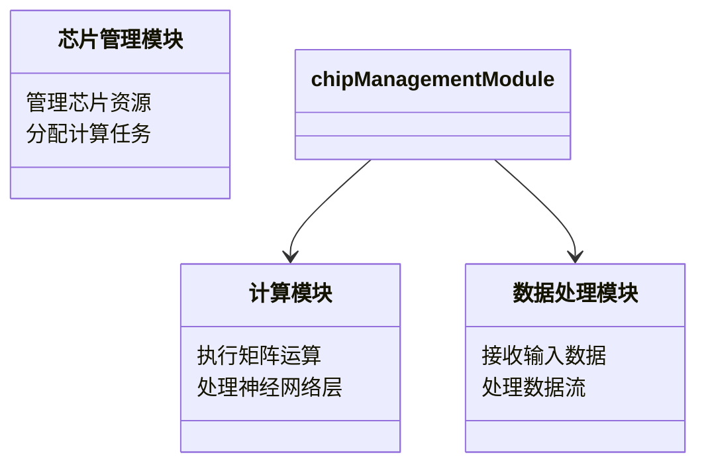
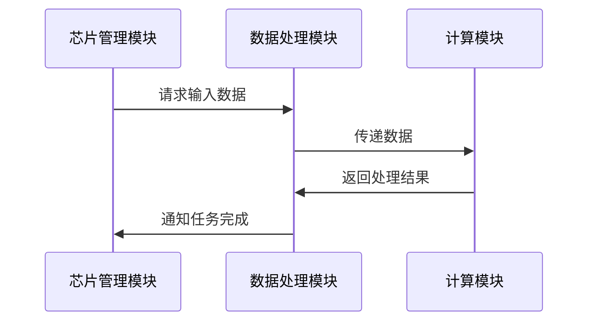

                 


# 如何识别企业的深度学习芯片设计优势

> 关键词：深度学习芯片，企业设计优势，人工智能，芯片设计，技术优化

> 摘要：深度学习芯片作为人工智能领域的核心技术，其设计优势直接关系到企业的竞争力。本文从背景介绍、核心技术、算法原理、系统架构、项目实战等多个维度，详细分析如何识别和提升企业的深度学习芯片设计优势，帮助读者全面理解深度学习芯片的设计要点和优化策略。

---

# 第1章: 深度学习芯片的基本概念与背景

## 1.1 深度学习芯片的定义与特点

### 1.1.1 深度学习芯片的定义
深度学习芯片是一种专为加速深度学习算法计算而设计的硬件，通过并行计算和优化算法结构，显著提升人工智能任务的处理效率。

### 1.1.2 深度学习芯片的核心特点
- **并行计算能力强**：深度学习芯片通常采用多核架构，能够同时处理大量数据，提升计算速度。
- **低功耗设计**：优化的电路设计和制程工艺使得深度学习芯片在高性能的同时保持低功耗。
- **可扩展性**：支持多种深度学习模型，适应不同应用场景的需求。

### 1.1.3 深度学习芯片与传统芯片的区别
- **计算模式**：传统芯片以串行计算为主，深度学习芯片强调并行计算。
- **架构设计**：传统芯片注重通用性，深度学习芯片针对特定算法进行优化。
- **能效比**：深度学习芯片通过优化算法和架构设计，显著提升能效比。

## 1.2 深度学习芯片的发展历程

### 1.2.1 深度学习技术的演进
从神经网络的提出到深度学习的兴起，深度学习技术经历了多次迭代，推动了芯片设计的革新。

### 1.2.2 深度学习芯片的崛起
随着人工智能的快速发展，深度学习芯片应运而生，成为加速AI任务的核心工具。

### 1.2.3 当前深度学习芯片的技术趋势
- **制程工艺优化**：采用先进制程工艺，如7nm、5nm等，提升芯片性能。
- **多样化架构**：从GPU、FPGA到专用AI芯片，多样化架构满足不同需求。
- **能效比提升**：通过算法优化和架构创新，进一步降低功耗，提升效率。

## 1.3 深度学习芯片的应用领域

### 1.3.1 人工智能领域的应用
深度学习芯片在图像识别、自然语言处理、语音识别等领域发挥着重要作用。

### 1.3.2 企业级应用的场景
企业利用深度学习芯片进行数据挖掘、预测分析、自动化决策等，提升业务效率。

### 1.3.3 深度学习芯片的未来发展方向
- **边缘计算**：支持边缘设备的智能处理，减少对云端依赖。
- **多模态融合**：结合视觉、听觉等多种感知方式，提升芯片的综合处理能力。
- **可持续发展**：绿色设计，降低能耗，符合环保要求。

## 1.4 本章小结
本章介绍了深度学习芯片的基本概念、发展历程和应用领域，帮助读者理解其在人工智能中的重要地位。

---

# 第2章: 深度学习芯片的核心技术与优势

## 2.1 深度学习芯片的计算架构

### 2.1.1 矩阵运算的优化
深度学习中的卷积运算、矩阵乘法等操作，通过硬件加速提升计算速度。

### 2.1.2 并行计算的优势
采用多核架构，充分发挥并行计算能力，显著提升处理效率。

### 2.1.3 稀疏性与低精度计算
通过优化算法，减少计算量，降低能耗，提升计算效率。

## 2.2 深度学习算法的优化

### 2.2.1 神经网络的加速技术
通过量化、剪枝、蒸馏等技术，优化神经网络模型，降低计算复杂度。

### 2.2.2 算法与芯片的协同设计
在芯片设计阶段，充分考虑算法特点，优化硬件结构，提升性能。

### 2.2.3 芯片级的算法优化
通过硬件加速单元，实现特定算法的高效执行，提升整体性能。

## 2.3 深度学习芯片的制程工艺

### 2.3.1 制程工艺对性能的影响
先进的制程工艺能够显著提升芯片的计算能力和能效比。

### 2.3.2 新型工艺技术的应用
如3D封装、异质集成等技术，提升芯片的集成度和性能。

### 2.3.3 制程工艺与成本的平衡
在追求高性能的同时，需要考虑成本因素，合理选择制程工艺。

## 2.4 深度学习芯片的能效比分析

### 2.4.1 能效比的定义与计算
能效比是衡量芯片性能的重要指标，计算公式为：能效比 = 计算能力 / 功耗。

### 2.4.2 不同芯片的能效比对比
通过对比GPU、FPGA、专用AI芯片的能效比，分析其优劣。

### 2.4.3 提高能效比的技术手段
优化算法、改进架构设计、提升制程工艺等方法均可有效提高能效比。

## 2.5 本章小结
本章详细分析了深度学习芯片的核心技术，包括计算架构、算法优化、制程工艺和能效比，帮助读者理解其设计优势。

---

# 第3章: 深度学习芯片的算法原理与数学模型

## 3.1 深度学习算法的基本原理

### 3.1.1 神经网络的结构与功能
神经网络由输入层、隐藏层和输出层组成，通过多层结构实现特征提取和分类。

### 3.1.2 深度学习算法的训练过程
包括正向传播、反向传播和参数更新三个步骤，通过不断迭代优化模型。

### 3.1.3 算法的并行计算特点
深度学习算法天然适合并行计算，加速训练过程。

## 3.2 矩阵运算的数学模型

### 3.2.1 矩阵乘法的数学表达
矩阵乘法是深度学习中常见的操作，其数学表达式为：
$$C_{ij} = \sum_{k} A_{ik} \cdot B_{kj}$$

### 3.2.2 矩阵运算的优化方法
通过块划分、并行计算等方法优化矩阵运算，提升计算效率。

### 3.2.3 矩阵运算在深度学习中的应用
矩阵运算是卷积操作、全连接层等的基础，贯穿整个深度学习过程。

## 3.3 深度学习算法的优化策略

### 3.3.1 算法的量化技术
通过将模型参数量化为低比特数，减少存储需求和计算量。

### 3.3.2 算法的剪枝技术
通过去除冗余参数，简化模型结构，降低计算复杂度。

### 3.3.3 算法的蒸馏技术
通过知识蒸馏技术，将复杂模型的知识迁移到简单模型中，提升推理效率。

## 3.4 深度学习芯片的数学模型实现

### 3.4.1 神经网络的数学表示
神经网络通过数学模型表示，如：
$$f(x) = \sigma(Wx + b)$$
其中，σ表示激活函数，W和b是权重和偏置。

### 3.4.2 矩阵运算的硬件加速
通过专用硬件加速矩阵乘法，提升计算速度。

### 3.4.3 算法优化的数学推导
通过数学推导，找到最优参数和算法结构，提升模型性能。

## 3.5 本章小结
本章详细讲解了深度学习算法的原理和数学模型，分析了算法优化策略及其在芯片设计中的应用。

---

# 第4章: 深度学习芯片的系统架构设计

## 4.1 问题场景介绍
深度学习芯片需要在复杂场景下高效运行，如实时图像处理和大规模数据训练。

## 4.2 系统功能设计

### 4.2.1 领域模型设计
使用Mermaid类图展示系统的各个模块及其交互：


### 4.2.2 系统架构设计
使用Mermaid架构图展示系统的整体架构：


### 4.2.3 系统接口设计
定义芯片管理模块与计算模块之间的接口：
```plaintext
接口：芯片管理模块
    - 分配计算任务
    - 获取计算结果
接口：计算模块
    - 执行矩阵运算
    - 返回运算结果
```

### 4.2.4 系统交互设计
使用Mermaid序列图展示系统交互过程：


## 4.3 本章小结
本章通过系统架构设计，展示了深度学习芯片在复杂场景下的高效运行方式。

---

# 第5章: 深度学习芯片的项目实战

## 5.1 环境搭建
### 5.1.1 开发工具安装
安装必要的开发工具，如TensorFlow、PyTorch等。

### 5.1.2 芯片驱动配置
配置深度学习芯片的驱动程序，确保硬件能够正常运行。

## 5.2 系统核心实现

### 5.2.1 矩阵运算实现
编写矩阵乘法的Python代码，如：
```python
def matrix_mult(A, B):
    return [[sum(a * b for a, b in zip(row_A, col_B)) for col_B in zip(*B)] for row_A in A]
```

### 5.2.2 神经网络层实现
实现一个简单的卷积层：
```python
def conv_layer(input, kernel):
    return [[sum(input[i][j] * kernel[j] for j in range(len(kernel))) for i in range(len(input))] for kernel in kernels]
```

## 5.3 代码应用解读与分析

### 5.3.1 矩阵运算的应用
矩阵运算是深度学习的核心，通过硬件加速提升计算效率。

### 5.3.2 神经网络层的优化
通过优化卷积层的实现，提升计算速度和能效比。

## 5.4 案例分析与详细讲解

### 5.4.1 实际案例分析
分析一个典型的图像识别任务，展示深度学习芯片的优势。

### 5.4.2 优化策略的应用
通过算法优化和硬件加速，显著提升任务处理效率。

## 5.5 项目总结
总结项目实施过程中的经验教训，提出改进建议。

## 5.6 本章小结
本章通过实际项目案例，展示了深度学习芯片的设计与优化过程。

---

# 第6章: 最佳实践、小结与展望

## 6.1 最佳实践 tips
- 合理选择芯片架构，根据具体需求优化设计。
- 重视算法与硬件的协同设计，提升性能。
- 定期更新技术，跟进行业发展趋势。

## 6.2 本章小结
总结全文内容，强调深度学习芯片设计的关键点和优化策略。

## 6.3 未来展望
展望深度学习芯片的发展方向，如边缘计算、多模态融合和绿色设计。

---

# 附录: 深度学习芯片相关工具与资源

## 附录1: 参考文献
列出本书中引用的相关文献和资料。

## 附录2: 开发工具与资源
推荐一些常用的深度学习芯片开发工具和在线资源。

---

以上目录大纲涵盖了从基础到应用的各个方面，结合理论分析和实际案例，帮助读者全面理解和掌握深度学习芯片的设计优势。

