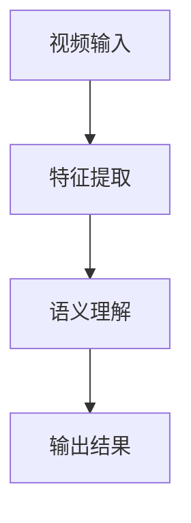
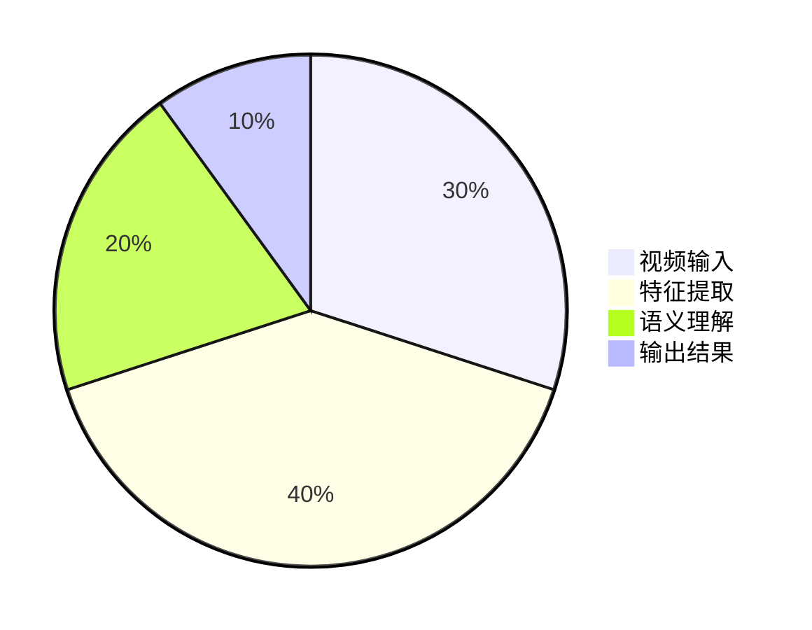
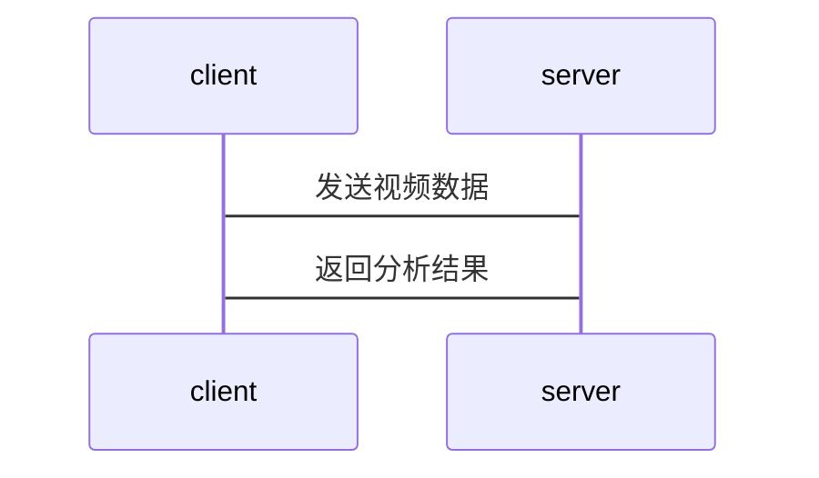

                 


# 如何识别企业的深度学习视频理解技术优势

## 关键词：深度学习，视频理解，企业技术优势，算法原理，系统架构

## 摘要：本文将深入探讨如何识别企业的深度学习视频理解技术优势。从背景介绍、核心概念、算法原理、系统架构到项目实战，我们将逐步分析和解读这一技术的核心优势，帮助企业在实际应用中找到技术突破口。

---

# 正文

## 第1章 深度学习与视频理解技术背景

### 1.1 深度学习的定义与特点

#### 1.1.1 深度学习的定义
深度学习是一种人工智能技术，通过多层神经网络模拟人类大脑的学习方式，具有特征提取能力强、非线性拟合好等特点。

#### 1.1.2 深度学习的核心特点
- **非线性表达**：能够处理复杂的非线性关系。
- **自动特征提取**：无需手动提取特征，系统自动学习。
- **强大的表示能力**：可以处理高维数据，如图像和视频。

#### 1.1.3 深度学习与传统机器学习的区别
| 对比维度       | 深度学习                             | 传统机器学习                         |
|----------------|--------------------------------------|---------------------------------------|
| 特征提取       | 自动提取复杂特征                     | 需要手动设计特征                     |
| 模型复杂度     | 模型复杂，层数多                   | 模型简单，层数少                   |
| 数据需求       | 需要大量数据训练                   | 数据需求较少                       |

### 1.2 视频理解技术的定义与特点

#### 1.2.1 视频理解技术的定义
视频理解技术是通过深度学习模型对视频内容进行分析、理解和语义提取的技术。

#### 1.2.2 视频理解技术的核心特点
- **多模态数据**：视频包含图像、声音、时间等多模态信息。
- **时序性**：视频具有时间维度，需要考虑动态变化。
- **复杂性**：视频内容丰富，场景多样，理解难度大。

### 1.3 企业深度学习视频理解技术的应用场景

#### 1.3.1 企业视频分析的常见场景
- 视频监控：人脸识别、行为分析。
- 内容审核：自动识别有害内容。
- 视频推荐：基于用户行为推荐相关内容。

#### 1.3.2 深度学习在视频理解中的优势
- **自动化**：减少人工干预，提高效率。
- **准确性**：通过深度学习模型，提高识别精度。
- **实时性**：支持实时视频分析。

#### 1.3.3 企业视频理解技术的未来趋势
- **多模态融合**：结合图像、声音、文本等多种信息。
- **实时性优化**：提升视频处理速度，降低延迟。
- **边缘计算**：将视频分析能力部署在边缘设备上。

## 第2章 深度学习视频理解技术的核心概念

### 2.1 视频理解技术的核心概念

#### 2.1.1 视频数据的特征提取
视频数据的特征提取是通过深度学习模型将视频转换为高维特征向量，常用的方法包括2D-CNN和3D-CNN。

#### 2.1.2 视频语义的理解与分析
视频语义理解是通过对视频内容的语义分析，识别视频中的关键信息，如物体、场景和事件。

#### 2.1.3 视频内容的深度学习模型
深度学习模型在视频理解中的应用包括目标检测、语义分割和视频分类。

### 2.2 深度学习模型的关键组件

#### 2.2.1 神经网络的输入层、隐藏层与输出层
- **输入层**：接收原始视频数据。
- **隐藏层**：通过多层神经网络提取特征。
- **输出层**：生成最终的预测结果。

#### 2.2.2 卷积神经网络（CNN）的结构特点
- **卷积层**：提取局部特征。
- **池化层**：降低计算复杂度，提取全局特征。
- **全连接层**：将特征向量映射到输出空间。

#### 2.2.3 循环神经网络（RNN）的应用场景
- **时间序列建模**：处理具有时间依赖性的视频数据。
- **视频描述生成**：通过RNN生成视频的文本描述。

### 2.3 视频理解技术的数学模型

#### 2.3.1 卷积神经网络的数学公式
卷积操作的数学公式为：
$$ y = f(W \cdot x + b) $$
其中，\( W \) 是卷积核权重，\( x \) 是输入数据，\( b \) 是偏置。

#### 2.3.2 循环神经网络的数学公式
循环神经网络的数学公式为：
$$ h_t = f(W_h h_{t-1} + W_x x_t + b) $$
其中，\( h_t \) 是当前时刻的隐藏状态，\( x_t \) 是当前时刻的输入数据。

## 第3章 深度学习视频理解技术的算法原理

### 3.1 目标检测算法原理

#### 3.1.1 YOLO算法的工作原理
YOLO算法通过将视频图像划分为网格，预测每个网格中的目标类别和位置。

#### 3.1.2 Faster R-CNN算法的工作原理
Faster R-CNN算法通过区域建议网络生成候选框，然后通过RoI-Pooling提取特征进行分类和回归。

#### 3.1.3 检测算法的优缺点对比
| 算法名称 | 优点                          | 缺点                          |
|----------|-------------------------------|-------------------------------|
| YOLO     | 实时性高，速度快              | 精度较低                      |
| Faster R-CNN | 精度高                      | 实时性较低                    |

### 3.2 语义分割算法原理

#### 3.2.1 U-Net算法的工作原理
U-Net通过跳跃连接将低层特征与高层特征结合，用于医学图像分割。

#### 3.2.2 Mask R-CNN算法的工作原理
Mask R-CNN在Faster R-CNN的基础上增加了掩膜分支，用于预测目标的像素级分割。

#### 3.2.3 分割算法的优缺点对比
| 算法名称 | 优点                          | 缺点                          |
|----------|-------------------------------|-------------------------------|
| U-Net    | 适用于小样本数据              | 对大规模数据表现一般          |
| Mask R-CNN | 精度高                      | 实时性较低                    |

### 3.3 视频分析算法原理

#### 3.3.1 3D CNN算法的工作原理
3D CNN通过在时间和空间上同时卷积，提取视频的三维特征。

#### 3.3.2 Transformer-based算法的工作原理
Transformer-based算法通过自注意力机制，捕捉视频中的长距离依赖关系。

#### 3.3.3 视频分析算法的优缺点对比
| 算法名称 | 优点                          | 缺点                          |
|----------|-------------------------------|-------------------------------|
| 3D CNN    | 能够捕捉空间和时间信息          | 计算复杂度高                  |
| Transformer | 精度高                      | 实时性较低                    |

## 第4章 深度学习视频理解技术的系统架构设计

### 4.1 系统功能设计

#### 4.1.1 系统功能模块
- 视频输入模块：接收视频流数据。
- 特征提取模块：通过深度学习模型提取视频特征。
- 语义理解模块：对视频内容进行语义分析。
- 输出模块：生成最终的预测结果。

#### 4.1.2 系统功能流程图


### 4.2 系统架构设计

#### 4.2.1 系统架构图


#### 4.2.2 系统接口设计
- 输入接口：接收视频流数据。
- 输出接口：返回预测结果。

#### 4.2.3 系统交互流程图


## 第5章 项目实战

### 5.1 环境安装

#### 5.1.1 安装依赖
- Python 3.8+
- PyTorch 1.9+
- OpenCV 4.5+
- Numpy 1.21+

### 5.2 系统核心实现源代码

#### 5.2.1 视频特征提取代码
```python
import torch
import torch.nn as nn

class VideoFeatureExtractor(nn.Module):
    def __init__(self):
        super(VideoFeatureExtractor, self).__init__()
        self.conv3d = nn.Conv3d(in_channels=3, out_channels=64, kernel_size=(3,3,3), stride=1, padding=1)

    def forward(self, x):
        x = self.conv3d(x)
        return x
```

#### 5.2.2 视频语义理解代码
```python
import torch
import torch.nn as nn

class VideoSemanticUnderstanding(nn.Module):
    def __init__(self):
        super(VideoSemanticUnderstanding, self).__init__()
        self.lstm = nn.LSTM(input_size=64, hidden_size=128, batch_first=True)

    def forward(self, x):
        out, _ = self.lstm(x)
        return out
```

### 5.3 代码应用解读与分析

#### 5.3.1 视频特征提取代码解读
- 使用3D卷积提取视频特征，将3D卷积核滑动窗口提取空间和时间信息。

#### 5.3.2 视频语义理解代码解读
- 使用LSTM处理序列数据，捕捉视频的时间依赖性，生成语义表示。

### 5.4 实际案例分析和详细讲解剖析

#### 5.4.1 案例背景
假设我们有一个视频监控系统，需要实时检测视频中的异常行为。

#### 5.4.2 案例实现
1. 使用3D CNN提取视频特征。
2. 使用LSTM进行行为分类。
3. 输出异常行为的预测结果。

### 5.5 项目小结
通过项目实战，我们掌握了深度学习视频理解技术的核心实现方法，能够将理论知识应用到实际场景中。

## 第6章 最佳实践、小结与注意事项

### 6.1 最佳实践

#### 6.1.1 数据预处理
- 数据增强：旋转、缩放、翻转等。
- 数据归一化：将视频数据归一化到统一范围。

#### 6.1.2 模型优化
- 参数调整：学习率、批量大小。
- 模型压缩：剪枝、量化等技术。

### 6.2 小结
本文从背景、概念、算法、系统架构到项目实战，全面分析了深度学习视频理解技术的优势，帮助企业识别和应用这一技术。

### 6.3 注意事项
- 数据质量：确保数据标注准确。
- 模型选择：根据实际需求选择合适算法。
- 性能优化：提升模型运行效率。

### 6.4 拓展阅读
- 《Deep Learning》 Yoshua Bengio
- 《Convolutional Neural Networks》 Ian Goodfellow

---

# 结语

通过本文的深入分析，我们了解了深度学习视频理解技术的核心优势，以及如何在企业中识别和应用这一技术。希望本文的内容能够为企业技术决策者和开发人员提供有价值的参考。

