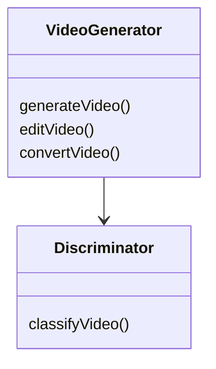
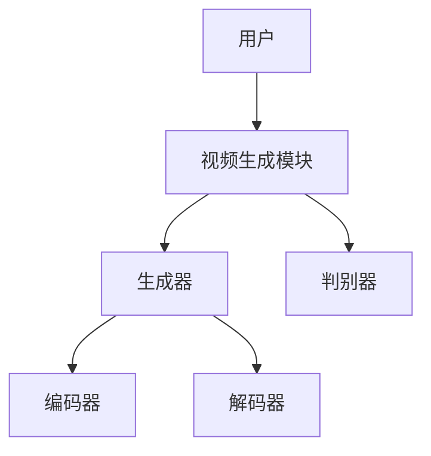
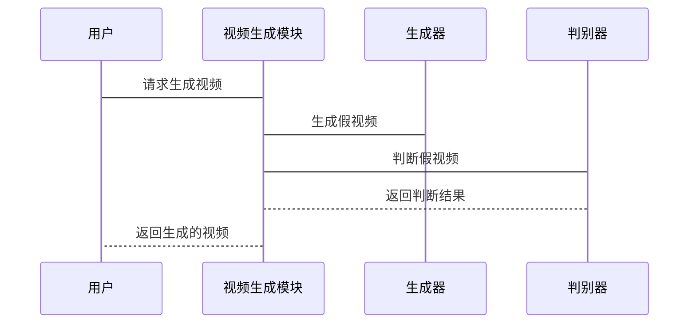

                 


# 如何识别企业的深度学习视频生成技术优势

## 关键词：深度学习，视频生成，生成对抗网络，变分自编码器，企业技术优势

## 摘要：本文将详细探讨如何识别企业在深度学习视频生成技术中的优势。通过分析生成对抗网络（GAN）和变分自编码器（VAE）等核心算法，解析其技术原理、数学模型及系统架构，结合实际项目案例，帮助读者系统地理解并识别这些技术的优势，为企业在技术选型和应用中提供有价值的参考。

---

## 第一部分：深度学习视频生成技术的背景与优势

### 第1章：深度学习视频生成技术的背景介绍

#### 1.1 深度学习视频生成技术的背景

深度学习技术近年来发展迅速，尤其是在生成对抗网络（GAN）和变分自编码器（VAE）等模型的应用下，视频生成技术取得了显著进展。企业可以通过深度学习技术提升视频生成的效率和质量，但如何识别这些技术的优势是关键。

**1.1.1 深度学习技术的发展历程**  
深度学习是一种人工智能技术，通过多层神经网络模拟人脑的学习方式。从图像识别到自然语言处理，深度学习在多个领域取得了突破性进展。视频生成作为深度学习的一个重要应用，近年来得到了广泛关注。

**1.1.2 视频生成技术的演变**  
传统的视频生成技术依赖于手动编辑和简单的算法，生成效果有限。随着深度学习的发展，生成对抗网络（GAN）和变分自编码器（VAE）等模型的出现，使得视频生成技术的生成质量、多样性和自动化程度有了显著提升。

**1.1.3 深度学习在视频生成中的作用**  
深度学习通过大量的训练数据和复杂的神经网络结构，能够捕捉到视频中的时空信息，生成高质量的视频内容。这种技术在企业中的应用，可以帮助企业提高视频生成的效率和效果。

---

### 第2章：深度学习视频生成技术的核心概念

#### 2.1 核心概念与原理

**2.1.1 生成对抗网络（GAN）的基本原理**  
生成对抗网络由生成器和判别器两部分组成。生成器的目标是生成逼真的视频内容，而判别器则负责区分生成的视频和真实视频。通过不断对抗训练，生成器能够生成越来越逼真的视频。

**2.1.2 变分自编码器（VAE）的原理**  
变分自编码器是一种基于概率建模的生成模型。它通过编码器将输入视频压缩为潜在空间的向量，再通过解码器将潜在向量还原为视频。VAE的优势在于生成内容的多样性。

**2.1.3 其他相关算法的简要介绍**  
除了GAN和VAE，还有一些其他算法，如条件生成对抗网络（cGAN）和深度变分自编码器（DVAE）。这些算法在特定场景下具有更好的表现。

#### 2.2 核心概念的对比分析

**2.2.1 GAN与VAE的特点对比**

| 特性                | GAN                                   | VAE                                  |
|---------------------|--------------------------------------|--------------------------------------|
| 生成方式            | 对抗生成                               | 基于概率建模                         |
| 生成质量            | 高，但训练不稳定                       | 中等，但生成多样化                   |
| 训练难度            | 高，需要精心设计损失函数             | 较低，损失函数相对简单               |
| 应用场景            | 适合生成高质量图像/视频               | 适合生成多样化内容                   |

**2.2.2 GAN与VAE的优缺点对比**

- **GAN的优势：** 生成质量高，适合生成高质量的视频内容。
- **GAN的缺点：** 训练过程不稳定，容易出现模式崩溃。
- **VAE的优势：** 生成过程稳定，能够生成多样化的视频内容。
- **VAE的缺点：** 生成质量相对较低，难以生成高质量的视频。

---

## 第二部分：深度学习视频生成技术的算法原理

### 第3章：生成对抗网络（GAN）的算法原理

#### 3.1 GAN的算法原理

**3.1.1 GAN的整体架构**  
GAN由生成器和判别器组成，生成器的目标是生成逼真的视频内容，判别器的目标是区分生成的视频和真实视频。两者通过对抗训练不断优化。

**3.1.2 GAN的损失函数**  
生成器的损失函数为：$$ L_{G} = \mathbb{E}_{z \sim p_z(z)} [\log D(G(z))] $$  
判别器的损失函数为：$$ L_{D} = -\mathbb{E}_{x \sim p_{data}(x)} [\log D(x)] - \mathbb{E}_{z \sim p_z(z)} [\log (1 - D(G(z)))] $$

**3.1.3 GAN的训练过程**  
1. 初始化生成器和判别器的参数。
2. 生成器生成一批假视频，判别器判断这些假视频是否为真。
3. 根据判别器的输出，更新生成器和判别器的参数。
4. 重复上述过程，直到生成器生成逼真的视频。

#### 3.2 GAN的Python代码实现示例

```python
import numpy as np
import tensorflow as tf
from tensorflow.keras.layers import Dense, Reshape

# 定义生成器
def generator():
    model = tf.keras.Sequential()
    model.add(Dense(256, activation='relu', input_dim=100))
    model.add(Dense(128, activation='relu'))
    model.add(Dense(64, activation='relu'))
    model.add(Dense(32, activation='relu'))
    model.add(Dense(16, activation='relu'))
    model.add(Dense(3, activation='sigmoid'))
    return model

# 定义判别器
def discriminator():
    model = tf.keras.Sequential()
    model.add(Dense(32, activation='relu', input_dim=3))
    model.add(Dense(16, activation='relu'))
    model.add(Dense(1, activation='sigmoid'))
    return model

# 初始化生成器和判别器
generator_model = generator()
discriminator_model = discriminator()

# 编译模型
generator_model.compile(optimizer='adam', loss='binary_crossentropy')
discriminator_model.compile(optimizer='adam', loss='binary_crossentropy')

# GAN训练过程
for _ in range(1000):
    # 生成假数据
    z = np.random.randn(100, 100)
    generated_images = generator_model.predict(z)
    
    # 判别器判断真假
    real_images = np.random.randint(0, 1, (100, 1))
    fake_images = 1 - real_images
    
    # 更新判别器
    discriminator_model.trainable = True
    discriminator_model.train_on_batch(generated_images, fake_images)
    
    # 更新生成器
    discriminator_model.trainable = False
    generator_model.train_on_batch(z, real_images)
```

---

### 第4章：变分自编码器（VAE）的算法原理

#### 4.1 VAE的算法原理

**4.1.1 VAE的整体架构**  
VAE由编码器和解码器组成，编码器将输入视频压缩为潜在空间的向量，解码器将潜在向量还原为视频。

**4.1.2 VAE的损失函数**  
VAE的损失函数包括重构损失和KL散度。重构损失为：$$ L_{recon} = \mathbb{E}_{x}[||x - \text{decoder}(\text{encoder}(x))||^2] $$  
KL散度为：$$ L_{KL} = \text{KL}(q(z|x) || p(z)) $$  
总损失为：$$ L = L_{recon} + L_{KL} $$

**4.1.3 VAE的训练过程**  
1. 编码器将输入视频压缩为潜在向量。
2. 解码器将潜在向量还原为视频。
3. 根据重构损失和KL散度，更新编码器和解码器的参数。
4. 重复上述过程，直到生成器生成逼真的视频。

#### 4.2 VAE的Python代码实现示例

```python
import numpy as np
import tensorflow as tf
from tensorflow.keras.layers import Dense, Reshape

# 定义编码器
def encoder():
    model = tf.keras.Sequential()
    model.add(Dense(32, activation='relu', input_dim=3))
    model.add(Dense(16, activation='relu'))
    model.add(Dense(2, activation='relu'))
    return model

# 定义解码器
def decoder():
    model = tf.keras.Sequential()
    model.add(Dense(16, activation='relu', input_dim=2))
    model.add(Dense(32, activation='relu'))
    model.add(Dense(3, activation='sigmoid'))
    return model

# 初始化编码器和解码器
encoder_model = encoder()
decoder_model = decoder()

# 编译模型
encoder_model.compile(optimizer='adam', loss='mse')
decoder_model.compile(optimizer='adam', loss='mse')

# VAE训练过程
for _ in range(1000):
    # 生成随机潜在向量
    z = np.random.randn(100, 2)
    # 编码器编码
    encoded_z = encoder_model.predict(z)
    # 解码器解码
    generated_images = decoder_model.predict(encoded_z)
    
    # 计算重构损失和KL散度
    L_recon = np.mean(np.square(z - encoded_z))
    L_KL = 0.5 * np.mean(1 + np.log(2) - np.log(1 + np.exp(encoded_z)) + (np.exp(encoded_z) - 1) ** 2)
    total_loss = L_recon + L_KL
    
    # 更新编码器和解码器
    encoder_model.trainable = True
    decoder_model.trainable = True
    encoder_model.optimizer.zero_grad()
    decoder_model.optimizer.zero_grad()
    total_loss.backward()
    encoder_model.optimizer.step()
    decoder_model.optimizer.step()
```

---

## 第三部分：深度学习视频生成技术的系统分析与架构设计

### 第5章：系统分析与架构设计方案

#### 5.1 项目介绍

本项目旨在开发一个企业级深度学习视频生成系统，利用GAN和VAE技术生成高质量的视频内容。系统主要功能包括视频生成、视频编辑和视频转换。

#### 5.2 系统功能设计

##### 5.2.1 领域模型



##### 5.2.2 系统架构设计



##### 5.2.3 接口设计

- **视频生成接口：** 接收输入参数，生成视频内容。
- **视频编辑接口：** 对生成的视频进行编辑和调整。
- **视频转换接口：** 将生成的视频转换为指定格式。

##### 5.2.4 交互设计



---

## 第四部分：深度学习视频生成技术的项目实战

### 第6章：项目实战

#### 6.1 环境安装

```bash
pip install numpy
pip install tensorflow
pip install keras
pip install matplotlib
```

#### 6.2 系统核心实现源代码

##### 6.2.1 视频生成模块

```python
import numpy as np
import tensorflow as tf
from tensorflow.keras.layers import Dense, Reshape

# 定义生成器
def generator():
    model = tf.keras.Sequential()
    model.add(Dense(256, activation='relu', input_dim=100))
    model.add(Dense(128, activation='relu'))
    model.add(Dense(64, activation='relu'))
    model.add(Dense(32, activation='relu'))
    model.add(Dense(16, activation='relu'))
    model.add(Dense(3, activation='sigmoid'))
    return model

# 定义判别器
def discriminator():
    model = tf.keras.Sequential()
    model.add(Dense(32, activation='relu', input_dim=3))
    model.add(Dense(16, activation='relu'))
    model.add(Dense(1, activation='sigmoid'))
    return model

# 初始化生成器和判别器
generator_model = generator()
discriminator_model = discriminator()

# 编译模型
generator_model.compile(optimizer='adam', loss='binary_crossentropy')
discriminator_model.compile(optimizer='adam', loss='binary_crossentropy')

# GAN训练过程
for _ in range(1000):
    # 生成假数据
    z = np.random.randn(100, 100)
    generated_images = generator_model.predict(z)
    
    # 判别器判断真假
    real_images = np.random.randint(0, 1, (100, 1))
    fake_images = 1 - real_images
    
    # 更新判别器
    discriminator_model.trainable = True
    discriminator_model.train_on_batch(generated_images, fake_images)
    
    # 更新生成器
    discriminator_model.trainable = False
    generator_model.train_on_batch(z, real_images)
```

##### 6.2.2 视频生成案例

```python
# 生成假数据
z = np.random.randn(100, 100)
generated_images = generator_model.predict(z)

# 可视化生成的视频
import matplotlib.pyplot as plt
plt.imshow(generated_images[0])
plt.show()
```

---

### 第7章：最佳实践

#### 7.1 关键点总结

- **技术选型：** 根据企业需求选择合适的算法，如GAN适合生成高质量视频，VAE适合生成多样化视频。
- **性能优化：** 使用更高效的模型结构和优化算法，如使用残差网络和批量归一化。
- **数据安全：** 确保训练数据的安全性和合法性，避免数据泄露和侵权。

#### 7.2 小结

通过本文的分析，读者可以系统地识别深度学习视频生成技术的优势，并将其应用于企业实践中。关键在于选择合适的算法，优化模型性能，并确保数据安全。

#### 7.3 注意事项

- 在实际应用中，需要根据具体需求调整模型参数和结构。
- 训练过程中可能会遇到模式崩溃等问题，需要及时调整参数和优化策略。
- 数据的质量和多样性对生成效果有重要影响，需要确保数据来源的多样性和质量。

#### 7.4 拓展阅读

- 《Deep Learning》—— Ian Goodfellow
- 《生成对抗网络：从理论到实践》—— 李航
- 《变分自编码器：理论与实现》—— 王飞跃

---

通过以上内容，读者可以系统地了解深度学习视频生成技术的优势，并在实际应用中识别和利用这些技术优势。

