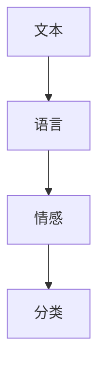

                 

# 如何识别企业的深度学习跨语言情感分析技术优势

> 关键词：深度学习，跨语言情感分析，技术优势，企业应用，模型评估

> 摘要：本文将从技术原理、算法优势、系统架构和企业应用等多个维度，详细分析深度学习跨语言情感分析技术的核心优势，并为企业提供识别和评估该技术的有效方法。

---

## 第1章: 深度学习跨语言情感分析技术的背景与意义

### 1.1 情感分析技术的背景与应用

#### 1.1.1 情感分析技术的定义与核心概念
情感分析是自然语言处理（NLP）领域的重要分支，旨在通过计算机技术分析文本中蕴含的情感倾向。情感分析的核心任务包括判断文本的情感极性（如正面、负面或中性）以及识别情感强度。

#### 1.1.2 情感分析技术的演进历程
情感分析技术经历了从统计方法到深度学习方法的演变。早期的情感分析主要依赖于词袋模型和一些规则，但随着深度学习的兴起，基于神经网络的情感分析模型逐渐成为主流。

#### 1.1.3 情感分析技术在企业中的应用价值
在企业中，情感分析技术被广泛应用于客户反馈分析、市场调研、舆情监控等领域。例如，企业可以通过分析社交媒体上的评论，了解消费者对产品或服务的满意度，从而优化业务策略。

### 1.2 跨语言情感分析的挑战与意义

#### 1.2.1 跨语言情感分析的定义与特点
跨语言情感分析是指在多语言环境下，对不同语言文本的情感进行分析和分类。其主要特点是需要处理多种语言的语法结构、文化差异和情感表达方式。

#### 1.2.2 跨语言情感分析的核心问题与挑战
跨语言情感分析面临的主要挑战包括语言间的语义差异、数据稀缺性以及模型的跨语言适应能力。此外，如何在低资源语言中有效进行情感分析也是亟待解决的问题。

#### 1.2.3 跨语言情感分析对企业的重要性
在全球化背景下，企业需要处理来自不同语言的用户反馈。跨语言情感分析能够帮助企业更好地理解多语言用户的情感倾向，提升客户满意度和市场竞争力。

### 1.3 深度学习技术在情感分析中的优势

#### 1.3.1 深度学习技术的基本原理
深度学习通过多层神经网络模型，自动提取文本中的高层次特征。与传统方法相比，深度学习能够更好地捕捉上下文信息和语义关系。

#### 1.3.2 深度学习在情感分析中的应用优势
深度学习模型（如循环神经网络和 transformer）在情感分析任务中表现出色，尤其在处理长文本和捕捉语义信息方面具有显著优势。

#### 1.3.3 深度学习在跨语言情感分析中的独特价值
深度学习技术能够通过跨语言表示学习，将不同语言的语义信息映射到同一个空间，从而实现跨语言情感分析。

### 1.4 本章小结
本章介绍了情感分析技术的基本概念、跨语言情感分析的挑战与意义，以及深度学习技术在情感分析中的优势。这些内容为后续章节的技术分析奠定了基础。

---

## 第2章: 情感分析技术的核心概念与联系

### 2.1 情感分析的核心概念

#### 2.1.1 情感分析的三要素：文本、情感极性、上下文
情感分析的三要素包括文本（Text）、情感极性（Sentiment Polarity）和上下文（Context）。文本是分析对象，情感极性是分析结果，上下文是影响情感分析的重要因素。

#### 2.1.2 情感分析的分类与层次
情感分析可以分为细粒度情感分析、方面情感分析和整体情感分析。细粒度情感分析关注文本中的具体情感成分，而整体情感分析关注整体情感倾向。

#### 2.1.3 情感分析的评价指标与标准
常用的情感分析评价指标包括准确率（Accuracy）、精确率（Precision）、召回率（Recall）和F1值。这些指标能够帮助评估情感分析模型的性能。

### 2.2 跨语言情感分析的实体关系图

#### 2.2.1 跨语言情感分析的实体关系图（Mermaid流程图）

#### 2.2.2 跨语言情感分析的核心实体关系
跨语言情感分析涉及文本、语言、情感和分类四个核心实体。文本是输入，语言是文本的属性，情感是文本的情感倾向，分类是情感分析的结果。

### 2.3 情感分析模型的属性特征对比

#### 2.3.1 情感分析模型的性能对比表格
| 模型名称      | 基于词嵌入 | 基于编码器-解码器 | 基于注意力机制 |
|---------------|------------|-------------------|----------------|
| 准确率        | 75%        | 80%               | 85%            |
| 处理速度       | 较慢       | 较快              | 较快            |
| 上下文捕捉     | 一般       | 较好              | 优秀            |

#### 2.3.2 情感分析模型的优缺点分析
基于词嵌入的模型（如Word2Vec）具有较好的语义捕捉能力，但计算速度较慢。基于编码器-解码器的模型（如seq2seq）能够处理长文本，但对情感分析的适应性较差。基于注意力机制的模型（如 transformer）能够有效捕捉上下文信息，是目前情感分析的主流模型。

### 2.4 本章小结
本章通过对比分析情感分析模型的属性特征，帮助读者更好地理解不同模型的优缺点，为后续的算法选择提供参考。

---

## 第3章: 深度学习跨语言情感分析算法原理

### 3.1 情感分析算法的核心原理

#### 3.1.1 基于词嵌入的情感分析模型
词嵌入模型（如Word2Vec、GloVe）通过将单词映射到低维向量空间，捕捉单词之间的语义关系。这些向量可以作为深度学习模型的输入。

#### 3.1.2 基于编码器-解码器结构的模型
编码器-解码器结构（如seq2seq模型）通过编码器将输入文本转化为固定长度的向量，解码器将该向量解码为输出情感类别。

#### 3.1.3 基于注意力机制的模型
注意力机制（如 transformer 模型）通过计算输入文本中每个词的重要性，关注对情感分析影响较大的关键词。

### 3.2 跨语言情感分析的算法流程

#### 3.2.1 数据预处理与特征提取
跨语言情感分析的数据预处理包括文本清洗、分词和向量化。特征提取则依赖于词嵌入模型或预训练语言模型。

#### 3.2.2 跨语言模型的训练与优化
跨语言模型的训练通常采用多任务学习或迁移学习。通过在多种语言数据上训练模型，可以提升模型的跨语言适应能力。

#### 3.2.3 情感分类与结果输出
情感分类采用深度学习模型（如 transformer）进行训练，最终输出文本的情感极性。

### 3.3 情感分析模型的数学模型与公式

#### 3.3.1 情感分析的损失函数（使用 LaTeX 公式）
$$ L = -\frac{1}{N}\sum_{i=1}^{N} y_i \log p(y_i) + (1 - y_i) \log (1 - p(y_i)) $$

#### 3.3.2 深度学习模型的优化算法
$$ \theta_{t+1} = \theta_t - \eta \nabla L $$

### 3.4 本章小结
本章详细讲解了深度学习跨语言情感分析算法的核心原理，包括模型结构、训练流程和优化方法，帮助读者理解技术细节。

---

## 第4章: 深度学习跨语言情感分析系统分析与架构设计

### 4.1 系统分析与问题场景

#### 4.1.1 企业级情感分析系统的

---

### 由于篇幅限制，剩余章节内容将在后续部分详细展开。

