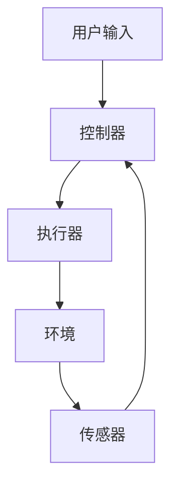
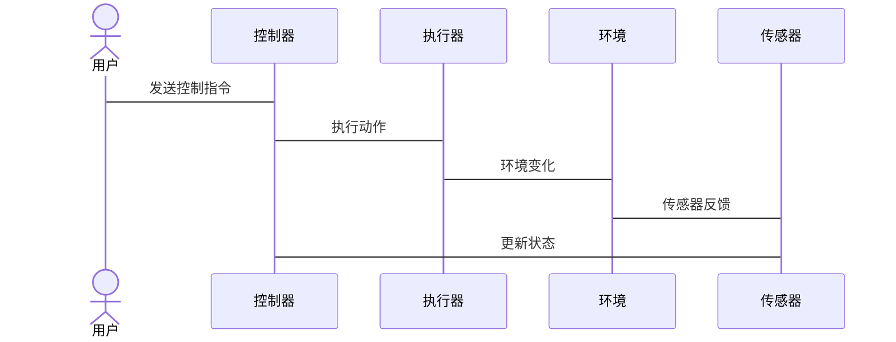

                 

# 如何识别企业的深度强化学习控制系统优势

> 关键词：深度强化学习，企业控制系统，技术优势，算法原理，系统架构

> 摘要：深度强化学习是一种结合了深度学习和强化学习的先进人工智能技术，能够通过与环境的交互来优化控制策略。本文从企业的角度出发，详细分析深度强化学习控制系统的优势，包括其在优化企业运营效率、提升决策能力、适应复杂环境等方面的应用。通过阐述其算法原理、系统架构、实现方法以及实际案例，本文为读者提供了一套系统性的识别和应用深度强化学习控制系统的方法论。

---

# 第1章 深度强化学习控制系统概述

## 1.1 深度强化学习的基本概念

深度强化学习（Deep Reinforcement Learning, DRL）是人工智能领域的重要分支，结合了深度学习（Deep Learning）和强化学习（Reinforcement Learning, RL）的核心思想。深度学习通过多层神经网络提取数据特征，强化学习通过与环境交互获得奖励来优化策略。DRL将两者的优势结合，能够在复杂环境中实现端到端的决策优化。

### 1.1.1 深度学习与强化学习的结合

- 深度学习擅长处理高维、非线性特征，能够从大量数据中提取复杂模式。
- 强化学习通过试错机制优化策略，适用于动态环境下的决策问题。
- DRL将深度学习作为强化学习的策略表示工具，能够在复杂环境中实现高效的决策。

### 1.1.2 深度强化学习的核心特点

- **端到端学习**：DRL可以直接从原始输入数据中学习最优策略，无需手动设计特征。
- **自适应性**：通过与环境的交互，DRL能够动态调整策略，适应环境的变化。
- **全局优化**：DRL能够从整体角度优化决策，而非局部优化。

### 1.1.3 深度强化学习在企业中的应用背景

企业控制系统通常涉及复杂的决策过程，例如生产调度、资源分配、库存管理等。传统的控制方法往往依赖于规则或简单的反馈机制，难以应对复杂动态的环境。深度强化学习通过数据驱动的方式优化决策，能够显著提升企业的运营效率和决策能力。

---

## 1.2 企业控制系统的优势

### 1.2.1 企业控制系统的定义与分类

企业控制系统是指通过传感器、执行器和控制器对生产过程、资源分配等进行实时监控和优化的系统。根据应用场景的不同，企业控制系统可以分为以下几类：

- **生产过程控制系统（PPC）**：用于工厂生产线的自动化控制。
- **资源分配控制系统（RACS）**：用于企业资源的优化分配。
- **供应链控制系统（SCC）**：用于供应链的协调与优化。
- **能源管理系统（EMS）**：用于企业能源的高效利用。

### 1.2.2 深度强化学习在控制系统中的优势

- **高效性**：DRL能够快速学习并适应复杂的控制场景，显著提高系统的响应速度。
- **鲁棒性**：DRL通过与环境的交互，能够发现最优策略，具有较强的鲁棒性。
- **灵活性**：DRL可以轻松适应环境的变化，无需频繁修改规则。

### 1.2.3 企业控制系统的核心目标与实现路径

- **核心目标**：通过优化控制策略，实现企业资源的高效利用、生产过程的稳定性以及成本的最小化。
- **实现路径**：通过DRL技术，构建数据驱动的控制系统，实现端到端的优化决策。

---

## 1.3 深度强化学习控制系统的核心要素

### 1.3.1 状态空间与动作空间

- **状态空间**：表示系统当前的环境状态，例如生产过程中的温度、压力等参数。
- **动作空间**：表示系统可以执行的操作，例如调整设备参数、启动或停止设备。

### 1.3.2 奖励机制与目标函数

- **奖励机制**：通过定义奖励函数，引导模型朝着期望的行为方向优化。
- **目标函数**：表示系统的优化目标，例如最大化收益或最小化成本。

### 1.3.3 策略网络与价值网络

- **策略网络**：负责根据当前状态输出最优动作。
- **价值网络**：用于评估当前状态的价值，帮助模型学习策略。

---

## 1.4 深度强化学习与传统控制方法的对比

### 1.4.1 传统控制方法的优缺点

- **优点**：简单易实现，适用于简单的控制场景。
- **缺点**：难以应对复杂的动态环境，缺乏灵活性。

### 1.4.2 深度强化学习的独特优势

- **强大的表达能力**：DRL通过深度神经网络能够处理复杂的非线性关系。
- **自适应性**：DRL能够通过与环境的交互不断优化策略，适应环境的变化。

### 1.4.3 深度强化学习在企业控制系统中的应用前景

随着人工智能技术的不断发展，DRL在企业控制系统中的应用前景广阔。通过DRL技术，企业能够实现更加智能化、高效的控制系统，显著提升企业的竞争力。

---

## 1.5 本章小结

本章详细介绍了深度强化学习的基本概念及其在企业控制系统中的优势。通过对比传统控制方法和深度强化学习，我们看到DRL在复杂动态环境下的强大能力。接下来的章节将从算法原理、系统架构等方面深入探讨DRL在企业控制系统中的具体实现。

--- 

# 第2章 深度强化学习算法原理

## 2.1 Q-learning算法

### 2.1.1 Q-learning的基本原理

Q-learning是一种经典的强化学习算法，通过学习状态-动作对的价值（Q值）来优化策略。其核心思想是通过试错机制，找到使累积奖励最大的策略。

### 2.1.2 Q-learning的数学模型

Q-learning的数学模型如下：

$$ Q(s, a) = Q(s, a) + \alpha [r + \gamma \max_{a'} Q(s', a') - Q(s, a)] $$

其中：
- \( Q(s, a) \) 表示当前状态 \( s \) 下执行动作 \( a \) 的 Q 值。
- \( \alpha \) 是学习率。
- \( r \) 是奖励值。
- \( \gamma \) 是折扣因子。
- \( s' \) 是下一个状态。

### 2.1.3 Q-learning的实现步骤

1. 初始化 Q 表。
2. 与环境交互，获取当前状态和奖励。
3. 更新 Q 表中的 Q 值。
4. 重复上述步骤，直到收敛。

---

## 2.2 策略梯度算法

### 2.2.1 策略梯度的基本概念

策略梯度（Policy Gradient）是一种通过直接优化策略参数来寻找最优策略的方法。与 Q-learning 不同，策略梯度直接对策略进行优化。

### 2.2.2 策略梯度的数学推导

策略梯度的目标是最化化期望奖励：

$$ \max_{\theta} J(\theta) = \mathbb{E}_{\tau \sim \pi_\theta} [R(\tau)] $$

其中，\( \tau \) 是轨迹，\( R(\tau) \) 是轨迹的奖励。

通过梯度上升法，我们可以更新策略参数 \( \theta \)：

$$ \theta \leftarrow \theta + \alpha \nabla_\theta J(\theta) $$

### 2.2.3 策略梯度的优缺点

- **优点**：直接优化策略，无需维护 Q 表。
- **缺点**：计算复杂，收敛速度较慢。

---

## 2.3 深度Q网络（DQN）

### 2.3.1 DQN的基本原理

DQN 是将深度神经网络作为 Q 函数的一种强化学习算法。通过神经网络来近似 Q 值，DQN 能够处理高维复杂状态。

### 2.3.2 DQN的网络结构

DQN 通常由两个神经网络组成：主网络和目标网络。

- 主网络负责评估当前状态的动作值。
- 目标网络用于稳定训练，定期更新主网络的权重。

### 2.3.3 DQN的训练流程

1. 从环境获取状态 \( s \)。
2. 主网络输出 Q 值，选择动作 \( a \)。
3. 执行动作，获取下一个状态 \( s' \) 和奖励 \( r \)。
4. 更新目标网络权重。
5. 使用经验回放更新主网络。

---

## 2.4 深度强化学习算法的优缺点

### 2.4.1 深度强化学习的优势

- **强大的表达能力**：深度神经网络能够处理复杂的非线性关系。
- **自适应性**：通过与环境的交互，DRL能够动态调整策略。

### 2.4.2 深度强化学习的挑战

- **训练时间长**：需要大量的交互和计算资源。
- **收敛性问题**：部分场景下可能无法保证收敛。

### 2.4.3 深度强化学习的未来发展方向

未来，DRL将朝着更加高效、鲁棒的方向发展，例如结合转移学习、多智能体协作等技术。

---

## 2.5 本章小结

本章详细介绍了几种经典的深度强化学习算法，包括 Q-learning、策略梯度和 DQN。通过对比不同算法的优缺点，我们看到每种算法都有其适用的场景。接下来的章节将从系统架构的角度探讨 DRL 在企业控制系统中的具体应用。

---

# 第3章 深度强化学习控制系统的核心技术

## 3.1 状态表示与动作空间设计

### 3.1.1 状态表示的定义与选择

状态表示是 DRL 系统设计的关键部分。合理的状态表示能够显著提升系统的性能。

### 3.1.2 动作空间的设计与实现

动作空间的设计需要考虑系统的约束条件和优化目标。

### 3.1.3 状态与动作的映射关系

通过建立状态与动作的映射关系，系统能够实现端到端的决策优化。

---

## 3.2 系统分析与架构设计

### 3.2.1 系统功能设计

- **数据采集**：通过传感器获取系统状态。
- **决策模块**：基于 DRL 算法输出最优动作。
- **执行模块**：将决策结果转化为实际操作。

### 3.2.2 系统架构图

---

## 3.3 系统接口设计

### 3.3.1 接口定义

- **输入接口**：接收传感器数据和用户输入。
- **输出接口**：发送控制指令到执行器。

### 3.3.2 交互流程

---

## 3.4 系统优化与实现

### 3.4.1 系统优化策略

- **模型优化**：通过剪枝、蒸馏等技术优化神经网络。
- **算法优化**：采用经验回放、优先级队列等方法加速训练。

### 3.4.2 系统实现步骤

1. 数据采集与预处理。
2. 构建 DRL 模型。
3. 训练模型并部署到控制系统中。

---

## 3.5 本章小结

本章详细探讨了 DRL 控制系统的实现技术，包括状态表示、系统架构和接口设计等方面。通过具体的实现步骤，我们能够更好地理解 DRL 在企业控制系统中的应用。

---

# 第4章 深度强化学习控制系统的优势识别

## 4.1 深度强化学习的优势

### 4.1.1 高效性

DRL 能够快速学习并适应复杂的控制场景，显著提高系统的响应速度。

### 4.1.2 鲁棒性

通过与环境的交互，DRL 能够发现最优策略，具有较强的鲁棒性。

### 4.1.3 灵活性

DRL 可以轻松适应环境的变化，无需频繁修改规则。

---

## 4.2 企业控制系统的优势

### 4.2.1 提高运营效率

通过 DRL 技术，企业能够实现更加智能化、高效的控制系统。

### 4.2.2 降低成本

DRL 能够优化资源分配，减少浪费，从而降低成本。

### 4.2.3 提升决策能力

通过数据驱动的方式优化决策，显著提升企业的决策能力。

---

## 4.3 深度强化学习在企业控制系统中的应用实例

### 4.3.1 案例一：生产过程优化

通过 DRL 技术优化生产线的参数设置，显著提高生产效率。

### 4.3.2 案例二：供应链管理

通过 DRL 技术优化供应链的协调与优化，提高供应链的响应速度。

---

## 4.4 本章小结

本章通过分析 DRL 的优势及其在企业控制系统中的应用，总结了 DRL 在企业控制系统中的巨大潜力。通过实际案例的分析，我们看到 DRL 能够显著提升企业的运营效率和决策能力。

---

# 第5章 深度强化学习控制系统的优势总结

## 5.1 深度强化学习的优势总结

- **高效性**：DRL 能够快速学习并适应复杂的控制场景。
- **鲁棒性**：DRL 能够通过与环境的交互发现最优策略。
- **灵活性**：DRL 可以轻松适应环境的变化。

## 5.2 企业控制系统的优势总结

- **提高运营效率**：通过 DRL 技术实现更加智能化的控制系统。
- **降低成本**：优化资源分配，减少浪费。
- **提升决策能力**：数据驱动的方式优化决策。

## 5.3 深度强化学习在企业控制系统中的应用前景

随着人工智能技术的不断发展，DRL 在企业控制系统中的应用前景广阔。通过 DRL 技术，企业能够实现更加智能化、高效的控制系统，显著提升企业的竞争力。

---

## 5.4 本章小结

本章总结了深度强化学习在企业控制系统中的优势，并展望了其未来的发展方向。通过本文的分析，我们能够更好地理解 DRL 在企业控制系统中的重要作用。

---

# 结语

深度强化学习是一种极具潜力的人工智能技术，能够在复杂动态环境中实现高效的决策优化。通过本文的分析，我们看到 DRL 在企业控制系统中的巨大优势。未来，随着技术的不断发展，DRL 将在企业控制系统中发挥越来越重要的作用，为企业创造更大的价值。

---

# 参考文献

（此处列出参考文献）

---

通过本文的系统性分析，我们能够清晰地识别深度强化学习控制系统的优势，并为企业在实际应用中提供有益的指导。

