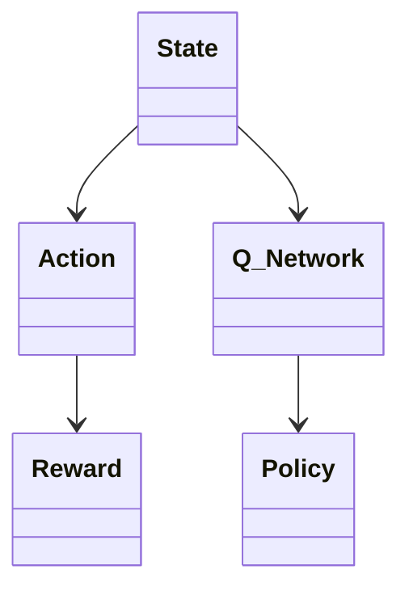
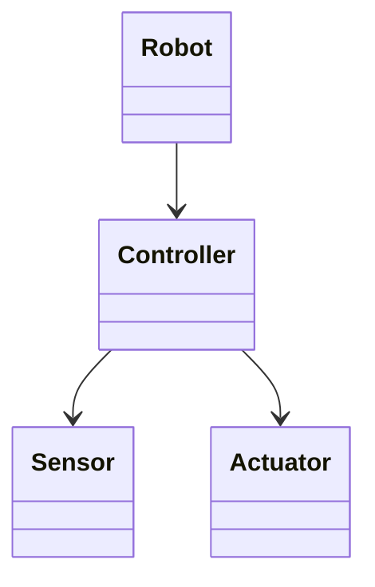
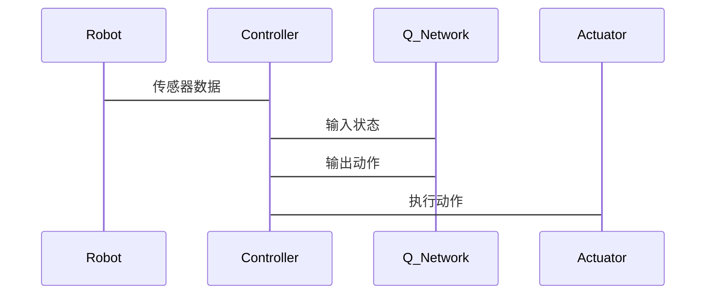

                 


```markdown
# 如何识别企业的深度强化学习机器人控制优势

## 关键词：深度强化学习、机器人控制、企业优势、技术应用、算法原理、系统架构、项目实战

## 摘要：深度强化学习在机器人控制领域的应用为企业带来了显著的技术优势。本文将从核心概念、算法原理、系统架构、项目实战等多方面，详细阐述如何识别和利用深度强化学习在机器人控制中的优势，助力企业在智能化竞争中脱颖而出。

---

# 第1章 深度强化学习与机器人控制的背景介绍

## 1.1 深度强化学习的基本概念

### 1.1.1 从传统机器学习到深度学习的演进
- 传统机器学习的局限性
- 深度学习的核心原理
- 深度强化学习的定义

### 1.1.2 强化学习的核心原理
- 状态、动作、奖励的定义
- Q-learning算法的基本步骤

### 1.1.3 深度强化学习的特点
- 数据驱动
- 自适应性
- 实时优化

## 1.2 机器人控制的现状与挑战

### 1.2.1 机器人控制的基本概念
- 机器人控制的分类
- 传统机器人控制技术的优缺点

### 1.2.2 当前机器人控制的主要技术
- 基于规则的控制
- 基于模型的控制
- 基于数据的控制

### 1.2.3 深度强化学习在机器人控制中的优势
- 灵活性
- 自适应性
- 实时性

## 1.3 深度强化学习与机器人控制的结合

### 1.3.1 深度强化学习在机器人控制中的应用领域
- 工业机器人
- 服务机器人
- 医疗机器人

### 1.3.2 机器人控制中的强化学习问题建模
- 状态空间的构建
- 动作空间的设计
- 奖励函数的定义

### 1.3.3 深度强化学习在机器人控制中的创新点
- 端到端学习
- 多目标优化
- 自适应控制

## 1.4 企业的现状与挑战

### 1.4.1 企业对机器人控制技术的需求
- 提高生产效率
- 降低成本
- 提升产品质量

### 1.4.2 传统机器人控制技术的局限性
- 刚性化
- 缺乏灵活性
- 难以应对复杂环境

### 1.4.3 深度强化学习为企业带来的新机遇
- 提高机器人适应性
- 实现自主决策
- 优化生产流程

## 1.5 本章小结
- 深度强化学习在机器人控制中的潜力
- 企业采用深度强化学习的必要性

---

# 第2章 深度强化学习的核心概念与联系

## 2.1 深度强化学习的核心原理

### 2.1.1 Q-learning算法
- Q-learning算法的基本流程
- 状态转移矩阵
- 动作选择策略

### 2.1.2 Deep Q-Networks (DQN) 算法
- DQN算法的创新点
- 经验回放机制
- 网络结构设计

### 2.1.3 政策梯度方法（Policy Gradient）
- 策略评估与优化
- 灵活性与稳定性的平衡
- 应用场景分析

## 2.2 深度强化学习的数学模型

### 2.2.1 Q值的更新公式
$$ Q(s, a) \leftarrow Q(s, a) + \alpha \left[r + \gamma \max Q(s', a') - Q(s, a)\right] $$

### 2.2.2 深度神经网络的损失函数
$$ \mathcal{L} = \mathbb{E}_{(s,a,r,s')} \left[ (r + \gamma Q(s', a') - Q(s,a))^2 \right] $$

## 2.3 深度强化学习与传统机器学习的对比

### 2.3.1 行为策略对比表格
| 方法 | 强化学习 | 监督学习 | 无监督学习 |
|------|----------|----------|------------|
| 数据 | 环境反馈 | 标签数据 | 无 |

## 2.4 系统架构设计

### 2.4.1 领域模型类图


## 2.5 本章小结
- 深度强化学习的核心算法及其优缺点
- 数学模型的详细推导
- 系统架构的总体设计

---

# 第3章 系统分析与架构设计

## 3.1 问题场景介绍

### 3.1.1 工业机器人控制的典型问题
- 精确控制
- 环境适应
- 故障预测

## 3.2 系统功能设计

### 3.2.1 领域模型类图


## 3.3 系统架构设计

### 3.3.1 分层架构


## 3.4 系统接口设计

### 3.4.1 接口定义
- 输入接口：传感器数据
- 输出接口：控制信号

## 3.5 系统交互流程图

### 3.5.1 交互流程


## 3.6 本章小结
- 系统架构的详细设计
- 关键接口的设计与实现
- 交互流程的优化

---

# 第4章 项目实战

## 4.1 环境安装与配置

### 4.1.1 安装Python环境
```bash
pip install numpy tensorflow gym
```

## 4.2 核心代码实现

### 4.2.1 DQN算法实现
```python
class DQN:
    def __init__(self, state_dim, action_dim, learning_rate=0.01):
        self.state_dim = state_dim
        self.action_dim = action_dim
        self.learning_rate = learning_rate
        self.model = self.build_model()

    def build_model(self):
        model = Sequential()
        model.add(Dense(64, activation='relu', input_dim=self.state_dim))
        model.add(Dense(self.action_dim, activation='linear'))
        model.compile(optimizer=Adam(lr=self.learning_rate), loss='mse')
        return model

    def remember(self, state, action, reward, next_state):
        # 存储经验
        pass

    def choose_action(self, state):
        # 根据Q值选择动作
        pass

    def update(self, batch):
        # 网络更新
        pass
```

## 4.3 实际案例分析

### 4.3.1 工业机器人控制案例
- 系统实现
- 性能分析
- 改进措施

## 4.4 本章小结
- 项目实战的核心代码
- 实际应用中的问题与解决方案
- 案例分析的经验总结

---

# 第5章 最佳实践与小结

## 5.1 小结
- 深度强化学习在机器人控制中的应用价值
- 企业采用的关键成功因素

## 5.2 最佳实践 tips
- 合理选择算法
- 注重数据质量
- 优化网络结构

## 5.3 注意事项
- 系统稳定性
- 安全性
- 可解释性

## 5.4 拓展阅读
- 推荐书籍和论文
- 在线资源和社区

---

# 附录

## 附录A: 深度强化学习核心公式汇总
- Q值更新公式
- 损失函数
- 行动选择策略

## 附录B: 项目代码示例
```python
# DQN算法实现代码
class DQN:
    def __init__(self, state_dim, action_dim, lr=0.01):
        self.state_dim = state_dim
        self.action_dim = action_dim
        self.lr = lr
        self.model = self.build_model()

    def build_model(self):
        model = tf.keras.Sequential([
            tf.keras.layers.Dense(64, activation='relu', input_shape=(self.state_dim,)),
            tf.keras.layers.Dense(self.action_dim, activation='linear')
        ])
        model.compile(optimizer=tf.keras.optimizers.Adam(lr=self.lr), loss='mse')
        return model

    def remember(self, state, action, reward, next_state):
        # 实现经验回放
        pass

    def choose_action(self, state):
        # 根据Q值选择动作
        pass

    def update(self, batch):
        # 网络更新
        pass
```

## 附录C: 系统架构图


---

# 参考文献

## 参考文献1: 《深度强化学习入门》
## 参考文献2: 《机器人控制技术与应用》
## 参考文献3: 《强化学习算法详解》
## 参考文献4: 《系统架构设计方法》
## 参考文献5: 《深度学习与机器人控制》

---

## 结语
深度强化学习在机器人控制中的应用为企业带来了显著的优势，通过本文的系统讲解，相信读者能够更好地识别和利用这些优势，推动企业的智能化发展。
```

