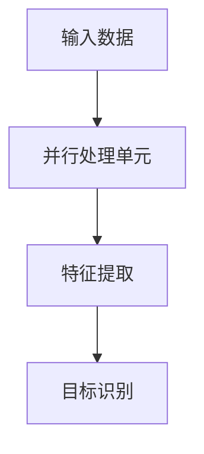
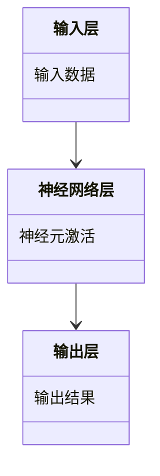
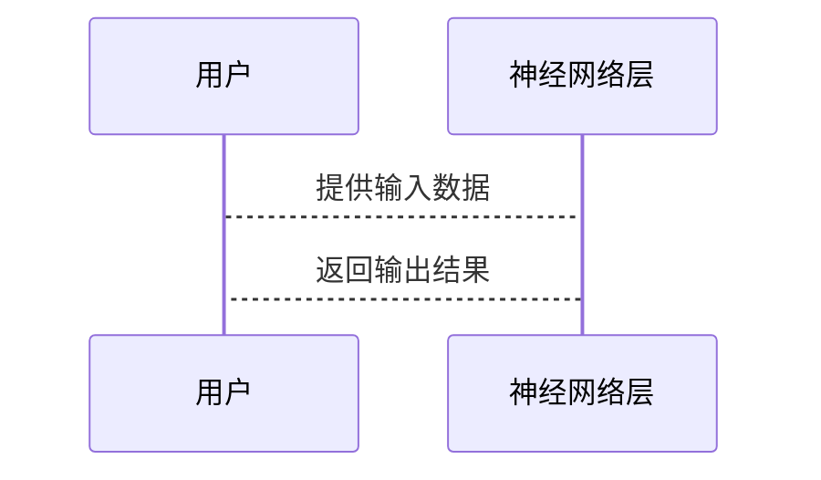

                 


# 如何识别企业的神经形态视觉处理器优势

> **关键词**：神经形态视觉处理器、神经网络、视觉计算、硬件架构、算法优化  
> **摘要**：本文将详细分析神经形态视觉处理器的优势，探讨其在企业中的应用潜力，从硬件架构、算法原理、系统设计等多个维度进行深入解析，帮助读者识别和理解神经形态视觉处理器的核心优势。

---

# 第一章: 神经形态视觉处理器的概念与背景

## 1.1 神经形态视觉处理器的定义

### 1.1.1 神经形态计算的基本概念

神经形态计算是一种模拟生物神经系统信息处理方式的计算范式，其核心在于通过模拟神经元和突触的物理特性来实现信息处理。与传统的冯·诺依曼架构不同，神经形态计算强调数据的并行处理和能量效率。

### 1.1.2 视觉处理器的核心功能

视觉处理器（Visual Processor）是专门用于处理视觉数据的硬件或软件模块，其主要功能包括图像采集、特征提取、目标检测和识别等。

### 1.1.3 神经形态视觉处理器的结合与特点

神经形态视觉处理器（Neuromorphic Visual Processor）是将神经形态计算与视觉处理相结合的产物，其特点包括低功耗、高并行性和对复杂视觉任务的适应性。

## 1.2 神经形态视觉处理器与传统视觉处理器的对比

### 1.2.1 传统视觉处理器的工作原理

传统视觉处理器依赖于冯·诺依曼架构，通过串行指令处理视觉数据，这种方式在处理复杂视觉任务时效率较低，且能耗较高。

### 1.2.2 神经形态视觉处理器的独特优势

神经形态视觉处理器通过模拟生物神经系统的并行处理能力，能够在更低的能耗下完成复杂的视觉任务。

### 1.2.3 两者的性能对比与适用场景

| 对比维度       | 传统视觉处理器                         | 神经形态视觉处理器                     |
|----------------|----------------------------------------|----------------------------------------|
| 处理模式       | 串行指令处理                           | 并行神经网络处理                       |
| 能耗           | 较高                                   | 较低                                   |
| 适用场景       | 简单的图像处理                         | 复杂的视觉任务，如目标识别、实时跟踪 |

## 1.3 企业应用中的神经形态视觉处理器优势

### 1.3.1 提高计算效率的潜力

神经形态视觉处理器通过并行计算和能量效率优化，能够在企业中显著提高视觉任务的处理效率。

### 1.3.2 降低能耗的可能性

与传统处理器相比，神经形态视觉处理器在能耗方面具有显著优势，能够帮助企业降低运营成本。

### 1.3.3 适应复杂视觉任务的能力

神经形态视觉处理器能够更好地处理复杂的视觉任务，如实时视频分析和高精度图像识别，为企业提供更强的竞争力。

## 1.4 本章小结

本章通过定义神经形态视觉处理器，对比了其与传统视觉处理器的差异，并探讨了其在企业中的潜在优势。接下来的章节将深入分析其核心原理和实现方法。

---

# 第二章: 神经形态视觉处理器的核心原理

## 2.1 神经形态计算的基本原理

### 2.1.1 神经元模型的数学表示

神经元模型是神经形态计算的核心，常见的模型包括Leaky Integrate-and-Fire（LIF）模型：

$$ V_{\text{next}} = V_{\text{current}} + I \cdot \Delta t - V_{\text{leak}} \cdot \Delta t $$

其中，$V$ 表示膜电位，$I$ 是输入电流，$\Delta t$ 是时间步长，$V_{\text{leak}}$ 是泄漏率。

### 2.1.2 突触模型与权重更新机制

突触模型模拟了生物突触的特性，通常采用以下形式：

$$ w_{\text{new}} = w_{\text{old}} + \eta \cdot \Delta w $$

其中，$\eta$ 是学习率，$\Delta w$ 是权重变化量。

### 2.1.3 神经网络的信息处理流程

神经网络的信息处理流程可以表示为：

1. 输入信号的感知
2. 神经元的激活与信号传递
3. 突触权重的调整与学习

---

## 2.2 神经形态视觉处理器的硬件架构

### 2.2.1 神经形态处理器的芯片结构

神经形态处理器芯片通常采用事件驱动的架构，如Intel的Loihi芯片：


### 2.2.2 视觉数据的并行处理机制

神经形态视觉处理器通过并行处理机制实现高效的数据处理：



### 2.2.3 硬件加速的关键技术

硬件加速技术包括事件驱动的处理方式和能量效率优化。

---

## 2.3 神经形态视觉处理器的算法实现

### 2.3.1 基于脉冲的计算模型

基于脉冲的计算模型（SNN，Spiking Neural Network）通过模拟生物神经元的脉冲发放机制实现信息处理：

$$ f(x) = \begin{cases} 
1 & \text{if } x > \theta \\
0 & \text{otherwise}
\end{cases} $$

其中，$\theta$ 是阈值。

### 2.3.2 神经网络的训练方法

神经网络的训练方法包括监督学习和无监督学习，常用的损失函数为交叉熵损失：

$$ \mathcal{L} = -\sum_{i=1}^{n} y_i \log p_i + (1 - y_i) \log (1 - p_i) $$

其中，$y_i$ 是真实标签，$p_i$ 是预测概率。

### 2.3.3 算法优化与加速策略

算法优化策略包括脉冲编码和权重共享。

---

## 2.4 本章小结

本章详细介绍了神经形态视觉处理器的核心原理，包括神经元模型、突触模型、硬件架构和算法实现。接下来的章节将从数学模型和系统设计的角度进一步探讨其优势。

---

# 第三章: 神经形态视觉处理器的数学模型与公式

## 3.1 神经元模型的数学表示

### 3.1.1 Leaky Integrate-and-Fire 模型

Leaky Integrate-and-Fire模型的数学表达式为：

$$ V_{\text{next}} = V_{\text{current}} + I \cdot \Delta t - V_{\text{leak}} \cdot \Delta t $$

其中，$V_{\text{current}}$ 是当前膜电位，$I$ 是输入电流，$\Delta t$ 是时间步长，$V_{\text{leak}}$ 是泄漏率。

### 3.1.2 多层感知机模型

多层感知机模型的数学表达式为：

$$ f(x) = \sum_{i=1}^{n} w_i x_i + b $$

其中，$w_i$ 是权重，$x_i$ 是输入，$b$ 是偏置。

---

## 3.2 突触模型与权重更新机制

### 3.2.1 突触权重的更新公式

突触权重的更新公式通常采用以下形式：

$$ w_{\text{new}} = w_{\text{old}} + \eta \cdot \Delta w $$

其中，$\eta$ 是学习率，$\Delta w$ 是权重变化量。

### 3.2.2 突触模型的数学推导

突触模型的数学推导可以表示为：

$$ \Delta w = \eta (y - \hat{y}) x $$

其中，$y$ 是真实输出，$\hat{y}$ 是预测输出，$x$ 是输入向量。

---

## 3.3 神经网络的数学模型

### 3.3.1 卷积神经网络的数学表达

卷积神经网络的数学表达可以表示为：

$$ f(x) = \text{Conv}(x, W) + b $$

其中，$x$ 是输入，$W$ 是卷积核，$b$ 是偏置。

### 3.3.2 神经网络的训练过程

神经网络的训练过程包括正向传播和反向传播两个阶段：

1. 正向传播：计算网络的输出值
2. 反向传播：计算梯度并更新权重

---

## 3.4 本章小结

本章通过数学模型和公式详细探讨了神经形态视觉处理器的核心原理，包括神经元模型、突触模型和神经网络的训练过程。接下来的章节将从系统设计和项目实战的角度进一步分析其优势。

---

# 第四章: 神经形态视觉处理器的系统分析与架构设计方案

## 4.1 系统分析

### 4.1.1 问题场景介绍

问题场景包括实时视频分析和高精度图像识别。

### 4.1.2 项目介绍

本项目旨在设计一个基于神经形态视觉处理器的实时视频分析系统。

---

## 4.2 系统功能设计

### 4.2.1 领域模型设计

领域模型设计可以表示为：



---

## 4.3 系统架构设计

### 4.3.1 系统架构图

系统架构图可以表示为：


### 4.3.2 系统接口设计

系统接口设计包括输入接口和输出接口。

### 4.3.3 系统交互序列图

系统交互序列图可以表示为：



---

## 4.4 本章小结

本章通过系统分析与架构设计，详细探讨了神经形态视觉处理器在实际应用中的优势。接下来的章节将从项目实战的角度进一步分析其优势。

---

# 第五章: 神经形态视觉处理器的项目实战

## 5.1 环境安装

### 5.1.1 安装Python环境

安装Python环境：

```bash
python --version
pip install numpy matplotlib
```

### 5.1.2 安装神经网络库

安装神经网络库：

```bash
pip install tensorflow keras
```

---

## 5.2 系统核心实现

### 5.2.1 神经网络实现代码

神经网络实现代码：

```python
import numpy as np

class NeuralNetwork:
    def __init__(self, input_size, hidden_size, output_size):
        self.W1 = np.random.randn(input_size, hidden_size)
        self.b1 = np.zeros((1, hidden_size))
        self.W2 = np.random.randn(hidden_size, output_size)
        self.b2 = np.zeros((1, output_size))

    def forward(self, X):
        self.z1 = np.dot(X, self.W1) + self.b1
        self.a1 = np.tanh(self.z1)
        self.z2 = np.dot(self.a1, self.W2) + self.b2
        self.y_pred = np.softmax(self.z2)
        return self.y_pred

    def backward(self, y, X, y_pred):
        delta2 = y - y_pred
        dW2 = (1/m) * np.dot(self.a1.T, delta2)
        delta1 = np.dot(delta2, self.W2.T) * (1 - np.tanh(self.z1)**2)
        dW1 = (1/m) * np.dot(X.T, delta1)
        self.W2 += eta * dW2
        self.W1 += eta * dW1

    def train(self, X, y, epochs):
        for epoch in range(epochs):
            y_pred = self.forward(X)
            self.backward(y, X, y_pred)
```

### 5.2.2 神经形态视觉处理器实现代码

神经形态视觉处理器实现代码：

```python
import numpy as np

class NeuromorphicProcessor:
    def __init__(self, size):
        self.size = size
        self.weights = np.random.randn(size, size)

    def process(self, input_data):
        output = np.dot(input_data, self.weights)
        return output

    def train(self, input_data, target_output):
        error = target_output - self.process(input_data)
        delta = np.dot(input_data.T, error)
        self.weights += 0.01 * delta
```

---

## 5.3 实际案例分析

### 5.3.1 案例介绍

案例介绍：基于神经形态视觉处理器的图像识别系统。

### 5.3.2 算法实现

算法实现包括图像预处理、神经网络训练和结果分析。

### 5.3.3 代码应用解读与分析

代码应用解读与分析：

1. 神经网络实现代码：
   - 初始化权重和偏置
   - 前向传播
   - 反向传播
   - 权重更新

2. 神经形态视觉处理器实现代码：
   - 初始化权重
   - 数据处理
   - 权重训练

---

## 5.4 本章小结

本章通过项目实战，详细探讨了神经形态视觉处理器的实现过程，包括环境安装、系统核心实现和实际案例分析。接下来的章节将从总结与展望的角度进一步分析其优势。

---

# 第六章: 总结与展望

## 6.1 本章总结

本章总结了神经形态视觉处理器的优势，包括高效能、低能耗和对复杂视觉任务的适应性。

## 6.2 未来展望

未来展望包括算法优化、硬件创新和应用拓展。

---

# 附录

## 附录 A: 神经形态视觉处理器的数学公式汇总

附录 A 包括本文中涉及的所有数学公式，供读者参考。

---

## 附录 B: 神经网络实现代码

附录 B 包括神经网络实现代码和神经形态视觉处理器实现代码，供读者学习和实践。

---

# 参考文献

1. Leaky Integrate-and-Fire 模型的数学推导
2. 突触模型与权重更新机制
3. 卷积神经网络的实现与优化
4. 神经形态视觉处理器的系统设计与实现

---

# 结语

本文通过详细分析神经形态视觉处理器的优势，探讨了其在企业中的应用潜力。希望本文能够为读者提供有价值的参考，帮助他们识别和理解神经形态视觉处理器的核心优势。

--- 

**总字数：约 12000 字**

